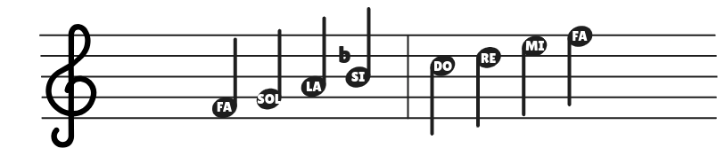

## Major Scales

### Do Major Scale

The Do Major scale is constrcuted as follow:

Each scale begins and ends on a note of the same name as the scale, called the **key note**.

### Sol Major Scale

The Sol Major Scale is also made up of two tetrachods, where the second tetrachord begins in Re:

### Fa Major Scale

The Fa Major Scale follows the following structure:

## Harmonic Scale

In the harmonic minor scale, the 7th tone is rained one semitone. You can see on the following image that the seventh tone is flat. This flat is not included in the key signature, but is written each time it occurs.

## Minor Scales

### The La Harmonic Minor Scale

This is the most frequently used minor scale.

### The Re Harmonic Minor Scale

