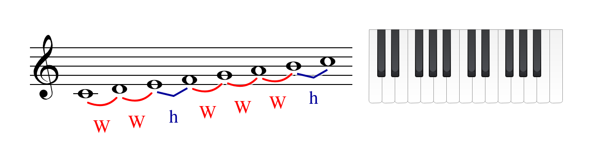
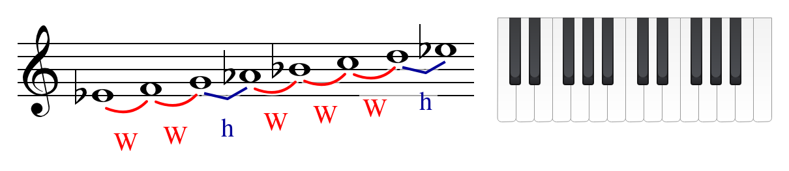
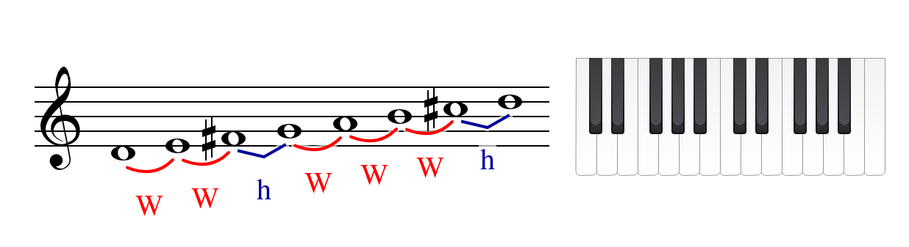

## Major Scales

> [!NOTE] **Scale**
>
> A **scale** is a selection of certain notes within an octave.

The first scale that we will discuss is the **major scale**. The major scale is constructed with this formula: $W$'s represent whole steps and $h$'s represent half steps.

$$
\begin{matrix}
W & W & h & W & W & W & h
\end{matrix}
$$

This pattern is the way it is because it is the only way to perfectly combine the three most fundamental and stable intervals in all of music: **the Octave**, **the Perfect Fifth**, and **the Major Third**.

### $Do$ Major Scale

Let's build a $Do$ Major Scale.

1. Our starting note will be $Do$
2. From the $Do$ we will take a **whole step** to $Re$
3. From the $Re$, we will take another **whole step** to $Mi$
4. Next, we will go up a **half step** to $Fa$
5. From $Fa$, the **whole step** will take us to $Sol$
6. Next is another **whole step** to $La$
7. The last **whole step** takes up to $Si$
8. Finally, the **half step** return us to $Do$

So $Do$ major is composed by:

$$
\begin{matrix}
& W & & W & & h & & W & & W & & W & & h \\
Do & \Leftrightarrow & Re & \Leftrightarrow & Mi & \Leftrightarrow & Fa & \Leftrightarrow & Sol & \Leftrightarrow & La & \Leftrightarrow & Si & \Leftrightarrow & Do \\
\end{matrix}
$$

### $Mi_\flat$ Major Scale

1. Our starting note will be $Mi_\flat$
2. From the $Mi_\flat$ we will take a **whole step** to $Fa$
3. From the $Fa$, we will take another **whole step** to $Sol$
4. Next, we will go up a **half step** to $La_\flat$
5. From $La_\flat$, the **whole step** will take us to $Si_\flat$
6. Next is another **whole step** to $Do$
7. The last **whole step** takes up to $Re$
8. Finally, the **half step** return us to $Mi_\flat$

So $Mi_\flat$ major is composed by:

$$
\begin{matrix}
& W & & W & & h & & W & & W & & W & & h \\
Mi_\flat & \Leftrightarrow & Fa & \Leftrightarrow & Sol & \Leftrightarrow & La_\flat & \Leftrightarrow & Si_\flat & \Leftrightarrow & Do & \Leftrightarrow & Re & \Leftrightarrow & Mi_\flat \\
\end{matrix}
$$

### $Re$ Major Scale

For our final scale, we will build the **$Re$ Major Scale**

1. Our starting note will be $Re$
2. The first whole step takes us from $Re$ to $Mi$
3. The second whole step takes us to $Fa_\sharp$
4. The half step takes us to $Sol$
5. The whole step takes us to $La$
6. From $La$, the whole step takes us to $Si$
7. From $Si$, the whole step takes us to $Do_\sharp$
8. Finally, the half step takes us back to $Re$

So $Re$ major is composed by:

$$
\begin{matrix}
& W & & W & & h & & W & & W & & W & & h \\
Re & \Leftrightarrow & Mi & \Leftrightarrow & Fa_\sharp & \Leftrightarrow & Sol & \Leftrightarrow & La & \Leftrightarrow & Si & \Leftrightarrow & Do_\sharp & \Leftrightarrow & Re \\
\end{matrix}
$$

