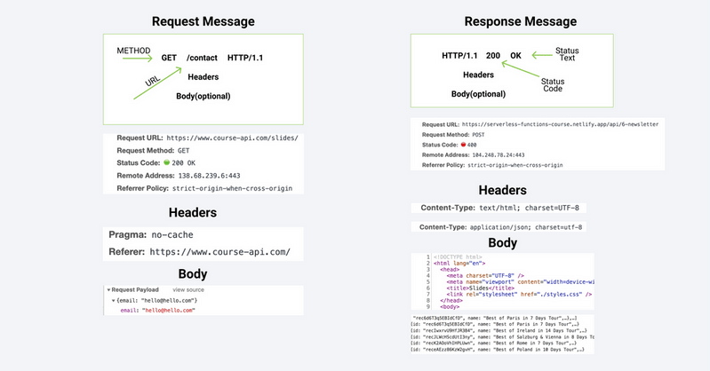

## Modules

### Exporting

So we can treat the attribute `exports` as an object and pass it whatever values we would like to show to other app that import our module:

```javascript
module.exports = { value1: "value1", value2: "value2" };
```

Where `value1` is the key of the attribute and `'value1'` is its value, e.g.:

```javascript
const name = "John";
const surname = "Tuckey";

module.exports = { Name: name, Surname: surname };
```

Also, if we only export one object it is sufficient to type:

```javascript
const name = "John";

module.exports = name;
```

Another way to export is to define explicitly the name of the attributes to export:

```javascript
module.exports.items = ["item1", "item2"];

const person = {
  name: "bob",
};
module.exports.singlePerson = person;
```

### Importing

Now, a module can be imported with the keyword `require` as follows:

```javascript
const externalModule = require('./module')
console.log(externalModule)

{ Name: 'John', Surname: 'Tukey' }
```

Another type of syntax could be unrolling the attributes of the export object:

```javascript
const { Name, Surname } = require("./module");
```

### Built-in Modules

Some built-in modules are:

- **OS**
- **PATH**
- **FS (Filesystem)**
- **HTTP**

Even though there are several more built-in modules.

### OS

To import the `OS` built-in module we do:

```javascript
const os = require("os");
```

And we call it by:

```javascript
console.log(`The system uptime is ${os.uptime()} seconds`);
```

### FS

We can also interact with the file system via the `FS` module. There are two ways to do so:

1. Asynchronously, which is non-blocking
2. Synchronously, that is blocking

#### Synchronous

To exemply both setups, we first de-structure the read and write synchronous methods from the `FS` module, and then we read and write files.

```javascript
const { readFileSync, writeFileSync } = require("fs");

// Read file with a given path and the corresponding encoding
const first = readFileSync("./file.txt", "utf8");
const second = readFileSync("./file2.txt", "utf8");

// Write to a file given a path, the content is overwritten
writeFileSync("./writeFile", "This content will be written");

// Write to a file given a path, the content is appended
writeFileSync("./writeFile", "This content will be written", { flag: "a" });
```

#### Asynchronous

Now, in order to access the file system asynchronously, we need a callback, and so we do:

```javascript
const { readFileSync, writeFileSync } = require("fs");

readFile("./file", "utf8", (error, result) => {
  if (error) {
    console.log(error);
    return;
  } else {
    console.log(result);
    const first = result;
    // Here we can add another read call
  }
});

writeFile("./file", "This is the content", (error, result) => {
  if (error) {
    console.log(error);
    return;
  } else {
    console.log(result);
  }
});
```

Where we specify a callback function with the ES6 syntax. Its first parameter is the error parameter and the second is the result of the operation.

The problem with synchronous calls is that they can be very time consuming and they halt the execution, which can be critical when working on time sensitive tasks or when several user call upon these type of functions at a time.

### HTTP

To show the bare basics, we will set up a server:

```javascript
const http = require("http");

const server = http.createServer((request, response) => {
  response.write("This is the index!");
  response.end();
});

// Define the port
server.listen(5000);
```

That can be accessed on `localhost:5000`. Next, we can code something a little more complex, where the content handed as a response depends on the request:

```javascript
const http = require("http");

const server = http.createServer((request, response) => {
  if (request.url === "/") {
    response.end("This is the index");
  } else if (request.url === "/about") {
    response.end("This is the about");
  } else {
    response.end("404");
  }
});

// Define the port
server.listen(5000);
```

## NPM

### Installing packages

You can install a package locally within your project as a local dependency:

```bash
$ nmp i <packageName>
```

Or you can install the package globally, so it can be accessed from any project:

```sh
$ npm install -g <packageName>
```

If you want to specify a version for the package:

```sh
$ npm install <packageName>@1.0.0
```

#### Package.json

This file stores important information about the project and the packages, it can be conceived as a manifest file. There are two ways to create it:

- Manually: create `package.json` in the root folder of the project and define the properties of the project/packages.
- Using `npm` following the guide (add `-y` to skip the questions of the guide):

```
$ npm init
```

When the project is initialized, the `package.json` file is as follows:

```JSON

{
  "name": "08_project",
  "version": "1.0.0",
  "description": "",
  "main": "index.js",
  "scripts": {
    "test": "echo \"Error: no test specified\" && exit 1"
  },
  "keywords": [],
  "author": "",
  "license": "ISC"
}

```

Where all those properties are set up during the guide of `npm init` or set as default with the flag `-y`.

After installing a dependency

```
$ npm i lodash
```

The following property is added:

```json
  "dependencies": {
    "lodash": "^4.17.21"
  }
```

And `npm` creates the folder `node_modules`, if it does not already exist, which stores the dependencies code. Also, in case of wanting to install dependencies needed only during the development process:

```
$ npm i <package> -D
$ npm i <package> --save-dev
```

And so, the property `devDependencies` is created in `pakage.json`.

##### Scripts

The object `scripts`, which is a property of `package.json`, can contain the definition of different actions, for example:

```json
"scripts": {
  "start": "node app.js"
}
```

So when running `npm start` our `app.js` will be executed. For some commands you will need to specify `run` and the command name as follows:

```bash
$ npm run dev
```

##### Nodemon

This is a package that lets you hot reload your project without having to execute your app constantly. For that, after installing `nodemon` as a local or global dependency, we specify on `package.json`:

```json
"scripts": {
  "dev": "nodemon app.js"
}
```

If we want to run it:

```bash
$ npm run dev
```

#### Package-lock.json

This file stores the dependencies version of the packages installed as dependencies, as to avoid installing newer version that can be the cause of bugs. Because within the `package.json` only our project's dependencies' versions are specified.

### Uninstalling packages

In order to uninstall the package we have a command, that follows the syntax:

```bash
$ npm uninstall <package>
```

We can also remove it from the `dependencies` object within `package.json`. So when you remove `package-lock.json` and the `node_modules` folder if you run

```
$ npm install
```

The package that was removed will not be installed.

### Git

When using git or other version control tool, it is desirable to create a `.gitignore` and to specify to avoid the `node_modules` folder, since its size can get big very easily.

So, by just pushing the source code, including `package.json`, if we want to install all of the project's dependencies' again, on the root folder we run:

```bash
$ npm install
```

## HTTP

### HTTP Messages

- **Request Message**: what the user sends
- **Response Message**: what the server sends



The messages have the following parts:

- **Info about the request**: Request URL, Request Method (GET is the default method), Status Code, etc.
  - **Headers**: meta information about the request/response, (e.g. "Content type: application/json" tells the browser that the body is `json`)
  - **Body**: which is the request payload, or the content of the response.
