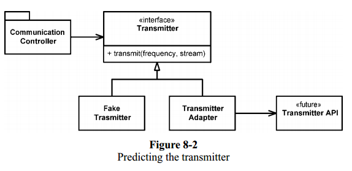

## Using Third-Party Code

There is a natural tension between the provider of an interface and the user of an interface. Providers: which strive for broad applicability and users: which are want an interface focused on their particular needs.

Let’s look at `java.util.Map` as an example. If our application needs a Map of Sensors, you might find the sensors set up like this:

```java
Map sensors = new HashMap();
```

Then, when some other part of the code needs to access the sensor, you see this code:

```java
Sensor s = (Sensor)sensors.get(sensorId);
```

The readability of this code can be greatly improved by using generics, as shown below:

```java
Map<Sensor> sensors = new HashMap<Sensor>();
...
Sensor s = sensors.get(sensorId );
```

However, this doesn’t solve the problem that `Map<Sensor>` provides more capability than we need. Also there will be a lot of places to fix if the interface to `Map` ever changes. A cleaner way to use Map might look like the following.

```java
public class Sensors {
  private Map sensors = new HashMap();

  public Sensor getById(String id) {
    return (Sensor) sensors.get(id);
  }
}
```

So the interface at the boundary (`Map`) is hidden. This interface is also tailored and constrained to meet the needs of the application. It results in code that is easier to understand and harder to misuse.

## Exploring and Learning Boundaries

We could write some tests to explore our understanding of the third-party code (learning tests). We call the third-party API, as we expect to use it in our application. Not only are learning tests free, they have a positive return on investment. When there are new releases of the third-party package, we run the learning tests to see whether there are behavioral differences.

## Using Code That Does Not Yet Exist

There is another kind of boundary, one that separates the known from the unknown. There are often places in the code where our knowledge seems to drop off the edge.

For example, there was a subsystem, the “Transmitter,” that we knew little about, and the people responsible for the subsystem had not gotten to the point of defining their interface. So we defined our own interface, this was the interface we wished we had.



This design also gives us a very convenient seam3 in the code for testing.

## Clean Boundaries

Good software designs accommodate change without huge investments and rework. We manage third-party boundaries by having very few places in the code that refer to them. We may wrap them as we did with `Map`, or we may use an **ADAPTER** to convert from our perfect interface to the provided interface.
