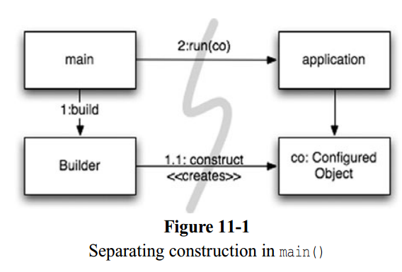

## Separate Constructing a System from Using It

The separation of concerns is one of the oldest and most important design techniques in our craft.

One way to separate construction from use is simply to move all aspects of construction to main, or modules called by main, and to design the rest of the system assuming that all objects have been constructed and wired up appropriately. (See Figure 11-1)

## Factories

Sometimes we need to make the application responsible for when an object gets created. In this case we can use the ABSTRACT FACTORY pattern to give the application control of when to build the objct, but keep the details of that construction separate from the application code.

## Dependency Injection

A powerful mechanism for separating construction from use is Dependency Injection (DI), the application of Inversion of Control (IoC) to dependency management.3 Inversion of Control moves secondary responsibilities from an object to other objects that are dedicated to the purpose, thereby supporting the Single Responsibility Principle. In the context of dependency management, an object should not take responsibility for instantiating dependencies itself. Instead, it should pass this responsibility to another “authoritative” mechanism, thereby inverting the control.

The class takes no direct steps to resolve its dependencies; it is completely passive. Instead, it provides setter methods or constructor arguments (or both) that are used to inject the dependencies. During the construction process, the DI container instantiates the required objects (usually on demand) and uses the constructor arguments or setter methods provided to wire together the dependencies. Which dependent objects are actually used is specified through a configuration file or programmatically in a special-purpose construction module.

But what about the virtues of LAZY-INITIALIZATION? This idiom is still sometimes useful with DI. First, most DI containers won’t construct an object until needed. Second, many of these containers provide mechanisms for invoking factories or for constructing proxies, which could be used for LAZY-EVALUATION and similar optimizations.

## Scaling Up

It is a myth that we can get systems “right the first time.” Instead, we should implement only today’s stories, then refactor and expand the system to implement new stories tomorrow. This is the essence of iterative and incremental agility. Test-driven development, refactoring, and the clean code they produce make this work at the code level.

Software systems are unique compared to physical systems. Their architectures can grow incrementally, if we maintain the proper separation of concerns.

## Cross-Cutting Concerns

Note that concerns like persistence tend to cut across the natural object boundaries of a domain. You want to persist all your objects using generally the same strategy. Using persistence as an example, you would declare which objects and attributes (or patterns thereof) should be persisted and then delegate the persistence tasks to your persistence framework. The behavior modifications are made noninvasively8 to the target code by the AOP framework.

An optimal system architecture consists of modularized domains of concern, each of which is implemented with Plain Old Java (or other) Objects. The different domains are integrated together with minimally invasive Aspects or Aspect-like tools. This architecture can be test-driven, just like the code.

## Optimize Decision Making

Modularity and separation of concerns make decentralized management and decision making possible. The agility provided by a POJO system with modularized concerns allows us to make optimal, just-in-time decisions, based on the most recent knowledge. The complexity of these decisions is also reduced.

## Use Standards Wisely, When They Add Demonstrable Value

Standards make it easier to reuse ideas and components, recruit people with relevant experience, encapsulate good ideas, and wire components together. However, the process of creating standards can sometimes take too long for industry to wait, and some standards lose touch with the real needs of the adopters they are intended to serve.

## Systems Need Domain-Specific Languages

In software, there has been renewed interest recently in creating Domain-Specific Languages (DSLs), which are separate, small scripting languages or APIs in standard languages that permit code to be written so that it reads like a structured form of prose that a domain expert might write.
