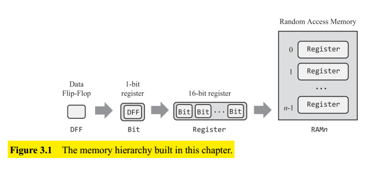
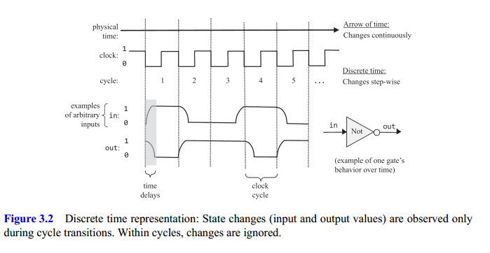
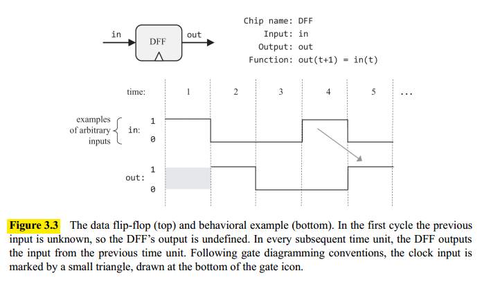
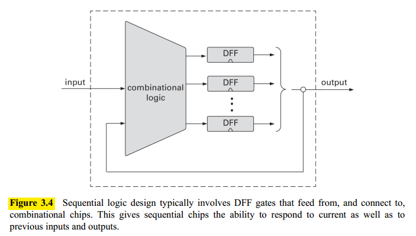
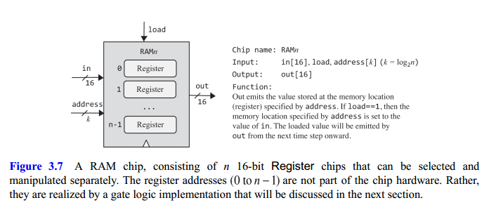
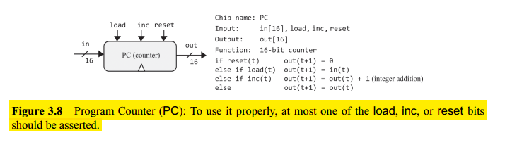

## Memory Devices

A **data flip flop** (DFF) is a time-dependent logic gate that can flip and flop between two stable states: representing $0$ and $1$. DFFs are used as low-level chip-parts embedded deep within other memory devices (see Figure 3.1.).

DFFs can be used to create $1$-bit registers and $n$ such registers can be lashed together to create an $n$-bit register. Next, a **RAM** device is constructed using an arbitrary number of such registers.

## Sequential Logic

On any operation outputs are always delayed, due to at least two reasons:

1. The signal that represent the inputs travel from the outputs of other chips, which takes time.
2. The computations that chips perform also take time.

Thus, time is an issue we must deal with. As seen at the top of figure 3.2, time is viewed as an arrow that progresses relentlessly forward. This progression is taken to be **continuous**: between
every two time-points there is another time-point, and changes in the world can be infinitesimally small.

Instead of viewing time as a continuous progression, we break it into **fixed-length intervals**, cycles. Where **cycles are atomic and indivisible**: changes in the world occur only during cycle transitions; within cycles, the world stands still.

This discrete view of time serves two design objectives:

1. It can be used for neutralizing the randomness associated with communications and computation time delays.
2. Second, it can be used for synchronizing the operations of different chips across the system.

Let's focus on the bottom part of figure 3.2, which tracks how a Not gate (used as an example) responds to arbitrarily chosen inputs. When we feed the gate with $1$, it takes a while before the gate's output stabilizes on $0$. However, since the cycle duration is—by design—longer than the time delay, when we reach the cycle's end, the gate output has already stabilized on $0$.

Therefore the cycle's length must be longer than the maximal time delays that can occur in the system. In practice, we design our hardware such that the cycle is sufficiently long to contain any possible time delay taking into acount that, the shorter the cycle, the faster the computer. To sum up, the cycle length is chosen to be slightly longer than the maximal time delay in any chip in the system.

Typically, the cycles are realized by an oscillator that alternates continuously between two phases labeled $0$−$1$, low-high, or ticktock. Using the hardware’s circuitry, the same **master clock signal** is simultaneously broadcast to every memory chip in the system. In every such chip, the clock input is funneled to the lower-level DFF gates.

### Flip-flops

The low-level devices that facilitate the memory/storage abstraction are named **flip-flop** gates, in our case, data flip-flop or DFF, whose interface includes a single-bit data input and a single-bit data output.

In addition, the DFF has a clock input that feeds from the master clock’s signal. Taken together, the data input and the clock input enable the DFF to implement the following behaviour $out(t) = in(t - 1)$

### Combinational and Sequential Logic

The most fundamental sequential gate is the DFF, and any chip that includes it is also said to be sequential.

As shown in figure 3.4, these sequential chips may also interact with combinational chips. In combinational chips, the introduction of feedback loops is problematic, because the output would depend on itself. However, if the feedback loop goes through a DFF gate: the DFF introduces an inherent time delay so that the output at time $t$ does not depend on itself but rather on the output at time $t - 1$.

The time dependency of sequential chips has an important side effect that serves to synchronize the overall computer architecture.

Suppose we instruct the ALU to compute $x + y$, because of physical constraints the electric signals representing $x$ and $y$ will likely arrive at the ALU at different times. It will take some time before the ALU’s output stabilizes to the correct result. Until then, the ALU will generate garbage.

## Random Access Memory

A direct-access memory unit, also called **Random Access Memory**, or RAM, is an aggregate of $n$ Register chips (see figure 3.7).

## Counter

The **Counter** is a chip that knows how to increment its value by 1 each time unit, aslo known as **Program Counter** or PC (see figure 3.8).

