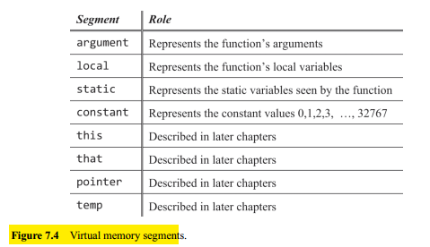
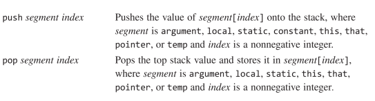
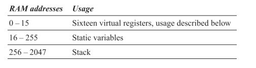
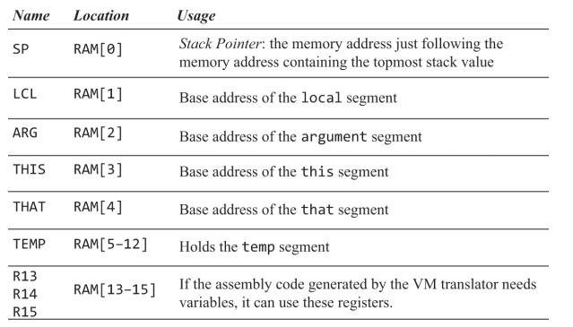

## Stach Machine

The centerpiece of the stack machine is the stack, which is a sequential storage space that grows and shrinks as needed. The push operation adds a value to the top of the stack, and pop operation removes the stack's top value. Note that the push/pop logic results in a **last-in-first-out** (LIFO) access logic.

### Stack Arithmetic

Consider the generic operation $x \text{op} y$, where the operator $\text{op}$ is applied to the operands $x$ and $y$. In a stack machine, this operation is carried out as follows:

1. The operands $x$ and $y$ are popped off the top of the stack.
2. The value of $x \text{op} y$ is computed.
3. The computed value is pushed onto the top of the stack.

For example, consider the expression $d = (2 - x) + (y + 9)$ shown in figure 7.3a.


### Virtual Memory Segments

High-level languages feature symbolic variables like $x, y, sum, count$, these can be a classlevel static variable, an instance-level field of an object, or a method-level local or argument variable.

In virtual machines there are no symbolic variables, instead, variables are represented as entries in **virtual memory segments** like `static`, `this`, `local`, and `argument`. The compiler maps the first, second, third, ... `static` variable found in program onto `static 0`, `static 1`, `static 2`, and so on. The other variable kinds are mapped on the segments `this`, `local`, and `argument`.

Our VM model features eight memory segments, whose names and roles are listed in figure 7.4.



## VM Specification, Part I

A VM program is a sequence of VM commands that fall into four categories:

- Push / pop commands
- Arithmetic-logical commands
- Branching commands
- Function commands

### Push / Pop Commands



### Arithmetic-Logical Commands

- Arithmetic commands: `add, sub, neg`
- Comparison commands: `eq, gt, lt`
- Logical commands: `and, or, not`

The commands `add, sub, eq, gt, lt, and,` and `or` have two implicit operands. We mean that the operand is not part of the command syntax since the command is designed to always operate on the two top stack values, there is no need to specify them.

## Implementation

The VM abstraction has only one data type: a signed integer. This type is implemented on the Hack platform as a two’s complement $16$-bit value. The VM Boolean values true and false are represented as $-1$ and $0$, respectively.

The host Hack RAM consists of $32$K $16$-bit words. VM implementations should use the top of this address space as follows:



Where some slots are already allocated:



Note that deciding where to locate virtual memory segments in the host RAM is a delicate issue. How can we ensure that these open-ended memory segments will not overflow into each other and into other reserved RAM areas? We will deal with this on the next chapter.

VM implementations manipulate these virtual segments symbolically, using the pointer names. For example, suppose we want to push the value of the `D` register onto the stack. This operation can be implemented using the logic which can be expressed in Hack assembly

```
// Selects RAM[SP] so we obtain the base address of the top of the stack
@SP
// Sets A to be the value under M, RAM[SP] (address of the top of the stack),
// So now the selected register (M) will be RAM[RAM[SP]] -> value of the element on top
// of the stack
A=M
// Update M to equal D, RAM[RAM[SP]] = M
M=D
// Selects RAM[SP] as the selected memory register, M = RAM[SP]
@SP
// As we pushed a new element on the stack, we augment the pointer
M=M+1
```

### Memory Segments Mapping

**Local, argument, this, that**: the base addresses of these segments are stored in the registers `LCL`, `ARG`, `THIS`, and `THAT`, respectively. Therefore, any access to the i-th entry of a virtual segment (in the context of a VM `push/pop segmentName i` command) should be translated into assembly code that accesses address in the RAM.

**Pointer**: the `pointer` segment contains exactly two values and is mapped directly onto RAM locations $3$ and $4$. These RAM locations are also called, respectively, `THIS` and `THAT`. Any access to pointer $0$ should result in accessing the `THIS` pointer, and any access to pointer $1$ should result in accessing the `THAT` pointer.

**Temp**: This $8$-word segment is also fixed and mapped directly on RAM locations $5$–$12$.

**Constant**: This virtual memory segment is truly virtual, as it does not occupy any physical RAM space. Instead, the VM implementation handles any access to constant $i$ by simply supplying the constant $i$.

**Static**: are mapped on addresses $16$ to $255$ of the host RAM. Each reference to static i in a VM program stored in file `Foo.vm` can be translated to the assembly symbol `Foo.i`. the Hack assembler will map these symbolic variables on the host RAM, starting at address $16$. We note in closing that since the stack begins at address $256$, the implementation limits the number of static variables in a Jack program to $255 - 16 + 1 = 240$.
