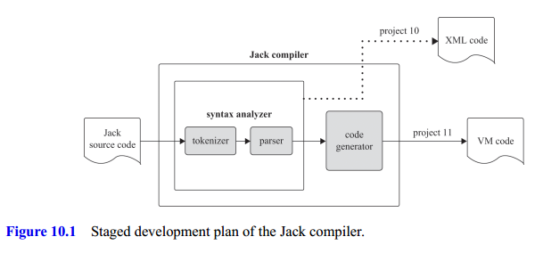
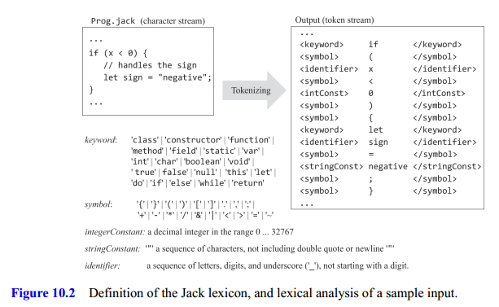
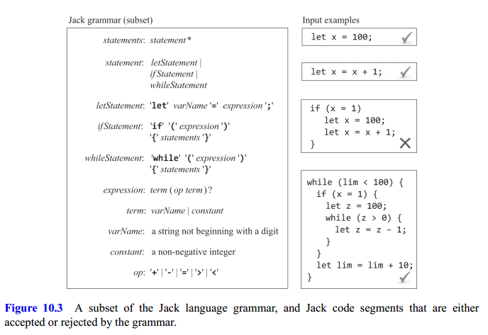
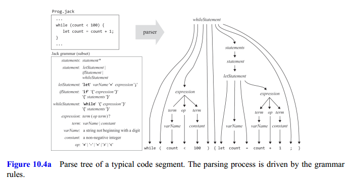
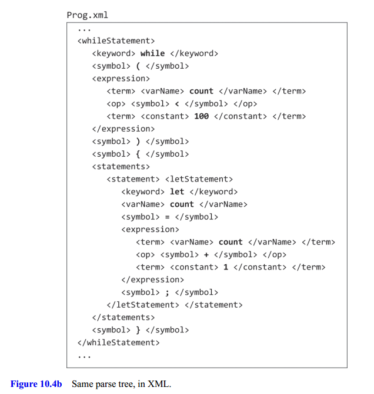
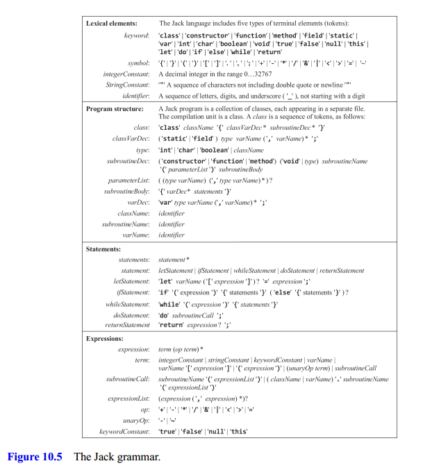

## Background

A **compiler** is a program that translates programs from a source language into a target language. The translation process, known as compilation, is conceptually based on two distinct tasks:

- Syntax analysis: usually divided further into two substages
  - Tokenizing: grouping of input characters into language atoms called tokens.
  - Parsing: grouping of tokens into structured statements that have a meaning.
- Code generation

Figure 10.1 shows these steps:

Given grammar—the set of rules that define the syntax of a programming language, parsing a program means to determine the exact correspondence between the program's text and the grammar's rules. To do so, we must first transform the program's text into a list of tokens.

### Lexical Analysis

The first step in analyzing the program's syntax is grouping the characters into tokens, as defined by the language lexicon, while ignoring white space and comments. This task is called **lexical analysis**, **scanning**, or **tokenizing**.

Figure 10.2 presents the Jack language lexicon and illustrates the tokenization of a typical code segment.

### Gammars

A grammar is written in a meta-language: a language describing a language. Terminals are tokens, nonterminals are names of other rules, and qualifiers are represented by the five symbols `|`, `*`, `?`, `(`, and `)`. See figure 10.3 for an example.

We see that the grammar of a programming language can be used to ascertain, without ambiguity, whether given inputs are accepted or rejected. As a side effect of this parsing act, the parser produces an exact correspondence between the given input, on the one hand, and the syntactic patterns admitted by the grammar rules, on the other. The correspondence can be represented by a data structure called a **parse tree**, also called a **derivation tree**, like the one shown in figure 10.4a.

How can we represent parse trees textually? See figure 10.4b for an example.

### Parser

A **parser** is an agent that operates according to a given grammar. The parser accepts as input a stream of tokens and attempts to produce as output the parse tree associated with the given input.

There are several algorithms for constructing parse trees. The **top-down approach**, also known as recursive descent parsing, attempts to parse the tokenized input recursively, using the nested structures admitted by the language grammar.

Recursive parsing algorithms are simple and elegant. If the language is simple, a single token lookahead is all that it takes to know which parsing rule to invoke next. Grammars that have this lingual property are called LL (1). These grammars can be handled simply and elegantly by recursive descent algorithms, without backtracking.

The term LL comes from the observation that the grammar parses the input from left to right, performing leftmost derivation of the input. The (1) parameter informs that looking ahead $1$ token.

## Specification

The complete Jack grammar is specified in figure 10.5.

