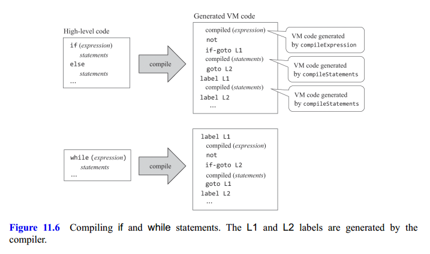
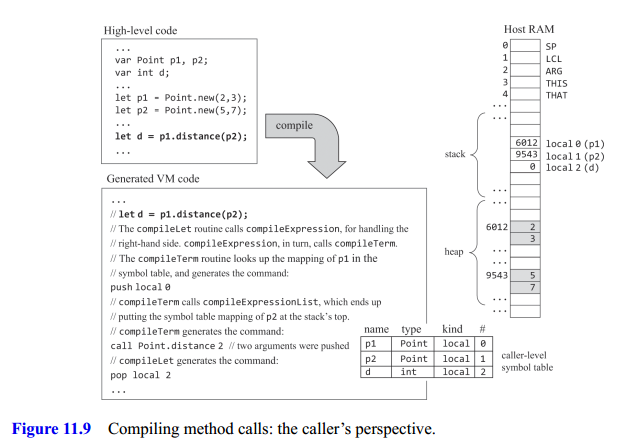
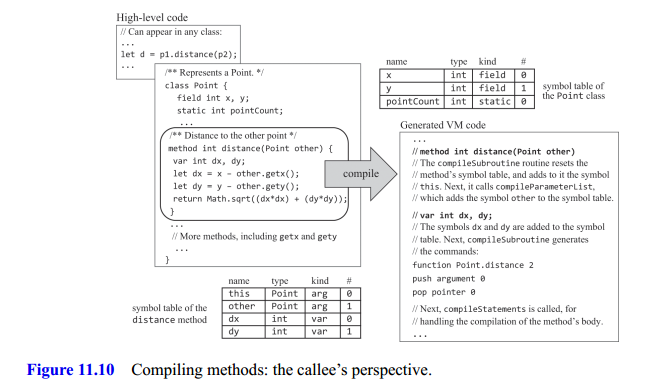
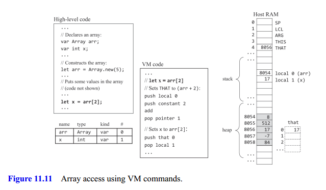

## Code Generation

We have to figure out how to systematically translate expressions, statements, subroutines, and the handling of variables, objects, and arrays into sequences of stack-based VM commands that execute the desired semantics on the target virtual machine.

### Handling Variables

One of the basic tasks of compilers is mapping the variables declared in the source high-level program onto the host RAM of the target platform. In Nand to Tetris there are no mapping complications: all the primitive types in Jack are 16-bit wide, and so are the addresses and words of the Hack RAM. Thus, every Jack variable, including pointer variables holding 16-bit address values, can be mapped on exactly one word in memory.

The second challenge faced by compilers is that variables of different kinds have different life cycles. Class-level static variables are shared globally by all the subroutines in the class. Therefore, a single copy of each static variable should be kept alive during the complete duration of the program’s execution.

The good news is that we've already handled all these difficulties. In our two-tier compiler architecture, memory allocation and deallocation are delegated to the VM level. All we have to do now is map Jack static variables on `static 0, static 1, static 2`, ...; field variables on `this 0, this 1`, ...; local variables on `local 0, local 1`, ...; and argument variables on `argument 0, argument 1`, ....

The variable properties can be managed conveniently using a **symbol table**. When a static, field, local, or argument variable is declared in the source code, the compiler allocates it to the next available entry in the corresponding `static`, `this`, `local`, or `argument` VM segment. To enable separate namespaces, each identifier is implicitly associated with a scope. Jack compilers can realize the scope abstractions by managing two separate symbol tables as seen in figure 11.2.


When the compiler fails to find the variable in the table associated with the current scope, it looks it up outward.

### Compiling Expressions

In Jack, expressions are written using infix notation. In contrast, our compilation's target language is postfix. We need an algorithm that knows how to parse an infix expression and generate from it as output postfix code. Figure 11.4 presents one such algorithm.


Figure 11.5 gives the complete grammatical definition of Jack expressions, along with several examples of actual expressions consistent with this definition.


### Compiling Strings

Each time a string constant comes up in a high-level statement or expression, the compiler generates code that calls the `String` constructor. Next, the compiler initializes the new object with the string characters by generating a sequence of calls to the String method `appendChar`, one for each character.

### Compiling Statements

The Jack programming language features five statements: `let`, `do`, `return`, `if`, and `while`.

#### Return

First, we call the `compileExpression` routine, which generates VM code designed to evaluate and put the expression’s value on the stack. Next, we generate the VM command `return`.

#### Let

Since parsing is a left-to-right process, we begin by remembering the `varName`. Next, we call `compileExpression`, which puts the expression's value on the top of the stack. Finally, we generate the VM command `pop varName`, (where `varName` is for example, `local 3`, `static 1`, and so on). With this we store the top value of the stack onto `varName`.

#### Do

Here we discuss the compilation of function calls of the form do `className.functionName (exp1, exp2, ..., expn)`. The `do` abstraction is designed to call a subroutine for its effect, ignoring the return value. To compile it we call `compileExpression` and then get rid of the topmost stack element (the expression's value) by generating a command like `pop temp 0`.

#### If/While

One of the challenges faced by compiler developers is expressing the semantics of high-level control flow statements using nothing more than goto primitives. Figure 11.6 shows how this gap can be bridged systematically.



The compiler starts by calling compileExpression, which generates VM commands designed to compute and push the expression's value onto the stack. The compiler then generates the VM command `not`, designed to negate the expression's value. Next, the compiler creates a label, say `L1`, and uses it for generating the VM command `if-goto L1`.

### Handling Objects

Each object is implemented physically as a memory block. The reference variable, also known as an **object variable**, or **pointer**, contains the memory block's base address. The `heap` is used as a memory pool from which memory blocks are carved, as needed, for representing new objects. When an object is no longer needed, its memory block can be freed.

Any methodis designed to operate on a placeholder known as the **current object**, or `this`. When VM commands make references to `this 0`, `this 1`, `this 2`, and so on, they should effect the fields of the current object. How do we align the `this` segment with the current object?

According to the VM specification, the pointer `THIS` (referred to as `pointer 0`) is designed to hold the base address of the memory segment this. Thus, to align the this segment with the current object, we can push its value (which is an address) onto the stack and then pop it into `pointer 0`.

Versions of this initialization technique are used conspicuously in the compilation of constructors and methods.

#### Compiling Constructors

**Compiling constructor calls**: First, one declares a variable of some class type. At a later stage, one can instantiate the object by calling a class constructor, for example, `let p = Point.new(2,3)`. On this second step first, the constructor allocates a memory block of the required size. Second, when the constructorterminates its execution, it returns to the caller the base address of the allocated memory block. Figure 11.7 shows how this abstraction can be realized.


The physical addresses $6012$ and $9543$ are irrelevant; the high-level code as well as the compiled VM code have no idea where the objects are stored in memory; the references to these objects are strictly symbolic, via `p1` and `p2` in the high-level code and `local 0` and `local 1` in the compiled code.

**Compiling constructors**: note that a constructor is a subroutine what makes the compilation of a constructor special is that in addition to treating it as a regular subroutine, the compiler must also generate code that (i) creates a new object and (ii) makes the new object the current object (also known as `this`) (see Figure 11.8).


The creation of a new object requires finding a free RAM block sufficiently large to accommodate the new object’s data and marking the block as used. These tasks are delegated to the host operating system.

Before calling `Memory.alloc`, the compiler determines the size of the required memory block. This can be readily computed from the class-level symbol table. For example:

```
push constant 2
call Memory.alloc
pop pointer 0
```

This VM code allocates a total of two words of memory and saves the base address returned by `Memory.alloc` on `this` (or `pointer 0`).

According to the Jack language specification, every constructor must end with a `return this` statement. This convention forces the compiler to end the constructor's compiled version with `push pointer 0` and `return` so the object's base address is on top of the stack.

#### Compiling Methods

We'll describe how to compile method calls and then how to compile the methods themselves.

**Compiling method calls**: Unlike functions, methods are subroutines that always operate on a given object, and it's the caller's responsibility to specify this object. The compiler handles object-oriented method calls like `p1.distance (p2)` as if they were procedural calls like `distance(p1, p2)`. Specifically, it translates `p1.distance(p2)` into `push p1`, `push p2`, `call distance`.

To compile the method call `varName.methodName(exp1, exp2, ..., expn)`, we start by generating the command `push varName`. If the method call mentions no varName, we push the symbol table mapping of `this`. Next, we call `compileExpressionList`, that generates code for all the expressions defined for arguments. Finally, we generate the command `call className.methodName n+1` informing that$n$ arguments were pushed onto the stack. See figure 11.9 for an example.



**Compiling methods**: any is designed to operate on the current object, represented by the built-in identifier `this`. One can write an entire method without ever mentioning `this`. So how does the Jack compiler handle expressions like x – other.getx()? First, it looks up `x` in the symbol tables and finds that it represents the first field in the current object. Which, according to the method call contract, it must be the first argument that was passed by the method's caller. Therefore, from the callee’s perspective, the current object must be the object whose base address is the value of `argument 0`. See figure 11.10 for the details.



Turning our attention to the compiled version, note that the code starts with `push argument 0`,
followed by `pop pointer 0`. These commands set the method's `THIS` pointer to the value of `argument 0`, which contains the base address of the object on which the method was called to operate (`p1`). Thus, from this point onward, the method’s this segment is properly aligned with the base address of the target object.

### Compiling Arrays

Arrays are similar to objects. In Jack, arrays are implemented as objects, concretely as instances of an Array class, which is part of the operating system. With the difference that the array abstraction allows accessing array elements using an index.

Using pointer notation, observe that `arr[i]` can be written as `*(arr + i)` that is, memory address `arr + i`. To compute the physical address of `arr[i]`, we execute `push arr, push i, add`, which results in pushing the target address onto the stack. Next, we execute `pop pointer 1`. According to the VM specification, this action stores the target address in the method’s THAT pointer, which has the effect of aligning the base address of the virtual segment that with the target address. See figure 11.11 for the details.



It doesn’t work for `a[i] = b[j]`. The good news is that this flawed compilation strategy can be easily fixed to compile correctly any instance of `let arr[expression1] = expression2`.

1. We generate the command `push arr`, calling compileExpression, and generating the command `add`. This sequence puts the target address `(arr + expression1)` at the stack's top.
2. We call `compileExpression`, which will end up putting at the stack's top the value of `expression2`.
3. We save this value (`pop temp 0`). This operation has the nice side effect of making `(arr + expression1)` the top stack element.
4. Thus we can now `pop pointer 1` (set THAT to the value of `(arr + expression1)`), `push temp 0`(saves the value of `expression2` on the stack), and `pop that 0` (sets the value under address `(arr + expression1)` to `expression2`).
