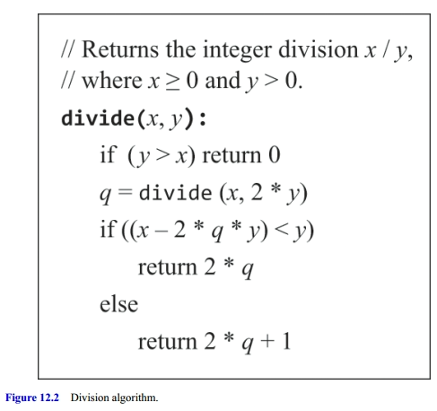
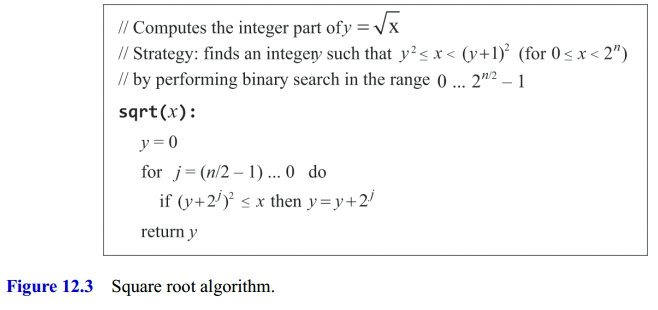
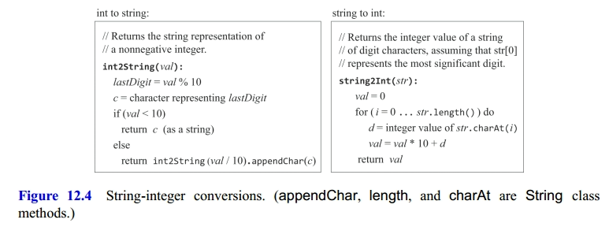
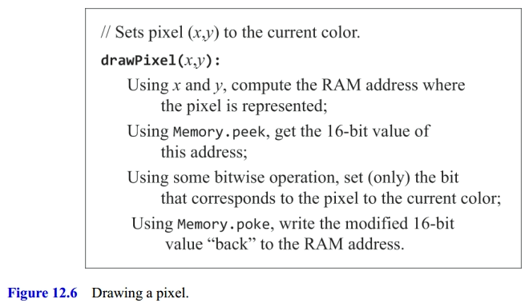
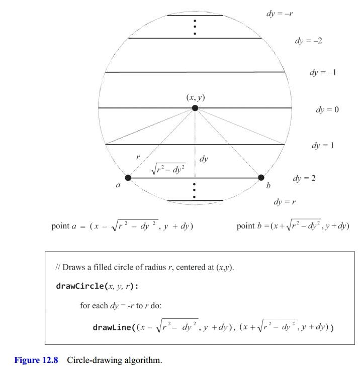
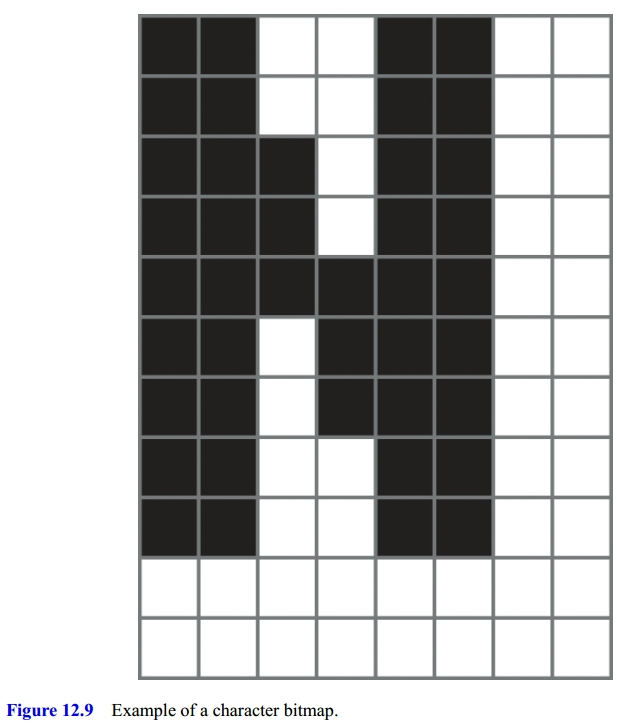
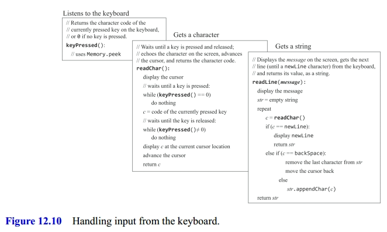

## Mathematical Operations

Normally, addition is implemented in hardware, at the ALU level, and subtraction is gained freely, using two's complement method. Other arithmetic operations can be handled either by hardware or by software, depending on cost/performance considerations.

As a rule, we seek algorithms whose running time is a polynomial function of the input's word size $n$. Algorithms whose running time depends on the values of $n$-bit numbers are unacceptable, since these values are exponential in $n$.

#### Multiplication

On decimal notation, To compute $356$ times $73$, we line up the two numbers one on top of the other, right-justified. Next, we multiply $356$ by $3$. Next, we shift $356$ to the left one position, and multiply $3560$ by $7$. The binary version of the multiplication procedure is illustrated in figure 12.1.


1. For each $i$-th bit of $y$, we shift $x$ $i$ times to the left (same as multiplying $x$ by $2^i$).
2. We look at the $i$-th bit of $y$: If it is $1$, we add the shifted $x$ to an accumulator; otherwise, we do nothing.

Note that $2 * shiftedx$ can be computed either by left-shifting the bitwise representation of $shiftedx$ or by adding $shiftedx$ to itself. Either operation lends itself to primitive hardware operations.

The multiplication algorithm performs $n$ iterations, where $n$ is the bit width of the $y$ input. In the Hack platform, the bit width of all data types is $16$. If we assume that each iteration of the multiplication algorithm entails about ten Hack machine instructions, it follows that each multiplication operation will require at most $160$ clock cycles

#### Division

We can try to subtract large chunks of $y$'s from $x$ in each iteration. For example, suppose we have to divide $175$ by $3$. We start by asking: What is the largest number $x = (90, 80, \cdots, 10)$, so that $3 \cdot x \leq 175$. The answer is $50$. This accelerated subtraction leaves a remainder of $175 - 3 \cdot 50 = 25$. Moving along, we now ask: What is the largest number $x = (9, 8, \cdots, 1)$, so that $3 \cdot x \leq 25$? We perform this steps until the remainder is less than $3$. This technique is the rationale behind the dreaded school procedure known as long division.

The binary version of this algorithm is identical, except that instead of accelerating the subtraction using powers of $10$ we use powers of $2$. Figure 12.2 presents another division algorithm which is as efficient, but more elegant and easier to implement.



Suppose we have to divide $480$ by $17$. The algorithm shown in figure 12.2 is based on the insight and so on. The depth of this recursion is bounded by the number of times $y$ can be multiplied by $2$ before reaching $x$. This also happens to be, at most, the number of bits required to represent $x$.

#### Square Root

The square root function has two attractive properties.

1. It is monotonically increasing.
2. Its inverse function, is a function that we already know how to compute efficiently, multiplication.

Taken together, these properties imply that we have all we need to compute square roots efficiently, using a form of binary search. Figure 12.3 gives the details.



Since the number of iterations in the binary search that the algorithm performs is bound by $\frac{n}{2}$ where $n$ is the number of bits in $x$, the algorithm's running time is $O(n)$.

### Strings

Typically, the string abstraction is supplied by a `String` class that is part of the standard class library that supports the language.

The more challenging `String` methods are those that convert integer values to strings and strings of digit characters to integer values.

**String representation of numbers**: When numbers are captured from an input device like a keyboard they are cast as strings of characters, each representing one of the digits $0$ to $9$. The subset of relevant characters is:


The integer value of character $c$, where $48 \leq c \leq 57$ is $c - 48$. Conversely, the character code of the integer $x$, where $0 \leq x \leq 9$ is $x + 48$. These conversion algorithms can be based on either iterative or recursive logic, so figure 12.4 presents one of each.



### Memory Management

Each time a program creates a new array or a new object, a memory block of a certain size must be allocated for representing the new array or object. And when the array or object is no longer needed, its RAM space may be recycled. These chores are done by two classical OS functions called `alloc` and `deAlloc`.

The memory blocks for representing arrays and objects are carved from, and recycled back into, a designated RAM area called a **heap**.

The agent responsible for managing this resource is the operating system. When the OS starts running, it initializes a pointer named `heapBase`, containing the heap's base address in the RAM (in Jack, the heap starts just after the
stack's end, with `heapBase=2048`). We’ll present two heap management algorithms: basic and improved.

#### Basic Memory Allocation Algorithm

The data structure that this algorithm manages is a single pointer, named `free`, which points to the beginning of the heap segment that was not yet allocated. See figure 12.5a for the details.


The basic heap management scheme is clearly wasteful, as it never reclaims any memory space.

#### Improved Memory Allocation Algorithm

This algorithm manages a linked list of available memory segments, called `freeList` (see figure 12.5b). Each segment in the list begins with two housekeeping fields: the segment's length and a pointer to the next segment in the list.


When asked to allocate a memory block of a given size, the algorithm has to search the `freeList` for a suitable segment. There are two heuristics for doing this search.

1. Best-fit: finds the shortest segment that is long enough for representing the required size
2. First-fit: finds the first segment that is long enough

Next, the length of this segment is updated in the `freeList`, reflecting the length of the part that remained after the allocation. If no memory was left in the segment, or if the remaining part is practically too small, the entire segment is eliminated from the `freeList`.

When asked to reclaim the memory block of an unused object, the algorithm appends the deallocated block to the end of the `freeList`.

Dynamic memory allocation algorithms like the one shown in figure 12.5b may create block fragmentation problems. Hence, a defragmentation operation should be considered, that is, merging memory areas that are physically adjacent in memory but logically split into different segments in the `freeList`. The defragmentation can be done each time an object is deallocated, when `alloc()` fails to find a block of the requested size, or according to some other, periodical ad hoc condition.

We end the discussion of memory management with two simple OS functions that have nothing to do with resource allocation. `Memory.peek(addr)` returns the value of the RAM at address `addr`, and `Memory.poke(addr,value)` sets the word in RAM address addr to value. These functions play a role in various OS services that manipulate the memory.

### Graphical Output

Modern computers render graphical output like animation and video on high-resolution color screens, using optimized graphics drivers and dedicated graphical processing units (GPUs). In Nand to Tetris we abstract away most of this complexity, focusing instead on fundamental graphicsdrawing algorithms and techniques.

We assume that the computer is connected to a physical black-and-white screen arranged as a grid of rows and columns, and at the intersection of each lies a pixel. By convention, the columns are numbered from left to right and the rows are numbered from top to bottom. Thus pixel $(0,0)$ is located at the screen’s top-left corner.

We assume that the screen is connected to the computer system through a memory map—a dedicated RAM area in which each pixel is represented by one bit. The screen is refreshed from this memory map many times per second by a process that is external to the computer.

The most basic operation that can be performed on the screen is drawing an individual pixel specified by $(x,y)$ coordinates. This is done by turning the corresponding bit in the memory map on or off. Other operations like drawing a line and drawing a circle are built on top of this basic operation. The graphics package maintains a current color that can be set to black or white. All the drawing operations use the current color. Since the RAM is an $n$-bit device, this operation requires reading and writing an n-bit value. See figure 12.6.



On the next code section we show how a pixel is drawn on our OS:

```java
function int setPixelOnWord(int x, int idx) {
      var int mask;
      // Avoid getting warning of integer constant too big
      let mask = powersOfTwo[idx];
      if (drawBlack) {
          // or operation over 000000001000000
          // where there is a 1 on the idx-th position
          // this ensures the idx-th bit is 1
          let x = x | mask;
      } else {
          // and operation over 111111101111111
          // where there is a 0 on the idx-th position
          // this ensures the idx-th bit is 0
          let x = x & -mask;
      }
      return x;
  }

/*** Draws the (x,y) pixel, using the current color. **/
function void drawPixel(int x, int y) {
      var int screenAddress, screenValue, wordIdx;
      var int col, row;
      let col = x;
      let row = y;
      let screenAddress = baseScreenMemory + (32 * row) + (col / 16);
      // Computes the index on the 16-bit word by performing col % 16
      let wordIdx = col - ((col / 16) * 16);
      let screenValue = Memory.peek(screenAddress);
      let screenValue = Screen.setPixelOnWord(screenValue, wordIdx);
      do Memory.poke(screenAddress, screenValue);
      return;
  }
```

When asked to render a continuous "line" between two "points" on a grid made of discrete pixels, the best that we can possibly do is approximate the line by drawing a series of pixels along the imaginary line connecting the two points. The procedure for drawing a line from $(x1,y1)$ to $(x2,y2)$ starts by drawing the $(x1,y1)$ pixel and then zigzagging in the direction of $(x2,y2)$ until that pixel is reached. See figure 12.7.


The following code realizes this algorithm:

```java
/*** Draws a line from pixel (x1,y1) to pixel (x2,y2), using the current color. **/
function void drawLine(int x1, int y1, int x2, int y2) {
    var int a, b;
    var int dx, dy, da, db;
    var int xDirection, yDirection;
    let dx = Math.abs(x2 - x1);
    let dy = Math.abs(y2 - y1);
    let a = 0;
    let b = 0;
    let da = 0;
    let db = 0;
    // Vertical line
    if (dx = 0) {
        do Screen.drawVerticalLine(x1, Math.min(y1, y2), dy);
        return;
    }
    // Horizontal line
    if (dy = 0) {
        do Screen.drawHorizontalLine(Math.max(x1, x2), y1, dx);
        return;
    }
    // If y1 > y2 we have to always go up, that is we have to decrement y1
    if (y1 > y2) {
        let yDirection = -1;
    } else {
        // Else we have to always go down, that is we have to increment y1
        let yDirection = 1;
    }
    // If x1 > x2 we have to always go left, that is we have to decrement x1
    if (x1 > x2) {
        let xDirection = -1;
    } else {
        // Else we have to always go right, that is we have to increment x1
        let xDirection = 1;
    }
    while (((da = dx) | (da < dx)) & ((db = dy) | (db < dy))) {
        do Screen.drawPixel(x1 + a, y1 + b);
        // (da, db) is, let's say the current dx and dy. They store
        // how many times we have gone (up-down)/(right-left). da being the units to the
        // "right-left" and db being the units "up-down".
        if ((db ** dx) < (da ** dy)) {
            // If the b/a ratio, that is the slope of our current line, m1, is below the
            // slope of the line to be painted (dx / dy), then we should readjust the
            // next pixel to draw so we augment m1. That means we need to modify the height b.
            // Go up/down
            let b = b + yDirection;
        } else {
            // Else we need to decrement the slope m1 by modifying the x-coordinate of
            // the endpoint of our current line, that is a
            // Go right/left
            let a = a + xDirection;
        }
        let da = Math.abs(a);
        let db = Math.abs(b);
    }
    return;
}
```

Figure 12.8 presents an algorithm that uses three routines that we've already implemented: multiplication, square root, and line drawing.



The algorithm is based on drawing a sequence of horizontal lines (like the typical line $ab$ in the figure), one for each row in the range $y - r$ to $y + r$. Since $r$ is specified in pixels, the algorithm ends up drawing a line in every row along the circle's north-south diameter, resulting in a completely filled circle. A simple tweak can cause this algorithm to draw only the circle's outline, if so desired.

And finally the next funcion shows how to implement the algorithm to draw the circle:

```java
/*** Draws a filled circle of radius r<=181 around (x,y), using the current color. **/
function void drawCircle(int x, int y, int r) {
    var int dy, dx, rSquare, dySquare, ySum, yDiff;
    let dy = 0;
    let rSquare = r * r;
    while (dy < (r + 1)) {
        let dySquare = dy * dy;
        // y coordinate is computed using original y +- an offset of dy, which takes values in [0, r]
        let ySum = y + dy;
        let yDiff = y - dy;
        // x coordinate is computed using pythagorean theorem, where the triangle's
        // hypothenuses length is equal to the radious (r) we also know the length of
        // one of the cathetus equals dy, therefore dx = +-sqrt(r^2 - dy^2)
        let dx = Math.sqrt(rSquare - dySquare);
        // Avoid redrawing middle part of circle
        if (~(dy = 0)) {
            // Draw upper part
            do Screen.drawLine(x - dx, yDiff, x + dx, yDiff);
        }
        // Draw lower part
        do Screen.drawLine(x - dx, ySum, x + dx, ySum);
        let dy = dy + 1;
    }
    return;
}
```

### Character Output

The character sets that computers use are divided into printable and non-printable subsets. For each printable character in the Hack character set, an 11-row-by-8-column bitmap image was designed. Taken together, these images are
called a font. To handle character spacing, each character image includes at least a $1$-pixel space before the next character in the row and at least a $1$-pixel space between adjacent rows (the exact spacing varies with the size and squiggles of individual characters). Figure 12.9 shows how our font renders the uppercase letter N.



On our OS the pixel representation for the characters are stored on a map, indexed by the int value assigned to each character:

```java
// Initializes the character map array
function void initMap() {
     var int i;

     let charMaps = Array.new(127);

     // Black square, used for displaying non-printable characters.
     do Output.create(0,63,63,63,63,63,63,63,63,63,0,0);

     // Assigns the bitmap for each character in the charachter set.
     // The first parameter is the character index, the next 11 numbers
     // are the values of each row in the frame that represents this character.
     do Output.create(32,0,0,0,0,0,0,0,0,0,0,0);          //
     do Output.create(97,0,0,0,14,24,30,27,27,54,0,0);      // a
     do Output.create(98,3,3,3,15,27,51,51,51,30,0,0);      // b
     do Output.create(99,0,0,0,30,51,3,3,51,30,0,0);        // c
     do Output.create(100,48,48,48,60,54,51,51,51,30,0,0);  // d
     do Output.create(101,0,0,0,30,51,63,3,51,30,0,0);      // e
     do Output.create(102,28,54,38,6,15,6,6,6,15,0,0);      // f
     do Output.create(103,0,0,30,51,51,51,62,48,51,30,0);   // g
     do Output.create(104,3,3,3,27,55,51,51,51,51,0,0);     // h
     ...
}

// Creates the character map array of the given character index, using the given values.
function void create(int index, int a, int b, int c, int d, int e,
                     int f, int g, int h, int i, int j, int k) {
    var Array map;

    let map = Array.new(11);
    let charMaps[index] = map;

    let map[0] = a;
    let map[1] = b;
    let map[2] = c;
    let map[3] = d;
    let map[4] = e;
    let map[5] = f;
    let map[6] = g;
    let map[7] = h;
    let map[8] = i;
    let map[9] = j;
    let map[10] = k;

    return;
}
```

The resulting font is a collection of ninetyfive rectangular bitmap images, each representing a printable character. For each printable character, we define an array that holds the character's bitmap. The array consists of 11 elements, each corresponding to a row of 8 pixels. Specifically, we set the value of each array entry j to an integer value whose binary representation (bits) codes the 8 pixels appearing in the j-th row of the character’s bitmap. So for example, the number $4$, whose binary representation in $8$ bits is $00000100$, would just color black the third column for the $j$th row.

Characters are usually displayed one after the other, from left to right, until the end of the line is reached. The character-writing package maintains a global cursor that keeps track of the screen location where the next character should be drawn. The cursor information consists of column and row counts, say, `cursor.col` and `cursor.row`.

After a character has been displayed, we do `cursor.col++`. At the end of the row we do `cursor.row++` and `cursor.col = 0`. When the bottom of the screen is reached, there is a question of what to do next. Two possible actions are effecting a scrolling operation or clearing the screen and starting over by setting the cursor to $(0,0)$.

### Keyboard Input

Detecting which key is presently pressed is a hardware-specific operation that depends on the keyboard interface. In the Hack computer, the keyboard continuously refreshes a $16$-bit memory register whose address is kept in a pointer named `KBD`. If a key is currently pressed on the keyboard, that address contains the key’s character code; otherwise, it contains $0$. This contract is used for implementing the keyPressed function shown in figure 12.10.



The elapsed time between the key pressed and the subsequent key released events is unpredictable. Hence, we have to write code that neutralizes this uncertainty. Also, when users press keys on the keyboard, we want to give feedback as to which keys have been pressed. Typically, we want to display some graphical cursor at the screen location where the next input goes, and, after some key has been pressed, we want to echo the inputted character by displaying its bitmap on the screen at the cursor location. All these actions are implemented by the `readChar` function.

A multicharacter input typed by the user is considered final after the ENTER key has been pressed, yielding the newLine character. Until the ENTER key is pressed, the user should be allowed to backspace, delete, and retype previously typed characters. All these actions are accommodated by the `readLine` function.

Our input-handling solutions are based on a cascading series of abstractions: The high-level program relies on the `readLine` abstraction, which relies on the `readChar` abstraction, which relies on the `keyPressed` abstraction, which relies on the `Memory.peek` abstraction, which relies on the hardware.
