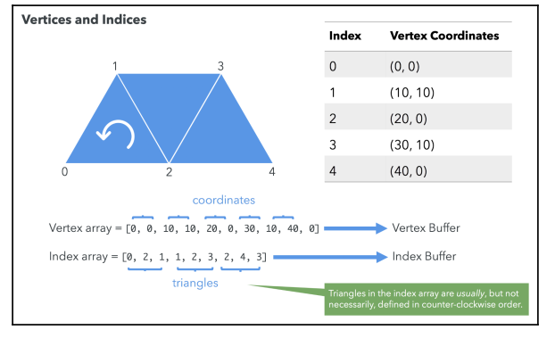
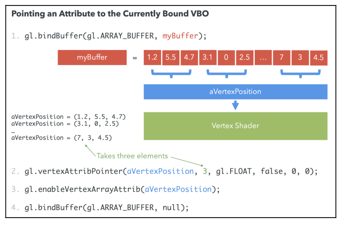
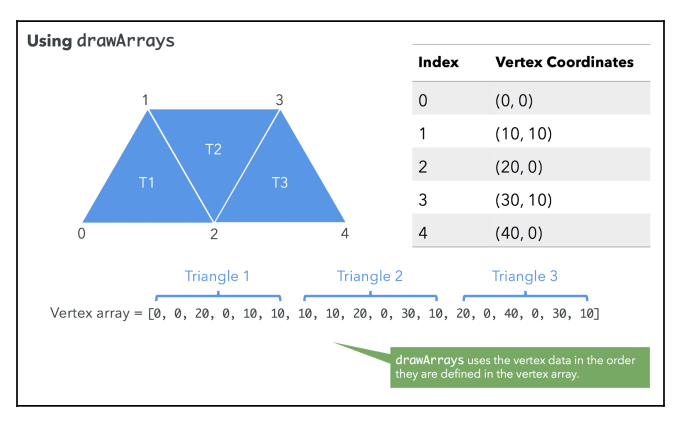
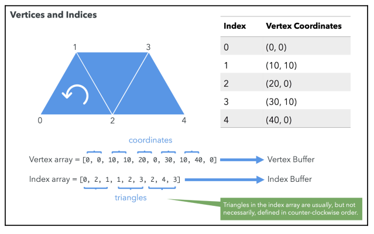
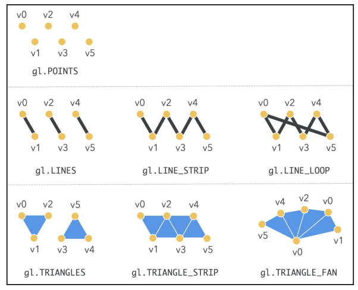

## WebGL Rendering Pipeline

**WebGL runs on the GPU on your computer**. As such, you need to provide code that runs on that GPU. This code is comprised by two functions called vertex shader and fragment shader, written in a very strictly-typed C/C++-like language called **GLSL, GL Shader Language**. Together, they are called a **program**.

A vertex shader's job is to compute vertex attributes, it outputs values that can be used to rasterize various kinds of primitives, including points, lines, and triangles.

A fragment shader's job is to compute a color for each pixel of the primitive currently being drawn.

Let's examine what WebGL's rendering pipeline. The following is a diagram of a simplified version of WebGL's rendering pipeline:


### Vertex Buffer Objects (VBOs)

**VBOs** contain the data that is used to describe the geometry to be rendered. Vertex coordinates, are usually stored and processed in WebGL as VBOs.

### Index Buffer Objects (IBOs)

IBOs contain information about the relationship of the vertices. It uses the index of each vertex in the vertex buffer as a value.

### Vertex Shader

The vertex shader is called on each vertex. The **shader manipulates per-vertex data**.

### Fragment Shader

Each surface element (pixel) is called a fragment. The main goal of the fragment shader is to calculate the color of individual pixels.

### Framebuffer

The **framebuffer** is a two-dimensional buffer contains the fragments that have been processed by the fragment shader.

### Attributes

**Attributes** are input variables that are used in the vertex shader.

For example, you may put three dimensional $32$-bit vectors in a buffer. You would tell a particular attribute which buffer to pull the vectors out of, what type of data it should pull out ($3$-component, $32$-bit floating point numbers), what offset in the buffer the positions start at, and how many bytes to get from one position to the next.

### Uniform

**Uniforms** are input variables that are available to both the vertex shader and the fragment shader. Unlike attributes, uniforms are constant during a rendering cycle.

### Textures

**Textures** are arrays of data that can be accessed in your shader program. Image data is the most common thing to put in a texture.

### Varyings

**Varyings** are used to pass data from the vertex shader to the fragment shader. The values set on a varying by a vertex shader will be interpolated while executing the fragment shader.

## Rendering in WebGL

There are two data types that are fundamental: **vertices** and **indices**. Vertices are the points that define the corners of 3D objects. Each vertex is represented by three floating-point numbers that correspond to the x, y, and z coordinates of the vertex.

Indices are numeric labels for the vertices in a given 3D scene. Indices allow us to tell WebGL how to connect vertices in order to produce a surface.

Both vertices and indices are stored on a javascript array and passed to WebGL's rendering pipeline.

### Defining a Geometry Using JavaScript Arrays



As you can see from the preceding illustration, we have placed the coordinates sequentially in the vertex array and then indicated how these coordinates are used to draw the trapezoid in the index array.

Triangles in the index array are usually, but not necessarily, defined in **counter-clockwise order**. It's important to pick one approach and keep it consistent because programs may use the clockwise/counter-clockwise order to determine whether a face is facing forward or backward for culling and rendering purposes.

In computer graphics, **back-face culling** determines whether a polygon of a graphical object is visible.

### Creating WebGL Buffers

Let's render a square. We define the vertices, and create the respective buffer. These vertices are defined in **clipspace coordinates**, because WebGL only deals with clipspace coordinates. Clipspace coordinates always go from $-1$ to $+1$.

```javascript
const vertices = [-0.5, 0.5, 0, -0.5, -0.5, 0, 0.5, -0.5, 0, 0.5, 0.5, 0];
const positionBuffer = gl.createBuffer();
```

Now, when `positionBuffer` is made the currently-bound WebGL buffer any subsequent buffer operation will be executed on this buffer until it is unbound, or another buffer is made the current one.

```javascript
gl.bindBuffer(gl.ARRAY_BUFFER, positionBuffer);
```

The first parameter is the type of buffer we are creating:

- `gl.ARRAY_BUFFER`: Vertex data
- `gl.ELEMENT_ARRAY_BUFFER`: Index data

Once we have bound a buffer, we need to pass along its contents.

```javascript
gl.bufferData(gl.ARRAY_BUFFER, new Float32Array(vertices), gl.STATIC_DRAW);
```

The last argument is the type, which is a performance hint for WebGL. The accepted values for type are as follows:

- `STATIC_DRAW`: Data in the buffer will not be changed (specified once and used many times)
- `DYNAMIC_DRAW`: Data will be changed frequently (specified many times and used many times)
- `STREAM_DRAW`: Data will change on every rendering cycle (specified once and used once)

WebGL requires JavaScript typed array so that the buffer data can be processed in its native binary form with the objective of speeding up geometryprocessing performance. The typed arrays used by WebGL include `Int8Array, Uint8Array, Int16Array, Uint16Array, Int32Array, Uint32Array, Float32Array`, and `Float64Array`.

It's important to note that vertex coordinates can be float, but indices are always integers. Finally, it is a good practice to unbind the buffer.

```javascript
gl.bindBuffer(gl.ARRAY_BUFFER, null);
```

All this same process applies for the index buffer.

### Associating Attributes to VBOs

Once we have created the VBOs, we need to associate these buffers to vertex shader attributes. Each vertex shader attribute will refer to one and only one buffer. We can achieve this by following these steps:

1. Bind a VBO

```javascript
gl.bindBuffer(gl.ARRAY_BUFFER, myBuffer);
```

2. Point an attribute to the currently-bound VBO

```javascript
gl.vertexAttribPointer(index, size, type, normalize, stride, offset);
```

- index: attribute's index that we are bounding the currently-bound buffer to (i.e. aVertexPosition)
- size: number of values per vertex that are stored in the currently-bound buffer.
- type: data type of the values stored in the current buffer (`FIXED, BYTE, UNSIGNED_BYTE, FLOAT, SHORT, UNSIGNED_SHORT`)
- normalize: beyond scope (set to false)
- stride: If stride is 0, then we are indicating that elements are stored sequentially in the buffer.
- offset: The position in the buffer from which we will start reading values for the corresponding attribute. Generally $0$.

3. Enable the attribute

```javascript
gl.enableVertexAttribArray(positionAttributeLocation);
```

4. Unbind

```javascript
gl.bindBuffer(gl.ARRAY_BUFFER, null);
```



## Rendering

### Drawing Functions

The `drawArrays` and `drawElements` functions are used for writing to the framebuffer.

`drawArrays` uses vertex data in the order in which it is defined in the buffer to create the geometry. In contrast, `drawElements` uses indices to access the vertex data buffers and create the geometry. Both drawArrays and drawElements will only use **enabled arrays**.

#### Using `drawArrays`

We will call `drawArrays` when information about indices is not available. In most cases, `drawArrays` is used when the geometry is simple enough that defining indices is overkill.

When we want to render a triangle or a rectangle. In that case, WebGL will create the geometry in the order in which the vertex coordinates are defined in the VBO. If you have contiguous triangles (as we did in the trapezoid example), you will have to **repeat** these coordinates in the VBO.

If you need to repeat many vertices to create the geometry, `drawArrays` is not the optimal method. The more vertex data you duplicate, the more calls you will have on the vertex shader, one per vertex.



The signature for `drawArrays` is as follows:

```javascript
gl.drawArrays(mode, first, count);
```

Where:

- `mode`: the type of primitive that we are going to render: `gl.POINTS, gl.LINE_STRIP, gl.LINE_LOOP, gl.LINES, gl.TRIANGLE_STRIP, gl.TRIANGLE_FAN`, and `gl.TRIANGLES`.
- `first`: the starting element in the enabled arrays.
- `count`: the number of elements rendered.

#### Using `drawElements`

`drawElements` allows us to use the IBO to tell WebGL how to render the geometry. Therefore, vertices are only processed once, and can be used as many times as they are defined in the IBO. This feature reduces both the memory and processing required on the GPU.



When we use `drawElements`, we need at least two buffers: a VBO and an IBO. As the vertex shader gets executed on each vertex, the rendering pipeline assembles the geometry into triangles using the IBO.

The signature for `drawElements` is as follows:

```javascript
gl.drawElements(mode, count, type, offset);
```

Where:

- `mode`: the type of primitive that we are going to render: `gl.POINTS, gl.LINE_STRIP, gl.LINE_LOOP, gl.LINES, gl.TRIANGLE_STRIP, gl.TRIANGLE_FAN`, and `gl.TRIANGLES`.
- `count`: the number of elements rendered.
- `type`: the type of the values in indices: `UNSIGNED_BYTE` or `UNSIGNED_SHORT`.
- `offset`: which element in the buffer will be the starting point for rendering.

## Rendering a Square

We first, compile each shader as follows:

```javascript
/**
 * Compiles the vertex or fragment shader
 */
export const compileShader = (
  gl: WebGL2RenderingContext,
  type: PROGRAM_TYPE,
  source: string
) => {
  let shader;
  if (type === PROGRAM_TYPE.VERTEX) {
    shader = gl.createShader(gl.VERTEX_SHADER);
  } else {
    shader = gl.createShader(gl.FRAGMENT_SHADER);
  }

  if (!shader) return;

  gl.shaderSource(shader, source);
  gl.compileShader(shader);

  if (!gl.getShaderParameter(shader, gl.COMPILE_STATUS)) {
    console.error(gl.getShaderInfoLog(shader));
    return null;
  }

  return shader;
};
```

We use this utility function to create the **program**:

```javascript
/**
 * Creates a program that is made up of a vertex shader and a fragment shader
 */

export const createProgram = (
  gl: WebGL2RenderingContext,
  vertexShaderSource: string,
  fragmentShaderSource: string
) => {
  // Obtain the shaders
  const vertexShader = compileShader(
    gl,
    PROGRAM_TYPE.VERTEX,
    vertexShaderSource
  );
  const fragmentShader = compileShader(
    gl,
    PROGRAM_TYPE.FRAGMENT,
    fragmentShaderSource
  );

  // Create a program
  const program = gl.createProgram();
  if (!program || !vertexShader || !fragmentShader) {
    throw "Could no create program";
  }

  // Attach the shaders to this program
  gl.attachShader(program, vertexShader);
  gl.attachShader(program, fragmentShader);
  gl.linkProgram(program);

  if (!gl.getProgramParameter(program, gl.LINK_STATUS)) {
    throw "Could not initialize shaders";
  }

  // Use this program instance
  gl.useProgram(program);

  return program;
};
```

Once the program has been created, we populate our buffers:

```javascript
/** Draws square on center of clipspace x in (-1, 1), y in (-1, 1)
 *  0->(-0.5, 0.5)  3->(0.5, 0.5)
 *      |           / |
 *      |        /    |
 *      |     /       |
 *      | /           |
 *  1->(-0.5, -0.5)  2->(0.5, -0.5)
 *
 */

// Define vertices for position on space: the depth (z) is not important for now
const vertices = [-0.5, 0.5, 0, -0.5, -0.5, 0, 0.5, -0.5, 0, 0.5, 0.5, 0];

// Define indices for identifying triangles that make up the geometry
// Using counter-clock wise order
// First triangle is made up from the vertices 0, 1, and 2, the second triangle
// is made up of vertices 1, 2 and 3
indices = [0, 1, 3, 1, 2, 3];

// Set up VBO
verticesBuffer = gl.createBuffer();
gl.bindBuffer(gl.ARRAY_BUFFER, verticesBuffer);
gl.bufferData(gl.ARRAY_BUFFER, new Float32Array(vertices), gl.STATIC_DRAW);

// Set up IBO
indicesBuffer = gl.createBuffer();
gl.bindBuffer(gl.ELEMENT_ARRAY_BUFFER, indicesBuffer);
gl.bufferData(
  gl.ELEMENT_ARRAY_BUFFER,
  new Uint16Array(indices),
  gl.STATIC_DRAW
);

// Unbind buffers
gl.bindBuffer(gl.ARRAY_BUFFER, null);
gl.bindBuffer(gl.ELEMENT_ARRAY_BUFFER, null);
```

Now, in order to draw, we bind our buffers again and the we bind and enable the attributes:

```javascript
// Clear the scene
gl.clear(gl.COLOR_BUFFER_BIT | gl.DEPTH_BUFFER_BIT);
gl.viewport(0, 0, gl.canvas.width, gl.canvas.height);

// Bind the vertex buffer with an attribute
gl.bindBuffer(gl.ARRAY_BUFFER, verticesBuffer);
// Obtain attribute instance
const vertexPositionAttr = gl.getAttribLocation(program, "aVertexPosition");
// Bind attibute to buffer and set some metadata
gl.vertexAttribPointer(vertexPositionAttr, 3, gl.FLOAT, false, 0, 0);
// Enable attribute
gl.enableVertexAttribArray(vertexPositionAttr);

// Bind IBO
gl.bindBuffer(gl.ELEMENT_ARRAY_BUFFER, indicesBuffer);

// Draw to the scene using triangle primitives
gl.drawElements(gl.TRIANGLES, indices.length, gl.UNSIGNED_SHORT, 0);

// Unbind buffers
gl.bindBuffer(gl.ARRAY_BUFFER, null);
gl.bindBuffer(gl.ELEMENT_ARRAY_BUFFER, null);
```

## Vertex Array Objects

**Vertex array objects** (VAOs) allow you to store all of the vertex/index binding information for a set of buffers in a single, easy to manage object.

This is an important feature that should always be used, since it significantly reduces rendering times.

When not using VAOs, all attributes data is in global WebGL state, which means that calling functions such as `gl.vertexAttribPointer`, `gl.enableVertexAttribArray`, and `gl.bindBuffer(gl.ELEMENT_ARRAY_BUFFER, buffer)` manipulates the global state. This leads to performance loss, because before any draw call, we would need to set up all vertex attributes and set the `ELEMENT_ARRAY_BUFFER` where indexed data is being used. with VAOs, we would set up all attributes during our application's initialization and simply bind the data at render, yielding much better performance.

So how would we use a VAO. There are two steps that change, firstly when we populate our data we create a VAO object alongside our VBO and IBO. And we also create create and enable here our vertex attributes.

```javascript
// Define vertices for position on space: the depth (z) is not important for now
const vertices = [-0.5, 0.5, 0, -0.5, -0.5, 0, 0.5, -0.5, 0, 0.5, 0.5, 0];

// Define indices for identifying triangles that make up the geometry
// Using counter-clock wise order
// First triangle is made up from the vertices 0, 1, and 2, the second triangle
// is made up of vertices 1, 2 and 3
indices = [0, 1, 3, 1, 2, 3];

// Set up VAO
VAO = gl.createVertexArray();
gl.bindVertexArray(VAO);

// Set up VBO (used inside VAO)
const verticesBuffer = gl.createBuffer();

gl.bindBuffer(gl.ARRAY_BUFFER, verticesBuffer);
gl.bufferData(gl.ARRAY_BUFFER, new Float32Array(vertices), gl.STATIC_DRAW);

// Tell VAO how to use the current bound buffer (vertices buffer!)
// Refer to 01_square.html and see how now the definition of how the data should
// be retrived is done now on initialization instead of on render.
// Obtain attribute instance
const vertexPositionAttr = gl.getAttribLocation(program, "aVertexPosition");

gl.enableVertexAttribArray(vertexPositionAttr);
gl.vertexAttribPointer(vertexPositionAttr, 3, gl.FLOAT, false, 0, 0);

// Set up IBO
indicesBuffer = gl.createBuffer();

gl.bindBuffer(gl.ELEMENT_ARRAY_BUFFER, indicesBuffer);
gl.bufferData(
  gl.ELEMENT_ARRAY_BUFFER,
  new Uint16Array(indices),
  gl.STATIC_DRAW
);

// Unbind buffers
gl.bindVertexArray(null);
gl.bindBuffer(gl.ARRAY_BUFFER, null);
gl.bindBuffer(gl.ELEMENT_ARRAY_BUFFER, null);
```

And, in order to draw we simply bind our VAO and our IBO to be used with `drawElements`.

```javascript
// Clear the scene
gl.clear(gl.COLOR_BUFFER_BIT | gl.DEPTH_BUFFER_BIT);
gl.viewport(0, 0, gl.canvas.width, gl.canvas.height);

// Bind VAO
gl.bindVertexArray(VAO);

// Bind IBO
gl.bindBuffer(gl.ELEMENT_ARRAY_BUFFER, indicesBuffer);

// Draw to the scene using triangle primitives
gl.drawElements(gl.TRIANGLES, indices.length, gl.UNSIGNED_SHORT, 0);

// Unbind buffers
gl.bindVertexArray(null);
gl.bindBuffer(gl.ELEMENT_ARRAY_BUFFER, null);
```

## `drawElements` Modes

- `TRIANGLES`: WebGL will use the first three indices defined in your IBO to construct the first triangle, the next three to construct the second triangle, and so on.
- `LINES`: will instruct WebGL to take each consecutive pair of indices defined in the IBO and draw lines by taking the coordinates of the corresponding vertices.
- `POINTS`: WebGL will not generate surfaces. Instead, it will render the vertices that we had defined using the index array.
- `LINES_LOOP`: draws a closed loop connecting the vertices defined in the IBO to the next one.
- `LINE_STRIP`: is similar to `LINE_LOOP`. The difference is that WebGL does not connect the last vertex to the first one.
- `TRIANGLE_STRIP`: draws connected triangles. Every vertex is specified after the first three.
- `TRIANGLE_FAN`: FAN creates triangles in a similar way to `TRIANGLE_STRIP`. However, the first vertex defined in the IBO is taken as the origin of the fan (the only shared vertex among consecutive triangles).



## WebGL as a State Machine: Buffer Manipulation

When dealing with buffers for the `getParameter`, `getBufferParameter`, and `isBuffer` functions, new information about the state of the rendering pipeline becomes available to us.

`getParameter(parameter)`, we use `parameter` to retrieve a reference to the currently-bound VBO (`parameter=ARRAY_BUFFER_BINDING`) or to retrieve a reference to the currently-bound IBO (`parameter=ELEMENT_ARRAY_BUFFER_BINDINGS`).

We can also query the size and the usage of the currently-bound VBO and IBO using `getBufferParameter(type, parameter)`, where type can have the following values:

- `ARRAY_BUFFER`: To refer to the currently-bound VBO
- `ELEMENT_ARRAY_BUFFER`: To refer to the currently-bound IBO
- And parameter can have the following values:

- `BUFFER_SIZE`: Returns the size of the requested buffer
- `BUFFER_USAGE`: Returns the usage of the requested buffer

Finally, `isBuffer(object)` will return true if the `object` is a WebGL buffer, or false with an error when the buffer is invalid.
