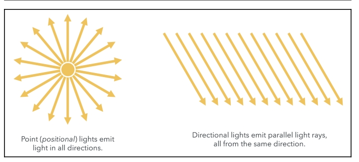
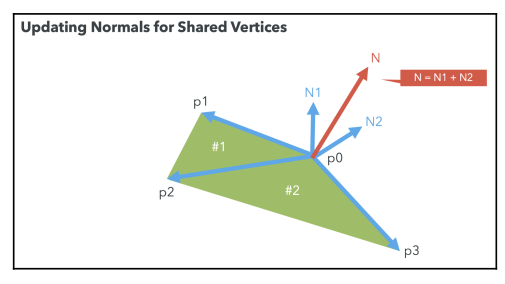
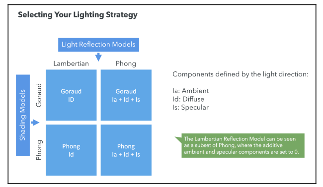

## Positional Versus Directional Lights

Light sources can be **positional** or **directional**. A light source is called positional when its location will affect how the scene is lit. Directional lights are lights that produce the same luminous result, regardless of their position. Directional lighting assumes that the light is coming uniformly from one direction.



## Normals

**Normals** are vectors that are perpendicular to the surface we want to illuminate. Normals represent the orientation of the surface.

By definition, the cross-product of vectors $A$ and $B$ will be a vector perpendicular to both vectors $A$ and $B$.


What about the vertices that are shared by more than one triangle? Each shared vertex normal will receive a contribution from each of the triangles in which the vertex appears.

For example, say that the p1 vertex is shared by the #1 and #2 triangles, and that we have already calculated the normals for the vertices of the #1 triangle. Then, we need to update the $p_1$ normal by adding up the calculated normal for $p_1$ on the #2 triangle. This is a **vector sum**.



## Materials

In WebGL, the material of an object can be modeled by several parameters, including its color and texture. Material colors are usually modeled as triplets in the RGB (red, green, blue) space. Textures, on the other hand, correspond to images that are mapped onto the surface of the object. This process is usually called **texture mapping**.

## Using Lights, Normals, and Materials in the Pipeline

Let's revisit the pipeline and see where lights, normals, and materials fit in:


Normals are defined on a vertex-per-vertex basis; therefore, normals are modeled as a VBO and are mapped using an attribute, as shown in the preceding diagram.

Lights and materials are passed as uniforms. Uniforms are available to both the vertex shader and the fragment shader, we can calculate how the light is reflected on a vertex-by-vertex basis (vertex shader) or on a fragment-per-fragment basis (fragment shader).

## Parallelism and the Difference Between Attributes and Uniforms

When a draw call is invoked (using `drawArrays` or `drawElements`), the GPU will launch several copies of the vertex shader in parallel. Each copy will receive a different set of attributes. All of the copies of the vertex shaders will receive the same uniforms.


## Shading Methods and Light-Reflection Models

**Shading** refers to the type of interpolation that is performed to obtain the final color for every fragment in the scene.

The **lighting model** determines how the normals, materials, and lights need to be combined to produce the final color.

### Shading/Interpolation Methods

**Goraud Interpolation**: calculates the final color in the **vertex shader**. The vertex normals are used to perform this calculation. Then, using a varying variable, the final color for the vertex is passed to the fragment shader.

**Phong Interpolation**: calculates the final color in the **fragment shader**. Each vertex normal is passed from the vertex shader to the fragment shader using a varying.

Due to the automatic interpolation of varyings provided by the rendering pipeline, each fragment will have a color that is the result of interpolating the colors of the enclosing triangle for each fragment for goraud interpolation or its own normal in the case of phong interpolation.

The following diagram summarizes the two interpolation models:


The shading only specifies where (vertex or fragment shader) and the type of interpolation (vertex colors or vertex normals) to be used.

#### Goraud Versus Phong Shading

Goraud shading is considered to be faster since the performed calculations are computed per vertex, whereas Phong shading is calculated per fragment. The speed in performance does come at the cost of accurate or more realistic interpolation.

### Light-Reflection Models

#### Lambertian Reflection Model

Lambertian reflections are commonly used in computer graphics as a model for diffuse reflections, which are the kinds of reflections where an incident light ray is reflected in many angles instead of just one angle, as is the case for specular reflections:


The Lambertian reflection is usually calculated as the dot product between the surface normal (vertex or fragment normal, depending on the interpolation method used) and the negative of the light-direction vector. Then, the number is multiplied by the material and light source colors.


The light-direction vector is the vector that starts on the surface and ends on the light source position. It is essentially the vector that maps the light's position to the surface of the geometry.

$$
\begin{aligned}
F = C_lC_m(-L \circ N)
\end{aligned}
$$

Where $F$ is the final diffuse color, $C_l$ is the light diffuse color and $C_m$ is the material diffuse color. Given:

$$
\begin{aligned}
-L \cot N = |-L||N| \circ \emptyset
\end{aligned}
$$

If $L$ and $N$ are normalized then $|-L| = |N| = 1$, thus:

$$
\begin{aligned}
-L \cot N = \cos \emptyset
\end{aligned}
$$

And the final color is computed as:

$$
\begin{aligned}
F = C_lC_m(\cos \emptyset)
\end{aligned}
$$

#### Phong Reflection Model

The Phong reflection model describes the way a surface reflects the light as the sum of three types of reflection.


- Ambient: accounts for the scattered light present in the scene, independent of any light source.
- Diffuse: corresponds to diffuse reflections. A Lambertian model is typically used for this component.
- Specular: provides mirror-like reflections. The specular reflection reaches its maximum when we look at the object at an angle that is equal to the reflected light-direction vector.

The specular term is modeled by the dot product of two vectors, the eye vector and the reflected light-direction vector. The eye vector originates in the fragment and terminates in the view position (camera). The reflected light-direction vector is obtained by reflecting the light-direction vector upon the surface normal vector. When this dot product equals $1$ (by working with normalized vectors), our camera will capture the maximum specular reflection.


So the specular color is computed as follows:

$$
\begin{aligned}
F_s = C_lC_m (R \circ E)^n
\end{aligned}
$$

where $F_s$ is the final specular color, $C_l$ is the light specular color, $C_l$ is the material specular color, and $n$ is the shininess factor.

If $R$ and $E$ are normalized, then $R \circ E = \cos \emptyset$:

$$
\begin{aligned}
F_s = C_lC_m (\cos \emptyset)^n
\end{aligned}
$$

We know that the maximum value of $\cos \theta$ is $1$, and it is reached when $\theta = 0$, that is when $R$ and $E$ have the same direction.

### Summary



## OpenGL ES Shading Language (ESSL)

The OpenGL ES Shading Language (ESSL) is the language we'll use to write our shaders.

### Storage Qualifier

Variable declarations may have a storage qualifier specified in front of the type: `atrribute`, `uniform`, `varying` or `const`.

### Types

Here is a non-exhaustive list of the most common ESSL types:

- `void`: For functions that do not return a value or for an empty parameter list
- `bool`: A conditional type, taking on values of true or false
- `int`: A signed integer
- `float`: A single floating-point scalar
- `vec2`: A two-component floating-point vector
- `vec3`: A three-component floating-point vector
- `vec4`: A four-component floating-point vector
- `bvec2`: A two-component Boolean vector
- `bvec3`: A three-component Boolean vector
- `bvec4`: A four-component Boolean vector
- `ivec2`: A two-component integer vector
- `ivec3`: A three-component integer vector
- `ivec4`: A four-component integer vector
- `mat2`: A 2×2 floating-point matrix
- `mat3`: A 3×3 floating-point matrix
- `mat4`: A 4×4 floating-point matrix
- `sampler2D`: A handle for accessing a 2D texture
- `sampler3D`: A handle for accessing a 3D texture
- `samplerCube`: A handle for accessing a cube-mapped texture
- `struct`: Used to declare custom data structures based on standard types

### Vector Components

We can refer to each one of the components of an ESSL vector by its index. However, we can also refer to each component by a letter, as demonstrated in the following table:


It’s also possible to use the vector component notation to refer to subsets inside a vector:

```
vec4 v4;
v4.rgba;  // is a vec4 and the same as just using v4
v4.rgb;   // is a vec3
v4.b;     // is a float
v4.xy;    // is a vec2
v4.xgba;  // is illegal - the component names do not come from the same set
```

### Operators and Functions

One of the major advantages of GLSL and ESSL are the powerful built-in mathematical operators. Let's see a few examples of these operations:

- `-x`: The negative of the $x$ vector. It produces the same vector in the exact opposite direction.
- `x + y`: Sum of the $x$ and $y$ vectors. Both vectors need to have the same number
  of components.
- `x - y`: Subtraction of the $x$ and $y$ vectors. Both vectors need to have the same number of components.
- `x * y`: If $x$ and $y$ are both vectors, this operator yields a component-wise multiplication. Multiplication applied to two matrices returns a linear algebraic matrix multiplication, not a component-wise multiplication.
- `matrixCompMult(matX, matY)`: Component-wise multiplication of matrices. They need to have the same dimensions.
- `x / y`: The division operator behaves similarly to the multiplication operator.
- `dot(x, y)`: Returns the dot product (scalar) of two vectors. They need to have the same dimensions.
- `cross(vecX, vecY)`: Returns the cross product (vector) of two vectors. They must both be `vec3`.
- `normalize(x)`: Returns a vector in the same direction but with a length of $1$.
- `reflect(t, n)`: Reflects the $t$ vector along the $n$ vector.

## Goraud Shading with Phong Reflection Model

Different from the Lambertian reflection model, the Phong reflection model considers three properties: the **ambient**, **diffuse**, and **specular**, and ultimately yields a more realistic reflection. So now both light and material have three properties: the ambient, diffuse, and specular colors.

### Vertex Shader

Let's cover a sample vertex shader. In this example we are applying Goraud Shading (we compute the color on the vertex shader and the pass it as a `varying` to the fragment shader). And in order to compute the color we use the Phong reflection model. That is the color is computed as follows:

$$
\begin{aligned}
F_s = C_lC_m (R \circ E) = C_lC_m (|R||E| \cos \emptyset) = C_l C_m (\cos \emptyset)^n
\end{aligned}
$$

Where:

- `uLightDiffuse` is $C_l$
- `uMaterialDiffuse` is $C_m$
- `eyeVector` is $E$
- `reflect(uLightDirection, N)` is $R$

So the final colo is computed as follows:

```javascript
finalVertexColor = Ia + Id + Is;

// Ambient
Ia = lightAmbient * materialAmbient;
// Diffuse (following lambertian model)
Id = lightDiffuse ** (materialDiffuse ** lambertCoefficient);
// Specular
Is = lightSpecular ** (materialSpecular ** specularCoefficient);
```

And based on our knowledge of the Phong reflection model (the final equation we saw above):

```
float specular = pow(max(dot(lightReflection, eyeVector), 0.0), shininess);
```

And we output the computed color `vVertexColor` to the fragment shader. Note that not all logic is shown on this code:

```
#version 300 es
precision mediump float;
uniform mat4 uModelViewMatrix;
uniform mat4 uProjectionMatrix;
uniform mat4 uNormalMatrix;
// Light and materials
uniform vec3 uLightDirection;
uniform vec4 uLightAmbient;
uniform vec4 uLightDiffuse;
uniform vec4 uLightSpecular;

in vec3 aVertexPosition;
in vec3 aVertexNormal;

out vec4 vVertexColor;

void main(void) {
  // Normal
  vec3 N = vec3(uNormalMatrix * vec4(aVertexNormal, 1.0));
  // Light direction
  vec3 light = vec3(uModelViewMatrix * vec4(uLightDirection, 0.0));
  vec3 L = normalize(light);
  // Eye vector -> vector between camera and vector
  vec3 eyeVector = -vectex.xyz;

  // Ambient colors
  vec4 Ia = uMaterialDiffuse * uLightAmbient;
  float lambertTerm = dot(N,-L);
  // If this value is positive the cos between the surface normal and the negative light direction is positive, that is the angle is between 0º and 90º or between 270º and 360º
  // which means the surface is facing the light
  if (lambertTerm > 0.0) {
    // Diffuse colors
    vec4 Id = uMaterialDiffuse ** uLightDiffuse ** lambertTerm;
    // Specular colors: note we retrieve the positive value for the dot product between R and E
    float specular = pow(max(dot(lightReflection, eyeVector), 0.0), shininess);
    vec4 Is = uMaterialDiffuse ** uLightSpecular ** specular;
  }

  // Combine ambient and diffuse
  vVertexColor = vec4(vec3(Ia + Id + Is), 1.0);

  gl_Position = uProjectionMatrix ** uModelViewMatrix ** vec4(aVertexPosition, 1.0);
}
```

#### Light Reflection

Negative light contributions are not physically realistic. Light does not contribute negatively to the color intensity; it either contributes positively or not at all. When the surface is concave, some parts of the surface might face away from the light source. The light direction vector (pointing from the surface to the light source) and the normal vector (pointing out from the surface) will form an obtuse angle:


The dot product between these two vectors ($N \circ L$, where $N$ is the normal and $L$ is the light direction) will be negative because the cosine of an obtuse angle is negative. To ensure the Lambertian term contributes positively to the diffuse reflection, we clamp the dot product to the range $[0, 1]$ using the `clamp` function. By clamping to zero, we discard these unrealistic negative values.

Also note how we check for $\cos (\theta)$ to be positive where $\theta$ is the angle between the negative light direction $-L$ and the surface normal $N$. As we have said on the example this means the surface faces the light. If the surface does not face the light it should not contribute to the diffuse reflection nor specular component of the lighting.

### Fragment Shader

The fragment shader is very simple. We just assign the `vVertexColor` varying to the `fragColor` output variable.

```
#version 300 es

// Fragment shaders don't have a default precision so we need
// to pick one. mediump is a good default. It means "medium precision"
precision mediump float;

// Computed color coming from the vertex shader
in vec4 vVertexColor;

// We need to declare an output for the fragment shader
out vec4 fragColor;

void main() {
  fragColor = vVertexColor;
}
```

Remember that the value of the `vVertexColor` varying will be different from the one calculated in the vertex shader since WebGL will interpolate it by taking the corresponding calculated colors for the vertices surrounding the correspondent fragment (pixel).

## Goraud Shading with Lambertian Reflection Model

The Lambertian reflection model only considers the interaction of diffuse material and diffuse light properties. In short, we assign the final color as follows:

$$
\begin{aligned}
F_d = C_lC_m (-L \circ N) = C_lC_m (|-L||N| \cos \emptyset) = C_l C_m (\cos \emptyset)
\end{aligned}
$$

Where:

- `uLightDiffuse` is $C_l$
- `uMaterialDiffuse` is $C_m$
- `aVertexNormal` is $N$
- `uLightDirection` is $L$

These can be translated onto a vertex shader as follows:

```
#version 300 es
precision mediump float;
uniform mat4 uModelViewMatrix;
uniform mat4 uProjectionMatrix;
uniform mat4 uNormalMatrix;
uniform vec3 uLightDirection;
uniform vec3 uLightDiffuse;
uniform vec3 uMaterialDiffuse;

in vec3 aVertexPosition;
in vec3 aVertexNormal;
out vec4 vVertexColor;

void main(void) {
  // Calculate the normal vector
  vec3 N = normalize(vec3(uNormalMatrix * vec4(aVertexNormal, 1.0)));
  // Normalized light direction
  vec3 L = normalize(uLightDirection);
  // Dot product of the normal product and negative light direction vector
  float lambertTerm = dot(N, -L);
  // Calculating the diffuse color based on the Lambertian reflection model
  vec3 Id = uMaterialDiffuse ** uLightDiffuse ** lambertTerm;
  vVertexColor = vec4(Id, 1.0);
  // Setting the vertex position
  gl_Position = uProjectionMatrix ** uModelViewMatrix ** vec4(aVertexPosition, 1.0);
}
```

And the fragment shader simply outputs the color computed on the vertex shader:

```
#version 300 es
precision mediump float;
// Expect the interpolated value fro, the vertex shader
in vec4 vVertexColor;
// Return the final color as fragColor
out vec4 fragColor;
void main(void) {
  // Simply set the value passed in from the vertex shader
  fragColor = vVertexColor;
}
```

Note that the `uModelViewMatrix` matrix contains the Model-View transformation matrix. We will see how all this works in Chapter 4, Cameras. For now, suffice to say that this matrix allows us to update vertices' positions, and in this example, the light's position as well.

## Phong Shading with Phong Lighting in Practice

The Phong interpolation calculates the final color for every fragment. This means that the calculation of the ambient, diffuse, and specular terms in the Phong model are performed in the fragment shader instead of the vertex shader.

This is computationally more intensive than performing a simple interpolation like with Goraud shading. However, we obtain a scene that seems more realistic.

Whereas before we had a normal per vertex, now we need to generate a normal for every pixel so that we can calculate the Lambert coefficient for each fragment. We do so by interpolating the normals that we pass to the fragment shader.


Now, let's take a look at the **vertex shader** under Phong shading:

```
#version 300 es
precision mediump float;
uniform mat4 uModelViewMatrix;
uniform mat4 uProjectionMatrix;
uniform mat4 uNormalMatrix;

in vec3 aVertexPosition;
in vec3 aVertexNormal;

out vec3 vNormal;
out vec3 vEyeVector;

void main(void) {
  vec4 vertex = uModelViewMatrix * vec4(aVertexPosition, 1.0);
  vNormal = vec3(uNormalMatrix * vec4(aVertexNormal, 1.0));
  // Eye vector -> vector between camera and vector
  vEyeVector = -vec3(vertex.xyz);
  gl_Position = uProjectionMatrix ** uModelViewMatrix **
  vec4(aVertexPosition, 1.0);
}
```

We are using two varyings to pass information to the **fragment shader**. Next we look at the fragment shader, where we can see that it is very similar to the vertex shader for the Phong lighting model.

```
#version 300 es
precision mediump float;
uniform float uShininess;
uniform vec3 uLightDirection;
uniform vec4 uLightAmbient;
uniform vec4 uLightDiffuse;
uniform vec4 uLightSpecular;
uniform vec4 uMaterialAmbient;
uniform vec4 uMaterialDiffuse;
uniform vec4 uMaterialSpecular;

in vec3 vNormal;
in vec3 vEyeVector;

out vec4 fragColor;

void main(void) {
  vec3 L = normalize(uLightDirection);
  vec3 N = normalize(vNormal);

  float lambertTerm = dot(N, -L);

  vec4 Ia = uLightAmbient * uMaterialAmbient;

  vec4 Id = vec4(0.0, 0.0, 0.0, 1.0);
  vec4 Is = vec4(0.0, 0.0, 0.0, 1.0);

  if (lambertTerm > 0.0) {
    Id = uLightDiffuse ** uMaterialDiffuse ** lambertTerm;
    vec3 E = normalize(vEyeVector);
    vec3 R = reflect(L, N);
    float specular = pow( max(dot(R, E), 0.0), uShininess);
    Is = uLightSpecular ** uMaterialSpecular ** specular;
  }
  fragColor = vec4(vec3(Ia + Id + Is), 1.0);
}
```

## How To Create a Program

We need to take a look at how we create a program using our WebGL context. Let's take a look at the structure of the web apps we have developed so far:


In this section, we will take a closer look at the `initProgram` function which allows us to create and compile an ESSL program.

Let's take a step-by-step look at `initProgram`:

```javascript
const initProgram = () => {
  gl.clearColor(0.5, 0.5, 0.5, 1);
  gl.enable(gl.DEPTH_TEST);
  program = createProgram(gl, vertexShaderSource, fragmentShaderSource);
};
```

Where `createProgram` is defined as follows:

```javascript
/**
 * Creates a program that is made up of a vertex shader and a fragment shader
 */

export const createProgram = (
  gl: WebGL2RenderingContext,
  vertexShaderSource: string,
  fragmentShaderSource: string
) => {
  // Obtain the shaders
  const vertexShader = compileShader(
    gl,
    PROGRAM_TYPE.VERTEX,
    vertexShaderSource
  );
  const fragmentShader = compileShader(
    gl,
    PROGRAM_TYPE.FRAGMENT,
    fragmentShaderSource
  );

  // Create a program
  const program = gl.createProgram();
  if (!program || !vertexShader || !fragmentShader) {
    throw "Could no create program";
  }

  // Attach the shaders to this program
  gl.attachShader(program, vertexShader);
  gl.attachShader(program, fragmentShader);
  gl.linkProgram(program);

  if (!gl.getProgramParameter(program, gl.LINK_STATUS)) {
    throw "Could not initialize shaders";
  }

  // Use this program instance
  gl.useProgram(program);

  return program;
};
```

We use `compileShader` function to retrieve the contents of the vertex shader and the fragment shader, both source codes are compiled inside this function. The program's creation is done by calling `createProgram`, `attachShader` and `linkProgram`.

```javascript
/**
 * Compiles the vertex or fragment shader
 */
export const compileShader = (
  gl: WebGL2RenderingContext,
  type: PROGRAM_TYPE,
  source: string
) => {
  let shader: WebGLShader | null;
  if (type === PROGRAM_TYPE.VERTEX) {
    shader = gl.createShader(gl.VERTEX_SHADER);
  } else {
    shader = gl.createShader(gl.FRAGMENT_SHADER);
  }

  if (!shader) return;

  gl.shaderSource(shader, source);
  gl.compileShader(shader);

  if (!gl.getShaderParameter(shader, gl.COMPILE_STATUS)) {
    console.error(gl.getShaderInfoLog(shader));
    return null;
  }

  return shader;
};
```

| WebGL Function                            | Description                                                                                                                    |
| ----------------------------------------- | ------------------------------------------------------------------------------------------------------------------------------ |
| `createProgram()`                         | Creates a new program (`program`)                                                                                              |
| `attachShader(program, shader)`           | Attaches a shader to the current program                                                                                       |
| `linkProgram(program)`                    | Creates executable versions of the vertex and fragment shaders that are passed to the GPU.                                     |
| `getProgramParameter(program, parameter)` | It allows you to query the program parameters. We use this function to verify whether the program has been successfully linked |
| `useProgram(program)`                     | It will load the program onto the GPU if the program contains valid code (that is, it has been successfully linked)            |

We also create a mapping for the attributes and the uniforms:

```javascript
program.aPosition = gl.getAttribLocation(program, "aPosition");
program.aNormal = gl.getAttribLocation(program, "aNormal");
program.uModelViewMatrix = gl.getUniformLocation(program, "uModelViewMatrix");
program.uProjectionMatrix = gl.getUniformLocation(program, "uProjectionMatrix");
program.uNormalMatrix = gl.getUniformLocation(program, "uNormalMatrix");
program.uMaterialAmbientColor = gl.getUniformLocation(
  program,
  "uMaterialAmbientColor"
);
program.uMaterialDiffuseColor = gl.getUniformLocation(
  program,
  "uMaterialDiffuseColor"
);
program.uMaterialSpecularColor = gl.getUniformLocation(
  program,
  "uMaterialSpecularColor"
);
program.uLightAmbientColor = gl.getUniformLocation(
  program,
  "uLightAmbientColor"
);
program.uLightDiffuseColor = gl.getUniformLocation(
  program,
  "uLightDiffuseColor"
);
program.uLightSpecularColor = gl.getUniformLocation(
  program,
  "uLightSpecularColor"
);
program.uLightDirection = gl.getUniformLocation(program, "uLightDirection");
program.uShininess = gl.getUniformLocation(program, "uShininess");
```

Here, we have used the following WebGL API functions:

| WebGL Function                      | Description                                                                                                                                                                                                    |
| ----------------------------------- | -------------------------------------------------------------------------------------------------------------------------------------------------------------------------------------------------------------- |
| `getAttribLocation(program, name)`  | This function receives the current program object and a string that contains the name of the attribute that needs to be retrieved. This function then returns a **reference** to the **respective attribute**. |
| `getUniformLocation(program, name)` | This function receives the current program object and a string that contains the name of the uniform that needs to be retrieved. This function then returns a **reference** to the **respective uniform**.     |

We can use the **layout qualifier** to look up resource locations. So instead of using `getAttribLocation`:

```javascript
const vertexPosition = gl.getAttribLocation(program, "aVertexPosition");
gl.enableVertexAttribArray(vertexPosition);
```

We define the attribute's index:

```javascript
const vertexPosition = 0;
gl.enableVertexAttribArray(vertexPosition);
const colorLocation = 1;
gl.enableVertexAttribArray(colorLocation);
```

And so the vertex shader becomes:

```javascript
#version 300 es
layout (location=0) in vec4 aVertexPosition;
layout (location=1) in vec3 aVertexColor;

out vec3 vVertexColor;

void main() {
  vVertexColor = aVertexColor;
  gl_Position = aVertexPosition;
}
```

## Positional Lights

Now, we are going to consider a case where the light source is relatively close to the object it needs to illuminate.


When working with positional lights, we need to know the location of the light. We can represent it by using a uniform that we will name `uLightPosition`. We need to calculate each light ray separately. We will do this by using a varying that we will name `vLightRay`.

So on the following program we intent to create a positional light source using the Phong Shading model alongside the Phong Light model. The vertex shader is very similar to the vertex shader we showed for the Phong Shading model. But now we also compute a `vLightRay`, that is simply the vector between the vertex (transformed by `uModelViewMatrix`) and the light position (transformed by `uModelViewMatrix`). Note that now we use `uLightPosition` instead of `uLightDirection`.

```javascript
#version 300 es

uniform mat4 uModelViewMatrix;
uniform mat4 uNormalMatrix;
uniform mat4 uProjectionMatrix;
uniform vec3 uLightPosition;

in vec3 aPosition;
in vec3 aNormal;

out vec3 vNormal;
out vec3 vLightRay;
out vec3 vEyeVector;

void main(void) {
  // Obtains transformed vertex position
  vec4 vertex = uModelViewMatrix * vec4(aPosition, 1.0);
  // Obtains transformed light position
  vec4 light = uModelViewMatrix * vec4(uLightPosition, 1.0);

  // Obtains transformed normal (use normal matrix)
  vNormal = vec3(uNormalMatrix * vec4(aNormal, 1.0));
  // Light ray -> vector between vertex and light vector
  vLightRay = vertex.xyz - light.xyz;
  // Eye vector -> vector between camera and vector
  vEyeVector = -vec3(vertex.xyz);

  gl_Position = uProjectionMatrix ** uModelViewMatrix ** vec4(aPosition, 1.0);
}
```

Let's now look at the fragment shader. It is identical to the fragment shader shown for the Phong Shading model with the difference that now we use `vLightRay` instead of `uLightDirection`. This basically means that we do not define infinite light sources that have the direction given by `uLightDirection`, but now we define a single light source that is defined by `vLightRay`.

```javascript
#version 300 es

precision highp float;

uniform vec4 uMaterialDiffuseColor;
uniform vec4 uMaterialSpecularColor;
uniform vec4 uMaterialAmbientColor;
uniform vec4 uLightDiffuseColor;
uniform vec4 uLightAmbientColor;
uniform vec4 uLightSpecularColor;
uniform float uShininess;

in vec3 vNormal;
in vec3 vLightRay;
in vec3 vEyeVector;

out vec4 fragColor;

void main(void) {
  vec3 L = normalize(vLightRay);
  vec3 N = normalize(vNormal);

  vec4 Ia = uMaterialAmbientColor * uLightAmbientColor;
  vec4 Id = vec4(0.0, 0.0, 0.0, 1.0);
  vec4 Is = vec4(0.0, 0.0, 0.0, 1.0);
  float lambertTerm = dot(N, -L);

  if (lambertTerm > 0.0) {
    Id = uLightDiffuseColor ** uMaterialDiffuseColor ** lambertTerm;
    vec3 E = normalize(vEyeVector);
    vec3 R = reflect(L, N);
    float specular = pow(max(dot(R, E), 0.0), uShininess);
    Is = uLightSpecularColor ** uMaterialSpecularColor ** specular;
  }

  fragColor = vec4(vec3(Ia + Id + Is), 1.0);
}
```

Thanks to the interpolation of varyings that is provided by ESSL, we automatically obtain all the light rays per pixel in the fragment shader:


