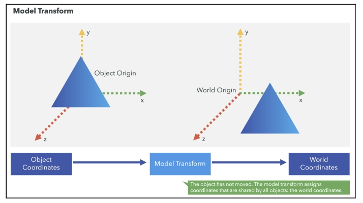
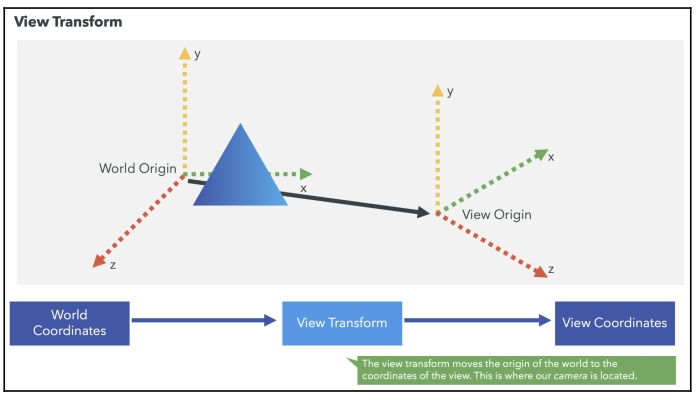
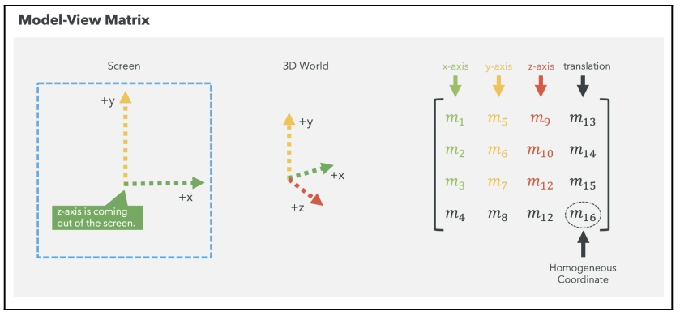
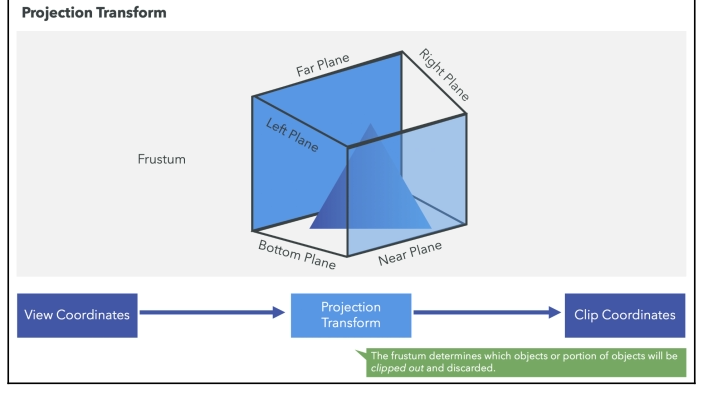
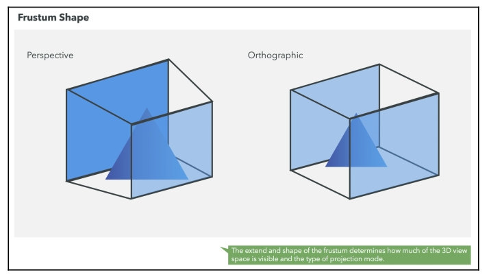
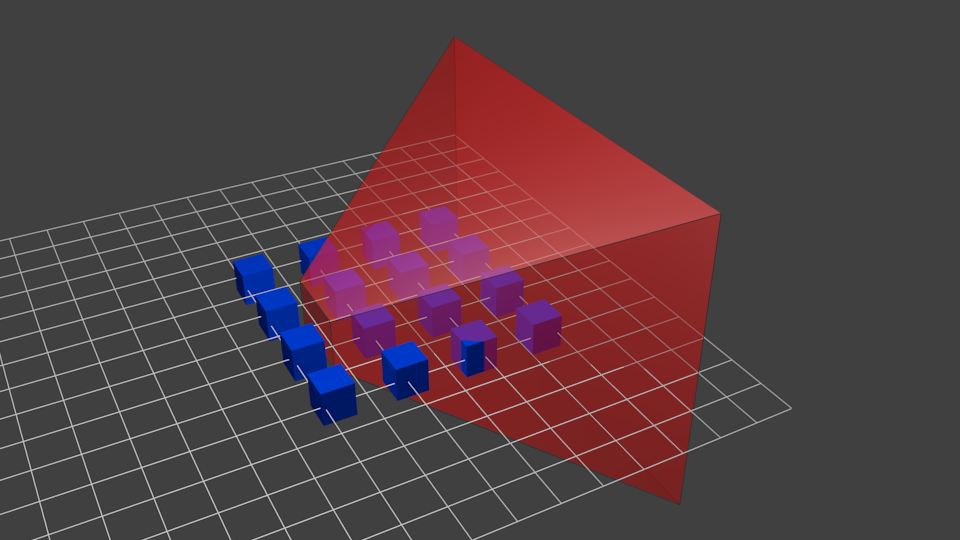
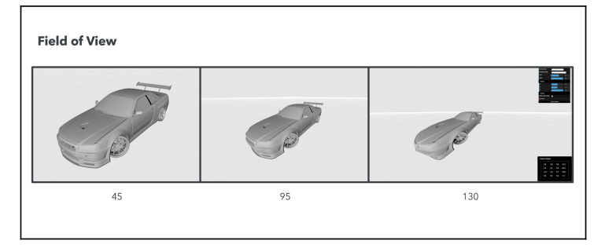
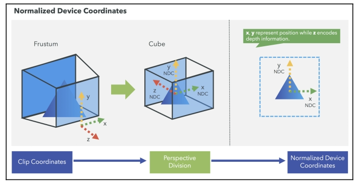
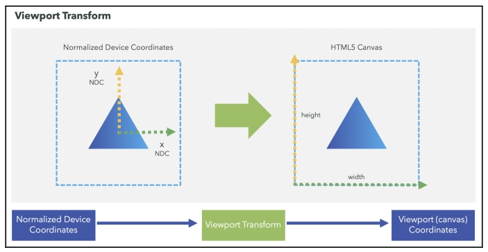

## The Model Matrix

A model is defined by a set of vertices. The $X,Y,Z$ coordinates of these vertices are defined relative to the object’s center: that is, if a vertex is at $(0,0,0)$, it is at the center of the object.

We'd like to be able to move this model (you just learnt to do so: `translation**rotation**scale`, and done. You apply this matrix to all your vertices at each frame and everything moves. Something that doesn't move will be at the center of the world.

Your vertices are now in World Space. We went from **Model Space** (all vertices defined relatively to the center of the model) to **World Space** (all vertices defined relatively to the center of the world). See figure below:

## The View Matrix

It you want to view a moutain from another angle, you can either move the camera... or move the mountain.

So initially your camera is at the origin of the World Space. In order to move the world, you simply introduce another matrix. Let’s say you want to move your camera of $3$ units to the right ($+X$). This is equivalent to moving your whole world $3$ units to the left ($-X$).

We went from **World Space** (all vertices defined relatively to the center of the world, as we made so in the previous section) to **Camera Space** (all vertices defined relatively to the camera). The figure below shows how we go from model/object coordinates to world coordinates and finally to camera coordinates.

## The Model-View Matrix

The Model-View matrix allows us to perform **affine transformations** in our scene. Affine is a mathematical name that describes transformations that do not change the structure of the object undergoing such transformations. In our 3D world scene, such transformations are rotation, scaling, reflection shearing, and translation. Let's take a look at how the Model-View matrix is constructed.

### Spatial Encoding of the World

By default, when you render a scene, you are looking at it from the origin of the world in the negative direction of the z-axis. As shown in the following diagram, the z-axis is coming out of the screen:

#### Rotation Matrix

The intersection of the first three rows with the first three columns defines the 3x3 Rotation matrix. This matrix contains information about rotations around the standard axis.

$$
\begin{aligned}
\begin{pmatrix}
m_1 & m_2 & m_3 \\
m_5 & m_6 & m_7 \\
m_9 & m_{10} & m_{11}
\end{pmatrix}
\end{aligned}
$$

#### Translation Vector

The intersection of the first three rows with the last column defines a three-component Translation vector.

$$
\begin{aligned}
\begin{pmatrix}
m_{13} & m_{14} & m_{15}
\end{pmatrix}
\end{aligned}
$$

#### The Mysterious Fourth Row

The fourth row does not have any special meaning.

- The $m_4$, $m_8$, and $m_{12}$ elements are always $0$.
- The $m_{16}$ element (the Homogeneous coordinate) will always be $1$.

## The Projection Matrix

Projection matrices are specialized $4$x$4$ matrices designed to transform a 3D point in camera space into its projected counterpart on the canvas. Essentially, when you multiply a 3D point by a projection matrix, you determine its 2D coordinates on the canvas within NDC (Normalized Device Coordinates) space (we'll see what these are later). Points in NDC space fall within the range $[-1, 1]$.

It's crucial to remember that projection matrices are intended for transforming vertices or 3D points, not vectors. The workaround involves treating points as $1\times 4$ vectors, enabling their multiplication by a $4\times 4$ matrix. The result is another $1\times 4$ matrix, or 4D points with homogeneous coordinates. These coordinates are only directly applicable as 3D points if their fourth component is $1$, allowing the first three components to represent a standard 3D Cartesian point.

This operation determines how much of the view space will be rendered and how it will be mapped onto the computer screen. This region is known as the **frustum** and it is defined by six planes (near, far, top, bottom, right, and left planes), as shown in the following diagram:

These six planes are encoded in the **Projection matrix**. Any vertices lying outside the frustum after applying the transformation are clipped out and discarded from further processing. Therefore, the frustum defines clipping coordinates, and the Projection matrix that encodes the frustum produces clipping coordinates.

If the far and near planes have the same dimensions, the frustum will then determine an **orthographic projection**. Otherwise, it will be a **perspective projection**.

We went from **Camera Space** (all vertices defined relatively to the camera) to **Homogeneous Space** (all vertices defined in a small cube. Everything inside the cube is onscreen).

Before projection, we’ve got our blue objects, in Camera Space, and the red shape represents the frustum of the camera: the part of the scene that the camera is actually able to see.

Multiplying everything by the Projection Matrix has the following effect:

### Perspective or Orthogonal Projection

A perspective projection assigns more space to details that are closer to the camera than details that are farther away. In other words, the geometry that is close to the camera will appear larger than the geometry that is farther from it.

In contrast, an orthogonal projection uses parallel lines; this means that lines will appear to be the same size, regardless of their distance to the camera.

#### Perspective Matrix

The Projection matrix determines the **field of view** (FOV) of the camera. Which is how much of the 3D space will be captured by the camera. It is a measure given in degrees, and the term is used interchangeably with the term **angle of view**.

- [Perspective Matrix](./02_01_perspective)

#### Orthographic Matrix

- [Orthographic Matrix](./02_02_orthographic)

## Clipping

Up to this point, we are still working with Homogeneous coordinates. Projection matrices actually transform points from the camera space to the **homogeneous clip space**, not to **NDC** (Normalized Device Coordinate) space.

Because WebGL doesn't know anything about the coordinate space it requires that when all of the transformations are done, things should be in normalized device coordinates. Normalized device coordinates are obtained by dividing the clipping coordinates by the $w$ component. This is why this step is known as **perspective division**. In the NDC space, the $x$ and $y$ coordinates represent the location of your vertices on a normalized 2D screen, while the z-coordinate encodes depth information, which is the relative location of the objects with respect to the near and far planes.

Basically the homogeneous coordinates have four components: $x$, $y$, $z$, and $w$. The clipping is done by comparing the $x$, $y$, and $z$ components against the Homogeneous coordinate, $w$. If any of them is more than, $+w$, or less than, $-w$, then that vertex lies outside the frustum and is discarded.

The **clipping coordinates** now range from $-1$ to $+1$ on each axis, regardless of the shape or size of the actual screen. The bottom left corner will be at $(-1, -1)$, and the top right corner will be at (1, 1). WebGL will then map these coordinates onto the viewport that was configured with `glViewport`.

## Recap

The following diagram shows the theory we have learned so far, along with the relationships between the steps in the theory and the implementation in WebGL.

The five transformations that we apply to object coordinates to obtain viewport coordinates are:

- The **Model-View matrix** that groups the model and view transform in one single matrix. When we multiply our vertices by this matrix, we end up in the **camera space** with homogeneous coordinates.
- The **Projection matrix** as a result, we end up in the **homogeneous clip space**.
- **Clipping**: transforms the homogeneous coordinates on cartesian coordinates by leaving out all vertices ouside of the range $[-w, w]$. This leaves us on the **clip space**.
- **Perspective Division**: after we apply perspective division, so now our coordinates are on the **NDC space**.
- **GL Viewport**: internal transform to move to the **raster space**.

An extra transformation matrix is defined specially for the normals. This is the **Normal matrix**, which is obtained by inverting and transposing the Model-View matrix. This matrix is applied to normal vectors to ensure that they continue to be perpendicular to the surface.

## References

1. [Model View Projection](https://jsantell.com/model-view-projection/)
2. [Projection Matrices](https://www.scratchapixel.com/lessons/3d-basic-rendering/perspective-and-orthographic-projection-matrix/projection-matrix-GPU-rendering-pipeline-clipping.html)
