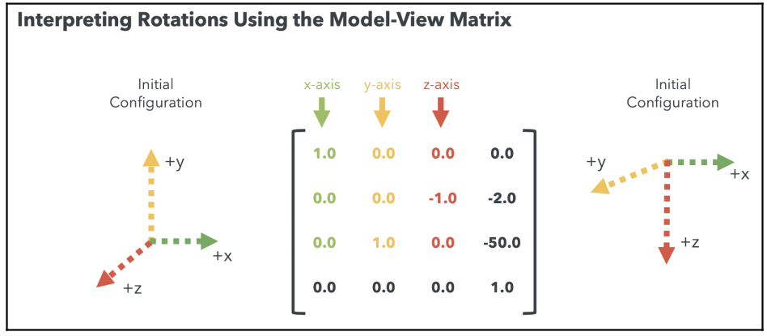
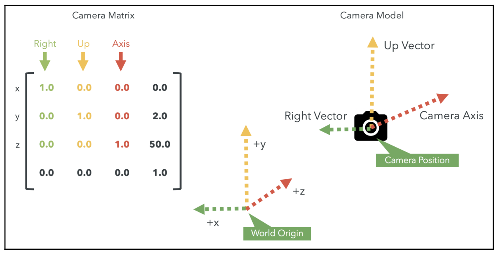

## Camera Translation

Let's move the camera to $[0, 0, 4]$ in world coordinates. This means four units from the origin on the positive z-axis. If we applied:

```javascript
mat4.translate(modelViewMatrix, modelViewMatrix, [0, 0, 4]);
```

In such a case, the world would be translated 4 units on the positive z-axis, and since the camera position has not been changed, it would be located at $[0, 0, -4]$, which is exactly the opposite of what we want. Now, say that we applied the translation in the opposite direction:

```javascript
mat4.translate(modelViewMatrix, modelViewMatrix, [0, 0, -4]);
```

In such a case, the world would be moved 4 units on the negative z-axis and then the camera would be located at $[0, 0, 4]$ in the new world-coordinate system.

The Camera matrix transformation is the inverse of the Model-View matrix transformation.

## Interpreting Transformations Using the Model-View Matrix



As we've just seen, understanding the rotation matrix (the $3 \times 3$ upper-left corner of the Model-View matrix) is simple: the first $3$ columns always tell us where the axis is.

## Basic Camera Types

So far, we've learned how to generate rotations and translations in either world or camera coordinates. In both cases, however, we are always generating the rotations around the center of the world. This may be ideal when we're orbiting around a 3D object. We will refer to this type of camera as an **orbiting camera**.

If we are able to look left and right (rotations) and then move in the direction in which our
camera is pointing (translation), then this camera type can be designated as a **first-person camera** and it is generally known as a **tracking camera**.

When applying transformation the order of the operations affects the result. It is not the same to rotate around the origin and then translate away from it (orbiting camera), as compared to translating the origin and then rotating around it (tracking camera).

With an orbiting camera, the camera will always look toward the center of the world.
Therefore, we will always use the z-axis to move to and from the object we are examining.
However, with a tracking camera, since the rotation occurs at the camera location, we can
end up looking to any position in the world. Thus, we need to know the direction in which the camera is pointing in world coordinates (camera axis).

## The Camera Model

Just like the Model-View matrix, the Camera matrix encodes information about the camera orientation. As we can see in the following diagram, the upper-left $3 \times 3$ matrix corresponds to the camera axes:



- The first column corresponds to the x-axis of the camera. We will call it `RightVector`.
- The second column is the y-axis of the camera. This will be `UpVector`.
- The third column determines the vector in which the camera can move back and forth. This is the z-axis of the camera and we will call it `CameraAxis`.

Because the Camera matrix is the inverse of the Model-View matrix, the upper-left $3 \times 3$ rotation matrix contained in the Camera matrix gives us the orientation of the camera axes in world space. This means that we can tell the orientation of our camera in world space just by looking at the columns of this $3 \times 3$ rotation matrix.
