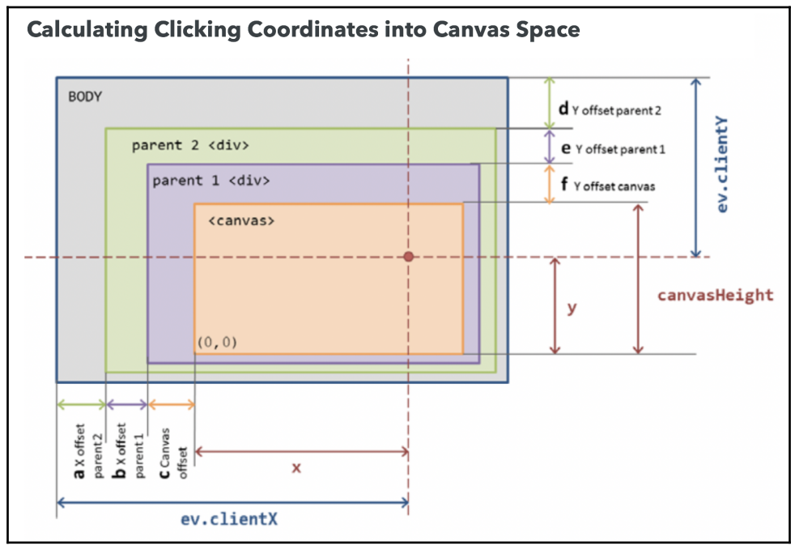

## Setting up an Offscreen Framebuffer

The results of the rendering on your screen are the contents of the framebuffer. Every call to `gl.drawArrays`, `gl.drawElements`, and `gl.clear` will change the contents of the framebuffer. Instead of rendering to the default framebuffer, we can also render to a scene that is offscreen – we call this **the offscreen framebuffer**. To set up a framebuffer, we need to create storage for at least two things: **colors** and **depth information**. To store colors, we will use a WebGL texture; to store depth information, we will use a renderbuffer.

### Creating a Texture to Store Colors

The only difference is that we do not have an image to bind to the texture, so when we call `gl.texImage2D`, the last argument is `null`. This is because we are allocating space to store colors for the offscreen framebuffer

```javascript
const canvas = document.getElementById("webgl-canvas");
const { width, height } = canvas;

const texture = gl.createTexture();
gl.bindTexture(gl.TEXTURE_2D, texture);
gl.texImage2D(
  gl.TEXTURE_2D,
  0,
  gl.RGBA,
  width,
  height,
  0,
  gl.RGBA,
  gl.UNSIGNED_BYTE,
  null
);
```

It's important to note that the width and height of the texture are set to the canvas size. This is because we want to ensure that the offscreen framebuffer resembles the dimensions of our 3D scene.

### Creating a Renderbuffer to Store Depth Information

Renderbuffers are used to provide storage for the individual buffers used in a framebuffer. The depth buffer (z-buffer) is an example of a renderbuffer. It is always attached to the screen framebuffer, which is the default rendering destination in WebGL.

The code to create a renderbuffer looks like the following code:

```javascript
const renderbuffer = gl.createRenderbuffer();
gl.bindRenderbuffer(gl.RENDERBUFFER, renderbuffer);
gl.renderbufferStorage(gl.RENDERBUFFER, gl.DEPTH_COMPONENT16, width, height);
```

The third line of code determines the storage size of the renderbuffer. Similar to before, we need to ensure that for every fragment (pixel) in the framebuffer, we have a color (stored in the texture) and a depth value (stored in the renderbuffer), so the size of the canvas and the size of the render buffer must be the same.

### Creating a Framebuffer for Offscreen Rendering

We need to create a framebuffer and attach the texture and the renderbuffer:

```javascript
const framebuffer = gl.createFramebuffer();

// Frame buffer
gl.bindFramebuffer(gl.FRAMEBUFFER, framebuffer);

// Texture
gl.framebufferTexture2D(
  gl.FRAMEBUFFER,
  gl.COLOR_ATTACHMENT0,
  gl.TEXTURE_2D,
  texture,
  0
);
// Render buffer
gl.framebufferRenderbuffer(
  gl.FRAMEBUFFER,
  gl.DEPTH_ATTACHMENT,
  gl.RENDERBUFFER,
  renderbuffer
);

// Clean up
gl.bindTexture(gl.TEXTURE_2D, null);
gl.bindRenderbuffer(gl.RENDERBUFFER, null);
gl.bindFramebuffer(gl.FRAMEBUFFER, null);
```

## Assigning One Color per Object in the Scene

We will pick an object based on its primitive color, we need to make sure that the color is constant per object and that each object has a different unique color. In situations where objects may share the same diffuse color, we can create a new ESSL uniform to store the picking color and make it unique for every object that's rendered into the offscreen framebuffer. The following diagram illustrates the situation:


## Rendering to an Offscreen Framebuffer

In order to perform object selection using the offscreen framebuffer, we need to ensure that both framebuffers are synchronized. The following diagram shows the behavior of the render function:


## Clicking on the Canvas

The next step is to capture and read the mouse coordinates. The following diagram shows how we use the offset calculation to obtain the clicked `canvas` coordinates:



## Reading Pixels from the Offscreen Framebuffer

WebGL allows us to read back from a framebuffer using the `readPixels` function:

```javascript
gl.readPixels(x, y, width, height, format, type, pixels);
```

We need to ensure that the offscreen framebuffer that we want to read from is the currently bound one. To do so, we bind it by using `bindFramebuffer`:

```javascript
// read one pixel
const readout = new Uint8Array(1 ** (1 ** 4));
gl.bindFramebuffer(gl.FRAMEBUFFER, framebuffer);
gl.readPixels(coords.x, coords.y, 1, 1, gl.RGBA, gl.UNSIGNED_BYTE, readout);
gl.bindFramebuffer(gl.FRAMEBUFFER, null);
```

Here, the size of the readout array is $1 \cdot 1 \cdot 4$. This means that it has one pixel of width times one pixel height times four channels, since the format is `RGBA`.

## Looking for Hits

Now, we will check whether the color obtained from the offscreen framebuffer matches any of the objects in our scene. When looking for hits, we compare each object's diffuse color with the label obtained from the offscreen framebuffer. There is, however, an additional step to consider: each color channel comes back in a $[0, 255]$ range while the object diffuse colors are in a $[0, 1]$ range.

We do not need to compare the alpha channel. If we had two objects with the same color but a different alpha channel, we could use the alpha channel in the comparison, but this is not the case in our example. Also, it’s important to note that the comparison is not precise, as we are dealing with decimal values in the $[0, 1]$ range. Because of that, we introduce a fudge factor by assuming that we have a hit after rescaling the colors and subtract the readout (object label) – the difference is less than one.
