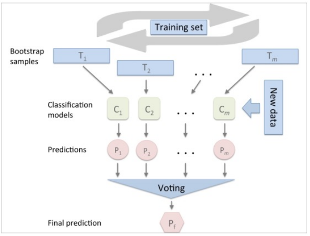
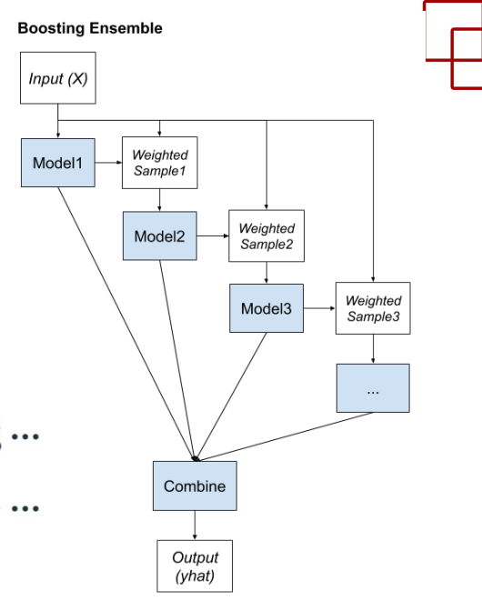
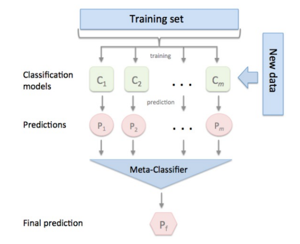
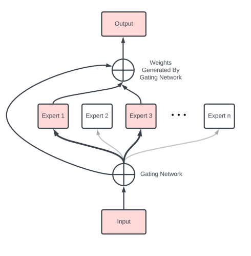
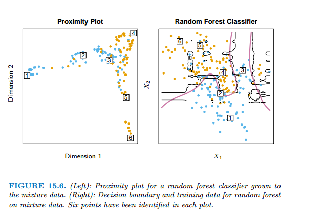

## Bias/Variance Tradeoff

Test error, also referred to as **generalization error**, is the prediction error over an independent test sample:

$$
\begin{aligned}
Err_{\mathcal{T}} = \mathbb{E}[L(Y | \hat{f}(X)) | \mathcal{T}]
\end{aligned}
$$

Where $L$ is the loss function. A related quantity is the **expected prediction error** (or **expected test error**):

$$
\begin{aligned}
Err = \mathbb{E}[Err_{\mathcal{T}}]
\end{aligned}
$$

where $Err_{\mathcal{T}}$ is the test error.

The error can always be decomposed into the sum of three fundamental quantities:

1. The variance of $\hat{f}(x_0)$
2. The squared bias of $\hat{f}(x_0)$
3. The variance of the error terms $\epsilon$.

That is,

$$
\begin{aligned}
\mathbb{E}[\left(y_0 - \hat{f}(x_0)\right)^2] = \mathbb{V}[\hat{f}(x_0)] + [Bias(\hat{f}(x_0))]^2 + \mathbb{V}[\epsilon]
\end{aligned}
$$

This amount is derived from:

$$
\begin{aligned}
Err(x_0) = \mathbb{E}[(Y - \hat{f}(x_0))^2] = \mathbb{E}[Y^2 + \hat{f}(x_0)^2 - 2Y\hat{f}(x_0)]
\end{aligned}
$$

$$
\begin{aligned}
= \mathbb{E}[Y^2] + \mathbb{E}[\hat{f}(x_0)^2] -2\mathbb{E}[Y]\mathbb{E}[\hat{f}(x_0)]
\end{aligned}
$$

We know that $\mathbb{V}[X] = \mathbb{E}[(X - \mathbb{E}[X])^2] = \mathbb{E}[X^2] - \mathbb{E}[X]^2$, such that:

$$
\begin{aligned}
= \mathbb{V}[Y] + \mathbb{E}[Y]^2 + \mathbb{V}[\hat{f}(x_0)] + \mathbb{E}[\hat{f}(x_0)]^2 -2\mathbb{E}[Y]\mathbb{E}[\hat{f}(x_0)]
\end{aligned}
$$

$$
\begin{aligned}
= \mathbb{E}[(Y - \mathbb{E}[Y])^2] + \mathbb{E}[Y]^2 + \mathbb{E}[(\hat{f}(x_0) - \mathbb{E}[\hat{f}(x_0)])^2] + \mathbb{E}[\hat{f}(x_0)]^2 -2\mathbb{E}[Y]\mathbb{E}[\hat{f}(x_0)]
\end{aligned}
$$

Note that, $Y = f(x_0) + \epsilon[/$], donde [$]\mathbb{E}[\epsilon] = 0$, thus it follows:

$$
\begin{aligned}
= \mathbb{E}[(Y - \mathbb{E}[Y])^2] + (\mathbb{E}[f(x_0)] + \mathbb{E}[\epsilon])^2 + \mathbb{E}[(\hat{f}(x_0) - \mathbb{E}[\hat{f}(x_0)])^2] + \mathbb{E}[\hat{f}(x_0)]^2 -2(\mathbb{E}[f(x_0)] + \mathbb{E}[\epsilon])\mathbb{E}[\hat{f}(x_0)]
\end{aligned}
$$

$$
\begin{aligned}
= \mathbb{E}[(Y - \mathbb{E}[Y])^2] + \mathbb{E}[f(x_0)]^2 + \mathbb{E}[(\hat{f}(x_0) - \mathbb{E}[\hat{f}(x_0)])^2] + \mathbb{E}[\hat{f}(x_0)]^2 -2\mathbb{E}[f(x_0)]\mathbb{E}[\hat{f}(x_0)]
\end{aligned}
$$

We know that $(a + b)^2 = a^2 + b^2 + 2ab$ and that $\mathbb{E}[f(x_0)] = f(x_0)$, such that:

$$
\begin{aligned}
= \mathbb{E}[(Y - \mathbb{E}[Y])^2] + \mathbb{E}[(\hat{f}(x_0) - \mathbb{E}[\hat{f}(x_0)])^2] + f(x_0)^2 + \mathbb{E}[\hat{f}(x_0)]^2 -2f(x_0)\mathbb{E}[\hat{f}(x_0)]
\end{aligned}
$$

$$
\begin{aligned}
= \mathbb{E}[(Y - \mathbb{E}[Y])^2] + \mathbb{E}[(\hat{f}(x_0) - \mathbb{E}[\hat{f}(x_0)])^2] + \left(\mathbb{E}[\hat{f}(x_0)] - f(x_0)\right)^2
\end{aligned}
$$

Here the notation $\mathbb{E}[\left(y_0 - \hat{f}(x_0)\right)^2]$ defines the **expected test MSE**, and refers expected to the average test MSE that we would obtain if we repeatedly $f$ using a large number of training sets, and tested each at $x_0$.

The **overall expected test MSE** can be computed by averaging $\mathbb{E}[\left(y_0 - \hat{f}(x_0)\right)^2]$ over all possible values of $x_0$ in the test set.

The previous equation tells us that in order to minimize the expected test error, we need to select a statistical learning method that simultaneously achieves **low variance** and **low bias**. Note that variance is inherently a nonnegative quantity, and squared bias is also nonnegative. Hence, we see that **the expected test MSE can never lie below** $\mathbb{V}[\epsilon]$**, the irreducible error**.

The **variance of the error terms**, $\mathbb{V}[\epsilon]$, is the variance of the target around its true mean $f(x_0)$, and **cannot be avoided** no matter how well we estimate $f(x_0)$, unless $\sigma^2 = 0$.

**Variance** refers to the amount by which $\hat{f}$ would change if we estimated it using a different training data set. Ideally the estimate for $f$ should not vary too much between training sets. This is computed as the expected squared deviation of $\hat{f}(x_0)$ around its mean.

**Bias** refers to the error that is introduced by approximating a real-life problem by a simpler model. This quentifies the amount by which the average of our estimate differs from the true mean.

As a general rule, as we use **more flexible methods**, the **variance will increase and the bias will decrease**.

As we **increase the flexibility**, the **bias** tends to initially **decrease faster** than the variance increases. Consequently, the **expected test MSE declines**. At some point **increasing flexibility** has little impact on the bias but starts to **significantly increase the variance**.

In a real-life situation in which $f$ is unobserved, it is **generally not possible to explicitly compute the test MSE, bias, or variance for a statistical learning method**.

**Training error** consistently **decreases** with model complexity, typically **dropping to zero** if we increase the model complexity enough. A model with **zero training error is overfit** to the training dat and will typically **generalize poorly**.

It is important to note that there are in fact two separate goals:

1. **Model selection**: **estimating the performance** of different models in order to **choose the best model**.
2. **Model assessment**: having chosen a **final model**, estimating its prediction error (**generalization error**) on new data.

The **training set** is used to fit the models. The **validation set** is used to estimate prediction error for model selection. The **test set** is used for assessment of the generalization error

## Bootstrapping

Bootstrapping is a resampling technique used in statistics to estimate the sampling distribution of a statistic by sampling with replacement from the original dataset. The method is particularly useful when analytical methods for deriving the sampling distribution are complex or unavailable.

Here's a breakdown of the bootstrapping process:

1. **Sampling with Replacement**: From the original dataset, **randomly draw** $n$ **samples with replacement**. This means that each observation has an equal chance of being selected for the sample, and an observation may be selected multiple times.
2. **Sample Statistics**: Calculate the statistic of interest (e.g., mean, median, standard deviation, regression coefficient) on each bootstrapped sample.
3. **Repeat**: Repeat steps $2$ and $3$ a large number of times to generate multiple bootstrap samples and their corresponding statistics.
4. **Estimate Sampling Distribution**: With the collection of bootstrap statistics, you can estimate the sampling distribution of the statistic of interest. This empirical distribution approximates the true sampling distribution of the statistic, providing information about its variability and uncertainty.
5. **Inference**: Use the estimated sampling distribution to make inferences about the population parameter or to construct confidence intervals.

## Bagging

### Introduction

The decision trees discussed suffer from **high variance**. In contrast, a procedure with **low variance** will yield **similar results** if applied repeatedly to **distinct data sets**.

**Bootstrap aggregation**, or **bagging**, is a procedure for reducing the **variance** of a **statistical learning method**.

Recall that given a set of $n$ independent observations $Z_1, \cdots, Z_n$ each with variance $\sigma^2$, the variance of the mean $\overline{Z}$ of the observations is given by $\frac{\sigma^2}{n}$.

So, **averaging** a set of observations **reduces variance**. Thus, to **reduce the variance** and **increase the prediction accuracy** of a statistical learning method is to take many training sets from the population, build a separate prediction model using each training set, and **average the resulting predictions**.

Using $B$ separate **training sets**, and average them in order to obtain a **single low-variance statistical learning model**, given by:

$$
\begin{aligned}
\hat{f}_{avg}(x) = \frac{1}{B}\sum_{b=1}^B \hat{f}^b(x)
\end{aligned}
$$

For each bootstrap sample $Z^{**b}, b = 1, 2, \cdots, B$, we fit our model, giving prediction $\hat{f}^{**b}(x)$. The bagging estimate is defined by:

$$
\begin{aligned}
\hat{f}_{bag}(x) = \frac{1}{B}\sum_{b=1}^B \hat{f}^{*b}(x)
\end{aligned}
$$

### Bagging on Regression Trees

To apply bagging to regression trees, we simply construct $B$ regression trees using $B$ bootstrapped training sets, and average the resulting predictions.

These trees are grown **deep**, and are **not pruned**. Hence each **individual tree has high variance, but low bias**. **Averaging** these B trees **reduces the variance**.

### Bagging on Decision Trees

How can bagging be extended to a classification problem where Y is qualitative? For a given test observation, we can record the class predicted by each of the $B$ trees, and take a **majority vote**.

Suppose our tree produces a classifier $\hat{G}(x)$ for a $K$-class response. Then the bagged estimate $\hat{f}_{bag}(x)$ is a $K$-vector $[p_1(x), p_2(x), \cdots, p_K(x)]$, with $p_k(x)$ equal to the proportion of trees predicting class $k$ at $x$.

The bagged classifier selects the class with the most votes from the $B$ trees, $\hat{G}_{bag}(x) = \arg \max_k \hat{f}_{bag}(x)$.

Often we require the **class-probability** estimates at $x$. For many classifiers $\hat{G}(x)$ there is already an underlying function $\hat{f}(x)$ that **estimates the class probabilities at** $x$ (for trees, the class proportions in the terminal node). An alternative bagging strategy is to **average these** instead.

The **number of trees** $B$ is **not a critical parameter** with bagging; using a very **large value** of $B$ will **not lead to overfitting**. In practice we use a value of $B$ sufficiently large that the **error has settled down**.

**Note that bagging a good classifier can make it better, but bagging a bad classifier can make it worse.**

### Out-of-Bag Error Estimation

There is a very straightforward way to estimate the test error of a bagged model

One can show that on average, **each bagged tree makes use of around two-thirds of the observations**. The observations not used to fit a given bagged tree are referred to as the **out-of-bag (OOB) observations**.

An **OOB prediction** can be obtained for each of the $n$ observations on the OOB observation set, from which the overall **OOB MSE** (for a regression problem) or classification error (for a classification problem) can be computed.

The resulting **OOB error** is a valid **estimate** of the **test error** for the bagged model.

### Variable Importance Measures

Although the collection of bagged trees is much more difficult to interpret than a single tree, one can obtain an overall **summary of the importance of each predictor** using the **RSS** (for bagging regression trees) or the **Gini index** (for bagging classification trees)

In the case of bagging regression trees, we can record the total amount that the **RSS is decreased due to splits over a given predictor**, averaged over all $B$ trees.

For classification trees, we can add up the total amount that the Gini index is decreased by splits over a given predictor, averaged over all $B$ trees.

### Advantages of ensemble models

- **Performance**: it improves single models' perfomance.
- **Robustness**: reduces predictions' variance.

So it also improves the equilibrium between bias and variance.

### How to generate diversity

- Manipulating **instances**: selecting a different subset of instances for each model.
- Manipulating **features**: selecting a different subset of features for each model.
- Manipulating **models' definition**: selecting different hyperparameters, optimization algorithm for ach model.

**Hybridation**: Mix any of the previous practices.

### Ensemble algorithms

#### Bagging

Models are trained concurrently with different data sets generated using bootstrapping.

#### Boosting

Construye múltiples modelos (típicamente modelos del mismo tipo) secuenciales, cada uno de los cuales aprende a corregir los errores de predicción de un modelo anterior en la cadena.

El objetivo es desarrollar un modelo fuerte a partir de muchos **modelos débiles** especialmente diseñados que se combinan mediante votación simple o promediando.

#### Staking

Construye múltiples modelos **sobre el mismo conjunto de datos**, típicamente modelos de diferentes tipos (modelos de nivel 0); y un modelo supervisado o meta modelo (modelo de nivel 1) que aprende cómo combinar mejor las predicciones de los modelos primarios.

### Model of Experts

Podemos dividir el espacio de características de entrada en subespacios según algún conocimiento de dominio del problema.

Luego se puede entrenar un modelo en cada subespacio del problema, convirtiéndose de hecho en un experto en el subproblema específico.

Luego, un modelo aprende a qué experto recurrir para predecir nuevos ejemplos en el futuro.

## Random Forests

### Definition

The idea in random forests (ilustrated on the image below) is to **improve the variance reduction of bagging by reducing the correlation between the trees**, without increasing the variance too much. This is achieved in the tree-growing process through **random selection of the input variables**.

An average of $B$ i.i.d. random variables, each with variance $\sigma^2$, has variance $\frac{1}{B}\sigma^2$.

If the variables are simply i.d. (identically distributed, but not necessarily independent) with positive pairwise correlation ρ, the variance of the average is:

$$
\begin{aligned}
\rho\sigma^2 + \frac{1 - \rho}{B}\sigma^2
\end{aligned}
$$

As $B$ increases, the second term disappears, but the first remains, and hence the size of **the correlation of pairs of bagged trees limits the benefits of averaging**.

When growing a tree on a bootstrapped dataset before each split, **select** $m \leq p$ **of the input variables at random** as candidates for splitting.

After $B$ such trees $\{T(x; \Theta_b)\}_1^B$ are grown, the random forest (regression) predictor is:

$$
\begin{aligned}
\hat{f}_{rf}^B(x) = \frac{1}{B}\sum_{b=1}^B T(x; \Theta_b)
\end{aligned}
$$

Where $\Theta_b$ characterizes the bth random forest tree in terms of split variables, cutpoints at each node, and terminal-node values.

Intuitively, **reducing** $m$ will **reduce the correlation between any pair of trees in the ensemble**.

### Details of Random Forests

For **classification**, the default value for $m$ is $\lfloor \sqrt{p} \rfloor$ and the minimum node size is one.

For **regression**, the default value for $m$ is $\lfloor \frac{p}{3} \rfloor$ and the minimum node size is five.

In practice the best values for these parameters will depend on the problem, and they should be treated as **tuning parameters** (hyperparamters).

#### Variable Importance

At each split in each tree, the **improvement in the split-criterion** is the **importance measure attributed to the splitting variable**, and is **accumulated over all the trees** in the forest separately for each variable.

Random forests also use the OOB samples to construct a different variable importance measure.

1. When the bth tree is grown, the **OOB samples** are passed down the tree, and the **prediction accuracy is recorded**.
2. Then the values for the jth variable are **randomly permuted in the OOB samples**, and the accuracy is again computed.
3. The decrease in accuracy as a result of this permuting is **averaged over all trees**, and is used as a **measure of the importance of variable** $j$ in the random forest.

#### Proximity Plots

In growing a random forest, an $N \times N$ proximity matrix is accumulated for the training data. Such that the entry $ij$ contains the number of trees for which the OOB sample $x_i$ and the OOB sample $x_j$ are on the same terminal node.

This proximity matrix is then represented in two dimensions using multidimensional scaling like the following example:

The proximity plot gives an indication of which observations are effectively close together in the eyes of the random forest classifier.

#### Random Forests and Overfitting

When the number of variables $p$ is large, but the fraction of relevant variables small, random forests are likely to perform poorly with small $m$. At each split the chance can be small that the relevant variables will be selected.

Another claim is that random forests “cannot overfit” the data.
