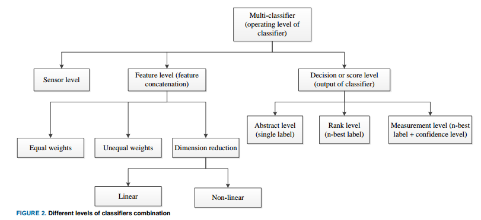
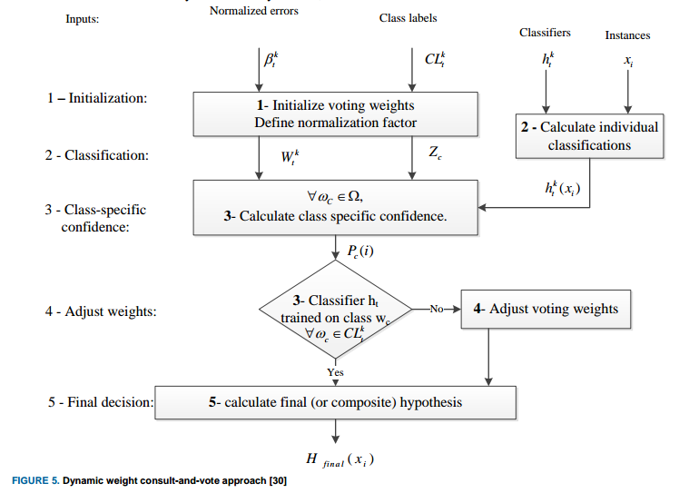
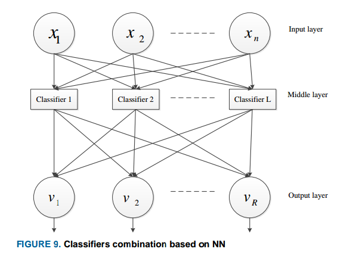
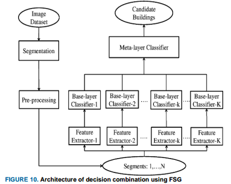
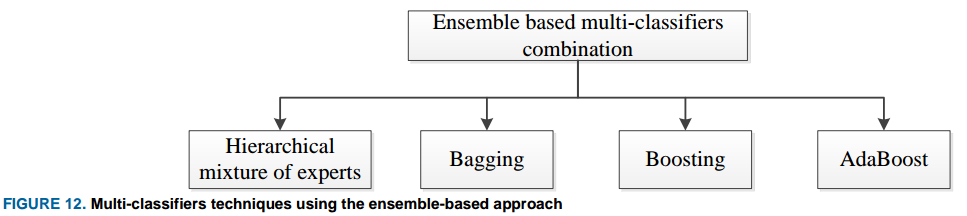

## Introduccion

### Bibliography

- [Classifiers Combination Techniques: A Comprehensive Review](https://ieeexplore.ieee.org/document/8335271)
- [10] S. Chitroub, "Classifier combination and score level fusion: concepts and practical aspects," Int. J. Image Data Fusion, vol. 1, no. 2, pp. 113–135, Jun. 2010.
- [11] H. He and Y. Cao, "SSC: a classifier combination method based on signal strength.," IEEE Trans. neural networks Learn. Syst., vol. 23, no. 7, pp. 1100–17, Jul. 2012.
- [12] C. De Stefano, F. Fontanella, and A. S. di Freca, "A Novel Naive Bayes Voting Strategy for Combining Classifiers.," in ICFHR, 2012, pp. 467–472.
- [13] J. Hou, Z.-S. Feng, and B.-P. Zhang, "A graph-theoretic approach to classifier combination," in Acoustics, Speech and Signal Processing (ICASSP), 2012 IEEE International Conference on, 2012, pp. 1017–1020.
- [14] Y.-D. Lan and L. Gao, "A New Model of Combining Multiple Classifiers Based on Neural Network," 2013 Fourth Int. Conf. Emerg. Intell. Data Web Technol., no. 2, pp. 154–159, Sep. 2013.
- [15] H. Kuang, X. Zhang, Y.-J. Li, L. L. H. Chan, and H. Yan, "Nighttime Vehicle Detection Based on Bio-Inspired Image Enhancement and Weighted Score-Level Feature Fusion," IEEE Trans. Intell. Transp. Syst., vol. 18, no. 4, pp. 927–936, Apr. 2017.
- [16] C. Senaras, M. Ozay, and F. T. Yarman Vural, "Building detection with decision fusion," 2013.

## Marco general para la combinacion de clasificadores

The task is seen as a problem of finding a combination function which accepts $N$-dimensional score vectors from each of the $M$ classifiers, then producing a single final classification score representing the selected class.

Given the $N$ possible classes $\{\omega_1, \omega_2, \cdots, \omega_N\}$ and a pattern $Z$ (that is a data sample), let $x_k$ be the measurement vector (the numerical attributes of $Z$) used by the $k$th classifier (different classifiers may use different attributes to discriminate). The probability density function of the measurement vector is represented by:

$$
\begin{aligned}
p(x_k|\omega_n)
\end{aligned}
$$

while the prior probability of the occurrence of the class is denoted by $p(\omega_n)$. The Bayesian framework aims to determine the class label for the pattern $Z$ by considering the information provided by all $M$ classifiers. The final decision is based on the aposteriori probability, which is the probability of the pattern belonging to a specific class $j$ given the measurement vectors from all classifiers $x_1, x_2, \cdots, x_M$.

$$
\begin{aligned}
p(\theta = \omega_j|x_1, x_2, \cdots, x_M) = \max_{k} p(\theta = \omega_k | x_1, x_2, \cdots, x_M)
\end{aligned}
$$

So the pattern $Z$ is assigned to class $\omega_j$ which produces the maximum a posterior probability. Where the aposteriori distribution is computed as follows:

$$
\begin{aligned}
p(\theta = \omega_j|x_1, x_2, \cdots, x_M) = \frac{p(x_1, x_2, \cdots, x_M|\theta = \omega_j)p(\theta=\omega_j)}{p(x_1, x_2, \cdots, x_M)}
\end{aligned}
$$

Provided that each classifier provides independently a decision support obtained from $x_k$, where $p(x_1, x_2, \cdots, x_M)$ is the joint pdf of the observations independently of class label.

The important issue is that the individual classifiers should not make identical erroneous decisions on the same observation instances, they should provide complementary information.

## Estrategias para la combinación de clasificadores

### Levels of Classifiers Combination

Classifiers combination can be carried out at three different levels:

- **Early combination at sensor data level**: combination of data collected from two or more sensors before feature selection technique is applied.
- **Combination at feature level**: it may simply involve basic concatenation of feature vectors with equal or different weights (might result in high dimensonal vectors, whose dimension has to be reduced).
- **Late combination at the decision level**: they are based on one of three approaches: abstract, rank, and score:
  - **Abstract-based**: a single output label from each individual classifier is used as input to the combination scheme.
  - **Rank-based**: each classifier yields several labels ranked from the most likely to the least likely. This information is then used by the combination scheme to reach the final decision.
  - **Score-based**: each classifier outputs the $n$ best labels together with their confidence scores. The combination can be **density-based**, **transformation-based** or **classifier-based** score fusion.

### Hard and Soft Level Classifier Combination

Another way to categorize combination algorithms is whether hard thresholding or soft scoring is used with each of the classifiers.

- **Hard-level combination**: uses the output of the classifier after it is hard thresholded.
- **Soft-level combination**: uses estimates of the aposteriori probability of the class.

The sum, product, max, min rules, etc., fall under the soft level combiners as they use the output aposteriori probability of the classifier or a score.

- **Sum rule**: The class with the highest sum of probabilities is chosen as the final prediction.
- **Product rule**: The class with the highest product of probabilities is chosen as the final prediction.
- **Max rule**: the class with the highest posterior probability among all classifications made by individual classifiers is selected as the final prediction.
- **Min rule**: the class with the lowest posterior probability among all classifications made by individual classifiers is selected as the final prediction.

Majority voting is a typical example of hard-level combiners and has found widespread use in the literature. There are three different versions of voting:

- Unanimous voting.
- More than half voting.
- Highest number of votes.

Considering the output label vector of the $i$th classifier as:

$$
\begin{aligned}
[d_{i, 1}, \cdots, d_{i, N}]^T \in [0, 1]^N
\end{aligned}
$$

where $i = 1, 2, \cdots, M$ and $d_{i, j} = 1$ if the classifier $D_i$ labels the $i$th instance as class $\omega_j$ and $0$ otherwise. The majority vote results in a decision for class $\omega_k$ if:

$$
\begin{aligned}
\sum_{i = 1}^M d_{i, k} = \max_{j = 1}^N \sum_{i = 1}^M d_{i, j}
\end{aligned}
$$

Where $M$ is the total number of classifiers and $N$ is total number of classes. Such that class $\omega_k$ is the most "selected" on all the classifier.

The accuracy of the combination scheme is given as:

$$
\begin{aligned}
P_{maj} = \sum_{m = \frac{M}{2} + 1}^M \binom{M}{m} p^m (1-p)^{M - m}
\end{aligned}
$$

where $p$ is the probability of correct classification.

Majority voting provides an accurate class label when at least $\frac{M}{2} + 1$ classifiers give correct classifications, it also requires participating classifiers to have comparable accuracies.

##### Weighted Majority Voting

Weighted majority voting is used when the classifiers' accuracies are not similar, so it is reasonable to assign more weight to the most accurate classifier. Now the decision rule becomes:

$$
\begin{aligned}
\sum_{i = 1}^M b_i d_{i, k} = \max_{j = 1}^N \sum_{i = 1}^M b_i d_{i, j}
\end{aligned}
$$

where $b_i$ is the weight associated with classifier $D_i$. For the sake of convenience, it is a good practice to normalize the weights such that the sum is one.

The weight selection is very important in determining the overall accuracy of the classifier combinations. Therefore, to minimize the classification error of the combination, the weights are assigned as follows:

$$
\begin{aligned}
b_i \propto \log\left(\frac{p_i}{1 - p_i}\right)
\end{aligned}
$$

where $p_i, \cdots, p_M$ are the individual accuracies for each independent classifier.

##### Dynamic Weighted Consult-and-vote

In [30], Muhlbaier et al. introduced a method for combining ensembles of classifiers using a dynamic weighted consult-and-vote approach for incremental learning of new classes. The proposed technique focuses on incremental learning, specifically for incorporating new classes into the classification system. The consult-and-vote strategy involves a dynamic process where individual classifiers within the ensemble consult with each other to determine their respective voting weights for classifying test instances.

The voting weights assigned to each classifier are determined based on their relative performance on the training data.

The method proposed by Muhlbaier et al. represents an enhancement over a previous approach developed by the authors. The previous approach may have encountered the "out-voting" problem, where certain classifiers dominate the decision-making process, potentially leading to biased or inaccurate results.

##### Divide and Conquer

Another modification of majority voting, involving a divide and conquer strategy, is described in [31]. It aims to enhance the majority voting approach by breaking down the classification task into smaller, more manageable sub-problems. Each sub-problem is then addressed independently, with dedicated classifiers or classification algorithms focusing on solving the specific challenges within that subset of data. After solving each of the smaller sub-problems individually, the results or decisions from these segments are combined using a majority voting scheme. Majority voting involves aggregating the outputs of the classifiers or algorithms involved in solving the sub-problems and selecting the class label that receives the most votes as the final decision.

##### Quality Based Combination Techniques

The quality-based combination approach, as referenced in [32], focuses on assigning higher weights to more reliable classifiers based on specific quality measures. Quality measures used to assess the performance of classifiers may vary depending on the application domain and specific requirements.

##### Feature Combination

The challenge of increasing dimensionality resulting from the simple combination of features from different datasets is addressed through innovative approaches to decision-level combination, as discussed in [33]. Combining features from diverse datasets can lead to a significant increase in the dimensionality of the data. The study proposed an effective approach for decision-level combination by leveraging spectral reflectance and its higher-order derivatives to classify hyperspectral land images. Spectral reflectance and its derivatives provide valuable information about the characteristics of the land surface, which can aid in classification tasks. The study conducted experiments under two scenarios to address the curse of dimensionality:

- **Scenario 1 - LDA-Based Dimensionality Reduction**: Linear Discriminant Analysis (LDA) was employed for dimensionality reduction.
- **Scenario 2 - Multiple Classifiers Decision Fusion** (MCDF): multiple classifiers were utilized for decision fusion to enhance classification performance.

##### Critic Classifier

In the study referenced as [34], the authors introduced an innovative approach that focuses specifically on addressing two-class classification problems. The key feature of this approach is the incorporation of a classifier critic associated with each individual classifier, aimed at predicting the error rate of the classifier. The role of the classifier critic is to forecast the potential error or misclassification rate of its associated classifier. The approach relies on classical standard voting techniques for combining the outputs of multiple classifiers.

##### Adaptative Voting Technique

In the study referenced as [35], the authors introduced an adaptive approach to voting techniques. The key innovation in this approach is the dynamic weighting of classifiers based on their estimated recognition performance.

##### Different Model Combination

In [36], the authors explored the combination of three distinct classifiers - Naive Bayes, J48 Decision Tree, and Decision Table - using various voting techniques to enhance classification accuracy. The classifiers were combined using different voting strategies, including simple voting (where each classifier has equal weight), weighted voting (assigning different weights to classifiers based on their performance), and probability-based voting (considering the confidence or probability estimates of classifiers). The study reported that the ensemble of classifiers using weighted and probability-based voting techniques outperformed simple majority voting. In addition to classifier combination and voting strategies, the study applied a supervised dimensionality reduction algorithm to further enhance performance. Dimensionality reduction techniques aim to reduce the complexity of the feature space while preserving relevant information, thereby improving classification accuracy and efficiency.

In [38], a voting strategy was employed for land cover classification of remotely sensed images by utilizing an ensemble of six different classifiers. Common voting techniques include simple majority voting, weighted voting, or probability-based voting, where the combined decision is based on the collective predictions of the ensemble members.

In the study referenced as [39], researchers proposed an approach that combines Artificial Neural Network (ANN) and K-Nearest Neighbors (KNN) based classifiers using a majority voting scheme. This method was specifically designed to enhance accuracy in scenarios where sensor data is prone to drift. The researchers employed a majority voting scheme to combine the predictions of the ANN and KNN classifiers. In this approach, each classifier in the ensemble provides a prediction, and the final decision is made based on the majority vote of the individual classifier outputs.

The primary goal of the study was to leverage the complementary strengths of ANN and KNN classifiers to address the challenge of sensor data drift. ANN models are known for their ability to learn complex patterns from data, while KNN is a non-parametric method based on instance-based learning that can be effective in classification tasks.

By combining multiple KNN classifiers using majority voting and employing median voting for the ANN classifiers, the researchers observed a substantial improvement in classification performance. The ensemble of ANN and KNN classifiers demonstrated enhanced accuracy in classifying sensor data, showcasing the effectiveness of the majority voting scheme in mitigating the impact of data drift on classification outcomes.

##### Dynamic Entropy Based Combination Technique

In [37], the authors introduced a novel dynamic entropy-based technique for combining classifiers. The key idea behind the combination scheme is to assign weights to individual classifiers based on their confidence levels in making decisions. Classifiers that exhibit high confidence in their predictions are assigned larger weights, while those with lower confidence receive smaller weights.

##### Assuming Linear Dependency Between Predictors

In [40], the authors considered linear dependency of both classifiers and features. To address this, they proposed a new approach that models the dependencies between features without making any assumptions about the distribution of features (independency) or classifiers. The researchers introduced two key models as part of their framework:

- **Linear Classifier Dependency Modelling** (LCDM): This model focuses on capturing dependencies between the classifiers themselves, exploring how the outputs of different classifiers may be linearly related.
- **Linear Feature Dependency Modelling** (LFDM) : This model is designed to identify and model dependencies between the features used by the classifiers, allowing for a more comprehensive understanding of the relationships within the feature space.

The results of the study demonstrated that the proposed approach outperformed existing methods in scenarios where linear dependencies between features and classifiers play a significant role. By explicitly modeling these dependencies, the framework was able to capture more complex relationships within the data and improve classification accuracy.

##### Runtime Weighted Opinion Pool

In [45], introduces a novel classifiers combination approach known as the Runtime Weighted Opinion Pool (RWOP). This approach dynamically assigns weights to the classifiers during runtime based on their local performance, leading to an adaptive and context-aware combination strategy. Unlike traditional weighted sum-based approaches, RWOP utilizes an intuitive runtime strategy to determine the weights for combining classifier outputs. The dynamic weight assignment in RWOP allows the system to adapt to changing conditions and varying input patterns, leading to more robust and accurate classification outcomes.

##### Using Hidden Markov Models

In the study referenced as [46], the authors introduce a novel approach for combining classifiers specifically designed for Hidden Markov Model (HMM) based classifiers. Unlike traditional methods where the combination typically occurs at the decision level, this new approach operates at a more elementary level within the HMM framework.

##### Assigning Weights to Classes

In the study referenced as [12], a novel weighted majority voting approach was proposed for classifiers combination. This approach differs from traditional methods by assigning weights to different classes rather than individual base classifiers. The weights are determined by estimating the joint probability distribution of each class using the scores provided by all classifiers in the combination pool. The joint probability distribution is computed using the Naïve Bayes probabilistic model.

### Combination Rules

In the context of multiple classifiers combination, the way individual classifiers handle input patterns can vary. Some classifiers may use the same representation of the input pattern, while others may employ their own unique representations. The effectiveness of combining these classifiers using different strategies has been explored in various studies, including those referenced as [41], [42], and [43].

- Simple Sum Rule: Despite being developed under restrictive assumptions, the simple sum rule was found to outperform other combination rules in certain scenarios.
- Majority Voting: The experimental results indicated that the majority voting approach was the most effective combination rule for the specific dataset used in the study.

##### Assesment

Fixed rule-based combination techniques in the context of multiple classifiers do not require a training stage and rely on class labels, distances, or confidences provided by individual classifiers. The efficiency of fixed rule techniques is influenced by various factors, as discussed in reference [44].

According to reference [44], fixed rule techniques are most efficient under specific conditions:

- Availability of Large Training Sets: Adequate training data is essential for reliable performance.
- Generation of Reliable Confidences: Individual classifiers should provide accurate and trustworthy confidence values.
- Training on Different Feature Spaces: Base classifiers should be trained on diverse feature representations to capture varied aspects of the data.

In scenarios where the strict conditions for fixed rule techniques are not met, a trained combination rule may yield better results.

### Adaptative and Non-Adaptative Combiners

#### Adaptative Combiners

Adaptive techniques for classifiers combination are mainly based on evolution or artificial intelligence algorithms. They include neural networks combination strategies and genetic algorithms as well as fuzzy set theory. Techniques under these categories are summarized on the following figure:

Artificial Neural Networks are usually used as a base classifier [29], however, it has also found wide use in combination of classifiers.

##### AD and CM Combination

In [48], the author introduces two innovative approaches for combining classifiers to enhance robustness and fault tolerance: the Attractor Dynamics (AD) algorithm and the Classifier Masking (CM) algorithm. The CM algorithm is described as a non-neural version of the AD algorithm, inspired by modeling properties of sensory integration in the central nervous system. Both approaches are designed to promote consensus among individual classifiers and improve the overall performance of the combined system by discarding corrupted classifier outputs.

##### ANN vs SVM Combination

In [49], the authors conducted a comparative analysis of combining the outputs of an ensemble of Artificial Neural Networks (ANNs) with Support Vector Machine (SVM) classifiers for processing remotely sensed data. They employed an Multi-Layer Perceptron (MLP) module to facilitate the non-linear combination of the outputs generated by the networks. The researchers explored two distinct approaches for optimizing coefficient selection: the Bayesian method and the error correlation matrix. Through experimental evaluation, the authors found that the MLP-based combination scheme yielded the most favorable results compared to the SVM classifiers.

##### Combination through ANN

In [50], the authors proposed a novel approach where they utilized an Artificial Neural Network (ANN) as a model for combining classifiers. Instead of combining the outputs of different classifiers, they integrated various training sets with distinct classifiers to train a unified combination rule within a three-layer ANN architecture. In this setup, each classifier represented a unit in the hidden layer of the ANN.

##### Incorporating A Priori Knowledge

In [51], the authors delved into the significance of leveraging a priori knowledge within existing classifiers combination techniques, specifically exploring the application of the Behavior Knowledge Space and the Dempster-Shafer (D-S) theory. This investigation aimed to elucidate how incorporating prior knowledge can enhance the performance of classifiers combination, particularly when dealing with strongly correlated classifiers. The study also highlighted the utilization of adaptive combiners, encompassing strategies such as adaptive weighting, associative switching, Mixture of Local Experts (MLE), and Hierarchical MLE

##### Combining Combination Strategies Dynamically

In [57] an adaptive approach to combining classifiers was introduced. The proposed approach dynamically selects between two different combination strategies based on the belief values obtained from each strategy. Specifically, the study compared the performance of a Bayesian classifiers combination approach and product and max rule combination strategy. In the Bayesian method, the combination of classifiers is based on probabilistic principles, where the posterior probabilities of class labels are calculated using Bayes' theorem. The product rule combines the outputs of individual classifiers by multiplying their probabilities or scores for each class. The max rule operates by selecting the class label that receives the highest score or confidence level among all the individual classifiers in the ensemble.

##### Modifying Majority Voting

In [58] the authors introduced various modifications to the traditional majority voting rule by incorporating a Bayesian framework and a Genetic Algorithm (GA) to determine the weights assigned to different classifiers in the ensemble. The Bayesian framework allowed for the probabilistic modeling of the weights, while the GA provided an optimization technique to search for the best combination of weights that maximized the ensemble performance. The results of the study indicated that the modified majority voting rule, when combined with the Bayesian framework and GA for weight optimization, achieved significant improvements in accuracy. Specifically, the optimal accuracies obtained were $94.3\%$ for the majority vote, $95.4\%$ for the genetic algorithm, and 95.95% for the Bayesian approach.

##### Based on Genetic Theory

In the study referenced as [22], the authors introduced an innovative approach that involved the simultaneous extraction and selection of features and classifiers to improve the performance of gender and age classification using speech signals collected from a typical Korean home environment.

The authors employed a Genetic Algorithm to simultaneously select features and classifiers. GA is a metaheuristic optimization technique inspired by the process of natural selection and genetics, used to search for the optimal combination of features and classifiers for the classification task. The outputs of the selected classifiers were combined using the Dempster-Shafer theory, a mathematical theory for combining evidence from different sources to make decisions under uncertainty.

In [59] a novel approach based on Genetic Algorithm (GA) with self-configuration capabilities was developed for classifier combination. The researchers employed a pool of twelve expert classifiers that were already trained on the task of character recognition, including both printed and handwritten characters. These expert classifiers likely had different strengths and weaknesses, making them suitable candidates for ensemble learning. The GA was integrated into the system to optimize the combination of outputs from the expert classifiers. By using the evolutionary principles of genetic algorithms, the system could iteratively adjust the weights assigned to each classifier in the ensemble to maximize the overall accuracy of the system.

##### Fuzzy Based

In the study referenced as [16], the authors introduced a novel approach known as Fuzzy Stacked Generalization (FSG) to combine the outputs of multiple classifiers. FSG operates within a hierarchical framework where multiple base-layer classifiers are utilized to make individual predictions on the input data. In FSG, the decisions made by the base-layer classifiers are aggregated to form a decision vector. This decision vector is then fed into a meta-layer classifier, which combines the outputs of the base-layer classifiers to make the final decision.

In [53], the authors proposed a classifiers combination technique using fuzzy templates (FT). An object is labeled with the class whose fuzzy template is closest to the objects' decision profile. the authors obtained an improved performance over majority, min, max and product rules, and unweighted average combination techniques

In [54], an adaptive fuzzy integral was used to combine multiple classifiers. The parameter $\lambda$-fuzzy, which measures performance, is adaptively adjusted depending upon the interaction among the classifiers. The essence of the parameter is to search for the maximum degree of agreement between the conflicting and complementary sources of evidence.

In [55], a fuzzy decision rule was employed to combine the outputs of multiple classifiers without the need for a training stage. Each classifier was independently applied to the input data, but no final decision was made based on their outputs at this stage. These classifiers are pre-existing models that have been trained on labeled data to make predictions or classifications. The results from the classifiers were aggregated using a fuzzy decision rule. This rule considered the membership degrees of the classes assigned by each classifier and selected the class with the highest membership degree (the confidence or certainty with which each classifier assigns a data point to a specific class) as the correct class. Two measures of accuracy, namely information reliability and global accuracy, were utilized in the combination rule to assess the performance of the combined classifiers.

In [56] the authors introduced a first-order Takagi-Sugeno-Kang (TSK) fuzzy model for combining multiple classifiers. Unlike conventional linear combination methods that assign different weights to pairs of classifiers and classes, the proposed TSK fuzzy model assigns weights to each individual classifier, class, and region of the classifier output space (decision boundary). This finer granularity in weight assignment allows for a more nuanced and adaptive combination of classifier outputs. The TSK fuzzy model is utilized to integrate the outputs of multiple classifiers. This model leverages fuzzy logic to combine the predictions of individual classifiers in a way that considers the uncertainty and variability in the classifier outputs. The study demonstrated improved accuracy compared to using individual classifiers alone. While the TSK fuzzy model showed promising results in enhancing classification accuracy, the authors did not explicitly address the potential bias and variance reduction that could arise from using a linear model for combining classifiers.

#### Non-Adaptative Combiners

The highest confidence approach is an example of nonadaptive combination techniques. It involves ranking the individual classifiers based on their confidence then selecting the decision of the top ranked one.

The Borda count technique is also an example of nonadaptive methods. It is based on the principle of single winner classifier in which the individual classifiers provide a ranked list of the classes. It is a more sophisticated alternative to majority voting [60] based on ranking level [9]. It does not require training, just like averaging, sum, and voting rules [52].

#### Conclusion

In summary, adaptive combiners tend to do better than the non-adaptive types. This is due to the fact that adaptive combiners update the weights given to the individual classifier dynamically before making the final decision. Given the fact that the performance of the individual classifiers can vary over input patterns, such a dynamic combination provides an edge over its non-adaptive counterpart especially when the data space is wide and diverse.

### Classification Based on the Number of Classifiers

The most commonly used techniques for ensemble based combinations are displayed in the following figure:

Bagging is one of the most intuitive and simple techniques used for ensemble based combination. However, unlike bagging, in boosting, the individual classifiers are trained hierarchically to discriminate more complex regions in the feature space. AdaBoost is a variation of the boosting technique. It is an adaptive boosting meta-algorithm that combines outputs of weak classifiers into a weighted sum that represents the final decision. However, the technique is sensitive to noisy data and outliers.

In [66], the authors used AdaBoost to enhance the performance of a hybrid Hidden Markov Model (HMM) and Neural Network (NN) speech recognition system. HMMs are commonly used for modeling sequential data like speech signals, while NNs are effective in capturing complex patterns in data. The researchers evaluated the performance of the hybrid HMM/NN system with and without the AdaBoost algorithm under noisy environments. Noise in speech signals can introduce distortions and affect the accuracy of the recognition system. By applying AdaBoost, the system was expected to adapt better to noisy conditions and enhance its robustness. The results of the study demonstrated that incorporating AdaBoost into the hybrid HMM/NN speech recognition system led to improved performance, even in the presence of noise. AdaBoost's ability to focus on difficult instances and adjust the weights of the classifiers based on their performance contributed to the system's ability to handle noisy environments and enhance overall recognition accuracy.

In [67] the researchers explored a combination approach at the feature level using Support Vector Machine (SVM) classifiers and a Global AdaBoost classifier. The study focused on combining features extracted from different datasets at the feature level. By utilizing SVM classifiers and a Global AdaBoost classifier, the researchers aimed to leverage the strengths of both classifiers in integrating information from multiple datasets to improve classification performance. One significant drawback identified in the study regarding feature-level combination is the issue of high dimensionality. Combining features from multiple datasets can result in a large number of features, which can lead to challenges such as increased computational complexity, overfitting, and reduced interpretability of the model.

### Other Combination Techniques

In [68] the researchers introduced a novel classifiers combination technique based on an SVM active learning algorithm. The study proposed a method that leverages Support Vector Machine (SVM) classifiers in conjunction with an active learning algorithm. Active learning refers to a machine learning approach where the algorithm can select the most informative data points for labeling, thereby improving the learning process iteratively. The researchers developed a strategy where an initial classifier, likely an SVM model, is used to generate class aposteriori probabilities. These probabilities serve as inputs to the classifiers-combiner, which is based on the SVM active learning algorithm. The approach outperforms traditional classifiers combination rules when considering class labeling cost and classification accuracy.

In [70] and [71] the researchers introduced a novel approach using eigenclassifiers for combining correlated classifiers. The proposed method involves utilizing Principal Component Analysis (PCA) projection to create eigenclassifiers from a set of initially correlated classifiers. By applying PCA, the goal is to transform the correlated classifiers into uncorrelated eigen-classifiers. This transformation process aims to enhance the diversity and independence of the classifiers, enabling them to complement each other effectively during the combination stage. The results of the study indicated that the PCA-based eigenclassifiers technique provided better or comparable accuracy with a reduced number of classifiers compared to Bagging and AdaBoost. This suggests that the uncorrelation process facilitated by PCA enhanced the performance of the combined classifiers, leading to improved classification results with fewer individual classifiers.

Similarly, in [72] the researchers explored methods to address linear and non-linear correlations among the outputs of individual classifiers by leveraging Principal Component Analysis (PCA) and a generalized kernel-based PCA approach. Initially, the authors identified linear correlations among the outputs of individual classifiers. To mitigate these linear correlations, the researchers applied a simple PCA approach. Building on the success of addressing linear correlations, the authors extended their approach to consider non-linear dependencies among the outputs of individual classifiers. o handle these non-linear dependencies, the researchers proposed a generalized kernel-based PCA approach. The results of the experiments demonstrated that the generalized kernel-based PCA approach outperformed alternative methods in improving classification accuracy.

In [73] the researchers introduced a novel classifier combination technique that focused on extracting class boundaries and utilizing a set of local linear combination rules. The proposed technique involved extracting class boundaries, which are the decision boundaries that separate different classes in the dataset. The researchers employed a set of local linear combination rules to combine the outputs of individual classifiers. These rules likely involved linear combinations of classifier outputs within specific regions of the feature space, allowing for adaptive and context-aware decision-making. The experimental results demonstrated that the classifier combination technique based on class boundaries and local linear combination rules achieved better accuracy compared to other methods such as linear combination, voting, and decision templates.

In [13], the researchers proposed a weighted averaging approach that incorporated graph-theoretical clustering and a Support Vector Machine (SVM) classifier for classifier combination. The researchers utilized graph-theoretical clustering techniques as part of the weighted averaging approach. Graph theory provides a framework for analyzing relationships between data points, and clustering algorithms can group similar data points together based on certain criteria. By incorporating graph-theoretical clustering, the approach likely aimed to identify clusters of data points with similar characteristics for more effective combination of classifier outputs. In addition to clustering, the approach involved the use of an SVM classifier. SVMs are powerful machine learning models commonly used for classification tasks. By integrating an SVM classifier into the weighted averaging process, the researchers likely leveraged its ability to create optimal decision boundaries between classes in the feature space. The results obtained from the experiments indicated that the proposed approach, despite its simplicity and intuitive nature, performed comparably to more sophisticated methods.

In [74], the researchers employed three different techniques - Highest Rank (HR), Borda Count (BC), and Logistic Regression (LR) - for combining decisions in a multi-classifier system. The decisions produced by each individual classifier were ranked based on their confidence or accuracy. The HR, BC, and LR techniques were then applied to either reduce the set of possible classes or re-rank them during the combination process. The results obtained from the experiments demonstrated a substantial improvement in the performance of the multi-classifier system.

Similarly, in [75] a new combination technique called Mixed Group Rank (MGR) was introduced as a novel approach to balancing between preference and confidence in a multi-classifier system. This technique aimed to generalize the principles of Highest Rank (HR), Borda Count (BC), and Logistic Regression (LR) by incorporating elements of both preference-based ranking and confidence-based decision-making.

In [76], the authors introduced an innovative approach that involves dynamically switching between classifier combination and classifier selection based on the characteristics of different regions in the feature space. The authors further introduced a hybrid combination scheme that integrates clustering-and-selection (CS) techniques with decision template (DT) methods. This hybrid approach likely combines the benefits of clustering for identifying regions of dominance and selection of the most appropriate classifier, along with decision templates for combining classifier outputs in a structured manner. The authors discussed the tradeoff between selecting the best classifier and combining classifiers. This tradeoff likely involves considerations of the strengths and weaknesses of individual classifiers versus the potential benefits of combining multiple classifiers.

In [77], the authors introduced a method based on classifier selection that focused on identifying the most suitable candidate through confidence evaluation of distance-based classifiers. The method aimed to select the most precise candidate from a set of distance-based classifiers by evaluating their confidence levels. This process likely involved assessing the certainty or reliability of each classifier's decision-making based on the distances between data points in the feature space. The authors likely defined specific rules or criteria for selecting the precise candidate based on the confidence evaluations of the distance-based classifiers. These rules may have considered factors such as the proximity of data points to decision boundaries, the consistency of classifier outputs, or the overall confidence levels of individual classifiers. The experiments conducted in the study likely utilized distance metrics such as Euclidean distance and city block distance for recognizing handwritten characters.

In [78], the author used information from the confusion matrix to merge multiple classifiers using a class ranking Borda type reconciliation method. The class ranking Borda type reconciliation method is a technique that combines the outputs of multiple classifiers by ranking the classes based on their performance and then using a Borda count approach to reconcile the rankings. The results obtained from this method were compared with three other classifier combination techniques: majority voting, sum rule, and median rule. The comparison was done using three types of confusion matrices: deterministic, uniform, and stochastic. The APBorda (aposteriori Borda count) and sum rule gave the overall best improvement, except in the case of a stochastic confusion matrix and disparate combination (where classifiers had a $10\%$ accuracy difference from each other). This means that in most cases, the APBorda and sum rule performed better in combining the classifiers, but there were specific scenarios where they did not perform as well.

In [79] a combination technique based on the F-measure was proposed for recognizing human emotions using an SVM (Support Vector Machine) classifier. In this technique, the F-measure was used to form a decision matrix to determine the final emotion.

In [80], the authors proposed an approach for detecting vacant parking spaces by combining two different systems. The first system was based on analyzing image data, while the second system relied on sensor data. The experiments conducted by the authors demonstrated that combining the outputs of these two different systems resulted in a reduced error in detecting vacant parking spaces.

In summary, several classifiers combination techniques have been proposed in the literature with each technique having its own strengths and weaknesses. Recent techniques mostly involve hybridization or modification of previous techniques to achieve better accuracy or to remove an associated constraint on which a particular technique was built on. Some of these constraints include the issue of correlated classifiers, Gaussian distribution, and IID. There is still a need to develop classifiers combination strategies which are not constrained to specific distributions.

## References

[12] C. De Stefano, F. Fontanella, and A. S. di Freca, "A Novel Naive Bayes Voting Strategy for Combining Classifiers.," in ICFHR, 2012, pp. 467–472.

[16] C. Senaras, M. Ozay, and F. T. Yarman Vural, “Building detection with decision fusion,” 2013.

[22] Y. Zhan, H. Leung, K.-C. Kwak, and H. Yoon, “Automated speaker recognition for home service robots using genetic algorithm and Dempster--Shafer fusion technique,” Instrum. Meas. IEEE Trans., vol. 58, no. 9, pp. 3058–3068, 2009.

[29] L. I. Kuncheva, Combining pattern classifiers: methods and algorithms. John Wiley & Sons, 2004.

[32] N. Poh and J. Kittler, "A unified framework for biometric expert fusion incorporating quality measures," Pattern Anal. Mach. Intell. IEEE Trans., vol. 34, no. 1, pp. 3–18, 2012.

[33] H. R. Kalluri, S. Prasad, and L. M. Bruce, "Decision-level fusion of spectral reflectance and derivative information for robust hyperspectral land cover classification," Geosci. Remote Sensing, IEEE Trans., vol. 48, no. 11, pp. 4047–4058, 2010.

[34] D. J. Miller and L. Yan, "Ensemble classification by critic-driven combining," in Acoustics, Speech, and Signal Processing, 1999. Proceedings., 1999 IEEE International Conference on, 1999, vol. 2, pp. 1029–1032

[35] F. Mattern, T. Rohlfing, and J. Denzler, "Adaptive performancebased classifier combination for generic object recognition," in Proc. of International Fall Workshop Vision, Modeling and Visualization (VMV), 2005, pp. 139–146

[36] G. Jain, A. Ginwala, and Y. A. Aslandogan, "An approach to text classification using dimensionality reduction and combination of classifiers," in Information Reuse and Integration, 2004. IRI 2004. Proceedings of the 2004 IEEE International Conference on, 2004, pp. 564–569.

[37] M. Magimai-Doss, D. Hakkani-Tur, O. Cetin, E. Shriberg, J. Fung, and N. Mirghafori, "Entropy based classifier combination for sentence segmentation," in Acoustics, Speech and Signal Processing, 2007. ICASSP 2007. IEEE International Conference on, 2007, vol. 4, p. IV--189

[39] S. Adhikari and S. Saha, "Multiple classifier combination technique for sensor drift compensation using ANN & KNN," in Advance Computing Conference (IACC), 2014 IEEE International, 2014, pp. 1184–1189.

[40] A. J. Ma, P. C. Yuen, and J.-H. Lai, "Linear dependency modeling for classifier fusion and feature combination," Pattern Anal. Mach. Intell. IEEE Trans., vol. 35, no. 5, pp. 1135–1148, 2013.

[43] Z. Wu, C.-H. Li, and V. Cheng, "Large margin maximum entropy machines for classifier combination," in Wavelet Analysis and Pattern Recognition, 2008. ICWAPR’08. International Conference on, 2008, vol. 1, pp. 378–383

[44] R. P. W. Duin, "The combining classifier: to train or not to train?," in Pattern Recognition, 2002. Proceedings. 16th International Conference on, 2002, vol. 2, pp. 765–770.

[45] W. Wang, A. Brakensiek, and G. Rigoll, "Combination of multiple classifiers for handwritten word recognition," in Frontiers in Handwriting Recognition, 2002. Proceedings. Eighth International Workshop on, 2002, pp. 117–122.

[48] A. V Bogdanov, "Neuroinspired architecture for robust classifier fusion of multisensor imagery," Geosci. Remote Sensing, IEEE Trans., vol. 46, no. 5, pp. 1467–1487, 2008.

[49] G. Pasquariello, N. Ancona, P. Blonda, C. Tarantino, G. Satalino, and A. D’Addabbo, "Neural network ensemble and support vector machine classifiers for the analysis of remotely sensed data: a comparison," in Geoscience and Remote Sensing Symposium, 2002. IGARSS’02. 2002 IEEE International, 2002, vol. 1, pp. 509–511.

[50] Y.-D. Lan and L. Gao, "A New Model of Combining Multiple Classifiers Based on Neural Network," in Emerging Intelligent Data and Web Technologies (EIDWT), 2013 Fourth International Conference on, 2013, pp. 154–159.

[51] V. Di Lecce, G. Dimauro, A. Guerriero, S. Impedovo, G. Pirlo, and A. Salzo, "Knowledge-based methods for classifier combination: an experimental investigation," in Image Analysis and Processing, 1999. Proceedings. International Conference on, 1999, pp. 562–565.

[52] A. K. Jain, R. P. W. Duin, and J. Mao, “Statistical pattern recognition: A review,” Pattern Anal. Mach. Intell. IEEE Trans., vol. 22, no. 1, pp. 4–37, 2000.

[53] L. I. Kuncheva, J. C. Bezdek, and M. A. Sutton, “On combining multiple classifiers by fuzzy templates,” in Fuzzy Information Processing Society-NAFIPS, 1998 Conference of the North American, 1998, pp. 193–197

[54] T. D. Pham, “Combination of multiple classifiers using adaptive fuzzy integral,” in Artificial Intelligence Systems, 2002.(ICAIS 2002). 2002 IEEE International Conference on, 2002, pp. 50–55.

[55] M. Fauvel, J. Chanussot, and J. A. Benediktsson, “Decision fusion for the classification of urban remote sensing images,” Geosci. Remote Sensing, IEEE Trans., vol. 44, no. 10, pp. 2828–2838, 2006.

[56] M. Cococcioni, B. Lazzerini, and F. Marcelloni, “A TSK fuzzy model for combining outputs of multiple classifiers,” in Fuzzy Information, 2004. Processing NAFIPS’04. IEEE Annual Meeting of the, 2004, vol. 2, pp. 871–876.

[57] Y. Yaslan and Z. Cataltepe, “Co-training with adaptive bayesian classifier combination,” in Computer and Information Sciences, 2008. ISCIS’08. 23rd International Symposium on, 2008, pp. 1–4.

[58] L. Lam and C. Y. Suen, “Optimal combinations of pattern classifiers,” Pattern Recognit. Lett., vol. 16, no. 9, pp. 945–954, 1995.

[59] K. Sirlantzis and M. C. Fairhurst, “Optimisation of multiple classifier systems using genetic algorithms,” in Image Processing, 2001. Proceedings. 2001 International Conference on, 2001, vol. 1, pp. 1094–1097

[66] H. Schwenk, “Using boosting to improve a hybrid HMM/neural network speech recognizer,” in Acoustics, Speech, and Signal Processing, 1999. Proceedings., 1999 IEEE International Conference on, 1999, vol. 2, pp. 1009–1012.

[67] J. Hu and Y. Chen, “Offline Signature Verification Using Real Adaboost Classifier Combination of Pseudo-dynamic Features,” in Document Analysis and Recognition (ICDAR), 2013 12th International Conference on, 2013, pp. 1345–1349

[68] X. Yi, Z. Kou, and C. Zhang, “Classifier combination based on active learning,” in Pattern Recognition, 2004. ICPR 2004. Proceedings of the 17th International Conference on, 2004, vol. 1, pp. 184–187.

[69] J. Kremer, K. Steenstrup Pedersen, and C. Igel, “Active learning with support vector machines,” Wiley Interdiscip. Rev. Data Min. Knowl. Discov., vol. 4, no. 4, pp. 313–326, Jul. 2014.

[70] A. Ulaş, O. T. Yıldız, and E. Alpaydın, “Eigenclassifiers for combining correlated classifiers,” Inf. Sci. (Ny)., vol. 187, pp. 109– 120, 2012.

[71] E. Ulaş, A., Semerci, M., Yıldız, O. T., & Alpaydın, “Incremental construction of classifier and discriminant ensembles,” Inf. Sci. (Ny)., vol. 179, no. 9, pp. 1298–1318, 2009

[72] U. Ekmekci and Z. Cataltepe, “Classifier combination with kernelized eigenclassifiers,” in Information Fusion (FUSION), 2013 16th International Conference on, 2013, pp. 743–749.

[73] M. Liu, K. Li, and R. Zhao, “A boundary based classifier combination method,” in Control and Decision Conference, 2009. CCDC’09. Chinese, 2009, pp. 3777–3782

[74] T. K. Ho, J. J. Hull, and S. N. Srihari, “Decision combination in multiple classifier systems,” Pattern Anal. Mach. Intell. IEEE Trans., vol. 16, no. 1, pp. 66–75, 1994.

[75] O. Melnik, Y. Vardi, and C.-H. Zhang, “Mixed group ranks: Preference and confidence in classifier combination,” Pattern Anal. Mach. Intell. IEEE Trans., vol. 26, no. 8, pp. 973–981, 2004.

[76] L. I. Kuncheva, “Switching between selection and fusion in combining classifiers: An experiment,” Syst. Man, Cybern. Part B Cybern. IEEE Trans., vol. 32, no. 2, pp. 146–156, 2002.

[77] C.-L. Liu and M. Nakagawa, “Precise candidate selection for large character set recognition by confidence evaluation,” Pattern Anal. Mach. Intell. IEEE Trans., vol. 22, no. 6, pp. 636–641, 2000.

[78] J. R. Parker, “Combining multiple non-homogeneous classifiers: an empirical approach,” in Cognitive Informatics, IEEE International Conference on, 2002, p. 288.

[79] A. Agrawal and N. K. Mishra, “Fusion Based Emotion Recognition System,” in 2016 International Conference on Computational Science and Computational Intelligence (CSCI), 2016, pp. 727–732

[80] Junzhao, L., Mohandes, M., Deriche, M., “A Multi-Classifier Image Based Vacant Parking Detection System”, IEEE International Conference on Electronics, Circuits, and Systems ICESC, pp. 933-936, Abu Dhabi, UAE, DEC 8-11, 2013

## Conclusiones

While a large number of combination techniques have been proposed, the literature still lacks a comprehensive performance analysis of such techniques for a given application. The review showed that while one strategy (e.g. fusion at decision level) may outperform others for a given application, the results from such a strategy may not be the best for another application.

However overall, it was shown that classifiers combinations in general improve performance significantly over individual classifiers for most problems.

An important research direction relies on adding an enhancement stage (post processing) to the classifiers output before applying combination rules. This would improve the performance of individual classifiers before the combination stage. Many classifiers combination techniques have performed well under certain restrictions which include independence assumption, Gaussian distribution, linear process, limited class problem (mostly 2-class problem) and low dimensional feature space. Thus, future work can reconsider relaxing some of these constraints

Another issue that needs to be further investigated is to explore the advantages of using different strategies for the fusion including probabilistic, learning, decision based, or evidence based techniques.

The discussion on voting based approaches has shown that there is a scope for improving classification accuracy. This issue also offers numerous opportunities for developing optimization techniques to determine the weights. Some of the approaches including GA, PSO, and Ant optimization techniques, among others, can be investigated.

Neural networks as well as similar models such as fuzzy networks, deep neural networks; SVM, etc. also offer an excellent opportunity for developing adaptive techniques to combine individual classifiers outputs. For example, can individual classifiers be considered as layers of more general architectures.

Computational complexity is an important issue that needs further research especially when the different algorithms are deployed over mobile or low power platform

An important issue which is still open is that of finding the optimal number of classifiers to be combined for a given application. Additionally, for a given number of features, is there a way to distribute these among the different classifiers to be combined.

Finally, the use of hybrid approaches to integrate results from different combination techniques, offers further opportunities for solving more involved applications.
