## Frameworks para Deep Learning

### Tensorflow

#### Arquitectura Tensorflow

Presenta un núcleo de bajo nivel (C++/CUDA). Además se define un API Python sencillo para definir el gráfico computacional, así como APIs de alto nivel (TF-Learn, Keras, etc)

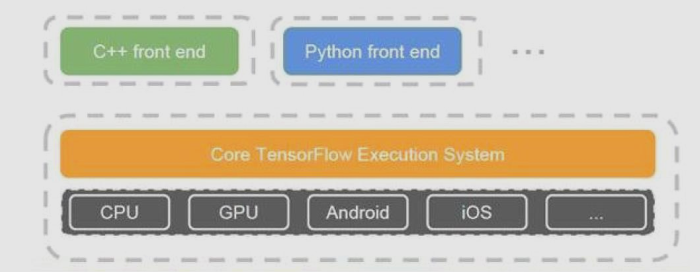

#### Tensorflow vs Numpy

- Numpy no dispone de funciones/métodos para la creación de funciones de tensores y no computa automáticamente sus derivadas.
- NumPy no tiene soporte para GPU.

#### Modelo Computacional de Tensorflow

Tensorflow construye grafos donde cada nodo es un tensor y cada arista es una operación entre los tensores. De tal manera que, como vemos en la figura inferior, se pueden repartir las computaciones entre distintas GPUs.

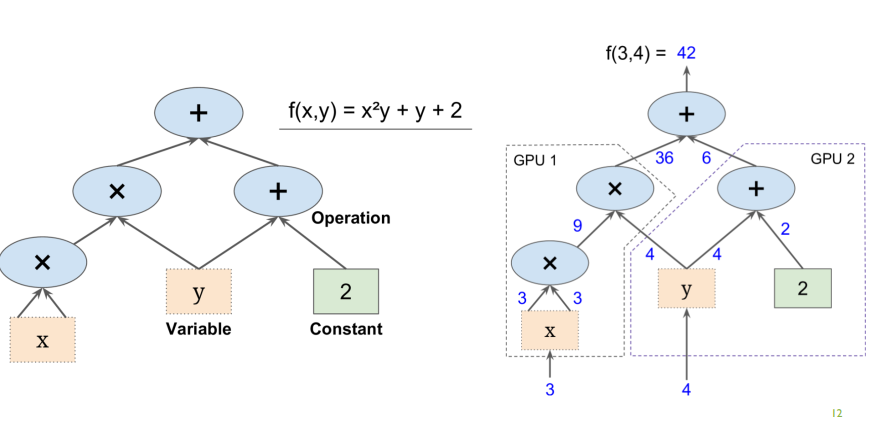

##### Lazy Evaluation

Este grafo sólo encompasa la definición de las operaciones, de tal manera que no requiere de su ejecución. Si no que la ejecución sólo se produce durante el entrenamiento.

#### Tensorflow Hub

Se trata de un repositorio de modelo pre-entrenados.

#### Operaciones

A continuación mostramos una serie de operaciones soportadas por Tensorflow:

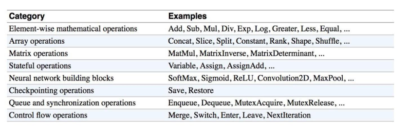

### Theano

Se trata de otro framework, pionero en el uso de grafos computacionales. Es una herramienta generalista, tal que podemos implementar cualquier tipo de algoirtmo sobre el framework. Además se puede especificar como backend a utilizar en Keras, en lugar de Tensorflow.

Sin embargo, finalizó su desarrollo a partir de la versión 1.0.

Librerías que usan Theano

- Keras
- blocks
- lasagne
- sklearn-theano
- PyMC 3
- theano-rnn
- Morb

Además presenta las siguientes características:

- Permite la evaluación lazy del grafo (precursor de esta ténica).
- Da soporte para GPU's.
- Permite la diferenciación simbólica.

### Keras

Keras puede ser utilizado con tensorflow o también como una librería adicional. Además presenta las siguientes ventajas:

- Sencilla para comenzar, y sencilla para avanzar
- Se ejecuta sobre Theano y TensorFlow
- Disponibilidad de herramientas de visualización (Tensorboard)
- Escrita de forma modular: fácil de expandir
- Suficientemente potente para escribir modelos serios

Pero también presenta las siguiente desventajas:

- Menos flexible
- Menos tipos: no hay modelos RBM, por ejemplo.
- Menos proyectos disponibles online que Caffe
- Soporte Multi-GPU no del 100%

La idea general para la creación de modelos/algoritmos sigue el siguiente esquema:

- Preparar los tensores de entrada y salida
- Crear la primera capa (layer) para manejar el tensor de entrada
- Crear la última capa (layer) para manejar el tensor de salida (targets)
- Construir virtualmente cualquier modelo entre estas dos capas (hidden layers)

Las definiciones de los modelos pueden ser guardados y recuperados en formato `json` y en formato `yaml`. Los parámetros también pueden ser guardados y recuperados en formato `h5`.

#### Tipos de Modelos

Keras soporta dos tipos de modelos:

- Modelo Secuencial
- API funcional: Se usa para definir modelos complejos: modelos multi-output, grafos acíclicos dirigidos (graph) o modelos con capa compartidas
- Grafo (deprecado)

### Caffe

- Construido sobre C++, CUDA.
- Presenta una gran cantidad de modelos pre-entrenados

La definición de modelos de hace de forma declarativa:

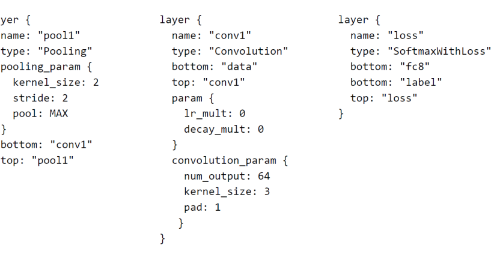

Cuáles son sus aplicaciones?

- Object Detection
- Pixelwise Prediction

### Torch

- Su backend está basado en C y en CUDA.
- Su frontend está escrito sobre Lua.

### PyTorch

Torch en python.

### Fast.AI

Es muy similar a Keras, Fast.AI permite generar herramientas y modelos pre-entranados de manera muy sencilla.

### Aplicaciones de DL

- Visión
- Speech Recognition
- NLP

## Computación Acelerada

### Diferencias CPU/GPU

- Una CPU tiene un número limitado de cores, mientras que una GPU tiene un número muy elevado de cores.
- Una GPU tiene procesadores menos potentes (menos operaciones por ciclo), sin embargo tiene muchas más unidades lógicas-aritméticas (ALU), por lo que tiene más capacidad de cálculo a coste de tener menos capacidad de manejo de almacenamiento.

### Proveedores

- Nvidia: se basa en la arquitecture Compute Unified Device Architecture (CUDA).
- AMD: se basa en una arquitectura más abierta, Heterogeneous System Architecture (HSA), que es multiplataforma. Su arquitectura se puede utilizar con distintos proveedores, p.ej. Nvidia.

#### Flujo de Procesamiento en CUDA

#### Plataformas

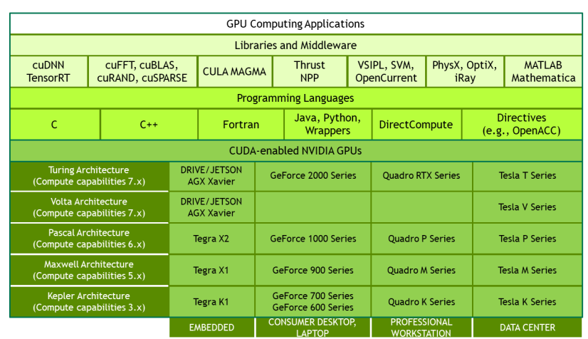

### TPU

Diseñado por Google especialmente diseñado para operaciones matriciales y tensores. Su uso fundamental es en el entrenamiento de redes neuronales y la inferencia.

#### Por qué utilizar TPUs?

Según Google:

- Son 30x más rápidos que GPUs y CPUs.
- Presentan una gran eficiencia energética.
- Las NN desarrolladas con Tensorflow requieren muy pocas líneas de código.
- Requieren menos tiempo -> menos dinero.

#### Cuándo deberíamos utilizar una TPU?

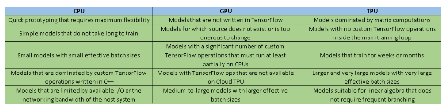

#### Versiones

Hay dos versiones:

- V2: HBM de 8 GB/TPU core. 1MXU (128x128) por core. TPU pod, hasta 512 cores (4TB de memoria)
- V3: HBM de 16 GB/TPU core. 2 MXU (128x128) por core. TPU pod, hasta 2048 cores (32 TB de memoria)

#### Flujo de Ejecución de TPUs

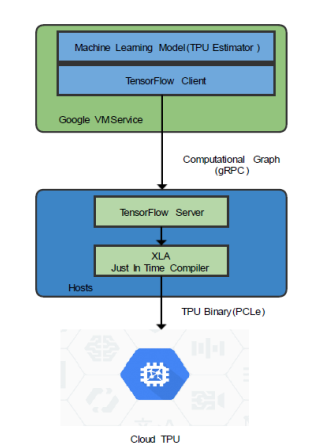

## Proveedores

### Deep Cognition

Se trata de una plataforma que incorpora un IDE visual que permite definir una red neuronal. Se puede utilizar:

- En la nube
- En local
- En una máquina virtual
- En una máquina de azure

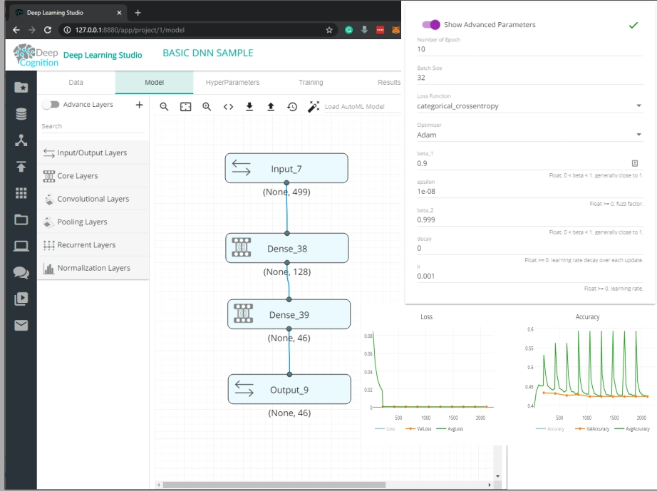

### H2O.AI

Su arquitecture se detalla en la siguiente imagen:

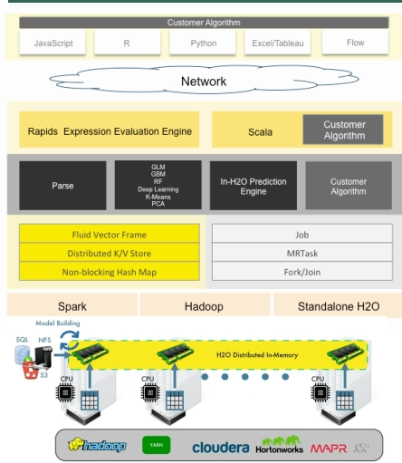

En la parte superior vemos los lenguajes que soporta:

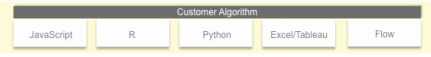

Seguidamente tenemos un bloque de tradcutores (Rapids en C++ y Scala en Java):

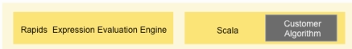

A continuación tenemos los algoritmos definidos así como la herramienta de predcción para H2O:

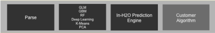

En la siguiente imagen tenemos la parte de la gestión de la computación que se lleva a cabo encima de clusters Spark/Hadoop o sobre la distribución standalone de H2O:

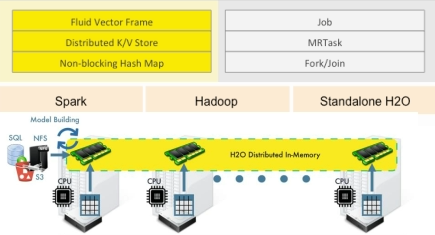

#### Auto ML

Permite evaluar modelos dado un conjunto de datos en base a una serie de métricas:

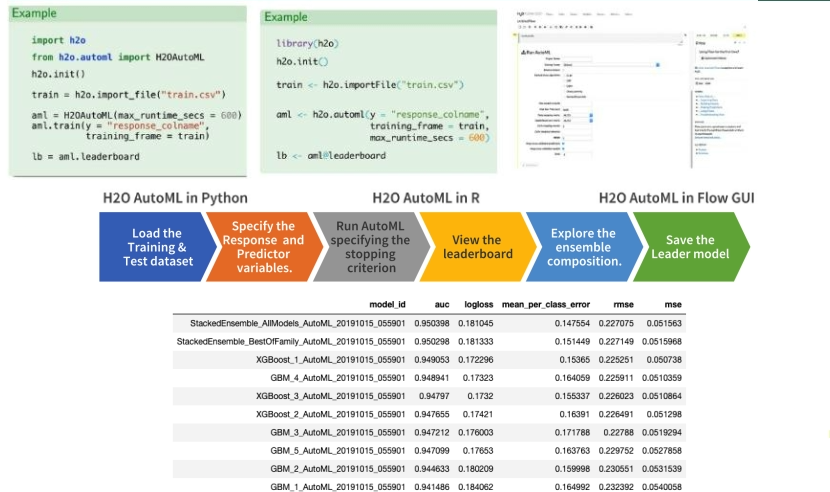

#### Driverless AI

Permite desarrollar el pipeline completo de H2O de forma visual, tal que permite automatizar tareas.

### Big ML

Se trata de una empresa española. Define algoritmos de clasificación, regresión, análisis de clusters, detección de anomalías, descubrimiento de asociación y modelado. Destaca sobretodo en el preprocesamiento de datos, visualización y en la evaluación de modelo.

No soporta ni CNN (no soporta capas de convolución ni de pooling) ni RNN.

Los parámetros soportados son los siguientes:

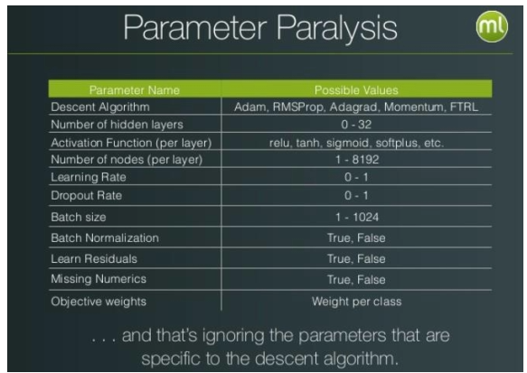
