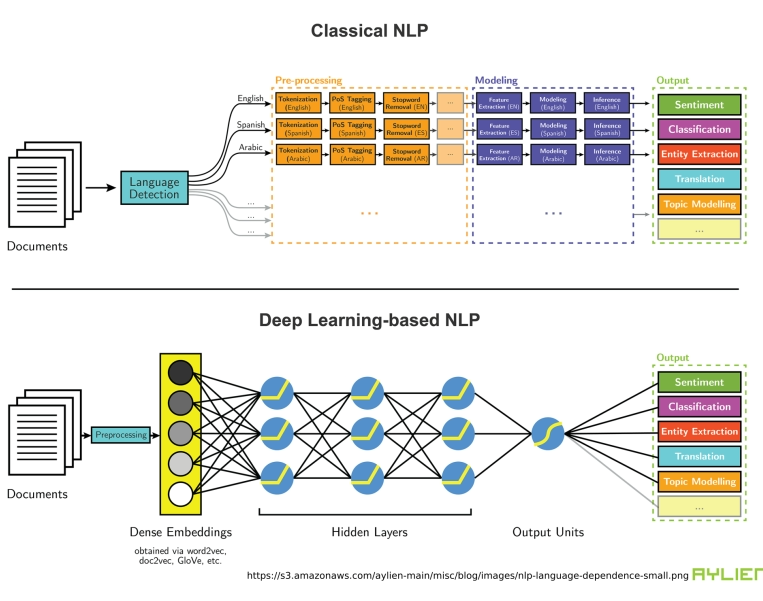

## Introducción a las aplicaciones del Deep Learning para el NLP

### Comparación entre enfoques clásico y de Deep Learning

#### Enfoque Clásico

El enfoque clásico se compone de los siguientes pasos:

1. Detección de idioma
2. Pre-procesado

- Tokenizado
- Etiquetado gramatical (POS)
- Eliminación de stop-words
- etc.

3. Modelado

- Extracción de características (entidades (NER), categorías (POS) ...)
- Aplicación de algoritmos de ML
- etc.

4. Salida

- Análisis de sentimientos
- Clasificación de textos
- Traducción
- etc

#### Enfoque Deep Learning

Mientas que el enfoque basado en Deep Learning se compone de los siguientes pasos:

1. Pre-procesado

- Tokenizado
- Etiquetado gramatical (POS)
- Eliminación de stop-words
- etc.

2. Representaciones distribuidas (word embeddings): transformación de palabras/secuencias en vectores que es la entrada que aceptan las redes neuronales. Para ello se distinguen métodos como: word2vec, Glove, etc.
3. Procesamiento en capas ocultas: no permite generar representación comprimida de la entradas.
4. Capa de salida

- Análisis de sentimientos
- Clasificación de textos
- Traducción
- etc

### Arquitecturas

Para llevar a cabo Natural Languague Processing (NLP) con Deep Learning podemos utilizar las siguientes arquitecturas:

- Redes recurrentes (RNN)
  - LSTM (Long Short Term Memory)
  - GRU (Gated Recurrent Units)
- Redes convolucionales (CNN)
- Autoencoders

## Ejemplos de Deep Learning para Natural Language Processing

### Clasificación de Textos

Para la clasificación de texto se define la siguiente estructura:

- Capa de embedding: que transforma la secuencia de palabras en una tabla de vectores capturando la semántica de las mismas.
- Componente de representación profunda: se utiliza RNN o CNN para obtener una representación comprimida de la entrada.
- Parte totalmente conectada: transforma la representación comprimida en clases o puntuaciones para cada clase.

Ver el capítulo Text Classification Using LSTM de Hands-On Natural Language Processing with Python.

### Generación de Textos

Se utilizan RNNs para crear modelos generativos, tal que la generación se puede llevar a cabo en base a caracteres o a palabras. Estas son capaces de aprender dependencias a largo plazo.

Ver el capítulo Text Generation and Summarization Using GRUs de Hands-On Natural Language Processing with Python.

### Resumen de Textos

Distinguimos entre dos tipos:

- **Extractivos**: se extraen frases o palabras clave. Son simples y robustos y no permiten la paráfrasis.
- **Abstractivos**: la salida contiene texto no contenido en el original manteniendo el significado.

Ver el cap. Text Generation and Summarization Using GRUs de Hands-On Natural Language Processing with Python.

### Traducción

Distinguimos distintos sistemas que efectúan la traducción automática:

- **Sistemas expertos**: se definen reglas lingüísticas y sintácticas.
- **Traducción estadística**: se aprenden reglas estadísticamente a partir de un gran conjunto de datos bilingüe. Tal que define un modelo de traducción que mapea textos de un lenguaje a otro. Solo funciona bien traduciendo textos similares a los de entrenamiento y necesita gran cantidad de datos
- **Traducción con redes neuronales**: utilizan un sólo modelo que trabaja sobre segmentos de texto, no sólo sobre palabras o frases.

Ver el cap. Machine Translation Using the Attention-Based Model de Hands-On Natural Language Processing with Python.

### Búsqueda y Eliminación de Duplicados

Se puede conseguir utilizando una CNN basada en caracteres, que proporciona la flexibilidad para entrenar modelos con caracteres desconocidos y ofrece mayor capacidad de generalición que los embeddings a nivel de palabra.

Ver el capítulo Searching and DeDuplicating Using CNNs de Hands-On Natural Language Processing with Python.

## Otras Aplicaciones

- Preguntas-respuestas y chatbots
- Reconocimiento de voz
- Texto a voz
