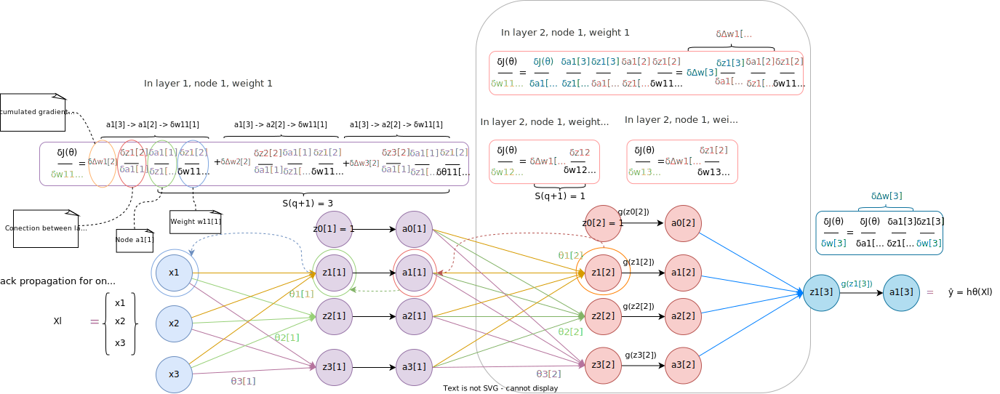
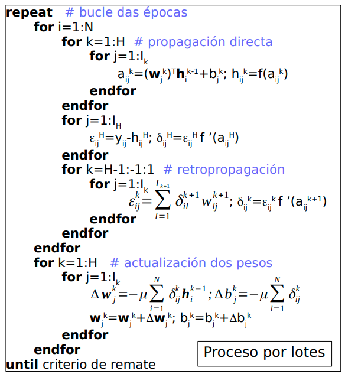

## Clasificación múltiple

Para crear una red neuronal que permita trabajar con $c$ clases lo que hacemos es hacer que la red neuronal tenga $c$ nodos en su capa de salida. Esto se ilustra en la siguiente imagen:


De tal manera que ahora, cada salida $y_j$ será un vector columna $c\times1$, donde existe un valor por cada categoría, al igual que la hipótesis para el ejemplo $j$, $h_\Theta(x_j)$, es un vector columna $c\times1$.

Como podemos ver, los valores de $y_j$ indican claramente a qué clase pertenece el ejemplo $j$ (clase 3), mientras que la hipótesis $h_\Theta(x_j)$ ofrece, para cada clase (columna) la probabilidad de que el ejemplo $j$ pertenezca a esa clase.

## Función de coste

### Notación

Como ya hemos visto en función del número de clases la salida tendrá distinta forma:

\*_ \*\*Clasificación binaria_: para cada ejemplo $j$, $y_j \in \{0, 1\}$, $h_\Theta(x_j) \in \mathbb{R}$ \*_ \*\*Clasificación múltiple_: para cada ejemplo $j$, $y \in \mathbb{R}^c$, $h_\Theta(x_j) \in \mathbb{R}^c$, donde $c$ es el número de clases

- Sea $k$ el número de capas y $S_i$ el número de nodos en la capa $i$.
- Sea $Y=(y_{ij})$ una matriz $c\times m$, donde $m$ es el número de ejemplos y cada $y_{j}$ es el vector columna $c\times1$ de salida para el ejemplo $j$.

Definimos la función de coste como sigue:

$$
\begin{aligned}
J(\Theta) = - \frac{1}{m} \left\{ \sum_{j=1}^m \sum_{i=1}^c [y_{ij}\cdot \log(h_\Theta(x_j)_i)] + [(1-y_{ij})\cdot \log(1-(h_\Theta(x_j)_i))]\right\}
\end{aligned}
$$

El primer sumatorio que va de 1 a $m$ se encarga de calcular el coste para cada ejemplo $j$. Mientras que el segundo sumatorio, que va de 1 a $c$, se encarga de calcular el coste para cada nodo de salida.

Esta función se aplica sobre los $k$ nodos en la capa de salida.

Utilizamos como ejemplo la figura de multiclasificación donde tenemos que $c=3$, y la hipótesis tiene los valores:

$$
\begin{aligned}
h_\Theta(x_1) =
\begin{bmatrix}
0.02 \\
0.1 \\
0.88 \\
\end{bmatrix}
\end{aligned}
$$

y la salida real para el ejemplo $x_1$ tiene los valores:

$$
\begin{aligned}
y_1 =
\begin{bmatrix}
0 \\
0 \\
1 \\
\end{bmatrix}
\end{aligned}
$$

Entonces la función de coste se calcularía como (observa que esto es sólo para un ejemplo, por lo que obviamos el primer sumatorio):

$$
\begin{aligned}
J(\Theta) = - \sum_{i=1}^c [y_{ij}\cdot \log(h_\Theta(x_j)_i)] + [(1-y_{ij})\cdot \log(1-(h_\Theta(x_j)_i))]
\end{aligned}
$$

$$
\begin{aligned}
J(\Theta) = - \{
    & \big[(y_{11} \cdot \log(h_\Theta(x_1)_{1}))
    + (1 - y_{11}) \cdot \log(1 - h_\Theta(x_1)_{1})\big] \\
    & + \big[(y_{21} \cdot \log(h_\Theta(x_1)_{2}))
    + (1 - y_{21}) \cdot \log(1 - h_\Theta(x_1)_{2})\big] \\
    & + \big[(y_{31} \cdot \log(h_\Theta(x_1)_{3}))
    + (1 - y_{31}) \cdot \log(1 - h_\Theta(x_1)_{3})\big]
\}
\end{aligned}
$$

Sustituimos los valores de cada vector:

$$
\begin{aligned}
J(\Theta) = - \{
    & \big[(0 \cdot \log(0.02))
    + (1 - 0) \cdot \log(1 - 0.02)\big] \\
    & + \big[(0 \cdot \log(0.1))
    + (1 - 0) \cdot \log(1 - 0.1)\big] \\
    & + \big[(1 \cdot \log(0.88))
    + (1 - 1) \cdot \log(1 - 0.88)\big]
\}
\end{aligned}
$$

Calculamos los valores:

$$
\begin{aligned}
J(\Theta) = - (\log(0.98) + \log(0.9) + \log(0.88))
\end{aligned}
$$

$$
\begin{aligned}
J(\Theta) = - (-0.009 - 0.046 -0.056) = - (-0.111) = 0.111
\end{aligned}
$$

#### Regularización

Definimos la función de coste introduciendo regularización como sigue:

$$
\begin{aligned}
J(\Theta) = - \frac{1}{m} \left\{ \sum_{j=1}^m \sum_{i=1}^c [y_{ij}\cdot \log(h_\Theta(x_j)_i)] + [(1-y_{ij})\cdot \log(1-(h_\Theta(x_j)_i))]\right\} + \\
\frac{\lambda}{2m} \sum_{q=1}^k \sum_{i=1}^{S_q}\sum_{j=1}^{S_{q+1}} (\theta_{ji}^{(q)})^2
\end{aligned}
$$

Antes de nada, recordar que $S_q$ denota el número de nodos en la capa $q$. Entonces, el primer término de la función es igual que cuando no se aplicaba regularización. Expliquemos el segundo término. La regularización, en este caso, consiste en sumar todos los pesos de la red neuronal, por lo tanto:

1. Por cada capa $q$, con $1 \leq q \leq k$, sumamos todos los elementos de la matriz de pesos $\Theta^{q}$, que como sabemos tiene dimensiones $S_{q} \times S_{q-1}$
2. Dada la matriz $\Theta^{(q)}$
3. Recorremos cada columna $i$, con $1 \leq i \leq S_{q-1}$
4. Recorremos cada elemento $j$ de la columna $i$, con $1 \leq j \leq S_{q}$
5. Sumamos al total cada elemento de la matriz $\Theta^{(q)}_{ji}$
6. Una vez se han sumado todas las matrices de pesos obtenemos un escalar, que multiplicamos por $\frac{\lambda}{2m}$

#### Múltiple Ejemplos

La salida de cada capa $q$ es una matriz $S_q \times m$, donde $S_q$ denota el número de nodos en la capa $q$ y $m$ denota el número de ejemplos.

Como vimos en nuestras figuras, donde se presentaban los cálculos sólo para un ejemplo, en cada capa $q$ podemos mapear la salida de los $S_q$ nodos a un vector columna $S_q \times 1$.

Si generalizamos esto a $m$ ejemplos tenemos que la salida de cada capa es una matriz $S_q \times m$. Esto se ilustra en la siguiente imagen:


### Retropropagación

Vamos, ahora a explicar cómo se aplica la retropropagación. Lo primero que debemos tener en cuenta es que este proceso se basa en la misma idea de optimización que la [Regresión Lineal](../01_linear_regression) y la [Regresión Logística](../02_logistic_regression), es decir, lo que queremos hacer es minimizar el coste, $J(\Theta)$

Sea $c$ el número de nodos en la última capa, $\theta_{it}$ el peso $t$ del nodo $i$ de la última capa $k$, $a_{ij}^{(k)}$ la salida del nodo $i$ para el ejemplo $j$ en la capa $k$:

1. Calculamos el gradiente de la última capa $k$ como: $\frac{\delta J(\Theta)}{\delta \theta_{it}^{(k)}} = \frac{\delta J(\Theta)}{\delta a_{1j}^{(k)}}\frac{\delta a_{1j}^{(k)}}{\delta \theta_{it}^{(k)}}$
2. Calculamos el gradiente en capas intermedias utilizando la regla de la cadena como: $\frac{\delta J(\Theta)}{\delta \theta_{it}^{(q)}} = \sum_{i=1}^{S_{(q+1)}} \frac{\delta J(\Theta)}{\delta a_{ij}^{(q+1)}}\frac{\delta a_{ij}^{(q+1)}}{\delta a_{ij}^{(q)}}\frac{\delta a_{ij}^{(q)}}{\delta \theta_{it}^{(q)}}$

Normalmente en las capas intermedias, $q$, nos referimos al término $\frac{\delta J(\Theta)}{\delta a_{ij}^{(q+1)}}$ como $\Delta^{(q+1)}_{ij}$.

$$
\begin{aligned}
\Delta w_j^k=-\mu \frac{\delta J}{\delta w_j^k}
\end{aligned}
$$

$$
\begin{aligned}
\Delta b_j^k=-\mu \frac{\delta J}{\delta b_j^k}
\end{aligned}
$$

Para $k=1...H$. De tal forma que se actualizan los pesos $w_j^k$ y el _offset_ $b_j^k$ de la capa $k$ y de la neurona $j$.

Tenemos que la capa de salida está compuesta de $I_H$ neuronas que se recorren con el índice $j$. Accedemos a la salida verdadera del ejemplo $i$ para la neurona $j$ ($y_{ij}$) y restamos la salida predicha $h_{ij}^H$ que hace referencia a la salida de la función de activación de la capa $H$ para la neurona $j$ y el ejemplo $i$. La diferencia se eleva al cuadrado para obtener MSE. También se puede vectorizar restando los vectores $y_i$ y $h_i^H \in \mathbb{R}^j$. De esta manera obtenemos el error para el patrón $x_i$: $J_i$.

#### Derivada del error

Aplicamos la regla de la cadena sobre $J_i$, ya que este depende de $a_{ij}^k$:

$$
\begin{aligned}
\frac{\delta J_i}{\delta w_j^k}=\frac{\delta J_i}{\delta a_{ij}^k}\frac{\delta a_{ij}^k}{\delta w_j^k}
\end{aligned}
$$

$$
\begin{aligned}
\frac{\delta J_i}{\delta b_j^k}=\frac{\delta J_i}{\delta a_{ij}^k}\frac{\delta a_{ij}^k}{\delta b_j^k}
\end{aligned}
$$

Definimos:

$$
\begin{aligned}
\delta_{ij}^k \equiv \frac{\delta J_i}{\delta a_{ij}^k}
\end{aligned}
$$

Este indica el gradiente de la capa siguiente, para evitar tener que calcularlo.

$$
\begin{aligned}
\frac{\delta a_{ij}^k}{\delta w_j^k} = h_i^{k-1}
\end{aligned}
$$

$$
\begin{aligned}
\frac{\delta a_{ij}^k}{\delta b_j^k} = 1
\end{aligned}
$$

Debido a que el valor de $a_{ij}^k$ es la combinación lineal de la entradas y los pesos, donde las entradas son las salidas de la capa anterior ($k-1$), es decir $h_i^{k-1}$, de tal manera que:

$$
\begin{aligned}
a_{ij}^k = (w_j^k)^Th_i^{k-1}+b_j^k
\end{aligned}
$$

Por lo que la derivada en función de $w_j^k$ se corresponde con $h_i^{k-1}$ y la derivada en función de $b_j^k$ es 1.

### Gradiente

Si sustituimos $\delta_{ij}^k \equiv \frac{\delta J_i}{\delta a_{ij}^k}$ y $\frac{\delta a_{ij}^k}{\delta w_j^k} = h_i^{k-1}$ en $\frac{\delta J_i}{\delta w_j^k}=\frac{\delta J_i}{\delta a_{ij}^k}\frac{\delta a_{ij}^k}{\delta w_j^k}$ obtenemos:

$$
\begin{aligned}
\Delta w_j^k=-\mu \frac{\delta J}{\delta w_j^k}
\end{aligned}
$$

$$
\begin{aligned}
\Delta w_j^k=-\mu \sum_{i=1}^N \frac{\delta J_i}{\delta a_{ij}^k}\frac{\delta a_{ij}^k}{\delta w_j^k} = -\mu \sum_{i=1}^N\delta_{ij}^kh_i^{k-1}
\end{aligned}
$$

Hacemos los mismo para el _offset_ sustituyendo $\delta_{ij}^k \equiv \frac{\delta J_i}{\delta a_{ij}^k}$ y $\frac{\delta a_{ij}^k}{\delta b_j^k} = 1$ en $\frac{\delta J_i}{\delta b_j^k}=\frac{\delta J_i}{\delta a_{ij}^k}\frac{\delta a_{ij}^k}{\delta b_j^k}$ obtenemos:

$$
\begin{aligned}
\Delta b_j^k=-\mu \frac{\delta J}{\delta b_j^k}
\end{aligned}
$$

$$
\begin{aligned}
\Delta b_j^k= -\mu \sum_{i=1}^N\frac{\delta J_i}{\delta a_{ij}^k}\frac{\delta a_{ij}^k}{\delta b_j^k}=-\mu \sum_{i=1}^N\delta_{ij}^k
\end{aligned}
$$

#### Capa de salida

Calculamos $\delta_{ij}^k$ en la capa de salida ($k=H$), cuyo valor se va a propagar hacia las capas anteriores. Lo que vamos a calcular es $\delta_{ij}^k \equiv \frac{\delta J_i}{\delta a_{ij}^k}$. Tenemos que la función de coste para el patrón $i$, $J_i$ viene definida por:

$$
\begin{aligned}
J_i=\frac{1}{2}\sum_{j=1}^{I_H}(y_{ij}-h_{ij}^H)^2=\frac{|y_i-h_i^H|^2}{2}
\end{aligned}
$$

Además el valor de $a_{ij}^k$, que es la combinación lineal de las entradas (salidas de las neuronas capa anterior, $k-1$) y los pesos junto con el _offset_:

$$
\begin{aligned}
a_{ij}^k=(w_j^k)^Th_i^{k-1}+b_j^k
\end{aligned}
$$

Por lo tanto en la capa final:

$$
\begin{aligned}
\frac{\delta J_i}{\delta a_{ij}^H}=\frac{1}{2}\frac{\delta (y_{ij}-h_{ij}^H)^2}{\delta (y_{ij}-h_{ij}^H)}\frac{\delta (y_{ij}-h_{ij}^H)}{\delta a_{ij}^H}
\end{aligned}
$$

Donde:

$$
\begin{aligned}
\frac{\delta (y_{ij}-h_{ij}^H)^2}{\delta (y_{ij}-h_{ij}^H)}=2(y_{ij}-h_{ij}^H)
\end{aligned}
$$

$$
\begin{aligned}
\frac{\delta (y_{ij}-h_{ij}^H)}{\delta a_{ij}^H}=\frac{\delta y_{ij}}{\delta a_{ij}^H}-\frac{\delta h_{ij}^H}{\delta a_{ij}^H}=0-f'(a_{ij}^H)
\end{aligned}
$$

Ya que sabemos que $h_{ij}^H=f(a_{ij}^H)$, por lo que:

$$
\begin{aligned}
\frac{\delta h_{ij}^H}{\delta a_{ij}^H}=\frac{\delta f(a_{ij}^H)}{\delta a_{ij}^H}=f'(a_{ij}^H)
\end{aligned}
$$

Una vez desarrollado todo esto sustiuimos los resultados en $\frac{\delta J_i}{\delta a_{ij}^H}$:

$$
\begin{aligned}
\frac{\delta J_i}{\delta a_{ij}^H}=\frac{1}{2}2(y_{ij}-h_{ij}^H)(-f'(a_{ij}^H))=(y_{ij}-h_{ij}^H)f'(a_{ij}^H)
\end{aligned}
$$

De tal forma que:

$$
\begin{aligned}
\delta_{ij}^H=\frac{\delta J_i}{\delta a_{ij}^H}=(y_{ij}-h_{ij}^H)f'(a_{ij}^H)=\epsilon_{ij}^Hf'(a_{ij}^H)
\end{aligned}
$$

Donde se define $\epsilon_{ij}^H$ como:

$$
\begin{aligned}
\epsilon_{ij}^H=y_{ij}-h_{ij}^H
\end{aligned}
$$

Finalmente obtenemos que el antigradiente en la última capa $H$ viene dado por:

$$
\begin{aligned}
\Delta w_j^H=-\mu \sum_{i=1}^N\delta_{ij}^Hh_i^{H-1}=-\mu\sum_{i=1}^N\epsilon_{ij}^Hf'(a_{ij}^H)h_i^{H-1}
\end{aligned}
$$

$$
\begin{aligned}
\Delta b_j^H=-\mu \sum_{i=1}^N\delta_{ij}^H=-\mu\sum_{i=1}^N\epsilon_{ij}^Hf'(a_{ij}^H)
\end{aligned}
$$

#### Retropropagación del gradiente

Para las capas anteriores a la capa de salida ($k<H$):

$$
\begin{aligned}
\delta_{ij}^k=\frac{\delta J_i}{\delta a_{ij}^k}=\sum_{l=1}^{I_{k+1}}\frac{\delta J_i}{\delta a_{il}^{k+1}}\frac{\delta a_{il}^{k+1}}{\delta a_{ij}^k}=\sum_{l=1}^{I_{k+1}}\delta_{il}^{k+1}\frac{\delta a_{il}^{k+1}}{\delta a_{ij}^k}
\end{aligned}
$$

En este caso se utiliza la regla de la cadena para obtener $\delta_{ij}^k$ de modo que se tienen en cuenta todas las combinaciones del gradiente acumulado $\delta a_{il}^{k+1}$ con la neurona actual ($\delta a_{ij}^k$) donde $l=1...I_{k+1}$, es decir se tienen encuenta todas las neuronas de la capa siguiente.

Con grafos, la regla de la cadena se puede interpretar como todos los caminos posibles desde la capa de salida hasta la neurona $j$ en la capa $k$. Cada camino une cada neurona $l$ de la capa siguiente: $\delta_{il}^{k+1}$ (el cual ya tiene el gradiente acumulado de las capas siguientes) con una neurona $j$ de la capa actual: $\delta a_{ij}^k$ de la siguiente forma: $\delta_{il}^{k+1}\frac{\delta a_{il}^{k+1}}{\delta a_{ij}^k}$. Además se suman todas las combinación posibles: $\sum_{l=1}^{I_{k+1}}$.

Esto nos permite utilizar el gradiente acumulado calculado en la capa siguiente que se propaga hacia atrás en la red neuronal, lo que evita tener que calcular $\frac{\delta J_i}{\delta a_{ij}^k}$.

Por otro lado tenemos:

$$
\begin{aligned}
a_{il}^{k+1}=(w_l^{k+1})^Th_i^{k}+b_l^{k+1}
\end{aligned}
$$

Que es el cálculo de la neurona $l$ de la capa siguiente, por lo que utiliza como entradas las salidas de la neurona de esta capa $h_i^{k}$. Esta es la versión vectorizada del cálculo, si lo expresamos como sumatorio:

$$
\begin{aligned}
a_{il}^{k+1}=\sum_{m=1}^{I_k}w_{lm}^{k+1}h_{im}^{k}+b_{lm}^{k+1}=\sum_{m=1}^{I_k}w_{lm}^{k+1}f(a_{im}^{k})+b_{lm}^{k+1}
\end{aligned}
$$

De tal forma que se multiplican los $I_k$ pesos de la capa siguiente ($w_{lm}^{k+1}$) con las $I_k$ salidas de la capa actual ($h_{im}^{k}$) y sumamos los _offset_ ($b_{lm}^{k+1}$). Además sabemos que $h_{im}^{k}=f(a_{im}^{k})$. Por lo tanto:

$$
\begin{aligned}
\frac{\delta a_{il}^{k+1}}{\delta a_{ij}^k}=\sum_{m=1}^{I_k}(\frac{\delta(w_{lm}^{k+1}f(a_{im}^{k}))}{\delta a_{ij}^k}+\frac{\delta b_{lm}^{k+1}}{\delta a_{ij}^k})
\end{aligned}
$$

La primera derivada tiene la siguiente forma:

$$
\begin{aligned}
\frac{\delta(w_{lm}^{k+1}f(a_{im}^{k}))}{\delta a_{ij}^k}=w_{lm}^{k+1}\frac{\delta f(a_{im}^{k})}{\delta a_{ij}^k}
\end{aligned}
$$

$$
\begin{aligned}
\frac{\delta f(a_{im}^{k})}{\delta a_{ij}^k} =\begin{cases}
f'(a^k_{im})=f'(a^k_{ij}) & m=j\\
0 & m \ne j
\end{cases}
\end{aligned}
$$

Por lo que podemos eliminar el sumatorio sobre $m$ y la derivada sobre el _offset_ ya que su valor es nulo:

$$
\begin{aligned}
\frac{\delta a_{il}^{k+1}}{\delta a_{ij}^k}=w_{lj}^{k+1}f'(a^k_{ij}) + 0
\end{aligned}
$$

#### Gradiente acumulado

Si volvemos a $\delta_{ij}^k=\frac{\delta J_i}{\delta a_{ij}^k}=\sum_{l=1}^{I_{k+1}}\delta_{il}^{k+1}\frac{\delta a_{il}^{k+1}}{\delta a_{ij}^k}$. Sustituimos $\frac{\delta a_{il}^{k+1}}{\delta a_{ij}^k}$ obteniendo:

$$
\begin{aligned}
\delta_{ij}^k=\frac{\delta J_i}{\delta a_{ij}^k}=\sum_{l=1}^{I_{k+1}}\delta_{il}^{k+1}w_{lj}^{k+1}f'(a^k_{ij})
\end{aligned}
$$

Podemos extraer $f'(a^k_{ij})$ ya que esta no depende de $l$:

$$
\begin{aligned}
\delta_{ij}^k=f'(a^k_{ij})\sum_{l=1}^{I_{k+1}}\delta_{il}^{k+1}w_{lj}^{k+1}
\end{aligned}
$$

Si definimos:

$$
\begin{aligned}
\epsilon_{ij}^k=\sum_{l=1}^{I_{k+1}}\delta_{il}^{k+1}w_{lj}^{k+1}
\end{aligned}
$$

Tenemos que:

$$
\begin{aligned}
\delta_{ij}^k=f'(a^k_{ij})\epsilon_{ij}^k
\end{aligned}
$$

#### Derivadas de las funciones de activación

La derivada de la función sigmoide:

$$
\begin{aligned}
f'(t)=af(t)(1-f(t))
\end{aligned}
$$

### Derivada de la función de coste

A continuación explicamos cómo derivar la función de coste (**Paso 1**).

#### Capa de salida

Procedemos a calcular la derivada:

$$
\begin{aligned}
\frac{\delta J(\Theta)}{\delta \theta_{it}^{(k)}} = \frac{\delta}{\delta \theta_{it}^{(k)}} \left(- \frac{1}{m}\right) \left\{ \sum_{j=1}^m\sum_{i=1}^c (y_{ij}\cdot \log(h_\Theta(x_j)_i)) + [(1-y_{ij})\log(1-h_\Theta(x_j)_i)]\right\}
\end{aligned}
$$

Sacamos el término constante de la derivada y aplicamos la propiedad: "La derivada de una suma equivale a la suma de las derivadas"

$$
\begin{aligned}
\frac{\delta J(\Theta)}{\delta \theta_{it}^{(k)}} = \left(- \frac{1}{m}\right)  \sum_{j=1}^m\sum_{i=1}^c \frac{\delta}{\delta \theta_{it}^{(k)}} \left\{(y_{ij}\cdot \log(h_\Theta(x_j)_i)) + [(1-y_{ij})\log(1-h_\Theta(x_j)_i)]\right\}
\end{aligned}
$$

Sea $h_\Theta(x_j) = a^{(k)}_j$, es decir la salida de la última capa para el ejemplo $j$.

$$
\begin{aligned}
\frac{\delta J(\Theta)}{\delta \theta_{it}^{(k)}} = \left(- \frac{1}{m}\right)  \sum_{j=1}^m\sum_{i=1}^c \frac{\delta}{\delta \theta_{it}^{(k)}} \left\{(y_{ij}\cdot \log(a^{(k)}_{ij})) + [(1-y_{ij})\log(1-a^{(k)}_{ij})]\right\}
\end{aligned}
$$

Sacaremos el término $y_{ij}$ de la derivada y juntemos todas las expresiones:

$$
\begin{aligned}
\frac{\delta J(\Theta)}{\delta \theta_{it}^{(k)}} = \left(- \frac{1}{m}\right)  \sum_{j=1}^m\sum_{i=1}^c  \left\{y_{ij} \left(\frac{\delta}{\delta \theta_{it}^{(k)}} \log(a^{(k)}_{ij}) \right) + (1-y_{ij}) \left(\frac{\delta}{\delta \theta_{it}^{(k)}} \log(1-a^{(k)}_{ij})\right)\right\}
\end{aligned}
$$

Aplicamos la regla de la cadena sobre el logaritmo:

$$
\begin{aligned}
\frac{\delta J(\Theta)}{\delta \theta_{it}^{(k)}} = \left(- \frac{1}{m}\right)  \sum_{j=1}^m\sum_{i=1}^c  \left\{y_{ij} \left(\frac{\delta \log(a_{ij}^{(k)})}{\delta a_{ij}^{(k)}}  \frac{\delta a_{ij}^{(k)}}{\delta \theta_{it}^{(k)}} \right) + (1-y_{ij}) \left(\frac{\delta \log(1-a^{(k)}_{ij})}{\delta (1-a^{(k)}_{ij})} \frac{\delta (1-a^{(k)}_{ij})}{\delta \theta_{it}^{(k)}} \right)\right\}
\end{aligned}
$$

Como sabemos:

1. $\frac{\delta (1)}{\delta \theta_{it}^{(k)}} = 0$, entonces
2. $\frac{\delta(1-a_{ij}^{(k)})}{\delta \theta_{it}^{(k)}} = \frac{\delta (1)}{\delta \theta_{it}^{(k)}} - \frac{\delta a_{ij}^{(k)}}{\delta \theta_{it}^{(k)}} = 0 + (-1) \frac{\delta a_{ij}^{(k)}}{\delta \theta_{it}^{(k)}}$

Entonces

$$
\begin{aligned}
\frac{\delta J(\Theta)}{\delta \theta_{it}^{(k)}} = \left(- \frac{1}{m}\right)  \sum_{j=1}^m\sum_{i=1}^c  \left\{y_{ij} \left(\frac{\delta \log(a_{ij}^{(k)})}{\delta a_{ij}^{(k)}}  \frac{\delta a_{ij}^{(k)}}{\delta \theta_{it}^{(k)}} \right) + (1-y_{ij}) \left((-1)\frac{\delta \log(1-a^{(k)}_{ij})}{\delta (1-a^{(k)}_{ij})} \frac{\delta a^{(k)}_{ij}}{\delta \theta_{it}^{(k)}} \right)\right\}
\end{aligned}
$$

Sacamos $\frac{\delta a_{ij}^{(k)}}{\delta \theta_{it}^{(k)}}$ como factor común y aplicamos el $(-1)$:

$$
\begin{aligned}
\frac{\delta J(\Theta)}{\delta \theta_{it}^{(k)}} = \left(- \frac{1}{m}\right)  \sum_{j=1}^m\sum_{i=1}^c  \frac{\delta a_{ij}^{(k)}}{\delta \theta_{it}^{(k)}}\left\{y_{ij} \frac{\delta \log(a_{ij}^{(k)})}{\delta a_{ij}^{(k)}} -  \left((1-y_{ij})\frac{\delta \log(1-a^{(k)}_{ij})}{\delta (1-a^{(k)}_{ij})} \right)\right\}
\end{aligned}
$$

Sustituimos

$$
\frac{\delta E^{(k)}}{\delta a_{ij}^{(k)}} = \left\{y_{ij} \frac{\delta \log(a_{ij}^{(k)})}{\delta a_{ij}^{(k)}} -  \left((1-y_{ij})\frac{\delta \log(1-a^{(k)}_{ij})}{\delta (1-a^{(k)}_{ij})} \right)\right\}
$$

$$
\begin{aligned}
\frac{\delta J(\Theta)}{\delta \theta_{it}^{(k)}} = \left(- \frac{1}{m}\right)  \sum_{j=1}^m\sum_{i=1}^c \frac{\delta E^{(k)}}{\delta a_{ij}^{(k)}} \frac{\delta a_{ij}^{(k)}}{\delta \theta_{it}^{(k)}}
\end{aligned}
$$

Si resolvemos las derivadas de los logaritmos obtenemos:

$$
\begin{aligned}
\frac{\delta E^{(k)}}{\delta a_{ij}^{(k)}} = y_{ij} \frac{\delta \log(a_{ij}^{(k)})}{\delta a_{ij}^{(k)}} - (1-y_{ij})\frac{\delta \log(1-a_{ij}^{(k)})}{\delta (1-a_{ij}^{(k)})}
\end{aligned}
$$

Nos centraremos ahora en la derivada que nos falta $\frac{\delta a_{ij}^{(k)}}{\delta \theta_{it}^{(k)}}$:

Sabemos que, vectorizando la operación, $a^{(k)}_j = g(z^{(k)}_j)$, donde $g$ es la función de activación (en este caso sigmoide).

Además:

$$
\begin{aligned}
z^{(k)}_j = \Theta^{k} \cdot a^{(k-1)}_j
\end{aligned}
$$

Por lo tanto, para cada nodo $i$ en la última capa $k$:

$$
\begin{aligned}
z^{(k)}_{ij} = \sum_{l=1}^{S_{(k-1)}} \theta^{(k)}_{il} \cdot a^{(k-1)}_{lj}
\end{aligned}
$$

Donde $S_{(k-1)}$ es el número de nodos en la capa $k-1$. Entonces, aplicamos de nuevo la regla de la cadena:

$$
\begin{aligned}
\frac{\delta a_{ij}^{(k)}}{\delta \theta_{it}^{(k)}} =  \frac{\delta g(z_{ij}^{(k)})}{\delta z_{ij}^{(k)}} \frac{\delta z_{ij}^{(k)}}{\delta \theta_{it}^{(k)}}
\end{aligned}
$$

Resolvemos la derivada para el segundo término:

$$
\begin{aligned}
\frac{\delta z_{ij}^{(k)}}{\delta \theta_{it}^{(k)}} = \sum_{l=1}^{S_{(k-1)}} \frac{\delta}{\delta \theta_{it}^{(k)}} \theta^{(k)}_{il} \cdot a^{(k-1)}_{lj}
\end{aligned}
$$

Tal que:

$$
\begin{aligned}
\frac{\delta}{\delta \theta_{it}^{(k)}} \theta^{(k)}_{il} \cdot a^{(k-1)}_{lj} =
\begin{cases}
a_{lj}^{(k-1)}, & t = l \\
0, & t \neq l \\
\end{cases}
\end{aligned}
$$

Por lo tanto, como sólo hay un $l$ con $l = t$ donde $1 \leq l \leq S_{(k-1)}$, entonces:

$$
\begin{aligned}
\frac{\delta z_{ij}^{(k)}}{\delta \theta_{it}^{(k)}} = a_{lj}^{(k-1)} = a_{tj}^{(k-1)}
\end{aligned}
$$

Juntamos ambos términos de la derivada inicial, con $\frac{\delta g(z_{ij}^{(k)})}{\delta z_{ij}^{k}} = \sigma'(z_{ij}^{(k)})$

$$
\begin{aligned}
\frac{\delta a_{ij}^{(k)}}{\delta \theta_{it}^{(k)}} =  \frac{\delta g(z_{ij}^{(k)})}{\delta z_{ij}^{(k)}} \frac{\delta z_{ij}^{(k)}}{\delta \theta_{it}^{(k)}} = \sigma'(z_{ij}^{(k)}) a_{tj}^{(k-1)}
\end{aligned}
$$

Vamos a resumir lo que tenemos hasta ahora. Por la regla de la cadena, separamos la derivada de la función del coste en función de los pesos en dos términos:

$$
\begin{aligned}
\frac{\delta J(\Theta)}{\delta \theta_{it}^{(k)}} = \sum_{j=1}^m \sum_{i=1}^c \frac{\delta E^{(k)}}{\delta a_{ij}^{(k)}} \frac{\delta a_{ij}^{(k)}}{\delta \theta_{it}^{(k)}}
\end{aligned}
$$

Si sustituimos ambos términos, para la capa de salida $k$:

$$
\begin{aligned}
\frac{\delta J(\Theta)}{\delta \theta_{it}^{(k)}} = \left(- \frac{1}{m}\right)  \sum_{j=1}^m\sum_{i=1}^c  \sigma'(z_{ij}^{(k)}) a_{tj}^{(k-1)}\left\{ \frac{y_{ij}}{a_{ij}^{(k)}} -  \left(\frac{(1-y_{ij})}{(1-a^{(k)}_{ij})} \right)\right\}
\end{aligned}
$$

### Capas intermedias

Veamos, ahora, cómo llevar a cabo el **Paso 2**: ¿cómo calculamos el gradiente (o lo que contribuye el peso $it$ en el error) para los pesos de las capas intermedias?, es decir, cómo calculamos:

$$
\begin{aligned}
\frac{\delta J(\Theta)}{\delta \theta_{it}^{(q)}}
\end{aligned}
$$

#### Derivada capas intermedias

Donde $q$ denota la capa, con $1 \leq q \leq (k-1)$. Pues lo que tenemos que hacer es, de nuevo, aplicar la regla de la cadena, entre el peso $\theta_{it}^{(q)}$ (peso $t$ del nodo $i$ de la capa $q$) y todo nodo $a_{lj}^{(q+1)}$(es decir para el nodo $l$ en la capa $q+1$ para el ejemplo $j$).

$$
\begin{aligned}
\frac{\delta J(\Theta)}{\delta \theta_{it}^{(q)}} = \frac{J(\Theta)}{\delta a^{(q+1)}_{1j}}\frac{\delta a_{1j}^{(q+1)}}{\delta \theta_{it}^{(q)}} + \cdots + \frac{J(\Theta)}{\delta a^{(q+1)}_{(S_(q+1))j}}\frac{\delta a_{(S_(q+1))j}^{(q+1)}}{\delta \theta_{it}^{(q)}}
\end{aligned}
$$

Donde $S_{(q+1)}$ es el número de nodos en la capa $q+1$. Para cada término $l$ de la suma, debemos volver a aplicar la regla de la cadena, tal que:

$$
\begin{aligned}
\frac{\delta J(\Theta)}{\delta \theta_{it}^{(q)}} = \frac{J(\Theta)}{\delta a^{(q+1)}_{lj}}\frac{\delta a_{lj}^{(q+1)}}{\delta a_{lj}^{(q)}}\frac{\delta a_{lj}^{(q)}}{\delta \theta_{it}^{(q)}}
\end{aligned}
$$

Es decir:

$$
\begin{aligned}
\frac{\delta J(\Theta)}{\delta \theta_{it}^{(q)}} = \sum_{l=1}^{S_{(q+1)}} \frac{J(\Theta)}{\delta a^{(q+1)}_{lj}}\frac{\delta a_{lj}^{(q+1)}}{\delta a_{lj}^{(q)}}\frac{\delta a_{lj}^{(q)}}{\delta \theta_{it}^{(q)}}
\end{aligned}
$$

Cabe destacar que $\frac{\delta a_{lj}^{(q)}}{\delta \theta_{it}^{(q)}} = \frac{\delta g(z_{lj}^{(q)})}{\delta z_{lj}^{(q)}} \frac{\delta z_{lj}^{(q)}}{\delta \theta_{it}^{(q)}}$ (explicado en [Derivada de la función del coste](#derivada-de-la-función-de-coste)).

Entonces, si generalizamos para todos los ejemplos, $m$:

$$
\begin{aligned}
\frac{\delta J(\Theta)}{\delta \theta_{it}^{(q)}} = \sum_{j=1}^m\sum_{l=1}^{S_{(q+1)}} \frac{J(\Theta)}{\delta a^{(q+1)}_{lj}}\frac{\delta a_{lj}^{(q+1)}}{\delta a_{lj}^{(q)}}\frac{\delta a_{lj}^{(q)}}{\delta \theta_{it}^{(q)}}
\end{aligned}
$$

### Ejemplo de retropropagación

#### Capa 3

La derivada en la última capa, para el único vector de pesos $\theta^{(3)}_1$ que tiene $n$ elementos (features o características), es:

$$
\frac{\delta J(\Theta)}{\delta \theta_{1t}^{(3)}}
$$

para cada $t$, $0 \leq t \leq n$

Como:

$$
\begin{aligned}
J(\Theta) = E^{(3)}(a_1^{(3)}) = E^{(3)}(g(z_1^{(3)})) = E^{(3)}(g(\Theta^{(3)}\cdot a^{(2)}))
\end{aligned}
$$

Donde denotamos la función que calcula el error entre lo predicho y la salida real como $E$, y $g$ es la función de activación.

Entonces, aplicamos la regla de la cadena para cada elemento $t$ en el vector de pesos:

$$
\begin{aligned}
\frac{\delta J(\Theta)}{\delta \theta_{1t}^{(3)}} = \frac{\delta J(\Theta)}{\delta a_1^{(3)}}\frac{\delta a_1^{(3)}}{\delta z_1^{(3)}}\frac{\delta z_1^{(3)}}{\delta \theta_{1t}^{(3)}}
\end{aligned}
$$

Si vectorizamos:

$$
\begin{aligned}
\frac{\delta J(\Theta)}{\delta \theta_{1}^{(3)}} = \frac{\delta J(\Theta)}{\delta a_1^{(3)}}\frac{\delta a_1^{(3)}}{\delta z_1^{(3)}}\frac{\delta z_1^{(3)}}{\delta \theta_{1}^{(3)}}
\end{aligned}
$$

#### Capa 2

Si ahora queremos obtener la derivada para uno de los vectores de pesos en la capa $2$, volvemos a aplicar la regla de la cadena. Tenemos ahora que desestructurar la función de coste todavía más, hasta obtener la expresión que incluye las salidas de la capa $1$, $a^{(1)}$.

$$
\begin{aligned}
J(\Theta) = E^{(3)}(g(\Theta^{(3)}\cdot a^{(2)})) = E^{(3)}(g(\Theta^{(3)}\cdot g(z^{(2)}))) = E^{(3)}(g(\Theta^{(3)}\cdot g(\Theta^{(2)} \cdot a^{(1)})))
\end{aligned}
$$

Sea $\Delta^{(3)}_{1j}$:

$$
\begin{aligned}
\Delta^{(3)}_{1j} = \frac{\delta J(\Theta)}{\delta a_{1j}^{(3)}}\frac{\delta a_{1j}^{(3)}}{\delta z_{1j}^{(3)}}
\end{aligned}
$$

Entonces, aplicamos la regla de la cadena para cada nodo $i$ de la capa $2$ y para cada elemento $t$:

$$
\begin{aligned}
\frac{\delta J(\Theta)}{\delta \theta_{it}^{(2)}} = \sum_{l=1}^{S_{(3)}} \Delta_{lj}^{(3)}\frac{\delta z_{lj}^{(3)}}{\delta a_{lj}^{(2)}}\frac{\delta a_{lj}^{(2)}}{\delta z_{lj}^{(2)}}\frac{\delta z_{lj}^{(2)}}{\delta \theta_{it}^{(2)}} = \Delta_{1j}^{(3)}\frac{\delta z_{1j}^{(3)}}{\delta a_{1j}^{(2)}}\frac{\delta a_{1j}^{(2)}}{\delta z_{1j}^{(2)}}\frac{\delta z_{1j}^{(2)}}{\delta \theta_{it}^{(2)}}
\end{aligned}
$$

Si vectorizamos:

$$
\begin{aligned}
\frac{\delta J(\Theta)}{\delta \theta_{i}^{(2)}} = \Delta_{j}^{(3)}\frac{\delta z^{(3)}}{\delta a_{j}^{(2)}}\frac{\delta a_{j}^{(2)}}{\delta z_{j}^{(2)}}\frac{\delta z_{j}^{(2)}}{\delta \theta_{i}^{(2)}}
\end{aligned}
$$

#### Capa 1

Para la capa $1$, volvemos a expandir la función de coste para ver cómo aplicar la regla de la cadena:

$$
\begin{aligned}
J(\Theta) = E^{(3)}(g(\Theta^{(3)}\cdot g(\Theta^{(2)} \cdot a^{(1)}))) = E^{(3)}(g(\Theta^{(3)}\cdot g(\Theta^{(2)} \cdot g(z^{(1)})))) =
\end{aligned}
$$

$$
\begin{aligned}
= E^{(3)}(g(\Theta^{(3)}\cdot g(\Theta^{(2)} \cdot g(\Theta^{(1)} x_j))))
\end{aligned}
$$

Para simplificar la notación: sea, para cada nodo $l$ de la capa $2$

$$
\begin{aligned}
\Delta^{(2)}_{lj} = \Delta_{1j}^{(3)}\frac{\delta z_1^{(3)}}{\delta a_{lj}^{(2)}}\frac{\delta a_{lj}^{(2)}}{\delta z_{lj}^{(2)}}
\end{aligned}
$$

Aplicamos la regla de la cadena, tal que para cada nodo $l$ de la capa $2$:

$$
\begin{aligned}
\frac{\delta J(\Theta)}{\delta \theta_{it}^{(1)}} = \sum_{l=1}^{S_{(2)}} \Delta_{lj}^{(2)}\frac{\delta z_{lj}^{(2)}}{\delta a_{lj}^{(1)}}\frac{\delta a_{lj}^{(1)}}{\delta z_{lj}^{(1)}}\frac{\delta z_{lj}^{(1)}}{\delta \theta_{it}^{(1)}}
\end{aligned}
$$

Si vectorizamos:

$$
\begin{aligned}
\frac{\delta J(\Theta)}{\delta \theta_{i}^{(1)}} = \Delta_{j}^{(2)}\frac{\delta z_{j}^{(2)}}{\delta a_{j}^{(1)}}\frac{\delta a_{j}^{(1)}}{\delta z_{j}^{(1)}}\frac{\delta z_{j}^{(1)}}{\delta \theta_{i}^{(1)}}
\end{aligned}
$$

El procedimiento se ilustra en la siguiente figura:



### Algoritmo

Dado un conjunto de entrenamiento $X$, donde $X$ es una matriz $(n + 1) \times m$ con $m$ ejemplos:

- Propagación hacia adelante

```python
def feed_forward(self, theta=None, capa=None, test=False):

    if theta is None:                                                   # Si no se introduce theta como argumento
        theta = self.theta                                              # Inicializar theta con el almacenado en el objeto

    if test:                                                            # Si se indica utilizar X_test
        a = self.X_test
        n, m = self.X_test.shape                                        # Guardar dimensiones de test
    else:
        a = self.X                                                      # La primera entrada es X
        n, m = self.X.shape                                             # Guardar dimensiones de train

    if capa is not None:                                                # Si se ha indicado una capa
        if capa <= len(theta) and capa >= 0:                            # Chequeamos que la capa esta dentro de los limites
            for i in range(capa):                                       # Recorremos las capas
                a = self.sigmoid(theta[i], a)                           # Calculamos la salida de la capa
                a = np.concatenate((np.matrix(np.ones(m)), a))          # Añadimos una fila de unos
            return a
        else:
            print("El número de capa no es válido")                     # Mensaje de error
    else:
        for elemento in theta:
            a = self.sigmoid(elemento, a)                               # Calculamos la salida de la capa actual
            a = np.concatenate((np.matrix(np.ones(m)), a))              # Añadimos una fila de unos
        h = a[1:, :]                                                    # Eliminamos los 1 en la última capa
        return h
```

- Calculo del coste en la última capa

```python
def calculo_coste(self, theta=None, unrolled=False):

    if theta is None:                                                                                                   # Si no se introduce theta como argumento
        theta = self.theta                                                                                              # Inicializar theta con el almacenado en el objeto

    if unrolled:                                                                                                        # Si theta se ha flatten en un vector de una dimension
        theta = self._roll_theta(theta)                                                                                 # Crear lista con matriz theta de capa capa

    h = self.feed_forward(theta)                                                                                        # Obtener la salida para todos los ejemplo
    coste = -np.sum(np.diagonal(self.y_hot_enc.T.dot(np.log(h)) + (1 - self.y_hot_enc.T).dot(np.log(1 - h))))/self.m    # Calcular el error con la matriz codificada de y

    if self.reg:                                                                                                        # Si se ha indicado que se aplica regularizacion
        reg_parcial = 0                                                                                                 # Inicializamos la variable temporal
        for elemento in theta:                                                                                          # Para capa
            reg_parcial += np.sum(np.power(elemento[:, 1:], 2))                                                         # No sumar el término independiente en cada nodo: primera fila
        reg_result = self.reg_par/(2**self.m)**(reg_parcial)                                                              # Calcular la regularizacion
        coste = coste + reg_result

    return coste
```

- Actualizar los pesos con propagación hacia atrás:

```python
def back_propagation(self, theta=None, unrolled=False, unroll=False):

        if theta is None:                                                                               # Si no se ha indicado ningun theta como argumento
            theta = self.theta                                                                          # Inicializar theta con el almacenado en el objeto

        if unrolled:
            theta = self._roll_theta(theta)                                                             # Creamos una lista del array

        delta = []                                                                                      # Inicializamos las lista temporal que contendra el delta de cada nodo
        delta_sum = []                                                                                  # Inicializamos la lista temporal que contendra el sumatorio delta
        gradientes = []                                                                                 # Inicializamos la lista que contendrá los gradientes de cada capa

        h = self.feed_forward(theta=theta)                                                              # Calculamos el valor del la salida para empezar a propagar hacia atras

        delta_next = h - self.y_hot_enc                                                                 # Calculamos el primer delta: el de la ultima capa
        delta.append(delta_next)                                                                        # Lo añadimos a la lista temporal
        indice = self.numero_capas - 1                                                                  # El indice indica hasta que capa calcular la salida

        for elemento in reversed(theta[1:]):                                                            # Recorremos las capas de atras hacia adelante
            h = self.feed_forward(theta=theta, capa=indice)                                             # Calculamos la salida de la capa actual
            delta_aux = np.multiply(elemento.T.dot(delta_next), self.sigmoid_gradient(elemento, h))     # Aplicamos la formula del gradiente
            delta_next = delta_aux[1:, :]                                                               # No cogemos el elemento independiente
            delta.append(delta_next)                                                                    # Lo añadimos a la lista de delta
            indice -= 1                                                                                 # Actualizamos el indice

        delta.reverse()                                                                                 # Damos la vuelta a la lista
        for indice in range(len(delta)):
            h = self.feed_forward(theta=theta, capa=indice)                                             # Obtenemos la salida de cada capa
            delta_sum.append(delta[indice].dot(h.T))                                                    # Añadimos (delta * a) a la lista de delta_mayuscula -> sumatorio

        for indice in range(len(delta_sum)):
            gradiente = (1/self.m) * delta_sum[indice]                                                  # Calculamos el grandiente: delta_mayuscula / m
            if self.reg:
                gradiente[1:, :] += (self.reg_par/self.m) * theta[indice][1:, :]                        # Si se indica regularizacion aplicarla: no regularizan primer elemento
            gradientes.append(gradiente)                                                                # Lo añadimos a la lista

        coste = self.calculo_coste(theta=theta)

        if unroll:                                                                                      # Si se ha indicado que se quiere hacer flatten a un vector de una dimension
            return coste, self._unroll_theta(gradientes)
        else:
            return coste, gradientes

```

### Notación

- Época: iteración en el entrenamiento
- Pesos ($w_j^k, b_j^k$): se inicializan de forma aletoria (evitar simetría) y con valores bajos.
- Criterios de finalización
  - $J$ o gradiente de $J$ inferior a un umbral
  - Número máximo de épocas
- Velocidad de apredizaje $\mu$ intermedia: evita lentitud en las oscilaciones
- Caída en mínimos locales que pueden tener $J$ elevado. Es por ello que se ejecuta varias veces el entrenamiento y se selecciona aquel que obtenga mejor resultado.
- Actualización de pesos patrón a patrón en lugar de tras computar el error sobre todo el dataset. Puede evitar mínimos locales y converge antes.
- Función de activación sigmoide para clasificación o linear para regresión

### Pseudocódigo


