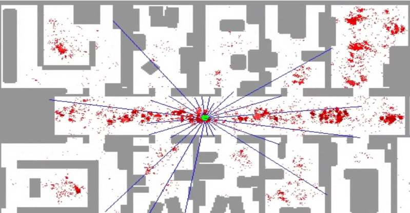
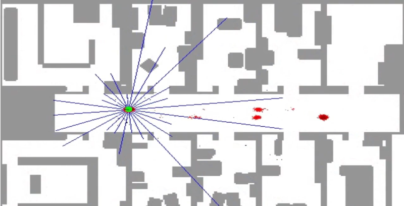

## Properties

| State Space | Belief     | Efficiency | Accuracy    |
| ----------- | ---------- | ---------- | ----------- |
| Continuous  | Multimodal |            | Approximate |

## Introduction

So, in a first instance, given a floor plan the robot has to perform global localization. That is, it does not know where it is, and it has to find out based on sensor measurements:

The robot has range sensors (blue lines), which use sonar sensors (basically sound) to obtain the distance between the robot and the obstacles around it. It uses this sensors to determine a posterior distribution that models its position at a given time.

Each particle (dot) is a discrete guess whether the robot might be, and it holds the following information: x coordinate, y coordinate, and heading direction. Then, the comprise of multiple of these guesses make up the representation for the posterior of the robot's location.

So, initially the robot is completely uncertain as to where it is, which derives into a uniform distribution as to where it may be, and thus the particles are scattered all over the floor plan. However as time passes, the particle filter makes them survive according to how consistent these particles are compared to the sensor measurements:

In summary, the particles guess where the robot might be moving and then the filter makes them "survive" (it does not discard them) using survival of the fittest. This latter statement means that those particles that are more consistent with the measurements are more likely to survive.

## Initial Probability

At the start the robot only has the map of the room and no other knowledge, therefore there is equal probability that the robot is at any position in the map. Hence, we create a set of $N$ particles modeled after a uniform distribution. Which means each particle is as likely to be chosen as any other.

## Resampling

At first, we have $N$ particles scattered all over the map and most of them are wrong. So now, we can start removing some of the wrong guesses using measurements of the environment. And we do this by resampling $N$ particles. This translates into, we choose $N$ particles that represent the place we believe the robot is in.

So, now the filter can go through each of our particles and determine what the measurement would be if our robot was in the position indicated by the particle. In other words, each particle has assigned an importance weight $w$ that determines how likely the measurement $Z$ is given a concrete particle $p_i$, ($P(Z|p_i)$).

So, given a total of $N$ particles:

$$
\begin{aligned}
N
\begin{cases}
p_1 & \rightarrow w_1\\
p_2 & \rightarrow w_2\\
\vdots\\
p_N & \rightarrow w_N\\
\end{cases}
\end{aligned}
$$

Let $W = \sum_i w_i$ be the sum of all the weights. We introduce a new variable $\alpha$ which represents the normalized weights:

$$
\begin{aligned}
N
\begin{cases}
p_1 & \rightarrow w_1 & \rightarrow \alpha_1 = \frac{w_1}{W}\\
p_2 & \rightarrow w_2 & \rightarrow \alpha_2 = \frac{w_2}{W}\\
\vdots\\
p_N & \rightarrow w_N & \rightarrow \alpha_N = \frac{w_N}{W}\\
\end{cases}
\end{aligned}
$$

Hence, $\sum_i \alpha_i = 1.0$. So we have now defined a new probability distribution that describes more clearly the position of our robot because it takes into account our measurement.

So, it's time for the resampling. We have to choose $N$ particles from the overall set, where each particle $p_i$ is chosen with probability $\alpha_i$:

Note we allow replacement, so we can draw multiple copies of the same particle $p_i$. So what will happen is, the higher $\alpha_i$ the more likely it is that particle $p_i$ is chosen multiple times, meanwhile the lower $\alpha_i$ is the more likely it is that it will not be chosen, and therefore simply removed from the set of particles.

As you can see in the previous image, we have drawn three times $p_2$, probably because the associated $\alpha_2$ was larger than the rest of the $\alpha$.

Therefore, the particles with a low importance weight will survive with a much lower rate than the ones with a higher importance weight.

## Motion

We also have to take into account that our particles cannot be static, but have to move with our robot. So whichever motion is applied to the robot should be applied to every single particle. Once the motion is applied we obtain a measurement and perform resampling to choose those particles that are more likely to describe the real position of the robot.

Note that the motion will most probably contain noise, so we do not want to propagate the motion equally to each particle. What we would want is to add some gaussian noise to the particles to represent somewhat this uncertainty about the motion.

## Algorithm

### Measurement Updates

We compute the posterior over state distribution:

$$
\begin{aligned}
P(X|Z) \propto P(Z|X)P(X)
\end{aligned}
$$

Here:

- $P(X)$ is the distribution over the set of particles.
- $P(Z|X)$ is the distribution that models the importance weights.

And by resampling we obtain $P(X|Z)$, because we draw with probability equal to the importance weight a given particle.

### Motion Updates

We compute the posterior over distribution one step later (after movement):

$$
\begin{aligned}
P(X^t) = \sum P(X^t|X)P(X)
\end{aligned}
$$

Where:

- $P(X)$ is the distribution over the set of particles.

And then, we sample from the sum. That is we generate a random particle $X^t$ by applying the motion model $P(X^t|X)$ to the particles $P(X)$.

## Resampling Example

Suppose we have the following data:

$$
\begin{aligned}
N
\begin{cases}
p_1 & \rightarrow w_1 = 0.6 & \rightarrow \alpha_1 = \frac{w_1}{W} = \frac{0.6}{6.0} = 0.1\\
p_2 & \rightarrow w_2 = 1.2 & \rightarrow \alpha_2 = \frac{w_2}{W} = \frac{1.2}{6.0} = 0.2\\
p_3 & \rightarrow w_3 = 2.4 & \rightarrow \alpha_3 = \frac{w_3}{W} = \frac{2.4}{6.0} = 0.4\\
p_4 & \rightarrow w_4 = 0.6 & \rightarrow \alpha_4 = \frac{w_4}{W} = \frac{0.6}{6.0} = 0.1\\
p_5 & \rightarrow w_2 = 1.2 & \rightarrow \alpha_5 = \frac{w_5}{W} = \frac{1.2}{6.0} = 0.2\\
\end{cases}
\end{aligned}
$$

Then, the probability of never sampling $p_3$ is given by the multiplication rule of probability:

On the first draw:

$$
\begin{aligned}
P(\bar{p_3}) = P(p_1) + P(p_2) + P(p_4) + P(p_5) = 0.6
\end{aligned}
$$

Because we allow for resampling, on the second draw:

$$
\begin{aligned}
0.6 \cdot P(\bar{p_3}) = 0.6 \cdot (P(p_1) + P(p_2) + P(p_4) + P(p_5)) = 0.6^2
\end{aligned}
$$

Thus, on the fifth and final draw:

$$
\begin{aligned}
0.6^4 \cdot P(\bar{p_3}) = 0.6^4 \cdot (P(p_1) + P(p_2) + P(p_4) + P(p_5)) = 0.6^5 = 0.0777
\end{aligned}
$$

However, the probabily of never drawing $p_1$ equals:

$$
\begin{aligned}
P(\bar{p_1}) = 0.9 ^ 5 = 0.59
\end{aligned}
$$

Therefore, the particles with a low importance weight will survive with a much lower rate than the ones with a higher importance weight.
