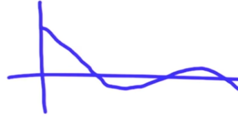

## Smoothing Algorithm

- Initilize $y_i$ to the non-smooth locations $x_i$: $y_i = x_i$
- Optimize two criteria:

  - First minimize the distance between the non-smooth point and the smooth point

  $$
  \min_i (x_i - y_i)^2
  $$

  - Then minimize the distance between two consecutive smooth points

  $$
  \min_i (y_i - y_{i+1})^2
  $$

- To optimize both, we include a parameter $\alpha$, to minimize the weigthed sum:

$$
\min (x_i - y_i)^2 + \alpha (y_i - y_{i+1})^2
$$

- We optimize both, because they are in conflict with each other:
  - If we only optimize the first one, we obtain the same path as the original non-smoothed path
  - If we only optimize the second one, we obtain no path

## PID Control

If we have a car that has a steering angle $\alpha$, how would we go about defining this parameter?

### P Controller

We set this angle proportional by some factor of $\tau$ to the crosstrack error. Where the crosstrack error refers to the lateral error between the vehicle and the reference trajectory. Thus:

$$
\begin{aligned}
\alpha = \tau CTE
\end{aligned}
$$

Note that with this approach we will eventually overshoot when reaching for the reference trajectory. That is because the car it not oriented the same as the trajectory, therefore it needs to reposition once it reaches the trajectory:



## PD Control

Here the steering angle does no only take into account the $CTE$, but it also uses the derivative of CTE. The latter will compute how much we are reducing the error in each moment $t$, and use this value to counter steer this angle (reduce the angle):

$$
\begin{aligned}
\alpha = - \tau_p CTE - \tau \frac{\delta}{\delta t} CTE
\end{aligned}
$$

Where:

$$
\begin{aligned}
\frac{\delta}{\delta t} CTE = \frac{CTE_t - CTE_{t-1}}{\Delta t}
\end{aligned}
$$

## Systematic Bias

In real life there is usually some noise when it comes to the angle of the wheels, and we refer to that as systematic bias. For example the wheels might be deviated a certain angle without us knowing.

## PID Control

Because of this systematic bias, the error with respect to the reference trajectory is very large. Therefore if we sum it over time we obtain larger and larger values. So, if we sum this CTE error weighted by a factor $\tau_I$, we can correct this error by counter steering:

$$
\begin{aligned}
\alpha = - \tau_P CTE - \tau_D \frac{\delta}{\delta t} CTE - \tau_I \sum CTE
\end{aligned}
$$

Where $\sum CTE$ equals the sum of the $CTE$ error overtime. Note:

- $- \tau_P CTE$: represents the proportional error
- $- \tau_D \frac{\delta}{\delta t}$: represents the differential error
- $- \tau_I \sum CTE$: represents the integral error

## Twiddle

We use Twiddle to optimize a set of parameters. In our case what we do is optimize, that is minimize, the average CTE.

So, given a parameters vector $p = [0, 0, 0]$ and a vector of potential changes $dp = [1, 1, 1]$ we:

1. Execute `run()` which computes the "optimal" steering angle and moves the robot accordingly. It also stores this motion as a trajectory. This function will return a "goodness" metric, that will signify the CTE.
2. So, after executing `run()` we get the best error so far.
3. We modify `p` to make our error smaller, to make this modification we use Twiddle. The algorithm is as follows:

```python
# Compute initial error
best_error = run(p)
# While the sum of the potential changes is bigger than a tolerance parameter
while sum(dp) < tolerance:
  # Iterate over every parameter
  for i in range(len(p)):
    # Update the parameter value by the value of the corresponding potential change
    p[i] += dp[i]
    # Compute the new error for this change
    err = run(p)
    # Does this better the previous error?
    err < best_error:
      # Make the change bigger
      dp[i] *= 1.1
    # If the error is worse
    else:
      # We try updating the parameter by subtracting (by two because we added before)
      p[i] -= 2*dp[i]
      err = run(p)
      # Does this better the previous error?
      err < best_error:
        # Make the change bigger
        dp[i] *= 1.1
      # If substracting does not make the error better
      else:
        # We decrease the change
        dp[i] *= 0.9
```

Basically Twiddle decreases/increases the parameters first a little bit, and for each time we make the error better we augment the increase or decrease.

And we stop when there are no major changes being made to the parameters, that is `sum(dp) < tolerance`.
