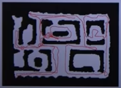
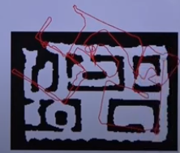
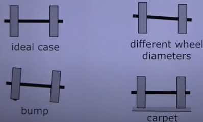
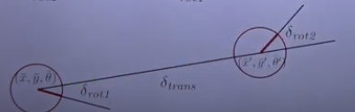

## Introduction

The motion of the system will always contain uncertainty, because it does not move perfectly with the command it is given. For example, suppose the robot follows the path illustrated in the next image:

However the internal estimate of the system yields the following result:

Showing that it has a tendency to drift to the right.

## Recursive Bayes Filter

As you may recall from [Bayes Filter](../01_bayes_filter) our belief at time $t$ was defined as follows:

$$
\begin{aligned}
bel(x_t) = \eta \cdot p(z_t | x_t) \cdot \int p(x_t | x_{t-1}, u_{1:t}) \cdot bel(x_{t-1}) dx_{t-1}
\end{aligned}
$$

And we said we used our motion model to estimate the next state of the system $\overline{x_t}$:

$$
\begin{aligned}
bel(\overline{x}_t) = \int p(x_t | x_{t-1}, u_{1:t}) \cdot bel(x_{t-1}) dx_{t-1}
\end{aligned}
$$

What we are doing here is marginilizing $x_t$ so that we know the probability of being at state $x_t$ given previous states $x_{t-1}$ and control command $u_t$.

Our motion model specifies a posterior probability, that asks what is the probability of the state being $x_t$ given we were at state $x_{t-1}$ and carried the command $u_t$.

## Typical Motion Models

- Odometry-based models: we use the measurements (odometry) of the robot about how it moved as a command
- Velocity-based models: we simply tell the system to move at a given velocity.

## Reasons for Motion Errors of Wheeled Robots

Some errors that cause wrong movement estimations are the following:

For the three different causes there are physical factors that make our robot move differently that what we expect it to for the given control command.

## Odometry Motion Model

Suppose a motion takes place, where the initial point is described as $(\overline{x}, \overline{y}, \overline{\theta})$ and the final point is $(\overline{x}', \overline{y}', \overline{\theta}')$

Our odometry information is given by $u = (\delta_{rot1}, \delta_{trans}, \delta_{rot2})$, where $\delta_trans$ is the distance between the two points, $\delta_{rot1}$ is the rotation on the first point and $\delta_{rot2}$ is the rotation on the second point. All of them are defined as follows:

$$
\begin{aligned}
\delta_{trans} = \sqrt{(\overline{x}' - \overline{x})^2 + (\overline{y}' - \overline{y})^2}
\end{aligned}
$$

$$
\begin{aligned}
\delta_{rot1} = atan2(\overline{y}' - \overline{y}, \overline{x}' - \overline{x}) - \overline{\theta}
\end{aligned}
$$

$$
\begin{aligned}
\delta_{rot2} = \overline{\theta}' - \overline{\theta} - \delta_{rot1}
\end{aligned}
$$

Each part is illustrated in the following image:

