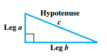
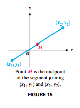
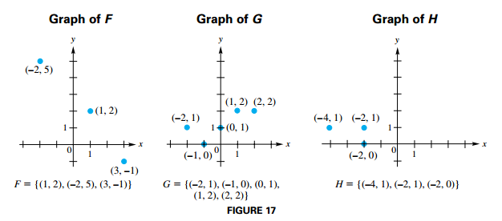
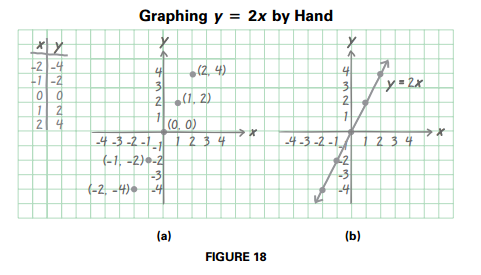
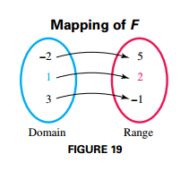
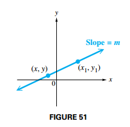
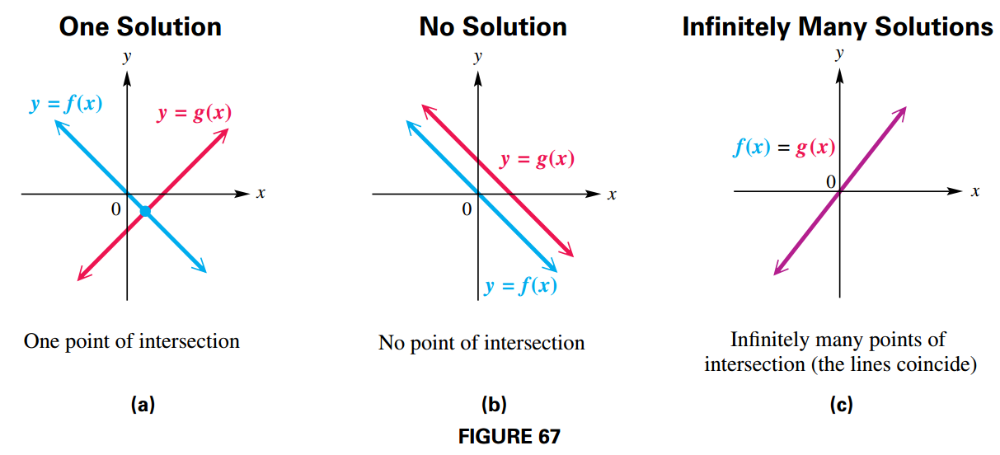

## Real Numbers and the Rectangular System

### Sets of Real Numbers

Several important sets of numbers are used in mathematics. Some of these sets are listed in the following table

| Set                | Description                                                                  |
| ------------------ | ---------------------------------------------------------------------------- |
| Natural Numbers    | $\{1, 2, 3, \cdots\}$                                                        |
| Whole Numbers      | $\{0, 1, 2, 3, \cdots\}$                                                     |
| Integers           | $\{\cdots, -1, 0, 1, 2, 3, \cdots\}$                                         |
| Rational Numbers   | $\{\frac{p}{q} \shortmid p \text{ and } q \text{ are integers, } q \neq 0\}$ |
| Irrational Numbers | $\{x \shortmid x \text { is not rational}\}$                                 |
| Real Numbers       | $\{x \shortmid x \text { is a decimal number}\}$                             |

### The Rectangular Coordinate System

If we place two number lines at right angles, intersecting at their origins, we obtain a two-dimensional **rectangular coordinate system**. This rectangular coordinate system is also called the **Cartesian coordinate system**.

### Pythagorean Theorem

In a right triangle, the sum of the squares of the lengths of the legs is equal to the square of the length of the hypotenuse.

$$
\begin{aligned}
a^2 + b^2 = c^2
\end{aligned}
$$

### Distance Formula

Suppose that $P(x_1, y_1)$ and $R(x_2, y_2)$ are two points in a coordinate plane. Then the distance between $P$ and $R$, written $d(P, R)$, is given by the **distance formula**.

$$
\begin{aligned}
d(P, R) = \sqrt{(x_2 - x_1)^2 + (y_2 - y_1)^2}
\end{aligned}
$$

### Midpoint Formula

The **midpoint** $M$ of the line segment with endpoints $(x_1, y_1)$ and $(x_2, y_2)$ has the following coordinates.

$$
\begin{aligned}
M = \left(\frac{x_1 + x_2}{2}, \frac{y_1 + y_2}{2}\right)
\end{aligned}
$$

## Introduction to Relations and Functions

### Set-Builder Notation and Interval Notation

The following chart summarizes set-builder notation, interval notation, and graphs of intervals of real numbers. It is assumed that $a < b$.

### Relations, Domain, and Range

A **relation** is a set of ordered pairs. If we denote the ordered pairs of a relation by $(x, y)$, then the set of all $x$-values is called the **domain** of the relation and the set of all $y$-values is called the **range** of the relation.

A relation can be represented by any of the following:

1. A **graph**, as illustrated in FIGURE 17 and FIGURE 18
2. A **table** of $xy$-values, as shown in FIGURE 18(a)
3. An **equation**, such as $y = 2x$ in FIGURE 18(b)
4. A **mapping or diagram**, as illustrated in FIGURE 19

### Functions

A **function** is a relation in which each element in the domain corresponds to exactly one element in the range. In a function, each $x$-value must correspond to exactly one $y$-value

#### Vertical Line Test

If every vertical line intersects a graph in no more than one point, then the graph is the graph of a function.

### Function Notation

To say that $y$ is a function of $x$ means that for each value of $x$ from the domain of the function, there is exactly one value of $y$. To emphasize that $y$ is a function of $x$, or that $y$ depends on $x$, it is common to write

$$
\begin{aligned}
y = f(x)
\end{aligned}
$$

with $f(x)$ read "f of x." This notation is called **function notation**.

## Linear Functions

### Linear Function

A function $f$ defined by $f(x) = ax + b$, where $a$ and $b$ are real numbers, is called a **linear function**.

Graphing linear equations by hand involves plotting points whose coordinates are solutions of the equation and then connecting them with a straight line.

From geometry, we know that two distinct points determine a line. Therefore, if we know the coordinates of two points, we can graph the line.

Unless otherwise specified, the domain of a linear function is the set of all real numbers. The range of a nonconstant linear function is also the set of all real numbers.

#### Intercepts

To find the $x$-intercept of the graph of $y = ax + b$, let $y = 0$ and solve for $x$ (assuming that $a \neq 0$). To find the $y$-intercept, let $x = 0$ and solve for $y$.

Let $ƒ$ be a function. Then any number $c$ for which $f(c) = 0$ is called a **zero** of the function $ƒ$. The point $(c, 0)$ is an $x$-intercept of the graph of $f$.

### Constant Function

A function $f(x) = b$, where $b$ is a real number, is called a **constant function**. Its graph is a horizontal line with $y$-intercept $(0, b)$. For $b \neq 0$, it has no $x$-intercept. (Every constant function is also linear.)

### Slope of a Line

The slope $m$ of the line passing through the points $(x_1, y_1)$ and $(x_2, y_2)$ is:

$$
\begin{aligned}
m = \frac{\Delta y}{\Delta x} = \frac{y_2 - y_1}{x_2 - x_1}
\end{aligned}
$$

where $\Delta x = x_2 - x_1 \neq 0$

#### Geometric Orientation Based on Slope

For a line with slope $m$,

1. If $m > 0$ (i.e., slope is positive), the line rises from left to right.
2. If $m < 0$ (i.e., slope is negative), the line falls from left to right.
3. If $m = 0$ (i.e., slope is $0$), the line is horizontal.

#### Vertical Line

A vertical line with $x$-intercept $(k, 0)$ has an equation of the form $x = k$. Its slope is undefined.

### Slope–Intercept Form of the Equation of a Line

In general, if $f(x) = ax + b$, then the slope of the graph of $f(x)$ is $a$ and the $y$-coordinate of the $y$-intercept is b. To verify this fact, notice that $f(0) = a(0) + b = b$.

Because the slope of the graph of $f(x) = ax + b$ is $a$, it is often convenient to use $m$ rather than $a$ in the general form of the equation. Therefore, we can write either

$$
\begin{aligned}
f(x) = mx + b
\end{aligned}
$$

or

$$
\begin{aligned}
y = mx + b
\end{aligned}
$$

This equation for $f(x)$ is generally called the **slope–intercept form** of the equation of a line.

## Equations of Lines and Linear Models

### Point Slope Form

FIGURE 51 shows a line passing through the fixed point $(x_1, y_1)$ with slope $m$. Let $(x, y)$ be any other point on the line.

By the slope formula:

$$
\begin{aligned}
m = \frac{y - y_1}{x - x_1}
\end{aligned}
$$

$$
\begin{aligned}
y - y_1 = m(x - x_1)
\end{aligned}
$$

This result is called the **point–slope form** of the equation of a line.

### Standard Form of the Equation of a Line

A linear equation written in the form:

$$
\begin{aligned}
Ax + By = C
\end{aligned}
$$

where $A$, $B$, and $C$ are real numbers ($A$ and $B$ not both $0$), is said to be in **standard form**.

### Parallel and Perpendicular Lines

Two distinct nonvertical lines are **parallel** if and only if they have the same slope.

Two lines, neither of which is vertical, are **perpendicular** if and only if their slopes have product $-1$.

### Linear Models and Regression

When data points are plotted in the $xy$-plane, the resulting graph is sometimes called a scatter diagram. Scatter diagrams are often helpful for analyzing trends in data

Graphing calculators are capable of finding the line of "best fit," for the data called the **least-squares regression line**, by using a technique taught in statistics courses known as **least-squares regression**.

One common measure of the strength of the linear relationship in a data set is called the correlation coefficient, denoted $r$, where $-1 \leq r \leq 1$.

## Linear Equations and Inequalities

### Solving Linear Equations in One Variable

A **linear equation in the variable** $x$ is an equation that can be written in the form:

$$
\begin{aligned}
ax + b = 0, a \neq 0
\end{aligned}
$$

We use two distinct approaches to solving equations.

1. The **analytic approach**, in which we use paper and pencil to transform complicated equations into simpler ones.
2. The **graphical approach**, in which we often support our analytic solutions by using graphs or tables.

The words **root**, **solution**, and **zero** all refer to the same basic concept.

### Identities and Contradictions

A **contradiction** is an equation that has no solution.

An **identity** is an equation that is true for all values in the domain of its variables.

#### Analytic Approach

One way to solve a given equation analytically is to rewrite it as a series of simpler equivalent equations, each of which has the same solution set as the given one. Equivalent equations are obtained by using the properties of equality.

#### Graphical Approaches to Solving Linear Equations

In general, if $f$ and $g$ are linear functions, then their graphs are lines that intersect at a single point, no point, or infinitely many points, as illustrated in FIGURE 67.

##### Intersection-of-Graphs Method of Graphical Solution

To solve the equation $f(x) = g(x)$ graphically, graph

$$
\begin{aligned}
y_1 = f(x)
\end{aligned}
$$

and

$$
\begin{aligned}
y_2 = g(x)
\end{aligned}
$$

The $x$-coordinate of any point of intersection of the two graphs is a solution of the equation.

##### x-Intercept Method of Graphical Solution

To solve the equation $f(x) = g(x)$ graphically, graph

$$
\begin{aligned}
y = f(x) - g(x) = F(x)
\end{aligned}
$$

The $x$-coordinate of any $x$-intercept of the graph of $y = F(x)$ (or zero of the function $F$) is a solution of the equation.

### Solving Linear Inequalities in One Variable

An inequality says that one expression is greater than, greater than or equal to, less than, or less than or equal to another.

Two inequalities with the same solution set are **equivalent inequalities**. Inequalities are solved using the properties of inequality:

For real numbers $a$, $b$, and $c$:

- $a < b$ and $a + c < b + c$ are equivalent
- If $c > 0$, then $a < b$ and $ac < bc$ are equivalent
- If $c < 0$, then $a < b$ and $ac > bc$ are equivalent

Similar properties exist for $>, \leq$ and $\geq$.

A linear inequality in the variable $x$ is an inequality that can be written in one of the following forms, where $a \neq 0$.

$$
\begin{aligned}
ax + b > 0
\end{aligned}
$$

$$
\begin{aligned}
ax + b < 0
\end{aligned}
$$

$$
\begin{aligned}
ax + b \geq 0
\end{aligned}
$$

$$
\begin{aligned}
ax + b \leq 0
\end{aligned}
$$

The solution set of a linear inequality is typically an interval of the real number line and can be expressed in interval notation.

#### Graphical Approaches to Solving Linear Inequalities

##### Intersection-of-Graphs Method of Solution of a Linear Inequality

Suppose that $f$ and $g$ are linear functions. The solution set of $f(x) > g(x)$ is the set of all real numbers $x$ such that the graph of $f$ is above the graph of $g$.

##### x-Intercept Method of Solution of a Linear Inequality

To solve $ƒ(x) > g(x)$, we can rewrite the inequality as $ƒ(x) - g(x) > 0$ or $F(x) > 0$. Such that the solution set of $F(x) > 0$ is the set of all real numbers $x$ such that the graph of $F$ is above the $x$-axis.

## Applications of Linear Functions

### Problem-Solving Strategies

These steps may be helpful in solving application problems.

1. Read the problem and make sure you understand it. Assign a variable to what you are being asked to find.
2. Write an equation that relates the quantities described in the problem.
3. Solve the equation and determine the solution to the posed question
4. Look back and check your solution.

### Direct Variation

A common application involving linear functions deals with quantities that vary directly (or are in direct proportion).

A number $y$ varies directly with $x$ if there exists a nonzero number $k$ such that:

$$
\begin{aligned}
y = kx
\end{aligned}
$$

The number k is called the **constant of variation**.
