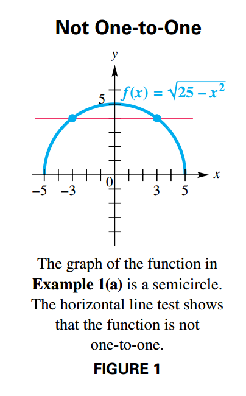
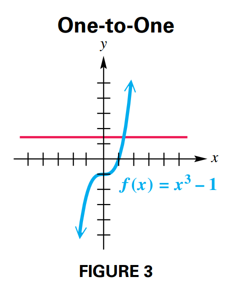
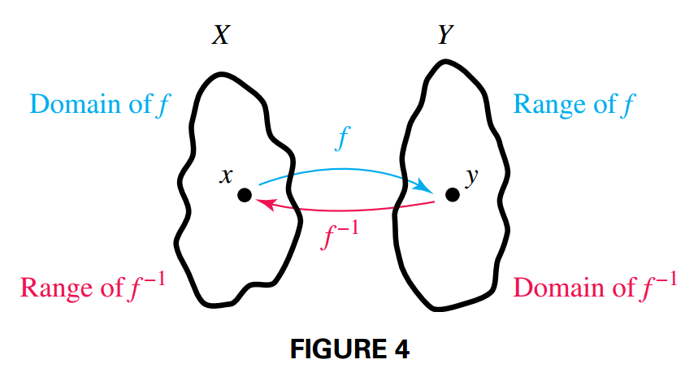
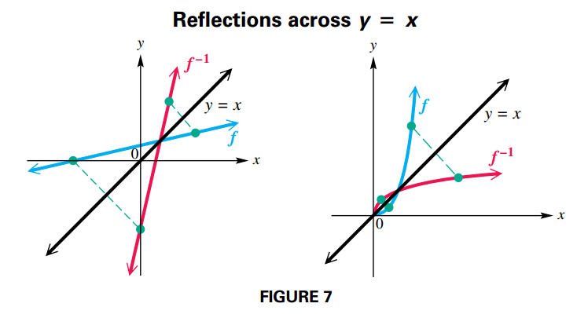
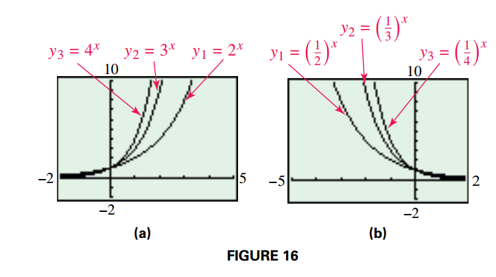
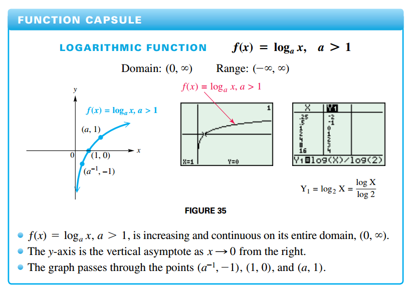
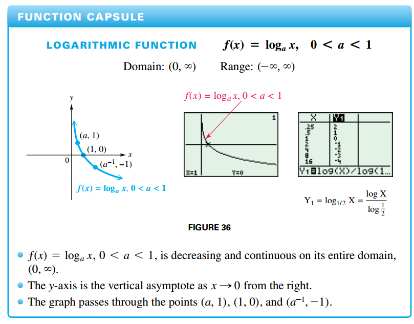
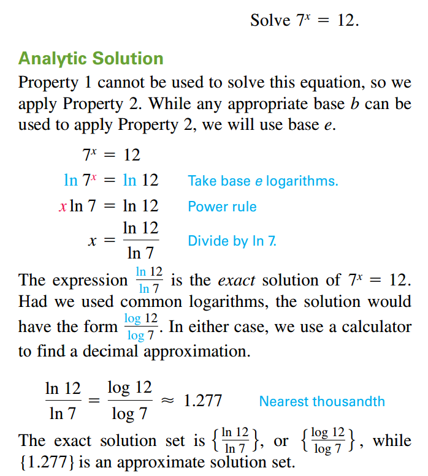
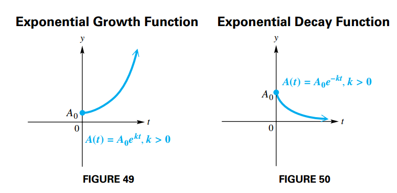

## Inverse Functions

### One-to-One Functions

A function $f$ is a **one-to-one function** if, for elements $a$ and $b$ from the domain of $f$:

$$
\begin{aligned}
a \neq b
\end{aligned}
$$

implies

$$
\begin{aligned}
f(a) \neq f(b)
\end{aligned}
$$

And by the contrapositive:

$$
\begin{aligned}
f(a) = f(b)
\end{aligned}
$$

implies

$$
\begin{aligned}
a = b
\end{aligned}
$$

A function that is either always increasing or always decreasing on its domain must be one-to-one.

### Horizontal Line Test

A function is one-to-one if every horizontal line intersects the graph of the function at most once.

### Inverse Function

Let $f$ be a one-to-one function. Then $g$ is the inverse function of $f$ and $f$ is the inverse function of $g$ if:

$$
\begin{aligned}
(f \circ g)(x) = x \text{ for every } x \text{ in the domain of } g
\end{aligned}
$$

and

$$
\begin{aligned}
(g \circ x)(x) = x \text{ for every } x \text{ in the domain of } f
\end{aligned}
$$

A special notation is often used for inverse functions. If $g$ is the inverse function of $ƒ$, then $g$ can be written as $f^{-1}$ (read "f-inverse").

By the definition of an inverse function, the domain of $f$ equals the range of $f^{-1}$, and the range of $f$ equals the domain of $f^{-1}$.

#### Finding the Equation of the Inverse of y = ƒ(x)

For a one-to-one function $f$ defined by an equation $y = f(x)$, find the defining equation of the inverse as follows. (You may need to replace $f(x)$ with $y$ first. Any restrictions on $x$ and $y$ should be considered.)

1. Interchange $x$ and $y$.
2. Solve for $y$.
3. Replace $y$ with $f^{-1}$.

#### Geometric Relationship between the graphs of $f$ and $f^{-1}$

If a function $f$ is one-to-one, then the graph of its inverse $f^{-1}$ is a reflection of the graph of $f$ across the line $y = x$.

#### Important Facts about Inverses

1. If $f$ is one-to-one, then $f^{-1}$ exists
2. The domain of $f$ is equal to the range of $f^{-1}$, and the range of $f$ is equal to the domain of $f^{-1}$.
3. If the point $(a, b)$ lies on the graph of $f$, then $(b, a)$ lies on the graph of $f^{-1}$. The graphs of $f$ and $f^{-1}$ are reflections of each other across the line $y = x$.

## Exponential Functions

### Real-Number Exponents

For any real number $a > 0$, $a \neq 1$, the following statements are true:

1. $a^{x}$ is a unique real number for each real number $x$.
2. $a^b = a^c$ if and only if $b = c$.
3. If $a > 1$ and $m < n$, then $a^m > a^n$.

### Graphs of Exponential Functions

If $a > 0$ and $a \neq 1$, then:

$$
\begin{aligned}
f(x) = a^x
\end{aligned}
$$

is the **exponential function with base** $a$.

The behavior of the graph of an exponential function depends, in general, on the magnitude of $a$. As a becomes larger ($a > 1$), the graph becomes steeper moving to the right of the $y$-axis. (See FIGURE 16(a)).

If the base $a$ is between $0$ and $1$, as a gets closer to $0$, the graph becomes steeper moving to the left of the $y$-axis. (See FIGURE 16(b)).

### Exponential Equations (Type 1)

On the equation $25^x = 125$ the variable appears in the exponent, we refer to such an equation as a **Type 1 exponential equation** (this is not any type of standard naming, it is just used on this manual).

## Logarithms and Their Properties

### Logarithm

For all positive numbers $a$, where $a \neq 1$,

$$
\begin{aligned}
a^y = x
\end{aligned}
$$

is equivalent to

$$
\begin{aligned}
y = \log_a x
\end{aligned}
$$

The expression $\log_a x$ represents the exponent to which the base $a$ must be raised in order to obtain $x$.

The number $a$ is called the **base** of the logarithm, and $x$ is called the **argument** of the expression.

The argument of a logarithm must be a positive number.

### Common Logarithm

Base $10$ logarithms are called **common logarithms**. The common logarithm of $x$ is written $log x$, where the base is understood to be $10$.

### Natural Logarithm

Logarithms with base $e$ are called **natural logarithms**. The natural logarithm of a positive number $x$ is written $\ln x$.

### Properties of Logarithms

For $a > 0$, $a \neq q$, and any real number $k$, the following hold.

1. $log_a 1 = 0$
2. $log_a a^k = k$
3. $a^{\log_a k} = k ,k > 0$
4. **Product rule** $\log_a xy = \log_a x + \log_a y$
5. **Quotient rule** $\log_a \frac{x}{y} = \log_a x - \log_a y$
6. **Power rule** $\log_a x^r = r\log_a x$

#### Proofs

Property $1$ is true because $a^0 = 1$ for any nonzero value of $a$.

Property $2$ is verified by writing the equation in exponential form. By the definition of the logarithm, if $\log_a a^k = k$, then $a^k = a^k$, which is true.

Property $3$ is justified by the fact that $\log_a k$ is the value we have to raise $a$ to obtain $k$. If we raise $a$ by $\log_a k$, then by the definition of the logarithm we obtain $k$.

The proof of Property $4$, the product rule, is as follows:

Let $m = \log_a x$ and $n = \log_a y$, then

$a^m = x$ and $a^n = y$ by the definiton of a logarithm. If we multiply them:

$$
\begin{aligned}
a^m a^n = xy
\end{aligned}
$$

$$
\begin{aligned}
a^{m + n} = xy
\end{aligned}
$$

By the definition of the logarithm:

$$
\begin{aligned}
\log_a xy = m + n
\end{aligned}
$$

Substituting $m = \log_a x$ and $n = \log_a y$

$$
\begin{aligned}
\log_a xy = \log_a x + \log_a y
\end{aligned}
$$

Properties $5$ and $6$, the quotient and power rules, are proved in a similar way

### Change-of-Base Rule

For any positive real numbers $x$, $a$, and $b$, where $a \neq 1$ and $b \neq 1$

$$
\begin{aligned}
\log_a x = \frac{\log_b x}{\log_b a}
\end{aligned}
$$

Let

$$
\begin{aligned}
y = \log_a x
\end{aligned}
$$

By the definition of the logarithm:

$$
\begin{aligned}
a^y = x
\end{aligned}
$$

We apply the logarithm on both sides:

$$
\begin{aligned}
\log_b a^y = \log_b x
\end{aligned}
$$

By the power rule:

$$
\begin{aligned}
y \log_b a = \log_b x
\end{aligned}
$$

$$
\begin{aligned}
y = \frac{\log_b x}{\log_b a}
\end{aligned}
$$

Substituting $y = \log_a x$

$$
\begin{aligned}
\log_a x = \frac{\log_b x}{\log_b a}
\end{aligned}
$$

## Logarithms Functions

### Logarithmic Function

If $a > 0$, $a \neq 1$, and $x > 0$, then

$$
\begin{aligned}
f(x) = \log_a x
\end{aligned}
$$

is the **logarithmic function with base** $a$.

The exponential function $f(x) = a^x$, $a > 1$, is increasing on its domain. If $0< a <1$, the function is decreasing on its domain. Thus, for all allowable bases $a$, function $f$ is one-to-one and has an inverse. We can find the rule for $f^{-1}$ analytically:

$$
\begin{aligned}
f(x) = a^x
\end{aligned}
$$

$$
\begin{aligned}
y = a^x
\end{aligned}
$$

$$
\begin{aligned}
x = a^y
\end{aligned}
$$

By the definition of the logarithm:

$$
\begin{aligned}
y = \log_a x
\end{aligned}
$$

$$
\begin{aligned}
f^{-1}(x) = \log_a x
\end{aligned}
$$

To confirm this, use [properties of logarithms](#properties-of-logarithms) to show that $(f \circ f^{-1})(x) = x$ and $(f^{-1} \circ f)(x) = x$.

$$
\begin{aligned}
(f \circ f^{-1})(x) = f(f^{-1}(x)) = a^{\log_a x} = x
\end{aligned}
$$

$$
\begin{aligned}
(f^{-1} \circ f)(x) = f^{-1}(f(x)) = \log_a a^x = x
\end{aligned}
$$

Thus, the functions $f(x) = a^x$ and $g(x) = log_a x$ are inverse functions.

### Graphs of Logarithmic Functions

## Exponential and Logarithmic Equations and Inequalities

### Properties of Logarithmic and Exponential Functions

For $b > 0$ and $b \neq 1$:

1. $b^x = b^y$ if and only if $x = y$.
2. If $x > 0$ and $y > 0$, then $log_b x = log_b y$ if and only if $x = y$

### Exponential Equations and Inequalities (Type 2)

Unlike a [Type 1 exponential equation](#exponential-equations-type-1) (or inequality) a **Type 2 exponential equation** (or inequality) is one in which the exponential expressions cannot easily be written as powers of the same base. For example:

$$
\begin{aligned}
7^x = 12
\end{aligned}
$$

### Solving Exponential and Logarithmic Equations

An exponential or logarithmic equation can be solved by changing the equation into one of the following forms, where $a$ and $b$ are real numbers, $a > 0$, and $a \neq 1$.

1. $a^{f(x)} = b$: Solve by taking a logarithm of each side.
2. $\log_a f(x) = \log_a g(x)$: The equation is satisfied when $f(x) = g(x)$
3. $\log_a f(x) = b$: Solve by changing to exponential form $f(x) = a^b$

## Further Applications and Modeling with Exponential and Logarithmic Functions

### Physical Science Applications

A function of the form:

$$
\begin{aligned}
A(t) = A_0 e^{kt}
\end{aligned}
$$

where $A_0$ represent the initial quantity present, $t$ represents the time elapsed, $k > 0$ represents the growth constant is called an **exponential growth function**.

A function of the form:

$$
\begin{aligned}
A(t) = A_0 e^{-kt}
\end{aligned}
$$

is an **exponential decay function**.

If a quantity decays exponentially, the amount of time that it takes to reach onehalf its original amount is called the **half-life**.
