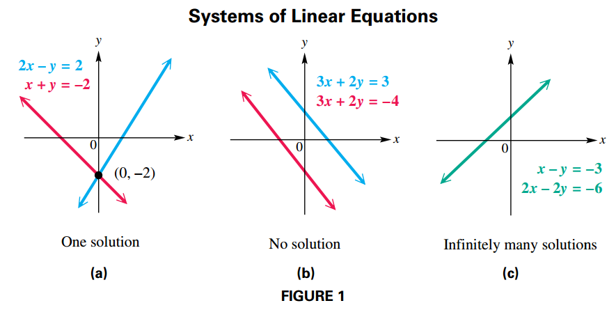
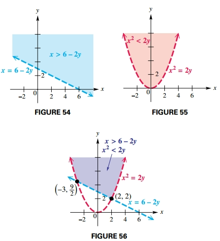

## Systems of Equations

### Linear Systems

Any equation of the form:

$$
\begin{aligned}
a_1 x_1 + a_2 x_2 + \cdots + a_n x_n = b
\end{aligned}
$$

for real numbers $a_1, a_2, \cdots, a_n$ (not all zero) and $b$ is a **linear equation** or a **first-degree equation in** $n$ **unknowns**.

A set of equations is called a **system of equations**. The solutions of a system of equations must satisfy every equation in the system. If all the equations in a system are linear, the system is a **system of linear equations**, or a **linear system**.

There are three possible outcomes for the graph of a system of two linear equations in two variables:

1. The graphs intersect at exactly one point, which gives the (single) ordered-pair solution of the system. The system is **consistent** and the **equations are independent**. (FIGURE 1a)
2. The graphs are parallel lines, so there is no solution and the solution set is $\emptyset$. The system is **inconsistent** and the **equations are independent**. See FIGURE 1(b).
3. The graphs are the same line, and there are infinitely many solutions. The system is **consistent** and the **equations are dependent**. See FIGURE 1(c).

### Substitution Method

In a system of two equations with two variables, the **substitution method** involves using one equation to find an expression for one variable in terms of the other, and then substituting this expression into the other equation of the system.

### Substitution Method

Another way to solve a system of two equations, the **elimination method**, uses multiplication and addition to eliminate a variable from one equation. Systems that have the same solution set are called **equivalent systems**. The three transformations allowed are the following:

1. Interchange any two equations of the system.
2. Multiply or divide any equation of the system by a nonzero real number.
3. Replace any equation of the system by the sum of that equation and a multiple of another equation in the system.

### Nonlinear Systems

A **nonlinear system of equations** is a system in which at least one of the equations is not a linear equation.

## Solutions of Linear Systems in Three Variables

We can extend the ideas of systems of equations in two variables to linear equations of the form:

$$
\begin{aligned}
Ax + By + Cz = D
\end{aligned}
$$

Considering the possible intersections of the planes representing three equations in three unknowns shows that the solution set of such a system may be either a **single ordered triple** $(x, y, z)$, an **infinite set of ordered triples** (dependent equations), or the **empty set** (an inconsistent system).

The following steps can be used to solve a linear system with three variables.

1. Eliminate a variable from any two of the equations.
2. Eliminate the **same variable** from a different pair of equations.
3. Eliminate a second variable using the resulting two equations in two variables to get an equation with just one variable.
4. Find the values of the remaining variables by substitution.

## Solution of Linear Systems by Row Transformations

### Matrix Row Transformations

For any augmented matrix of a system of linear equations, the following row
transformations will result in the matrix of an equivalent system.

1. Any two rows may be interchanged.
2. The elements of any row may be multiplied by a nonzero real number.
3. Any row may be changed by adding to its elements a multiple of the corresponding elements of another row.

### Row Echelon Method

The **echelon (triangular) form** of an augmented matrix has **1s down the diagonal** from upper left to lower right and **0s below** each 1.

Once a system of linear equations is in echelon form, back-substitution can be used to find the solution set. The **row echelon method**
uses matrices to solve a system of linear equations.

- Start by obtaining a 1 as the first entry in the first column and then transform all entries below it to a 0.
- Continue through the columns obtaining a 1 as the second entry in the second column (zeros below), the third entry in the third column (zeros below), and so on.
- Repeat this process to row echelon form.

The following matrix is an augmented matrix in row echelon form:

$$
\begin{aligned}
\begin{bmatrix}
  1 & 2 & 3 & 4\\
  0 & 5 & 6 & 7\\
  0 & 0 & 0 & 9\\
\end{bmatrix}
\end{aligned}
$$

### Reduced Row Echelon Method

The reduced row echelon form has 1s along the main diagonal and 0s both below and above. For example

$$
\begin{aligned}
\begin{bmatrix}
  1 & 1 & 1 & 6\\
  2 & -1 & 1 & 5\\
  3 & 1 & -1 & 9\\
\end{bmatrix}
\end{aligned}
$$

By using row transformations, this augmented matrix can be transformed to

$$
\begin{aligned}
\begin{bmatrix}
  1 & 0 & 0 & 3\\
  0 & 1 & 0 & 2\\
  0 & 0 & 1 & 1\\
\end{bmatrix}
\end{aligned}
$$

Which represents $x = 3, y = 2, z = 1$. There is no need for back-substitution with reduced row echelon form.

### Special Cases

Whenever a row of the augmented matrix is of the form

$$
\begin{aligned}
\begin{bmatrix}
  0 & 0 & \cdots & a\\
\end{bmatrix}
\end{aligned}
$$

where $a \neq 0$ the **system is inconsistent** and there will be **no solution**.

A row of the matrix of a linear system in the form:

$$
\begin{aligned}
\begin{bmatrix}
  0 & 0 & \cdots & 0\\
\end{bmatrix}
\end{aligned}
$$

indicates that the equations of the **system are dependent**.

## Matrix Properties and Operations

### Matrix addition

The sum of two $m \times n$ matrices $A$ and $B$ is the $m \times n$ matrix $A + B$ in which each element is the sum of the corresponding elements of $A$ and $B$.

**Only matrices with the same dimension can be added.**

### Multiplication of a Matrix by a Scalar

The product of a scalar $k$ and a matrix $A$ is the matrix $kA$, each of whose elements is $k$ times the corresponding element of $A$.

### Matrix Multiplication

The product $AB$ of an $m \times n$ matrix $A$ and an $n \times k$ matrix $B$ is an $m \times k$ matrix and is found as follows.

To find the $i$th row, $j$th column element of $AB$, multiply each element in the $i$th row of $A$ by the corresponding element in the $j$th column of $B$. The sum of these products gives the element of row $i$, column $j$ of $AB$.

$$
\begin{aligned}
c_{ij} = \sum_{k=1}^{n} a_{ik}b_{kj}
\end{aligned}
$$

**The product AB can be found only if the number of columns of A is the same as the number of rows of B. The final product will have as many rows as A and as many columns as B.**

## Determinants and Cramer's Rule

### Determinants of $2 \times 2$ matrices

The determinant of a $2 \times 2$ matrix $A$ is a real number defined as $det(A) = a_{11} a_{22}− a_{21} a_{12}$.

### Determinants of $3 \times 3$ matrices

The determinant of a $3 \times 3$ matrix $A$ is a real number defined as $det(A) = (a_{11}a_{22}a_{33} + a_{12} a_{23} a_{31} + a_{13} a_{21}a_{32}) − (a_{31}a_{22}a_{13} + a_{32} a_{23} a_{11} + a_{33} a_{21}a_{12})$.

### Cofactor

Let $M_{ij}$ be the **minor** for element $a_{ij}$ in an $n \times n$ matrix. The cofactor of $a_{ij}$, written $A_{ij}$, is defined as follows.

$$
\begin{aligned}
A_{ij} = (-1)^{i + j} \cdot M_{ij}
\end{aligned}
$$

### Cramer's Rule for $2 \times 2$ Systems

The solution of the system:

$$
\begin{aligned}
a_1x + b_1y = c_1
\end{aligned}
$$

$$
\begin{aligned}
a_2x + b_2y = c_2
\end{aligned}
$$

is given by:

$$
\begin{aligned}
x = \frac{D_x}{D}, y = \frac{D_y}{D}
\end{aligned}
$$

where:

$$
\begin{aligned}
D_x = det(
\begin{bmatrix}
c_1 & b_1 \\
c_2 & b_2 \\
\end{bmatrix})
\end{aligned}
$$

$$
\begin{aligned}
D_y = det(
\begin{bmatrix}
a_1 & c_1 \\
a_2 & c_2 \\
\end{bmatrix})
\end{aligned}
$$

$$
\begin{aligned}
D = det(
\begin{bmatrix}
a_1 & b_1 \\
a_2 & b_2 \\
\end{bmatrix}) \neq 0
\end{aligned}
$$

## Solution of Linear Systems by Matrix Inverses

### Multiplicative Inverses of Square Matrices

In a similar way, if $A$ is an $n \times n$ matrix, then its multiplicative inverse, written $A^{-1}$, must satisfy both:

$$
\begin{aligned}
AA^{-1} = A^{-1}A = I_n
\end{aligned}
$$

**This result means that only a square matrix can have a multiplicative inverse.**

The inverse matrix of an $n \times n$ matrix $A$ (if it exists) can be found analytically
by first forming the augmented matrix $[A|I_n]$ such that $Ax = I_n$, thus $x = A^{-1}$.

This means you are solving $n$ systems of linear equations of the form $Ax_i = I_{n_i}$.

This system is solved by performing matrix row operations, until the left side of the augmented matrix becomes the identity matrix.

The resulting augmented matrix can be written as $[I_n|A^{-1}]$, where the right side of the matrix is $A^{-1}$.

If $A^{-1}$ exists, then it is unique. If $A^{-1}$ does not exist, then $A$ is a **singular matrix**.

### Using Determinants to Find Inverses

If

$$
\begin{aligned}
A = \begin{bmatrix}
a & b \\
c & d
\end{bmatrix}
\end{aligned}
$$

and $det(A) \neq 0$ then

$$
\begin{aligned}
A^{-1} = \frac{1}{det(A)}\begin{bmatrix}
d & -b \\
-c & a
\end{bmatrix}
\end{aligned}
$$

If $det(A) = 0$, then $A^{−1}$ does not exist and $A$ is a singular matrix.

### Solving Linear Systems Using Inverse Matrices

To solve the matrix equation $AX = B$, first see if $A^{-1}$ exists. Assuming that it does, use the facts that $A^{-1}A = I$ and $IX = X$.

$$
\begin{aligned}
AX = B
\end{aligned}
$$

$$
\begin{aligned}
A^{-1}(AX) = A^{-1}B
\end{aligned}
$$

$$
\begin{aligned}
(A^{-1}A)X = A^{-1}B
\end{aligned}
$$

$$
\begin{aligned}
IX = A^{-1}B
\end{aligned}
$$

$$
\begin{aligned}
X = A^{-1}B
\end{aligned}
$$

## Systems of Inequalities and Linear Programming

### Solving Linear Inequalities

A linear inequality in two variables is an inequality of the form

$$
\begin{aligned}
Ax + By \leq C,
\end{aligned}
$$

where $A$, $B$, and $C$ are real numbers with $A$ and $B$ not both equal to $0$. (The symbol $\leq$ be replaced with $\geq$, $>$ or $<$).

#### Graphing a Linear Inequality

Graph $x + 4y 7 > 4$.

- The boundary here is the line $x + 4y = 4$.
- Since the points on this line do not satisfy $x + 4y = 4$, make the line dashed.
- To decide which half plane represents the solution, solve for $y$. Such that $y > -\frac{1}{4}x + 1$
- Since $y$ is greater than $-\frac{1}{4}x + 1$, the graph of the solution set is the half plane above the boundary

#### Two Methods for Graphing an Inequality

For a function $f$, the graph of $y < f(x)$ consists of all the **points that are below** the graph of y = ƒ(x). The graph of $y > f(x)$ consists of all the **points that are above** the graph of $y = f(x)$.

If the inequality is not or cannot be solved for $y$, choose a **test point** not on the boundary. If the test point **satisfies the inequality**, the graph includes all points on the **same side of the boundary** as the test point. Otherwise, the graph includes all points on the **other side of the boundary**.

### Soliving Systems of Inequalitites

The solution set of a **system of inequalities** is the **intersection of the solution sets of its members**

Graph the solution set of the system.

$$
\begin{aligned}
x > 6 - 2y
\end{aligned}
$$

$$
\begin{aligned}
x^2 < 2y
\end{aligned}
$$

The next figures show the graphs for both inequalities as well as the solution set, that is the intersection of the regions that represent the solution set for each inequality.

### Linear Programming

We use **linear programming** to find an optimum value. A linear programming problem typically needs the definition of the following concepts:

- The restrictions of the problem, usually a system of inequalitites, that conform the **constraints**.
- An **objetive function**, which is the function we aim to optimize.
- The **region of feasible solutions** that is the set of values for $x$ and $y$ that satisfy all constraints.

#### Fundamental Theorem of Linear Programming

If the optimal value for a linear programming problem exists, it occurs at a vertex of the region of feasible solutions.

#### Solving a Linear Programming Problem

1. **Write the objective function** and all necessary **constraints**.
2. **Graph** the **region of feasible solutions**.
3. Identify all **vertices** (corner points).
4. **Evaluate** the objective function at **each vertex**.
5. The **solution** is given by the **vertex producing the optimal value** of the objective function.

## Partial Fractions

### Decomposition of Rational Expressions

#### Partial Fraction Decomposition of $\frac{f(x)}{g(x)}$

- If $\frac{f(x)}{g(x)}$ is not a **proper fraction** (a fraction whose numerator is lesser degree than it denominator) divide $f(x)$ by $g(x)$. For example

$$
\begin{aligned}
\frac{x^4 - 3x^3 + x^2 + 5x}{x^2 + 3} = x^2 - 3x - 2 + \frac{14x + 6}{x^2 + 3}
\end{aligned}
$$

Then appy the following steps to the **remainder**.

- Factor the denominator $g(x)$ into factors of the form $(ax + b)^m$ or $(cx^2 + dx + e)^n$.
- For each distinct linear factor $(ax + b)$, the decomposition must include the term \frac{A}{ax + b}.
- For each repeated linear factor $(ax + b)^m$, the decomposition must include the terms:

$$
\begin{aligned}
\frac{A_1}{(ax + b)} + \frac{A_2}{(ax + b)^2} + \cdots + \frac{A_m}{(ax + b)^m}
\end{aligned}
$$

- For each distinct quadratic factor $(cx^2 + dx + e)$, the decomposition must include the term $\frac{Bx + C}{cx2 + dx + e}$
- For each repeated quadratic factor $(cx^2 + dx + e)^n$, the decomposition must include the terms:

$$
\begin{aligned}
\frac{B_1x + C_1}{(cx^2 + dx + e)} + \frac{B_2x + C_2}{(cx^2 + dx + e)^2} + \cdots + \frac{B_nx + C_n}{(cx^2 + dx + e)^n}
\end{aligned}
$$

- Use algebraic techniques to solve for the constants in the numerators of the decomposition.

### Techniques for Decomposition into Partial Fractions

#### For Linear Factors

1. Multiply each side of the resulting rational equation by the common denominator.
2. Substitute the zero of each factor into the resulting equation. For repeated linear factors, substitute as many other numbers as is necessary to find all the constants in the numerators. The number of substitutions required will equal the number of constants $A, B, \cdots$.

For example:

$$
\begin{aligned}
\frac{f(x)}{(x-1)(x-2)} = \frac{A}{(x-1)} + \frac{B}{(x - 2)} = \frac{A(x-2) + B(x-1)}{(x-2)(x-1)}
\end{aligned}
$$

Multiply both sides by $(x-1)(x-2)$:

$$
\begin{aligned}
f(x) = A(x-2) + B(x-1)
\end{aligned}
$$

Solve for $x = 2$:

$$
\begin{aligned}
f(2) = A(0) + B(1)
\end{aligned}
$$

And then solve for $x = 1$:

$$
\begin{aligned}
f(1) = A(-1) + B(0)
\end{aligned}
$$

#### For Quadratic Factors

1. Multiply each side of the resulting rational equation by the common denominator.
2. Collect terms on the right side of the equation.
3. Equate the coefficients of like terms to get a system of equations.
4. Solve the system to find the constants in the numerators.

For example:

$$
\begin{aligned}
\frac{x^2 + 3x - 1}{(x + 1)(x^2 + 2)} = \frac{A}{(x + 1)} + \frac{Bx + C}{(x^2 + 2)}
\end{aligned}
$$

Multiply each side by $(x + 1)(x^2 + 2)$:

$$
\begin{aligned}
x^2 + 3x - 1 = A(x^2 + 2) + (Bx + C)(x + 1)
\end{aligned}
$$

Collect the terms on each side of the equation:

$$
\begin{aligned}
x^2 + 3x - 1 = Ax^2 + A2 + Bx^2 + Bx + Cx + C = x^2 (A + B) + x (B + C) + 2A + C
\end{aligned}
$$

Equate the coefficients of like terms to get a system of equations:

$$
\begin{aligned}
(A + B) = 1
\end{aligned}
$$

$$
\begin{aligned}
(B + C) = 3
\end{aligned}
$$

$$
\begin{aligned}
2A + C = -1
\end{aligned}
$$

Solving this system for $A$, $B$, and $C$ would give the partial fraction decomposition.
