## The Law of Sines

### Derivation of the Law of Sines

Given an acute triangle (Figure 1(a)) or an obtuse triangle (Figure 1(b)). We construct the perpendicular from $B$ to side $AC$. Let $h$ be the length of the perpendicular.

Then:

$$
\begin{aligned}
\sin A = \frac{h}{c} \leftrightarrow h = c \sin A
\end{aligned}
$$

$$
\begin{aligned}
\sin C = \frac{h}{a} \leftrightarrow h = a \sin C
\end{aligned}
$$

Since $h = c \sin A = a \sin C$, then:

$$
\begin{aligned}
a \sin C = c \sin A
\end{aligned}
$$

$$
\begin{aligned}
\frac{a}{\sin A} = \frac{c}{\sin C}
\end{aligned}
$$

By constructing perpendicular lines from the other vertices, it can be shown that:

$$
\begin{aligned}
\frac{a}{\sin A} = \frac{b}{\sin B}
\end{aligned}
$$

$$
\begin{aligned}
\frac{b}{\sin B} = \frac{c}{\sin C}
\end{aligned}
$$

Therefore:

$$
\begin{aligned}
\frac{a}{\sin A} = \frac{b}{\sin B} = \frac{c}{\sin C}
\end{aligned}
$$

### Ambiguous Case

If we are given the length of two sides and the angle opposite to one of them then zero, one or two such triangles could exist. This is what we call the **ambiguous case**.

To solve this type of triangle we make use of the following facts:

- For any angle $\theta$ of a triangle, $0 < \sin \theta \leq 1$.
- Given an angle $\theta$ on the triangle where $\sin \theta = 1$, then $\theta = 90º$ and the triangle is a right triangle.
- For any angle $\theta$ it follows $\sin \theta = \sin (180º - \theta)$
- The smallest angle is opposite the shortest side, the largest angle is opposite the longest side and the midle-valued angle is opposite the intermediate side.

We know that if $A$ is acute then there are four possible outcomes, whilst if $A$ is obtuse there are two possible outcomes.

When $A$ is acute we define the following cases, after applying the law of sines:

- If $\sin B > 1$ and $a < h< b$ then there are $0$ possible triangles, as the range of $\sin$ is $[-1, 1]$.

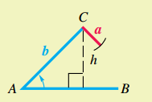

- If $\sin B = 1$ and $a = b$ and $h < b$ then there is $1$ possible triangle.

- If $0 < \sin B < 1$ and $a \leq b$ there is $1$ possible triangle.

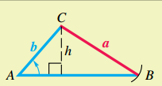

- If $0 < \sin B_1 < 1$, $h < a < b$, there is $1$ possible triangle. Note that $\sin B_1 = \sin (180º - B_1)$, so if if, $A + B_2 < 180º$ (which means there is a $C$ such that $A + B_2 + C = 180º$) then there is another possible triangle.

When $A$ is obtuse we define the following cases, after applying the law of sines:

- If $\sin B \geq 1$ and $a \leq b$, then there are zero possible triangles as the range of $\sin$is $[-1, 1]$.

- If $0 < \sin B < 1$ and $a > b$ then there is one possible triangle.

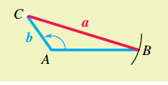

## The Law of Cosines and Area Formulas

### Triangle Side Length Restriction

In any triangle, the sum of the lengths of any two sides must be greater than the length of the remaining side.

### Derivation of the Law of Cosines

Let $ABC$ be any oblique triangle. Let $B$ be a vertex at the origin and the side $BC$ be along the positive x-axis (Figure 10).

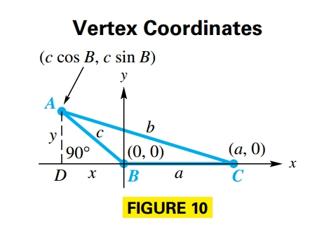

Let $(x, y)$ be the coordinates of vertex $A$, then:

$$
\begin{aligned}
\sin B = \frac{y}{c}
\end{aligned}
$$

and

$$
\begin{aligned}
\cos B = \frac{x}{c}
\end{aligned}
$$

Such that:

$$
\begin{aligned}
y = c \sin B
\end{aligned}
$$

and

$$
\begin{aligned}
x = c \cos B
\end{aligned}
$$

So the coordiantes for $A$ become $(c \cos B, c \sin B)$. Point $C$ has coordinates $(a, 0)$ and $AC$ has length $b$. So if we apply the distance formula we obtain:

$$
\begin{aligned}
b = \sqrt{(c \cos B - a)^2 + (c \sin B - 0)^2}
\end{aligned}
$$

$$
\begin{aligned}
b^2 = (c \cos B - a)^2 + (c \sin B - 0)^2
\end{aligned}
$$

$$
\begin{aligned}
b^2 = c^2 \cos^2 B + a^2 - 2ac\cos B + c^2 \sin^2 B
\end{aligned}
$$

$$
\begin{aligned}
b^2 = c^2 (\cos^2 B + \sin^2 B) + a^2 - 2ac\cos B
\end{aligned}
$$

$$
\begin{aligned}
b^2 = c^2 (1) + a^2 - 2ac\cos B
\end{aligned}
$$

$$
\begin{aligned}
b^2 = c^2 + a^2 - 2ac\cos B
\end{aligned}
$$

If we place $A$ or $C$ at the origin we obtain:

$$
\begin{aligned}
a^2 = b^2 + c^2 - 2bc\cos B
\end{aligned}
$$

$$
\begin{aligned}
c^2 = a^2 + b^2 - 2ab\cos B
\end{aligned}
$$

### How To Resolve Oblique Triangles

Four cases can occur in solving an oblique triangle:

- **Case 1**: One side and two angles are known
  - Use the angle sum formula ($A + B + C = 180º$)to find the remaining angle
  - Use the law of sines to find the remaining sides
- **Case 2**: Two sides and one angle (not in-between) are known (ambiguous case, there may be no triangle, one triangle or two triangles)
  - Use the law of sines to find an angle
  - Use the angle sum formula to find the remaining angle
  - Use the law of sines to find the remaining side
  - If two triangles exist, repeat Step 2 and 3
- **Case 3**: Two sides and the included angle are known
  - Use the law of cosines to find the third side
  - Use the law of sines to find the smaller of the two remaining angle
  - Use the angle sum formula to find the remaining angle
- **Case 4**: Three sides are known
  - Use the law of cosines to find the largest angle
  - Use the law of sines to find either of the two remaining angles
  - Use the angle sum formula to find the remaining angle

### Area Formulas

#### Heron's Area Formula

Given a triangle with sides of length $a$, $b$ and $c$, its **semiperimeter** is:

$$
\begin{aligned}
s = \frac{1}{2}(a + b + c)
\end{aligned}
$$

And the area of the triangle is:

$$
\begin{aligned}
\mathcal{A} = \sqrt{s(s-a)(s - b)(s - c)}
\end{aligned}
$$

#### Other Area Formula

If we know the measures of two sides and the angle between them, we can find the area of the triangle. We know:

$$
\begin{aligned}
\mathcal{A} = \frac{1}{2} bh
\end{aligned}
$$

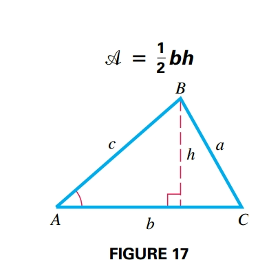

where $b$ is the base and $h$ is the height, that can be computed as follows:

$$
\begin{aligned}
\sin A = \frac{h}{c} \leftrightarrow h = c \sin A
\end{aligned}
$$

Therefore:

$$
\begin{aligned}
\mathcal{A} = \frac{1}{2}bh = \frac{1}{2}bc \sin A
\end{aligned}
$$

Since the labels for the vertices in triangle ABC could be rearranged, other area formulas can be written:

$$
\begin{aligned}
\mathcal{A} = \frac{1}{2}ab \sin C
\end{aligned}
$$

$$
\begin{aligned}
\mathcal{A} = \frac{1}{2}ac \sin B
\end{aligned}
$$

## Vectors and Their Applications

### Basic Terminology

**Vector quantitites** are defined by their magnitude and their direction. They are represented by a directed line segment, called a **vector**, whose length represents the magnitude.

When two letters (i.e. OP) name a vector, the first indicates the initial point, while the second one indicates the terminal point. The magnitude of a vector $\textbf{OP}$ is written $|\textbf{OP}|$

Two vectors are equal if and only if they both have the same direction and the same magnitude.

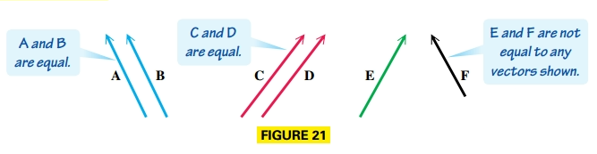

The sum of two vectors is also a vector. There are two ways to geometrically find the sum of two vectors $\textbf{A}$ and $\textbf{B}$.

1. Place the initial point of vector $\textbf{B}$ at the terminal point of vector $\textbf{A}$ (Figure 22). The vector with the same initial point as $\textbf{A}$ and the same terminal point as $\textbf{B}$ is the sum $\textbf{A} + \textbf{B}$

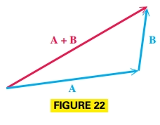

2. Use the **parallelogram rule**. Place vectors $\textbf{A}$ and $\textbf{B}$ so that their initial points coincide (Figure 23). Then complete the parallelogram. The diagonal of the parallelogram with the same initial point as $\textbf{A}$ and $\textbf{B}$ is the sum $\textbf{A} + \textbf{B}$.

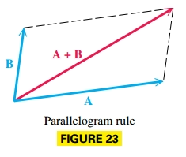

Vector addition is commutative.

For every vector $\textbf{v}$ there is a vector $-\textbf{v}$ that has the same magnitude as $\textbf{v}$ but opposite direction, and is called the opposite of $\textbf{v}$ (Figure 24). The sum of $\textbf{v}$ and $-\textbf{v}$ hsa magnitude $0$ and is called the **zero vector**.

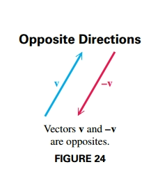

To substract vector $\textbf{B}$ from vector $\textbf{A}$ find the vector sum $\textbf{A} + (-\textbf{B})$ (Figure 25).

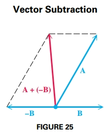

The product of a scalar $k$ and a vector $\textbf{u}$ is called **scalar multiplication**. The vector $k\textbf{u}$ has magnitude $k|\textbf{u}|$. The vector $k\textbf{u}$ has the same direction as $\textbf{u}$ if $k > 0$ and opposite direction if $k < 0$ (Figure 26).

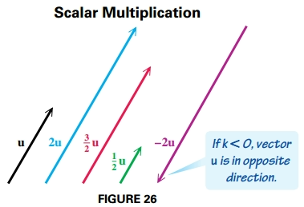

### Interpretation of Vectors

A vector with its initial point at the origin in a rectrangular coordinate system is called a **position vector**. The position vector $\textbf{u}$ with its endpoint at the point $(a, b)$ is written $\langle a, b \rangle$. Every vector in the real plane corresponds to an ordered pair of real numbers. Geometrically a vector is a directed line segment and algebraically it is an ordered pair, where $a$ is the horizontal component and $b$ is the vertical component of vector $\textbf{u}$.

Figure 27 shows the vector $\textbf{u} = \langle a, b \rangle$. The positive angle between the x-axis and the position vector is called the **direction angle** of the vector.

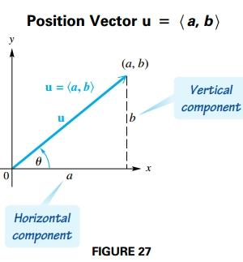

The maginutde of vector $\textbf{u} = \langle a, b \rangle$ is given by:

$$
\begin{aligned}
|\textbf{u}| = \sqrt{a^2 + b^2}
\end{aligned}
$$

The direction angle $\theta$ satisfies $\tan \theta = \frac{b}{a}$ where $a \neq 0$.

A vector $\textbf{u}$ with magnitude $|\textbf{u}|$ and direction angle $\theta$ has as horizontal component:

$$
\begin{aligned}
a = |\textbf{u}| \cos \theta
\end{aligned}
$$

and as vertical component:

$$
\begin{aligned}
b = |\textbf{u}| \sin \theta
\end{aligned}
$$

Therefore $\textbf{u} = \langle a, b \rangle = \langle |\textbf{u}| \cos \theta, |\textbf{u}| \sin \theta \rangle$

### Properties of Parallelograms

1. A parallelogram is quadrilateral whose opposite sides are parallel
2. The opposite sides and opposite angles of a parallelogram are equal, and adjacent angles of a parallelogram are supplementary.
3. The diagonals of a parallelogram bisect each other, but do not necessarily bisec the angles of the parallelogram.

### Vector Operations

Let $a, b, c, d$ and $k$ be real numbers:

$$
\begin{aligned}
\langle a, b \rangle + \langle c, d \rangle = \langle a + c, b + d \rangle
\end{aligned}
$$

$$
\begin{aligned}
k\langle a, b \rangle = \langle ka, kb \rangle
\end{aligned}
$$

$$
\begin{aligned}
\langle a, b \rangle - \langle c, d \rangle= \langle a, b \rangle + -\langle c, d \rangle = \langle a - c, b - d \rangle
\end{aligned}
$$

A **unit vector** is a vector that has magnitude $1$. Two important unit vectors are:

$$
\begin{aligned}
\textbf{i} = \langle 1, 0 \rangle
\end{aligned}
$$

$$
\begin{aligned}
\textbf{j} = \langle 0, 1 \rangle
\end{aligned}
$$

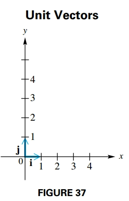

### Vector Notation Using $i$ and $j$

If $\textbf{v} = \langle a, b \rangle$ then $\textbf{v} = a \textbf{i} + b \textbf{j}$

### Dot Product and the Angle between Vectors

The dot product (or inner product) of two vectors $\textbf{u} = \langle a, b \rangle$ and $\textbf{v} = \langle c, d \rangle$ id denoted as $\textbf{u} \cdot \textbf{v}$ and given by the following:

$$
\begin{aligned}
\textbf{u} \cdot \textbf{v} = ac + bd
\end{aligned}
$$

#### Properties of the Dot Product

For all vectors $\textbf{u}$, $\textbf{v}$ and $\textbf{w}$ and real numbers $k$ the following hold:

1. $\textbf{u} \cdot \textbf{v} = \textbf{v} \cdot \textbf{u}$
2. $\textbf{u} \cdot (\textbf{v} + \textbf{w}) = \textbf{u} \cdot \textbf{v} + \textbf{u} \cdot \textbf{w}$
3. $(\textbf{u} + \textbf{v}) \cdot \textbf{w} = \textbf{u} \cdot \textbf{w} + \textbf{v} \cdot \textbf{w}$
4. $(k \textbf{u}) \cdot \textbf{v} = k(\textbf{u} \cdot \textbf{v}) = \textbf{u} \cdot (k \textbf{v})$
5. $0 \cdot \textbf{u} = 0$
6. $\textbf{u} \cdot \textbf{u} = |\textbf{u}|^2$

The dot product of two vectors can be **positive**, $0$ or **negative** based on the angle between them.

If $\textbf{a} \cdot \textbf{b} = 0$ for two nonzero vectors $\textbf{a}$ and $\textbf{b}$, then $\cos \theta = 0$ and $\theta = 90º$. Thus $\textbf{a}$ and $\textbf{b}$ are perpendiular or orthogonal vectors (Figure 40).

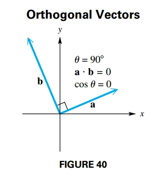

#### Geometric Interpretation of the Dot Product

If $\theta$ is the angle between the two nonzero vectors $\textbf{u}$ and $\textbf{v}$, where $0º \leq \theta \leq 180º$ then the following holds:

$$
\begin{aligned}
\textbf{u} \cdot \textbf{v} = |\textbf{u}||\textbf{v}| \cos \theta
\end{aligned}
$$

or equivalently

$$
\begin{aligned}
\cos \theta = \frac{\textbf{u}\textbf{v}}{|\textbf{u}||\textbf{v}|}
\end{aligned}
$$

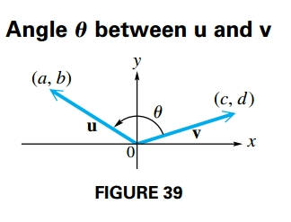

For angles $\theta$ between $0º$ and $180º$, the following table shows the relationship between $\cos \theta$, the dot product and $\theta$.

| $\cos \theta$ | Dot Product | Angle $\theta$ between Vectors |
| Positive | Positive | Acute |
| $0$ | $0$ | Right |
| Negative | Negative | Obtuse |

## Trigonometric (Polar) Form of Complex Numbers

### The Complex Plane and Vector Representation

To graph a complex number we modify the rectangular coordinate system by calling the horizontal axis the **real axis** and the vertical axis the **imaginary axis**, such that we obtain the **complex plane** (Figure 46).

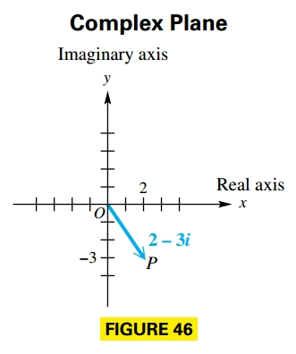

Each complex number $a + bi$ determines a unique position vector $\textbf{OP}$ with initial point $(0, 0)$ and terminal point $(a, b)$.

### Trigonometric (Polar) Form

The next figure shows the complex number $x + yi$ that corresponds to a vector $\textbf{OP}$ with direction angle $\theta$ and magnitude $r$, such that:

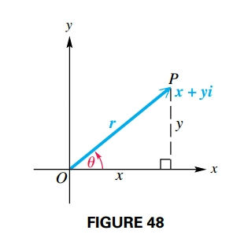

$$
\begin{aligned}
x = r \cos \theta
\end{aligned}
$$

$$
\begin{aligned}
y = r \sin \theta
\end{aligned}
$$

$$
\begin{aligned}
r = \sqrt{x^2 + y^2}
\end{aligned}
$$

$$
\begin{aligned}
\tan \theta = \frac{y}{x}, x \neq 0
\end{aligned}
$$

If we substitute $x = r \cos \theta$ and $y = r \sin \theta$ into $x + yi$ it gives:

$$
\begin{aligned}
x + yi = r \cos \theta + r \sin \theta i
\end{aligned}
$$

$$
\begin{aligned}
= r (\cos \theta + i \sin \theta)
\end{aligned}
$$

This is called the **trigonometric form** (or **polar form**) of the complex number $x + yi$.

The expression $\cos \theta + i \sin \theta$ is sometimes abbreviated $\text{cis} \theta$, therefore $r(\cos \theta + i \sin \theta) = r \text{cis} \theta$

The number $r$ is the **modulus** or **absolute value** of $x + yi$ and $\theta$ is the **argument** of $x + yi$.

#### Converting from Rectangular to Trigonometric Form

1. Sketch a graph of the number $x + yi$ in the complex plane.
2. Find $r$ by using the equation $r = \sqrt{x^2 + y^2}$.
3. Find $\theta$ by using th equation $\tan \theta = \frac{y}{x}, x \neq 0$ choosing the quadrant indicated in (1).

A **fractal** is a geometric figure with an endless self-similarity property. A fractal image repeats itself infinitely with ever decreasing dimensions.

### Produc Theorem

Given two complex number $x + yi$ and $a + bi$ such that their trigonometric form is given by:

$$
\begin{aligned}
x + yi = r(\cos \theta + i \sin \theta)
\end{aligned}
$$

and

$$
\begin{aligned}
a + bi = n(\cos \phi + i \sin \phi)
\end{aligned}
$$

If we multiply their trigonometric forms we obtain:

$$
\begin{aligned}
[r(\cos \theta + i \sin \theta)][n(\cos \phi + i \sin \phi)]
\end{aligned}
$$

$$
\begin{aligned}
= r \cdot n (\cos \theta + i \sin \theta)(\cos \phi + i \sin \phi)
\end{aligned}
$$

$$
\begin{aligned}
= r \cdot n (\cos \theta \cdot \cos \phi + i \sin \theta \cdot \cos \phi + \cos \theta \cdot i \sin \phi + i^2 \sin \theta \cdot \sin \phi)
\end{aligned}
$$

We know that $i^2 = -1$, and we factor out $i$.

$$
\begin{aligned}
= r \cdot n (\cos \theta \cdot \cos \phi + (-1) \sin \theta \cdot \sin \phi + i (\sin \theta \cdot \cos \phi + \cos \theta \cdot \sin \phi))
\end{aligned}
$$

$$
\begin{aligned}
= r \cdot n (\cos \theta \cdot \cos \phi - \sin \theta \cdot \sin \phi + i (\sin \theta \cdot \cos \phi + \cos \theta \cdot \sin \phi))
\end{aligned}
$$

Given $\cos \theta \cdot \cos \phi - \sin \theta \cdot \sin \phi = \cos (\theta + \phi)$ and $\sin \theta \cdot \cos \phi + \cos \theta \cdot \sin \phi = \sin (\theta + \phi)$

$$
\begin{aligned}
= r \cdot n (\cos (\theta + \phi) + i \sin (\theta + \phi))
\end{aligned}
$$

In compact form this is written:

$$
\begin{aligned}
= r \cdot n \text{cis} (\theta + \phi)
\end{aligned}
$$

### Quotient Theorem

Given two complex number $x + yi$ and $a + bi$ such that their trigonometric form is given by:

$$
\begin{aligned}
x + yi = r(\cos \theta + i \sin \theta)
\end{aligned}
$$

and

$$
\begin{aligned}
a + bi = n(\cos \phi + i \sin \phi)
\end{aligned}
$$

If we divide them we obtain:

$$
\begin{aligned}
\frac{x + yi}{a + bi} = \frac{(x + yi)(a - bi)}{(a + bi)(a - bi)}
\end{aligned}
$$

$$
\begin{aligned}
= \frac{ax + ayi - bxi -ybi^2}{a^2 - b^2i^2} = \frac{ax + ayi - bxi + yb}{a^2 + b^2}
\end{aligned}
$$

$$
\begin{aligned}
= \frac{a(x + yi) + b(y - xi)}{a^2 + b^2}
\end{aligned}
$$

If we substitute their trigonometric forms, knowing that $a = n \cdot \cos \phi$, $b = n \cdot \sin \phi$, $x = r \cdot \cos \theta$ and $y = r \cdot \sin \theta$, then

$$
\begin{aligned}
= \frac{(n \cdot \cos \phi)(r \cdot \cos \theta + i \cdot r \cdot \sin \theta) + (n \cdot \sin \phi)(r \cdot \sin \theta - i \cdot r \cdot \cos \theta)}{(n \cdot \cos \phi)^2 + (n \cdot \sin \phi)^2}
\end{aligned}
$$

We extract $n$ and $r$ as common factors and we expand the denominator:

$$
\begin{aligned}
= \frac{n \cdot r [\cos \phi \cdot (\cos \theta + i \cdot \sin \theta) + \sin \phi \cdot (\sin \theta - i \cdot \cos \theta)]}{n^2 (\cos^2 \phi + \sin^2 \phi)}
\end{aligned}
$$

We know that $\cos^2 x + \sin^2 x = 1$. We multiply the elements on the numerator:

$$
\begin{aligned}
= \frac{n \cdot r (\cos \phi \cdot \cos \theta + i \cdot \cos \phi \cdot \sin \theta + \sin \phi \cdot \sin \theta - i \sin \phi \cdot \cos \theta)}{n^2}
\end{aligned}
$$

We rearrange the elements on the numerator and extract $i$ as a common factor:

$$
\begin{aligned}
= \frac{n \cdot r [\cos \theta \cdot \cos \phi + \sin \theta \cdot \sin \phi + i \cdot (\sin \theta \cdot \cos \phi - \sin \phi \cdot \cos \theta)]}{n^2}
\end{aligned}
$$

Given that $\cos \theta \cdot \cos \theta + \sin \theta \cdot \sin \phi = \cos (\theta - \phi)$ and $\sin \theta \cdot \cos \phi - \sin \phi \cdot \cos \theta = \sin (\theta - \phi)$:

$$
\begin{aligned}
= \frac{n \cdot r (\cos (\theta - \phi) + i \cdot \sin (\theta - \phi))}{n^2}
\end{aligned}
$$

$$
\begin{aligned}
= \frac{r}{n} (\cos (\theta - \phi) + i \cdot \sin (\theta - \phi))
\end{aligned}
$$

In compact form this is written:

$$
\begin{aligned}
= \frac{r}{n} \text{cis} (\theta - \phi)
\end{aligned}
$$

## Power and Roots of Complex Numbers

### Powers of Complex Numbers (De Moivre’s Theorem)

Consider the following:

$$
\begin{aligned}
r(\cos \theta + i \sin \theta)^2 = [r(cos \theta + i \sin \theta)][r(cos \theta + i \sin \theta)]
\end{aligned}
$$

By the [complex number product theorem](#produc-theorem):

$$
\begin{aligned}
= r^2 [cos (\theta + \theta) + i \sin (\theta + \theta)]
\end{aligned}
$$

$$
\begin{aligned}
= r^2 (\cos 2\theta + i \sin 2 \theta)
\end{aligned}
$$

So by **De Moivre's Theorem**:

If $r(\cos \theta + i \sin \theta)$ is a complex number and $n$ is any positive integer, then the following holds:

$$
\begin{aligned}
[r(\cos \theta + i \sin \theta)]^n = r^n (\cos n\theta + i \sin n\theta)
\end{aligned}
$$

In compact form:

$$
\begin{aligned}
[r\text{ cis} \theta]^n = r^n \text{ cis } n\theta
\end{aligned}
$$

### Roots of Complex Numbers

For a positive integer $n$, the complex number $a + bi$ an $n$**th root** of the complex number $x + yi$ if the following holds:

$$
\begin{aligned}
(a + bi)^n = x + yi
\end{aligned}
$$

#### Finding the Roots of Complex Numbers

To find the three complex cube roots of $8(\cos 135º + i \sin 135º)$ we look for a comple number, $r(\cos \alpha + i \sin \alpha)$ that satisfies:

$$
\begin{aligned}
[r (\cos \alpha + i \sin \alpha)]^3 = 8(\cos 135º + i \sin 135º)
\end{aligned}
$$

Using De Moivre's theorem the expression becomes:

$r^3(\cos 3\alpha + i \sin 3\alpha) = 8(\cos 135º + i \sin 135º)$

The first condition implies:

$$
\begin{aligned}
r^3 = 8 \leftrightarrow r = 2
\end{aligned}
$$

The second condition implies:

$$
\begin{aligned}
\cos 3\alpha = \cos 135º
\end{aligned}
$$

$$
\begin{aligned}
\sin 3\alpha = \sin 135º
\end{aligned}
$$

Such that $3\alpha$ must represent an angle that is coterminal with $135º$, therefore:

$$
\begin{aligned}
3 \alpha = 135º + 360º k, k \in \mathbb{Z}
\end{aligned}
$$

$$
\begin{aligned}
\alpha = \frac{135º + 360º k}{3}, k \in \mathbb{Z}
\end{aligned}
$$

If we let $k$ take on integer values $0$, $1$ and $2$:

$$
\begin{aligned}
\text{If } k = 0 \text{, then } \alpha = 45º
\end{aligned}
$$

$$
\begin{aligned}
\text{If } k = 1 \text{, then } \alpha = 165º
\end{aligned}
$$

$$
\begin{aligned}
\text{If } k = 2 \text{, then } \alpha = 285º
\end{aligned}
$$

For $k > 2$ we obtain angles bigger than $365º$ that are coterminal with the identified solution. For example, for $k = 4$ we obtain $\alpha = 405º$ that is coterminal with $45º$.

This previous example represents the $n$**th Root Theorem** that says:

If $n$ is a positive integer, $r$ is a positive real number and $\theta$ is in degrees, then the nonzero complex number $r (\cos \theta + i \sin \theta)$ has exactly $n$ distinct $n$th roots, given by:

$$
\begin{aligned}
\sqrt[n]{r} (\cos \alpha + i \sin \alpha)
\end{aligned}
$$

$$
\begin{aligned}
\sqrt[n]{r} \text{ cis } \alpha
\end{aligned}
$$

where:

$$
\begin{aligned}
\alpha = \frac{\theta + 360º \cdot k}{n}, k = 0, 1, \cdots, n - 1
\end{aligned}
$$

If $\theta$ is in radians then:

$$
\begin{aligned}
\alpha = \frac{\theta + 2 \pi \cdot k}{n}, k = 0, 1, \cdots, n - 1
\end{aligned}
$$

## Polar Equations and Graphs

### Polar Coordinate System

The **polar coordinate system** is based on a point, called the **pole**, and a ray, called the **polar axis**. The polar axis is usually drawn in the direction of the positive x-axis. See FIGURE 56.

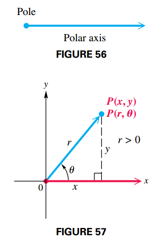

In FIGURE 57, the pole has been placed at the origin of a rectangular coordinate system. The point $P$ has rectangular coordinates $(x, y)$, directed angle $\theta$ and directed distance $r$. The ordered pair $(r, \theta)$ gives us the **polar coordinates**.

Figure 58 shows the rectangular axes over a **polar coordinate grid**.

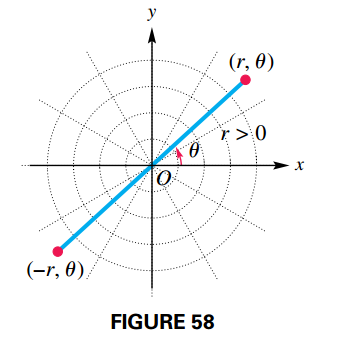

#### Relationships between Rectangular and Polar Coordinates

If a point has rectangular coordinates $(x, y)$ and polar coordinates $(r, \theta)$ then:

$$
\begin{aligned}
x = r \cos \theta
\end{aligned}
$$

$$
\begin{aligned}
y = r \sin \theta
\end{aligned}
$$

$$
\begin{aligned}
r^2 = x^2 + y^2
\end{aligned}
$$

$$
\begin{aligned}
\tan \theta = \frac{y}{x}, x \neq 0
\end{aligned}
$$

Note that a point in the plane can only have one pair of rectangular coordinates, however this same point can have infinitely many pairs of polar coordinates. For example $(2, 30º) = (2, 390º) = (2, -330º) = (-2, 210º) = \cdots$ (see Figure 62).

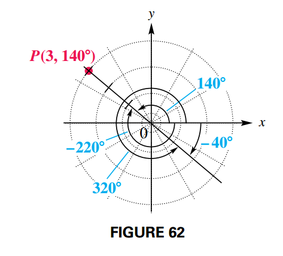

### Graph of Polar Equations

Equations in $x$ and $y$ are called **rectangluar** (or **Cartesian**) equations, so equations in $r$ and $\theta$ are called **polar equations**.

$$
\begin{aligned}
r = 3 \sin \theta
\end{aligned}
$$

The rectangular forms of lines and circles can also be defined in terms of polar coordinates, usually obtained by solving for $r$. For a line:

$$
\begin{aligned}
ax + by = c
\end{aligned}
$$

$$
\begin{aligned}
a(r \cos \theta) + b(r \sin \theta) = c
\end{aligned}
$$

$$
\begin{aligned}
r(a \cos \theta + b \sin \theta) = c
\end{aligned}
$$

$$
\begin{aligned}
r = \frac{c}{a \cos \theta + b \sin \theta}
\end{aligned}
$$

For a circle:

$$
\begin{aligned}
x^2 + y^2 = a^2
\end{aligned}
$$

$$
\begin{aligned}
r^2 = a^2
\end{aligned}
$$

$$
\begin{aligned}
r = \pm \sqrt{a^2} = \pm a
\end{aligned}
$$

### Classifying Polar Equations

The table summarizes common polar graphs and forms of their equations.

#### Circles

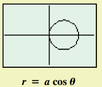

$$
\begin{aligned}
r = a \cos \theta
\end{aligned}
$$

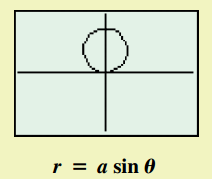

$$
\begin{aligned}
r = a \sin \theta
\end{aligned}
$$

#### Lemniscates

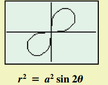

$$
\begin{aligned}
r^2 = a^2 \sin 2 \theta
\end{aligned}
$$

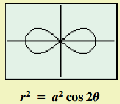

$$
\begin{aligned}
r^2 = a^2 \cos 2 \theta
\end{aligned}
$$

#### Limaçons

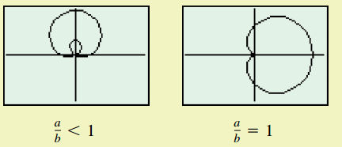

$$
\begin{aligned}
r = a \pm b \sin \theta
\end{aligned}
$$

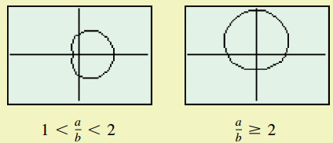

$$
\begin{aligned}
r = a \pm b \cos \theta
\end{aligned}
$$

#### Rose Curves

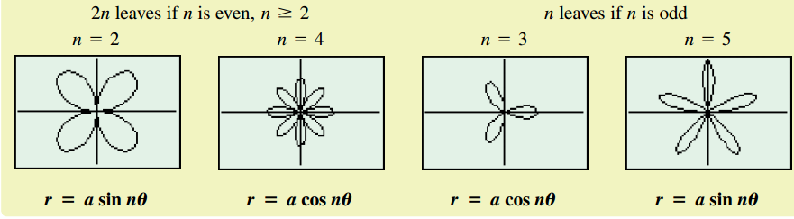

## More Parametric Equations

### Parametric Equations with Trigonometric Functions

If we use trigonometric functions in parametric equations, many interesting curves can be drawn as shown in the following figure:

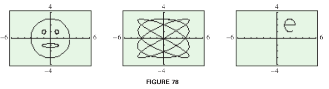

### The Cycloid

The path traced by a fixed point on the circumference of a circle rolling along a line is called a cycloid. A cycloid is defined by:

$$
\begin{aligned}
x = at - a \sin t
\end{aligned}
$$

$$
\begin{aligned}
y = a - a \cos t
\end{aligned}
$$

For $t$ in $(-\infty, \infty)$.

It has an interesting physical property. If a flexible cord goes through points $P$ and $Q$, due to the force of gravity, a bead slides without friction along this path from $P$ to $Q$. The path that requires least time takes the shape of an inverted cycloid.

### Applications of Parametric Equations

Parametric equations are used to simulate motion. If a ball is thrown with an initial velocidy of $v_0$ at an angle $\theta$ with the horizontal, it position $(x, y)$ can be modeled by the parametric equations:

$$
\begin{aligned}
x = (v_0 \cos \theta)t
\end{aligned}
$$

$$
\begin{aligned}
y = (v_0 \sin \theta)t - 16t^2 + h
\end{aligned}
$$

where $t$ is in seconds and $h$ is the ball's initial height above the ground.

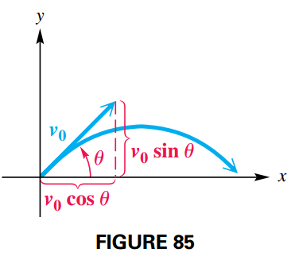
