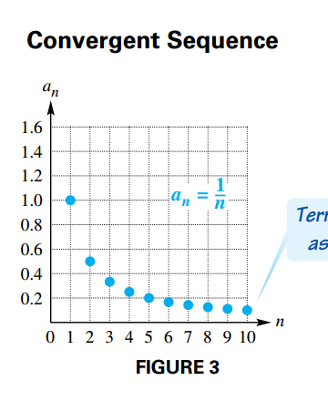
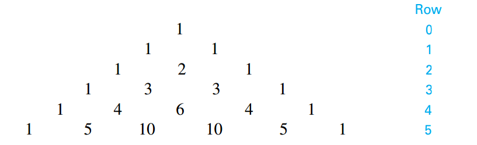
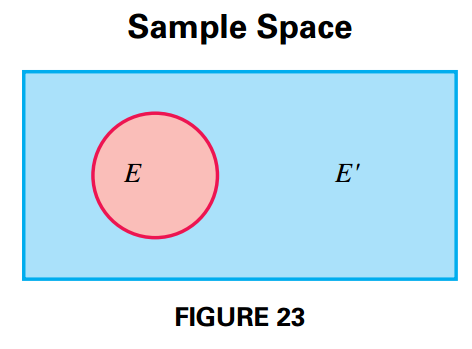

## Sequences and Series

### Sequences

A **sequence** is a function that has a set of natural numbers as its domain.

Instead of using a funcion notation to indicate a sequence $f$, we use $a_n$, where $a_n = f(n)$.

The elements in the range of a sequence are called the **terms** of the sequence, and they are ordered.

The **general term** of the $n$th term of the sequence is $a_n$.

A sequence is a **finite sequence** if the domain is a finite set $\{1, 2, 3, 4, \cdots, n\}$, where $n$ is a natural number. An **infinite sequence** has the set of a ll natural numbers as its domain.

If the terms of an infinite sequence get closer to some real number, the sequence is said to be **convergent** and to **converge** to that real number (see Figure 3). A sequence that does not converte to some number is **divergent**.

Some sequences are defined by a **recursive definition**, a definition in which each term is defined as an expression involving the previous term or terms.

### Series

The sum of the terms of a sequence is called a **series**.

A **finite series** is an expression of the form:

$$
\begin{aligned}
S_n = a_1 + a_2 + a_3 + \cdots + a_n = \sum_{i=1}^n a_i
\end{aligned}
$$

An **infinite series** is an expression of the form:

$$
\begin{aligned}
S_{\infty} = a_1 + a_2 + a_3 + \cdots + a_n  + \cdots = \sum_{i=1}^{\infty} a_i
\end{aligned}
$$

### Summation Properties

If $a_1, a_2, a_3, \cdots, a_n$ and $b_1, b_2, b_3, \cdots, b_n$ are two sequences, and $c$ is a constante, then for every positive integer $n$, the following hold:

$$
\begin{aligned}
\sum_{i=1}^n c = n c
\end{aligned}
$$

$$
\begin{aligned}
\sum_{i=1}^n ca_i = c \sum_{i=1}^n a_i
\end{aligned}
$$

$$
\begin{aligned}
\sum_{i=1}^n (a_i + b_i) = \sum_{i=1}^n a_i + \sum_{i=1}^n b_i
\end{aligned}
$$

$$
\begin{aligned}
\sum_{i=1}^n (a_i - b_i) = \sum_{i=1}^n a_i - \sum_{i=1}^n b_i
\end{aligned}
$$

### Summation Rules

$$
\begin{aligned}
\sum_{i=1}^n i = 1 + 2 + \cdots + n = \frac{n(n + 1)}{2}
\end{aligned}
$$

$$
\begin{aligned}
\sum_{i=1}^n i^2 = 1^2 + 2^2 + \cdots + n^2 = \frac{n(n + 1)(2n + 1)}{6}
\end{aligned}
$$

$$
\begin{aligned}
\sum_{i=1}^n i^3 = 1^3 + 2^3 + \cdots + n^3 = \frac{n^2(n + 1)^2}{4}
\end{aligned}
$$

## Arithmetic Sequences and Series

### Arithmetic Sequences

A sequence in which each term after the first is obtained by adding a fixed number, the **common difference** $d$, to a previous term is an **arithmetic sequence** (or **arithmetic progression**). The common difference is obtained as:

$$
\begin{aligned}
d = a_{n + 1} - a_n
\end{aligned}
$$

In an arithmetic sequence with first term $a_1$ and common difference $d$, the $n$th term is:

$$
\begin{aligned}
a_n = a_1 + (n - 1)d
\end{aligned}
$$

To obtain the graph for that sequence:

$$
\begin{aligned}
a_n = a_1 + (n - 1)d
\end{aligned}
$$

$$
\begin{aligned}
= a_1 + dn - d
\end{aligned}
$$

$$
\begin{aligned}
= dn + (a_1 - d)
\end{aligned}
$$

$$
\begin{aligned}
= dn + c
\end{aligned}
$$

where $c = a_1 - d$. Such that the points on the graph of an arithmetic sequence $f$ are defined by $f(n) = dn + c$. The following image shows such a graph:

### Arithmetic Series

The sum of the terms of an arithmetic sequence is an **arithmetic series**. To obtain the general formula for the arithmetic series we first write the sum of the first $n$ terms as:

$$
\begin{aligned}
S_n = a_1 + (a_1 + d) + (a_1 + 2d) + \cdots + (a_1 + (n - 1)d)
\end{aligned}
$$

Now we write the same sum in reverse order, beginnin with $a_n$ and substracting $d$:

$$
\begin{aligned}
S_n = a_n + (a_n - d) + (a_n - 2d) + \cdots + (a_n - (n - 1)d)
\end{aligned}
$$

Now we add both expressions:

$$
\begin{aligned}
2 S_n = (a_1 + a_n) + (a_1 + a_n) + \cdots + (a_1 + a_n)
\end{aligned}
$$

$$
\begin{aligned}
2 S_n = n(a_1 + a_n)
\end{aligned}
$$

$$
\begin{aligned}
S_n = \frac{n}{2}(a_1 + a_n)
\end{aligned}
$$

$$
\begin{aligned}
S_n = \frac{n}{2}(a_1 + a_1 + (n-1)d)
\end{aligned}
$$

$$
\begin{aligned}
S_n = \frac{n}{2}(2a_1 + (n-1)d)
\end{aligned}
$$

## Geometric Sequences and Series

### Geometric Sequences

A **geometric sequence** (or **geometric progression**) is a sequence in which each term after the first is obtained by multiplying the preceding term by a constant non-zero real number, called the **common ratio** $r$. That is:

$$
\begin{aligned}
r = \frac{a_{n+1}}{a_n}
\end{aligned}
$$

In a geometric sequence with first term $a_1$ and common ratio $r$, where neither of them are zero, then the $n$th term is:

$$
\begin{aligned}
a_n = a_1 r^{n-1}
\end{aligned}
$$

### Geometric Series

A **geometric series** is the sum of the terms of a geometric sequence. To find a formula of the sum $S_n$ first we write the sum as follows:

$$
\begin{aligned}
S_n = a_1 + a_2 + \cdots + a_n
\end{aligned}
$$

$$
\begin{aligned}
= a_1 + a_1 r + \cdots + a_1 r^{n-1}
\end{aligned}
$$

We multiply each side of the equation by $r$

$$
\begin{aligned}
rS_n = a_1r + a_1 r^2 + \cdots + a_1 r^{n}
\end{aligned}
$$

And now we substract these two equations:

$$
\begin{aligned}
S_n - rS_n = a_1 + (a_1r - a_1r) + (a_1 r^2 - a_1 r^2) + \cdots + (a_1 r^{n-1} - a_1 r^{n-1}) - a_1 r^{n}
\end{aligned}
$$

$$
\begin{aligned}
S_n - rS_n = a_1 - a_1 r^{n}
\end{aligned}
$$

$$
\begin{aligned}
S_n (1 - r) = a_1 - a_1 r^{n}
\end{aligned}
$$

$$
\begin{aligned}
S_n = \frac{a_1 - a_1 r^{n}}{1 - r}, r \neq 1
\end{aligned}
$$

#### Infinite Geometric Series

If a geometric sequence has first term $a_1$ and common ratio $r$, then:

$$
\begin{aligned}
S_n = \frac{a_1 - a_1 r^{n}}{1 - r}, r \neq 1
\end{aligned}
$$

$$
\begin{aligned}
S_n = \frac{a_1(1 - r^{n})}{1 - r}, r \neq 1
\end{aligned}
$$

If $|r| < 1$, then $\lim_{n \rightarrow \infty}r^n = 0$ and

$$
\begin{aligned}
\lim_{n \rightarrow \infty} S_n = \frac{a_1(1 - 0)}{1 - r} = \frac{a_1}{1 - r}
\end{aligned}
$$

The quotient $\frac{a_1}{1 - r}$ is called the **sum of the term of an infinite geometric sequence**. The limit $\lim_{n \rightarrow \infty} S_n$ can be expressed as $S_{\infty}$ or $\sum_{i=1}^{\infty} a_i$.

## Counting Theory

### Fundamental Principle of Counting

Two events are **independent events** if neither influences the outcome of the other.

If $n$ independent events take place, with:

$$
\begin{aligned}
\begin{matrix}
m_1 \text{ ways for event } 1 \text{ to occur}, \\
m_2 \text{ ways for event } 2 \text{ to occur}, \\
\cdot \\
\cdot \\
\cdot \\
m_n \text{ ways for event } n \text{ to occur}, \\
\end{matrix}
\end{aligned}
$$

then there are:

$$
\begin{aligned}
m_1 \times m_2 \times \cdots \times m_n
\end{aligned}
$$

different ways for all $n$ events to occur.

### n-Factorial

For any positive integer $n$:

$$
\begin{aligned}
n! = n(n-1)(n-2)\cdots (3)(2)(1)
\end{aligned}
$$

By definition $0! = 1$.

### Permutations

A **permutation** of $n$ elements taken $r$ at a time if one of the possible orderings of $r$ elements from a set of $n$ elements. The number of permutations of $r$ elements on a set of $n$ elements its denoted by $P(n, r)$ and is calculated as follows:

$$
\begin{aligned}
P(n, r) = n(n - 1)(n - 2)(n - r + 1)
\end{aligned}
$$

$$
\begin{aligned}
= \frac{n(n - 1)(n - 2)(n - r + 1)(n - r)(n - r - 1) \cdots (2)(1)}{(n - r)(n - r - 1)\cdots (2)(1)}
\end{aligned}
$$

$$
\begin{aligned}
= \frac{n!}{(n - r)!}
\end{aligned}
$$

Altenative notations for $P(n, r)$ are $P^n_r$ and $_{n}P_{r}$.

### Combinations

A subset of items selected without regard to order is called a **combination**.

To evaluate $C(n, r)$, we start with the number of permutations, given by $P(n, r)$. To get rid of the repeat orderings we divide by $r!$ (the number of ways to oder the subset of $r$ elements). Such that the number of combinations of $n$ elements taken $r$ at a time is obtained as:

$$
\begin{aligned}
C(n, r) = \frac{P(n, r)}{r!}
\end{aligned}
$$

$$
\begin{aligned}
= \frac{n!}{(n - r)!r!}
\end{aligned}
$$

Altenative notations for $C(n, r)$ are $C^n_r$ and $_{n}C_{r}$.

## The Binomial Theorem

### Binomial Coefficient

Generalizing, we find that the coefficient for the term of the expansion of $(x + y)^n$ in which the variable part is $x^ry^{n -r}$, where $r \leq n$ is:

$$
\begin{aligned}
\binom{n}{r} = \frac{n!}{r!(n - r)!}
\end{aligned}
$$

which is equivalent to $C(n ,r)$. This number is called the **binomial coefficient** and is often written as $\binom{n}{r}$.

### Pascal's Triangle

If we only write the coffiencients for the expansion of $(x + y)^n$ we obtain the following pattern:

Such that each number in the triangle is the sum of the two numbers directly above it. This triangular array of numbers is called **Pascal's Triangle**.

### The Binomial Theorem

Our observations about the expansion of $(x + y)^n$ are summarized as follows:

- There are $n + 1$ terms in the expansion.
- The first term is $x^n$ and the last term is $y^n$
- In each term, the exponent on $x$ decreases by $1$, and the exponent on $y$ increases by $1$.
- The sum of the exponents on $x$ and $y$ in any term is $n$
- The coefficient of the term with $x^ry^{n - r}$ o $x^{n - r}y^r$ is $\binom{n}{r}$

From these observations the **binomial theorem** is derived:

For any positive integer $n$:

$$
\begin{aligned}
(x + y)^n = x^n + \binom{n}{1} x^{n-1}y + \binom{n}{2}x^{n-2}y^2 + \cdots + \binom{n}{r}x^{n - r}y^r + \cdots + \binom{n}{n - 1}xy^{n - 1} + y^n
\end{aligned}
$$

$$
\begin{aligned}
(x + y)^n = \sum_{r=0}^n \binom{n}{r}x^{n - r}y^r
\end{aligned}
$$

### rth Term of a Binomial Expansion

The $r$th term of the binomial expansion of $(x + y)^n$, where $n \geq r - 1$ is:

$$
\begin{aligned}
\binom{n}{r - 1} x^{n - (r - 1)} y^{r - 1}
\end{aligned}
$$

## Mathematical Induction

### Principle of Mathematical Induction

Let $S_n$ be a statement concerning the positive integer $n$. Suppose that both of the following hold:

1. $S_1$ is true.
2. For any positive integer $k$, $k \leq n$ if $S_k$ is true, then $S_{k+1}$ is also true.

Then $S_n$ is true for every positive integer $n$.

### Method of Proof by Mathematical Induction

1. Prove that the statement is true for $n = 1$.
2. Show that for any positive integer $k$, if $S_k$ is true then $S_{k+1}$ is also true.

### Generalized Principle of Mathematical Induction

Let $S_n$ be a statement concerning the positive integer $n$. Let $j$ be a fixed positive integer. Suppose that both of the following hold.

1. $S_j$ is true.
2. For any positive integer $k$, $k \geq j$, $S_k$ implies $S_{k+1}$

Then $S_n$ is true for all positive integers $n$, where $n \geq j$.

### Proof of the Binomial Theorem

The binomial theorem can be proved by mathematical induction. That is, for any positive integer $n$ and any numbers $x$ and $y$,

$$
\begin{aligned}
(x + y)^n = x^n + \binom{n}{1} x^{n-1}y + \binom{n}{2} x^{n-2}y^2 + \cdots + \binom{n}{r} x^{n - r}y^r + \cdots + \binom{n}{n-1}xy^{n-1} + y^n
\end{aligned}
$$

**Proof** Let $S_n$ be the previous statement. Begin by verifying $S_n$ for $n = 1$.

$$
\begin{aligned}
(x + y)^{n=1} = x + y = \binom{1}{0}x^1y^0 + \binom{1}{1} x^0y^1
\end{aligned}
$$

Now we assume $S_k$, such that:

$$
\begin{aligned}
(x + y)^k = x^k + \frac{k!}{1!(k - 1)!} x^{k-1}y + \frac{k!}{2!(k - 2)!} x^{k-2}y^2 + \cdots + \frac{k!}{r!(k - r)!} x^{k - r}y^r + \cdots + \frac{k!}{(k - 1)!1!}xy^{k-1} + y^k
\end{aligned}
$$

We multiply the left side by $(x + y)$:

$$
\begin{aligned}
(x + y)(x + y)^k = x(x + y)^k + y(x + y)^k
\end{aligned}
$$

And we apply $S_k$

$$
\begin{aligned}
x(x + y)^k + y(x + y)^k = x\left[x^k + \frac{k!}{1!(k - 1)!} x^{k-1}y + \frac{k!}{2!(k - 2)!} x^{k-2}y^2 + \cdots + \frac{k!}{r!(k - r)!} x^{k - r}y^r + \cdots + \frac{k!}{(k - 1)!1!}xy^{k-1} + y^k\right] + y \left[x^k + \frac{k!}{1!(k - 1)!} x^{k-1}y + \frac{k!}{2!(k - 2)!} x^{k-2}y^2 + \cdots + \frac{k!}{r!(k - r)!} x^{k - r}y^r + \cdots + \frac{k!}{(k - 1)!1!}xy^{k-1} + y^k\right]
\end{aligned}
$$

$$
\begin{aligned}
= \left[x^{k + 1} + \frac{k!}{1!(k - 1)!} x^{k}y + \frac{k!}{2!(k - 2)!} x^{k-1}y^2 + \cdots + \frac{k!}{r!(k - r)!} x^{k - r + 1}y^r + \cdots + \frac{k!}{(k - 1)!1!}x^2y^{k-1} + xy^k\right] + \left[yx^k + \frac{k!}{1!(k - 1)!} x^{k-1}y^2 + \frac{k!}{2!(k - 2)!} x^{k-2}y^3 + \cdots + \frac{k!}{r!(k - r)!} x^{k - r}y^{r + 1} + \cdots + \frac{k!}{(k - 1)!1!}xy^{k} + y^{k+1}\right]
\end{aligned}
$$

Now we group the elements with the same terms:

$$
\begin{aligned}
= x^{k+1} + \left[\frac{k!}{1!(k - 1)!} x^{k}y + \frac{k!}{0!k!} yx^k \right] + \left[\frac{k!}{2!(k - 2)!} x^{k-1}y^2 + \frac{k!}{1!(k - 1)!} x^{k-1}y^2 \right] + \cdots + \left[\frac{k!}{r!(k - r)!} x^{(k - r) + 1}y^r +  \frac{k!}{(r - 1)!(k - (r - 1))!}x^{(k - r) + 1}y^{r} \right] + \cdots + y^{k + 1}
\end{aligned}
$$

We first show that:

$$
\begin{aligned}
\frac{k!}{r!(k - r)!} + \frac{k!}{(r + 1)!(k - (r + 1))!} = \binom{k + 1}{r + 1}
\end{aligned}
$$

By the definition of the factorial of a number:

$$
\begin{aligned}
= \frac{k (k - 1) (k - 2) \cdots (k - r) \cdots 1}{(r + 1)!(k - r - 1)!} + \frac{k (k - 1) (k - 2) \cdots (k - r + 1) \cdots 1}{r!(k - r)!}
\end{aligned}
$$

$$
\begin{aligned}
= \frac{k (k - 1) (k - 2) \cdots (k - r)}{(r + 1)!} + \frac{k (k - 1) (k - 2) \cdots (k - r - 1)}{r!}
\end{aligned}
$$

$$
\begin{aligned}
= \frac{k (k - 1) (k - 2) \cdots (k - r)}{(r + 1)!} + (r + 1)\frac{k (k - 1) (k - 2) \cdots (k - r + 1)}{(r + 1)!}
\end{aligned}
$$

$$
\begin{aligned}
= \frac{k(k - 1)(k - 2) \cdots (k - r - 1) \left[(k - r) + (r + 1)\right]}{(r + 1)!}
\end{aligned}
$$

$$
\begin{aligned}
= \frac{k(k - 1)(k - 2) \cdots (k - r - 1) \left[k + 1\right]}{(r + 1)!}
\end{aligned}
$$

$$
\begin{aligned}
= \frac{(k + 1)k(k - 1)(k - 2) \cdots (k - r - 1)}{(r + 1)!}
\end{aligned}
$$

$$
\begin{aligned}
= \frac{(k + 1)k(k - 1)(k - 2) \cdots (k - r - 1) \cdots 1}{(r + 1)!(k - r)!}
\end{aligned}
$$

$$
\begin{aligned}
= \frac{(k + 1)!}{(r + 1)!((k + 1) - (r + 1))!}
\end{aligned}
$$

$$
\begin{aligned}
= \binom{k + 1}{r + 1}
\end{aligned}
$$

So now:

$$
\begin{aligned}
= x^{k+1} + \left[\frac{k!}{1!(k - 1)!} + \frac{k!}{0!k!}\right] x^{k}y + \left[\frac{k!}{2!(k - 2)!} + \frac{k!}{1!(k - 1)!} \right] x^{k-1}y^2 + \cdots + \left[\frac{k!}{r!(k - r)!} + \frac{k!}{(r - 1)!(k - (r - 1))!} \right] x^{(k - r) + 1} y^r + \cdots + y^{k + 1}
\end{aligned}
$$

By the previous proof $\frac{k!}{r!(k - r)!} + \frac{k!}{(r + 1)!(k - (r + 1))!} = \binom{k + 1}{r + 1}$, therefore:

$$
\begin{aligned}
= x^{k+1} + \binom{k + 1}{1} x^{k}y + \binom{k + 1}{2} x^{k-1}y^2 + \cdots + \binom{k + 1}{r!} x^{(k - r) + 1} y^r + \cdots + y^{k + 1}
\end{aligned}
$$

$$
\begin{aligned}
= x^{k+1} + \binom{k + 1}{1} x^{(k + 1) - 1}y + \binom{k + 1}{2} x^{(k + 1) - 2}y^2 + \cdots + \binom{k + 1}{r} x^{(k + 1) - r} y^r + \cdots + y^{k + 1}
\end{aligned}
$$

$$
\begin{aligned}
= \sum_{r = 0}^{k + 1} \binom{k + 1}{r}x^{(k + 1) - r}y^r
\end{aligned}
$$

## Probability

### Basic Concepts

Given an experiment that has one or more **outcomes** that are equally likely to occur. Then the set $S$ of all possible outcomes of a given experiment is called the **sample space** for the experiment. For example, the sample space for the experiment of tossing a consists of the outcomes $H$ (heads) and $T$ (tails). This can be written in set notation as:

$$
\begin{aligned}
S = \{H, T\}
\end{aligned}
$$

Any subset of the sample space is called an **event**. To represent the number of outcomes that belong to event $E$ we use the notation $n(E)$.

The notation $P(E)$ is used for the probability of an event $E$.

#### Probability of Event E

In a sample space with equally likely outcomes, the **probability** of an event $E$, written $P(E)$ is given by:

$$
\begin{aligned}
P(E) = \frac{n(E)}{n(S)}
\end{aligned}
$$

where $n(E)$ is the number of outcomes in sample space $S$ that belong to event $E$, and $n(S)$ is the total number of outcomes in sample space $S$.

### Complements and Venn Diagrams

The set of all outcomes in the sample space that do not belong to event $E$ is called the **complement** of $E$, written $E'$. By definition:

$$
\begin{aligned}
E \cup E' = S
\end{aligned}
$$

$$
\begin{aligned}
E \cap E' = \emptyset
\end{aligned}
$$

Probability concepts can be illustrated using **Venn Diagrams**, as shown in FIGURE 23.

### Odds

The **odds** in favor of an event $E$ are expressed as the ratio of $P(E)$ to $P(E')$, or as the fraction $\frac{P(E)}{P(E')}$.

If the odds favoring event $E$ are $m$ to $n$, then:

$$
\begin{aligned}
P(E) = \frac{m}{m + n}
\end{aligned}
$$

and

$$
\begin{aligned}
P(E') = \frac{n}{m + n}
\end{aligned}
$$

### Union of Two Events

Two events $H$ and $K$ that cannot occur simultaneously are said to be **mutually exclusive**, therefore $H \cap K = \emptyset$ is always true. This suggests the following proprety:

For any events $E$ and $F$:

$$
\begin{aligned}
P(E \text{ or } F) = P(E \cup F) = P(E) + P(F) - P(E \cap F)
\end{aligned}
$$

### Properties of Probability

For any events $E$ and $F$ the following hold:

1. $0 \leq P(E) \leq 1$
2. $P(\text{a certain event}) = 1$
3. $P(\text{an impossible event}) = 0$
4. $P(E') = 1 - P(E)$
5. $P(E \text{ or } F) = P(E \cup F) = P(E) + P(F) - P(E \cap F)$

### Binomial Probability

An experiment that consists of repeated independent trials, which only has two outcomes (success and failure) is called a **binomial experiment**.

Let the probability of success in one trial be $p$, such that the probability of failure becomes $1 - p$. Then the probability of $r$ successes in $n$ trials is:

$$
\begin{aligned}
\binom{n}{r} p^r (1 - p)^r
\end{aligned}
$$
