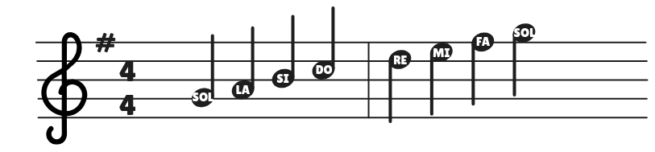
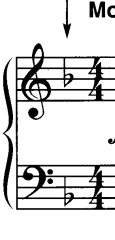
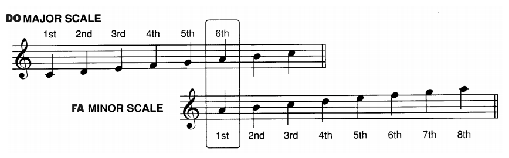
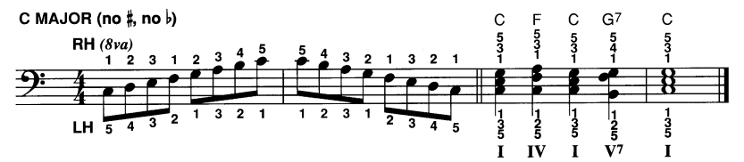
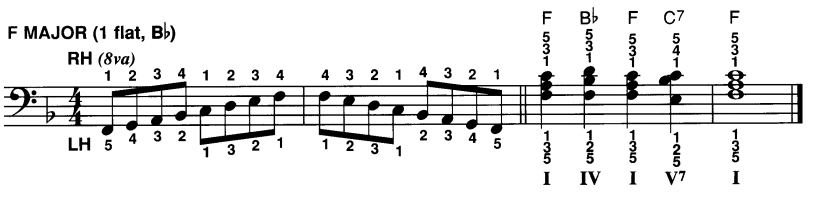
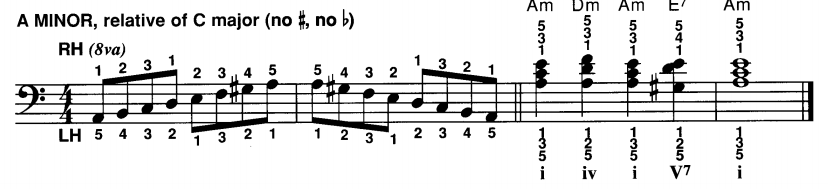
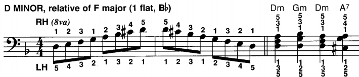

## Major Keys

### Key of Sol Major

A piece based on the Sol major scale is in the **KEY OF Sol MAJOR**. Since fa is sharp in the Sol scale, every fa will be sharp in the key of Sol major. Instead of placing a sharp before every fa in the entire piece, the sharp is indicated at the beginning in the **KEY SIGNATURE**.

### Key of Fa Major

A piece based on the Fa Major Scale has the following key signature:

## Minor Keys

Every Major key has a relative minor key that has the same key signature.

The relative minor being on the 6th tone of the major scale.

### Relative Minor of Do Major: La Minor

The relative minor of Do Major is La Minor:

Because the key of Do Major and La Minor have the same key signature (no sharps and no flats) we say that they are relatives.

The minor scale shown above is called the **natural minor scale**.

### Relative Minor of Fa Major: Re Minor

The **Re Minor** is the relative of **Fa Major** and both keys have the same signature (1 flat: Si). Remember the relative minor beings on the **6th** tone of the major scale.

The minor scale shown above is the **natural minor** scale. That is, a scale that only uses the notes that are found in the relative major scale.

## Most Frequently Used Keys

### Major Keys

- **Do Major**

- **Sol Major**: 1 sharp on Fa.

- **Fa Major**: 1 flat on Si.

### Minor Keys (Harmonic Minors)

- **La Minor**: relative of Do Major.

- **Re Minor**: relative of Fa Major, 1 flat on Si.

