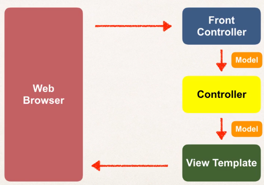

`Spring MVC` is a framework for building web applications in `Java` based on the Model-View-Controller design patter.



- The Front Controller is known as `DispatcherServlet`:
  - It is part of the Spring Framework
  - Pre-processes and delegates requests from the web browser to your controllers
- The MVC pattern is made up of:
  - Model objects: contains the data
  - View templates: UI of the app that displays data (most common templates: `JSP` + `JSLT`)
  - Controller classes: business logic (handle request, access db, etc.)

It includes the features of the Core Spring Framework (Inversion of Control and Dependency Injection)

## Configuration

### Configuration on `web.xml`

We have to add an entry for our Front Controller: `DispatcherServlet`

```xml
<?xml version="1.0" encoding="UTF-8"?>
<web-app xmlns:xsi="http://www.w3.org/2001/XMLSchema-instance"
	xmlns="http://xmlns.jcp.org/xml/ns/javaee"
	xsi:schemaLocation="http://xmlns.jcp.org/xml/ns/javaee http://xmlns.jcp.org/xml/ns/javaee/web-app_3_1.xsd"
	id="WebApp_ID" version="3.1">

	<display-name>spring-mvc-demo</display-name>

	<absolute-ordering />

	<!-- Step 1: Configure Spring MVC Dispatcher Servlet -->
	<servlet>
		<!-- Name to reference this servlet -->
		<servlet-name>dispatcher</servlet-name>
		<servlet-class>org.springframework.web.servlet.DispatcherServlet</servlet-class>
		<!-- File of configuration of spring application -->
		<init-param>
			<param-name>contextConfigLocation</param-name>
			<param-value>/WEB-INF/spring-mvc-demo-servlet.xml</param-value>
		</init-param>
		<load-on-startup>1</load-on-startup>
	</servlet>

	<!-- Step 2: Set up URL mapping for Spring MVC Dispatcher Servlet -->
	<servlet-mapping>
		<servlet-name>dispatcher</servlet-name>
		<!-- For any url that comes in pass it to the "dispatcher" servlet -->
		<url-pattern>/</url-pattern>
	</servlet-mapping>
</web-app>
```

### Configuration on `spring-mvc-demo-servlet.xml`

```xml
<?xml version="1.0" encoding="UTF-8"?>
<beans xmlns="http://www.springframework.org/schema/beans"
	xmlns:xsi="http://www.w3.org/2001/XMLSchema-instance"
	xmlns:context="http://www.springframework.org/schema/context"
	xmlns:mvc="http://www.springframework.org/schema/mvc"
	xsi:schemaLocation="
		http://www.springframework.org/schema/beans
    	http://www.springframework.org/schema/beans/spring-beans.xsd
    	http://www.springframework.org/schema/context
    	http://www.springframework.org/schema/context/spring-context.xsd
    	http://www.springframework.org/schema/mvc
        http://www.springframework.org/schema/mvc/spring-mvc.xsd">

	<!-- Step 3: Add support for component scanning -->
	<context:component-scan base-package="com.springdemo" />

	<!-- Step 4: Add support for conversion, formatting and validation support -->
	<mvc:annotation-driven/>

	<!-- Step 5: Define Spring MVC view resolver -->
	<bean
		class="org.springframework.web.servlet.view.InternalResourceViewResolver">
		<!-- Specify where to look for view files -->
		<property name="prefix" value="/WEB-INF/view/" />
		<property name="suffix" value=".jsp" />
	</bean>

</beans>
```

## Controller

### Create Controller Class

```java
package com.springdemo.mvc;

import org.springframework.stereotype.Controller;
import org.springframework.web.bind.annotation.RequestMapping;

// Add controller annotation
@Controller
public class HomeController {

    // Add request mapping: this method controls the request coming to this url
    @RequestMapping("/")
    public String showPage() {
      // Name of the view that is returned: note they are stored in WEB-INF/view/
        return "main-menu";
    }
}
```

Now, we can create the view. Inside `WEB-INF/view` we create a file `main-menu.jsp`:

```jsp
<!DOCTYPE>
<html>
  <body>
    <h2>Spring MVC Demo - Home Page</h2>
  </body>
</html>
```

## Read HTML Form Data

### Controller

```java
package com.springdemo.mvc;

import org.springframework.stereotype.Controller;
import org.springframework.web.bind.annotation.RequestMapping;

@Controller
public class HelloWorldController {

	// need a controller method to show the initial HTML form
	@RequestMapping("/showForm")
  // The method name can be anything
	public String showForm() {
		return "helloworld-form";
	}

	// need a controller method to process the HTML form
	@RequestMapping("/processForm")
	public String processForm() {
		return "helloworld";
	}

}
```

### View

We create `WEB-INF/view/helloworld-form.jsp`

```jsp
<!DOCTYPE html>
<html>
<head>
	<title>Hello World - Input Form</title>
</head>

<body>
  <!-- The action is the request url -->
	<form action="processForm" method="GET">
		<input type="text" name="studentName"
			placeholder="What's your name?" />
		<input type="submit" />
	</form>
</body>
</html>
```

And we create `WEB-INF/view/helloworld-form.jsp`

```jsp
<!DOCTYPE html>
<html>
<body>
  Hello World of Spring!
  <br><br>
  <!-- name of HTML form field from previous jsp view -->
  Student name: ${param.studentName}
</body>
</html>
```

## Model

### Example

#### Controller

```java
package com.springdemo.mvc;

import javax.servlet.http.HttpServletRequest;

import org.springframework.stereotype.Controller;
import org.springframework.ui.Model;
import org.springframework.web.bind.annotation.RequestMapping;

@Controller
public class HelloWorldController {

  // new a controller method to read form data and
  // add data to the model

  @RequestMapping("/processFormVersionTwo")
  // the HttpServletRequest allows you to retrieve information from the request (like the parameters of a form)
  // the model is our Model where we will store data
  public String parseString(HttpServletRequest request, Model model) {

    // read the request parameter from the HTML form
    String theName = request.getParameter("studentName");

    // convert the data to all caps
    theName = theName.toUpperCase();

    // create the message
    String result = "Yo! " + theName;

    // add message attribute to the model
    model.addAttribute("message", result);

    return "helloworld";
  }

}
```

#### View

Now, on the view, we can access the `Model` data:

```jsp
<!DOCTYPE html>
<html>
<body>
  Hello World of Spring!
  <br><br>
  Student name: ${param.studentName}
  <br><br>
  <!-- Access model data by the attribute's name-->
  The message: ${message}
</body>
</html>
```

## Add CSS and JS

Here are the steps on how to access static resources in a Spring MVC. For example, you can use this to access images, css, JavaScript files etc.

You can configure references to static resources in the spring-mvc-demo-servlet.xml.

- Add the following entry to your Spring MVC configuration file: `spring-mvc-demo-servlet.xml`

```xml
<mvc:resources mapping="/resources/**" location="/resources/"></mvc:resources>
```

- Now in your view pages, you can access the static files using this syntax:

```jsp

```

## Request Params and Request Mappings

### Request Params

Spring provides for a specific annotation that allows you to retrieve request parameters directly without using the `HttpServletRequest` object. Given the [form](<./Read HTML Form Data.md>):

```java
package com.springdemo.mvc;

import javax.servlet.http.HttpServletRequest;

import org.springframework.stereotype.Controller;
import org.springframework.ui.Model;
import org.springframework.web.bind.annotation.RequestMapping;
import org.springframework.web.bind.annotation.RequestParam;

@Controller
public class HelloWorldController {

    @RequestMapping("/processFormVersionThree")
    public String processFormVersionThree(
      // We use the annotation to obtain the parameter
            @RequestParam("studentName") String theName,
            Model model) {

        // convert the data to all caps
        theName = theName.toUpperCase();

        // create the message
        String result = "Hey My Friend from v3! " + theName;

        // add message to the model
        model.addAttribute("message", result);

        return "helloworld";
    }
}
```

### Controller Request Mappings

- They serve as a parent mapping for the controller
- All request mappings on methods in the controller are relative

For example:

```java
package com.springdemo.mvc;

import javax.servlet.http.HttpServletRequest;

import org.springframework.stereotype.Controller;
import org.springframework.ui.Model;
import org.springframework.web.bind.annotation.RequestMapping;
import org.springframework.web.bind.annotation.RequestParam;

@Controller
// This is the request mapping for the controller
@RequestMapping("/hello")
public class HelloWorldController {

    // Both of these request mappings are relative to the parent mapping
    // that is the mapping translates to domain/hello/showForm
    // need a controller method to show the initial HTML form
    @RequestMapping("/showForm")
    public String showForm() {
        return "helloworld-form";
    }

    // need a controller method to process the HTML form
    @RequestMapping("/processForm")
    public String processForm() {
        return "helloworld";
    }
}
```

## Forms





