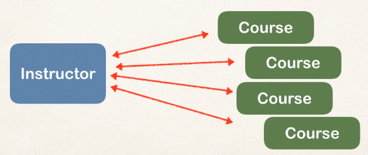

Is a framework for persisting/saving Java objects in a database

- Handles all of the low-level SQL
- Minimizes the amount `JDBC` code to develop
- Provides the Object-to-Relational Mapping (ORM):
  - The developer defines a mapping between a `Java` class and a database table


Hibernate uses `JDBC` for all database communications:


## Configure Hibernate with Annotations

### Add Hibernate Configuration File

We create the following `hibernate.cfg.xml` file:

```xml
<!DOCTYPE hibernate-configuration PUBLIC
        "-//Hibernate/Hibernate Configuration DTD 3.0//EN"
        "http://www.hibernate.org/dtd/hibernate-configuration-3.0.dtd">

<hibernate-configuration>

    <!-- A session factory allows us to get sessions objects to connect to the database -->
    <session-factory>

        <!-- JDBC Database connection settings -->
        <property name="connection.driver_class">com.mysql.cj.jdbc.Driver</property>
        <property name="connection.url">jdbc:mysql://localhost:3306/hb_student_tracker?useSSL=false&amp;serverTimezone=UTC</property>
        <property name="connection.username">hbstudent</property>
        <property name="connection.password">hbstudent</property>

        <!-- JDBC connection pool settings ... using built-in test pool -->
        <property name="connection.pool_size">1</property>

        <!-- Select our SQL dialect -->
        <property name="dialect">org.hibernate.dialect.MySQLDialect</property>

        <!-- Echo the SQL to stdout -->
        <property name="show_sql">true</property>

        <!-- Set the current session context -->
        <property name="current_session_context_class">thread</property>

    </session-factory>

</hibernate-configuration>
```

### Annotate Java Class

Hibernate deals with the concept of `Entity`, which is basically a Java Class with its attributes, setters and getters, that is mapped to a database table with the help of annotations.

Note that there are two ways of configuring the mapping:

- XML Config file (legacy)
- Java Annotations (modern, preferred)

With Java Annotations we have to follow these steps:

- Map the class to a database table

```java
// Let spring know this is an entity we want to map to a database table
@Entity
// Provides the actual name of the table (observe in this case it is optional
// because the name of the class = the name of the database table)
@Table(name="student")
public class Student {
...
}
```

- Map the fields to database columns

```java
public class Student {
  // Primary key
  @Id
  // How to generate primary key
  @GeneratedValue(strategy=GenerationType.IDENTITY)
  // Column name (also not needed if the name in the database and the name here are the same)
  @Column(name="id")
  private int id;

  @Column(name="first_name")
  private String firstName;

  @Column(name="last_name")
  private String lastName;

  @Column(name="email")
  private String email;

  ...

}
```

Some other ID Generation Strategies are:

- AUTO: pick the appropiate strategy for the given database
- IDENTITY: assign primary keys using database identidy column
- SEQUENCE: assign primary keys using a database sequence
- TABLE: assign primary keys using an uderlying database table to ensure uniqueness
- You can also create your custom generator

## Sessions

There are two key components when it comes to session handling:

- `SessionFactory`: reads the hibernate configuration file, creates sessions objects, and is created only once in the application and reused over and over again
- `Session`: is a wrapper around a `JDBC` connection, which is the main object used to save/retrieve objects. This object is created multiple times.

So to create a `SessionFactory` and then create `Session` from it:

```java
public class Demo {
  public static void main(String[] args) {

    // create session factory
    SessionFactory factory = new Configuration()
                              // configuration file in src/ (if it is not specified, hibernate will look for a file named hibernate.cfg.xml)
                              .configure("hibernate.cfg.xml")
                              // Class that was annotated to be mapped
                              .addAnnotatedClass(Student.class)
                              // You can add multiple classes
                              .addAnnotatedClass(...)
                              // Create the factory
                              .buildSessionFactory();

    // create session
    Session session = factory.getCurrentSession();

    try {
      // Use session object to perform CRUD operations
    }
    finally {
      // Delete session factory
      factory.close();
    }
  }
}
```

## Database Operations

### Save Java Object

To save a `Java Object`:

```java
public ... {
  try {
  	// create a student object
  	Student tempStudent = new Student("Paul", "Doe", "paul@luv2code.com");

  	// start a transaction
  	session.beginTransaction();

  	// save the student object
  	session.save(tempStudent);

  	// commit transaction
  	session.getTransaction().commit();
  }
  finally {
  	factory.close();
  }
}
```

### Read Java Object

```java
public ... {
  try {
    // From the student created and saved previously
    // find out the student's id: primary key

    // now get a new session and start transaction
    session = factory.getCurrentSession();
    session.beginTransaction();

    // retrieve student based on the id: primary key
    System.out.println("\nGetting student with id: " + tempStudent.getId());

    // Get from the DB by the primary key of the student
    Student myStudent = session.get(Student.class, tempStudent.getId());

    // commit the transaction
    session.getTransaction().commit();
  }
  finally {
  	factory.close();
  }
}
```

### Query Java Object

Hibernate has a query language for retrieving objects: `HQL` which is similar to `SQL`.

```java
public class QueryStudentDemo {
  public static void main(String[] args) {

    // create session factory
    ...
    // create session
    Session session = factory.getCurrentSession();

    try {

      // start a transaction
      session.beginTransaction();

      // Note we use the Java object name for the table name
      // and the name of the attribute in the class for the name
      // of the column (firstName istd of first_name)
      // query students: lastName='Doe' OR firstName='Daffy'
      theStudents = session.createQuery("from Student s where"
                    + " s.lastName='Doe' OR s.firstName='Daffy'").getResultList();

      // query students where email LIKE '%gmail.com'
      theStudents = session.createQuery("from Student s where"
      		+ " s.email LIKE '%gmail.com'").getResultList();

      // commit transaction
      session.getTransaction().commit();
    }
    finally {
    	factory.close();
    }
  }
```

### Update Java Objects

```java
public class UpdateStudentDemo {
  public static void main(String[] args) {

    // create session factory
    ...

    // create session
    Session session = factory.getCurrentSession();

    try {
      // Update one student
      int studentId = 1;

      // now get a new session and start transaction
      session = factory.getCurrentSession();
      session.beginTransaction();

      Student myStudent = session.get(Student.class, studentId);

      // Update name of student
      myStudent.setFirstName("Scooby");

      // commit the transaction
      session.getTransaction().commit();

      // Update several students

      session = factory.getCurrentSession();
      session.beginTransaction();

      // update email for all students
      System.out.println("Update email for all students");

      session.createQuery("update Student set email='foo@gmail.com'")
      	.executeUpdate();

      // commit the transaction
      session.getTransaction().commit();
    }
    finally {
    	factory.close();
    }
  }
}
```

### Delete Java Objects

```java
public class DeleteStudentDemo {
public static void main(String[] args) {

    // create session factory
    ...

    // create session
    Session session = factory.getCurrentSession();

    try {
      int studentId = 1;

      // now get a new session and start transaction
      session = factory.getCurrentSession();
      session.beginTransaction();

      // retrieve student based on the id: primary key
      Student myStudent = session.get(Student.class, studentId);

      // delete the student
      session.delete(myStudent);

      // delete student id=2
      session.createQuery("delete from Student where id=2").executeUpdate();

      // commit the transaction
      session.getTransaction().commit();
    }
    finally {
    	factory.close();
    }

}
}
```

## Database Concepts

### Cascade Types

- `PERSIST`: if entity is persisted/saved, the related entity will also be persisted
- `REMOVE`: if entity is removed/deleted, the related entity will also be deleted
- `REFRESH`: if entity is refreshed, the related entity will also be refreshed
- `DETACH`: if entity is detached (not associated with session), the related entity will also be detached
- `MERGE`: if entity is merged, the related entity will also be merged
- `ALL`: all of the above cascade types

By default, no operations are cascaded.

## One To One Relationship

### Unidirectional

Here we demonstrate how to implement a unidirectional one to one relationship between two entities:


Well, first of all you have to define the two database tables corresponding to these two entities.

#### Entities

We now code the two entities:

```java
package com.hibernate.demo.entity;
/** annotate the class as an entity and map to db table **/
@Entity
@Table(name="instructor")
public class Instructor {
  // define the fields and annotate the fields
  // with db column names
  @Id
  @GeneratedValue(strategy=GenerationType.IDENTITY)
  @Column(name="id")
  private int id;

  @Column(name="first_name")
  private String firstName;

  @Column(name="last_name")
  private String lastName;

  @Column(name="email")
  private String email;

  // Set up mapping to InstructorDetail entity
  // Note the cascade type
  @OneToOne(cascade=CascadeType.ALL)
  // Define the foreign key
  @JoinColumn(name="instructor_detail_id")
  private InstructorDetail instructorDetail;

  public Instructor() {

  }
  ...
  // Setters and getters
}
```

Note the specification of the [Cascade Type](./Concepts.md). And now the `InstructorDetail`:

```java
package com.hibernate.demo.entity;
// annotate the class as an entity and map to db table
@Entity
@Table(name="instructor_detail")
public class InstructorDetail {
    // define the fields
    // annotate the fields with db column names

    @Id
    @GeneratedValue(strategy=GenerationType.IDENTITY)
    @Column(name="id")
    private int id;

    @Column(name="youtube_channel")
    private String youtubeChannel;

    @Column(name="hobby")
    private String hobby;

    public InstructorDetail() {
  }

  ...
  // Setters and getters
}

```

#### Main App

To test our code, we are going to create an `Instructor` object and an `InstructorDetail` object and save them. The test main app is the following:

```java
package com.hibernate.demo;
public class CreateDemo {
  public static void main(String[] args) {

    // create session factory
    // ...

    // create session
    Session session = factory.getCurrentSession();

    try {

      // create the objects
      Instructor tempInstructor =
            new Instructor("Madhu", "Patel", "madhu@mail.com");

      InstructorDetail tempInstructorDetail =
            new InstructorDetail(
                    "http://www.youtube.com",
                    "Guitar");

      // associate the objects
      tempInstructor.setInstructorDetail(tempInstructorDetail);

      // start a transaction
      session.beginTransaction();

      // save the instructor
      //
      // Note: this will ALSO save the details object
      // because of CascadeType.ALL
      //
      session.save(tempInstructor);

      // commit transaction
      session.getTransaction().commit();
    }
    finally {
        factory.close();
    }
  }
}
```

### Bidirectional

Now we will define the following Bidirectional One To One relationship:


Let's now see how to code a bidirectional relationship:

#### Entities

```java
package com.hibernate.demo.entity;

/** annotate the class as an entity and map to db table **/
@Entity
@Table(name="instructor")
public class Instructor {
  // define the fields and annotate the fields
  // with db column names
  @Id
  @GeneratedValue(strategy=GenerationType.IDENTITY)
  @Column(name="id")
  private int id;

  @Column(name="first_name")
  private String firstName;

  @Column(name="last_name")
  private String lastName;

  @Column(name="email")
  private String email;

  // Set up mapping to InstructorDetail entity
  // Note the cascade type
  @OneToOne(cascade=CascadeType.ALL)
  // Define the foreign key
  @JoinColumn(name="instructor_detail_id")
  private InstructorDetail instructorDetail;

  public Instructor() {

  }
  ...
  // Setters and getters
```

And now the `InstructorDetail`:

```java
package com.hibernate.demo.entity;
// annotate the class as an entity and map to db table
@Entity
@Table(name="instructor_detail")
public class InstructorDetail {
  // define the fields
  // annotate the fields with db column names
  @Id
  @GeneratedValue(strategy=GenerationType.IDENTITY)
  @Column(name="id")
  private int id;

  @Column(name="youtube_channel")
  private String youtubeChannel;

  @Column(name="hobby")
  private String hobby;

  // add @OneToOne annotation
  // mappedBy refers to the instructorDetail property
  // in the Instructor class
  // This uses the information from the Instructor class in @JoinColumn
  // to define the mapping
  @OneToOne(mappedBy="instructorDetail",
            // Different cascade types
            cascade={
            CascadeType.DETACH,
            CascadeType.MERGE,
            CascadeType.PERSIST,
            CascadeType.REFRESH})
  private Instructor instructor;

  public InstructorDetail() {
  }

  ...
  // Setters and getters
}

```

#### Main App

In our test main app we are going to search for an `InstructorDetail` object, and we are going to retrieve the related `Instructor` object:

```java
package com.hibernate.demo;
public class GetInstructorDetailDemo {
    public static void main(String[] args) {
    session = factory.getCurrentSession();
    try {
      // start a transaction
      session.beginTransaction();

      // get the instructor detail object
      int theId = 2999;
      InstructorDetail tempInstructorDetail =
            session.get(InstructorDetail.class, theId);

      // print  the associated instructor
      System.out.println("the associated instructor: " +
                        tempInstructorDetail.getInstructor());

      // commit transaction
      session.getTransaction().commit();
    } catch(Exception exc){
      exc.printStackTrace();
    } finally {
      // Finish session
            session.close();
          // Remove factory
            factory.close();
    }
  }
}
```

## One To Many Relationship

### Unidirectional

Here we demonstrate how to implement a unidirectional one to many relationship between two entities:


Well, first of all you have to define the two database tables corresponding to these two entities.

#### Entities

We now code the two entities:

```java
package com.hibernate.demo.entity;
// annotate the class as an entity and map to db table
@Entity
@Table(name="course")
public class Course {
  // define the fields
  // annotate the fields with db column names
  @Id
  @GeneratedValue(strategy=GenerationType.IDENTITY)
  @Column(name="id")
  private int id;

  @Column(name="title")
  private String title;

  // Set up one to many relationship
  @ManyToOne(cascade=
              // On delete course, do not delete instructor
              {CascadeType.PERSIST,
              CascadeType.MERGE,
              CascadeType.DETACH,
              CascadeType.REFRESH})
  @JoinColumn(name="instructor_id")
  private Instructor instructor;

  // Set up unidirectional one to many relationship
  @OneToMany(fetch=FetchType.LAZY, cascade=CascadeType.ALL)
    @JoinColumn(name="course_id")
    private List<Review> reviews;

  public Course() {
  }

  ...
  // Setters and getters
}
```

And now the `Review`:

```java
package com.hibernate.demo.entity;
@Entity
@Table(name="review")
public class Review {

    @Id
    @GeneratedValue(strategy=GenerationType.IDENTITY)
    @Column(name="id")
    private int id;

    @Column(name="comment")
    private String comment;

    public Review() {

    }
```

Note that there is no reference in the `Review` to the `Course`.

#### Main App

To test our code, we are going to get a `Course` and the list of `Review` objects associated. The test main app is the following:

```java
package com.hibernate.demo;
public class CreateDemo {
  public static void main(String[] args) {

    // create session factory
    // ...

    // create session
    Session session = factory.getCurrentSession();

    try {
      // start a transaction
      session.beginTransaction();

      // get the course
      int theId = 10;
      Course tempCourse = session.get(Course.class, theId);

      // Get reviews
      tempCourse.getReviews();

      // commit transaction
      session.getTransaction().commit();
    }
    finally {
      session.close();
        factory.close();
    }
  }
}
```

### Bidirectional

Now we will define the following relationship:



Let's now see how to code a bidirectional relationship:

#### Entities

```java
package com.hibernate.demo.entity;

/** annotate the class as an entity and map to db table **/
@Entity
@Table(name="instructor")
public class Instructor {
  // define the fields and annotate the fields
  // with db column names
  @Id
  @GeneratedValue(strategy=GenerationType.IDENTITY)
  @Column(name="id")
  private int id;

  @Column(name="first_name")
  private String firstName;

  @Column(name="last_name")
  private String lastName;

  @Column(name="email")
  private String email;

  // Set up mapping to InstructorDetail entity
  // Note the cascade type
  @OneToOne(cascade=CascadeType.ALL)
  // Define the foreign key
  @JoinColumn(name="instructor_detail_id")
  private InstructorDetail instructorDetail;

  // Bidirectional relationship with courses
  // the mapping information is in the instructor
  // property in the Course class
  @OneToMany(mappedBy="instructor",
              // On delete instructor, do not delete courses
              cascade=
              {CascadeType.PERSIST,
              CascadeType.MERGE,
              CascadeType.DETACH,
              CascadeType.REFRESH})
  private List<Course> courses;

  public Instructor() {

  }
  ...
  // Setters and getters
}
```

And now the `Course` class:

```java
package com.hibernate.demo.entity;
// annotate the class as an entity and map to db table
@Entity
@Table(name="course")
public class Course {
  // define the fields
  // annotate the fields with db column names
  @Id
  @GeneratedValue(strategy=GenerationType.IDENTITY)
  @Column(name="id")
  private int id;

  @Column(name="title")
  private String title;

  // Set up one to many relationship
  @ManyToOne(cascade=
              // On delete course, do not delete instructor
              {CascadeType.PERSIST,
              CascadeType.MERGE,
              CascadeType.DETACH,
              CascadeType.REFRESH})
  @JoinColumn(name="instructor_id")
  private Instructor instructor;

  public Course() {
  }

  ...
  // Setters and getters
}

```

#### Main App

In our test main app we are going to search for an `InstructorDetail` object, and we are going to retrieve the related `Instructor` object:

```java
package com.hibernate.demo;
public class GetInstructorDetailDemo {
  public static void main(String[] args) {
    session = factory.getCurrentSession();
    try {
      // start a transaction
      session.beginTransaction();
      // get the instructor from db
      int theId = 1;
      Instructor tempInstructor = session.get(Instructor.class, theId);

      // create some courses
      Course tempCourse1 = new Course("Air Guitar - The Ultimate Guide");
      Course tempCourse2 = new Course("The Pinball Masterclass");

      // add courses to instructor
      tempInstructor.add(tempCourse1);
      tempInstructor.add(tempCourse2);

      // save the courses
      session.save(tempCourse1);
      session.save(tempCourse2);

      // commit transaction
      session.getTransaction().commit();

    } catch(Exception exc){
      exc.printStackTrace();
    } finally {
      // Finish session
      session.close();
      // Remove factory
      factory.close();
    }
  }
}
```

## Eager vs Lazy Loading

### Default Fetch Types

| Mapping     | Defaul Fetch Type |
| ----------- | ----------------- |
| @OneToOne   | FetchType.EAGER   |
| @OneToMany  | FetchType.LAZY    |
| @ManyToOne  | FetchType.EAGER   |
| @ManyToMany | FetchType.LAZY    |

### Specify Fetch Type on Entity

We can specify the fetching type on the Entity as follows:

```java
@Entity
@Table(name="instructor")
public class Instructor {

	@Id
	@GeneratedValue(strategy=GenerationType.IDENTITY)
	@Column(name="id")
	private int id;

	@OneToOne(cascade=CascadeType.ALL)
	@JoinColumn(name="instructor_detail_id")
	private InstructorDetail instructorDetail;

  // Specify fetch type (only load the courses on demand, their retrieval
  // is delayed)
	@OneToMany(fetch=FetchType.LAZY,
			   mappedBy="instructor",
			   cascade= {CascadeType.PERSIST, CascadeType.MERGE,
						 CascadeType.DETACH, CascadeType.REFRESH})
	private List<Course> courses;

  ...
```

### Avoid Closed Session Exception

To avoid the error we use the `JOIN FETCH` (we do override lazy loading with eager loading) of `HQL`:

```java
public class FetchJoinDemo {
  public static void main(String[] args) {

    // create session factory
    SessionFactory factory =
    ...
    // create session
    Session session = factory.getCurrentSession();

    try {
      // start a transaction
      session.beginTransaction();

      // Hibernate query with HQL to avoid exception of lazy loading when closing session
      // get the instructor from db
      int theId = 1;
      Query<Instructor> query =
      		session.createQuery("select i from Instructor i "
      						+ "JOIN FETCH i.courses "
      						+ "where i.id=:theInstructorId",
      				Instructor.class);

      // set parameter on query
      query.setParameter("theInstructorId", theId);

      // execute query and get instructor
      Instructor tempInstructor = query.getSingleResult();

      System.out.println("luv2code: Instructor: " + tempInstructor);

      // commit transaction
      session.getTransaction().commit();

      // close the session
      session.close();

      System.out.println("\nluv2code: The session is now closed!\n");

      // get courses for the instructor
      System.out.println("luv2code: Courses: " + tempInstructor.getCourses());

      System.out.println("luv2code: Done!");
    }
    finally {
      // add clean up code
      session.close();

      factory.close();
    }
  }
}
```

## Many To Many Relationship

### Entities

We now code the two entities:

```java
package com.hibernate.demo.entity;
// annotate the class as an entity and map to db table
@Entity
@Table(name="course")
public class Course {
  // define the fields
  // annotate the fields with db column names
  @Id
  @GeneratedValue(strategy=GenerationType.IDENTITY)
  @Column(name="id")
  private int id;

  @Column(name="title")
  private String title;

  // Set up one to many relationship
  @ManyToOne(cascade=
              // On delete course, do not delete instructor
              {CascadeType.PERSIST,
              CascadeType.MERGE,
              CascadeType.DETACH,
              CascadeType.REFRESH})
  @JoinColumn(name="instructor_id")
  private Instructor instructor;

  // Set up unidirectional one to many relationship
  @OneToMany(fetch=FetchType.LAZY, cascade=CascadeType.ALL)
	@JoinColumn(name="course_id")
	private List<Review> reviews;

  // Set up many to many relationship with lazy loading
  // so only Courses are retrieved, and the students associated
  // are obtained only if needed
	@ManyToMany(fetch=FetchType.LAZY,
			cascade= {CascadeType.PERSIST, CascadeType.MERGE,
			 CascadeType.DETACH, CascadeType.REFRESH})
  // Specifying the join table, and the corresponding
  // foreign keys
  @JoinTable(
    // table name
    name="course_student",
    // this entity's pk
    joinColumns=@JoinColumn(name="course_id"),
    // related entity's pk
    inverseJoinColumns=@JoinColumn(name="student_id")
  )
  private List<Student> students;

  public Course() {
  }

  ...
  // Setters and getters
}
```

And now the `Student`:

```java
package com.hibernate.demo.entity;
@Entity
@Table(name="student")
public class Student {

  @Id
  @GeneratedValue(strategy=GenerationType.IDENTITY)
  @Column(name="id")
  private int id;

  @Column(name="first_name")
  private String firstName;

  @Column(name="last_name")
  private String lastName;

  @Column(name="email")
  private String email;

  // Set up many to many relationship with lazy loading
  // so only Students are retrieved, and the courses associated
  // are obtained only if needed
  @ManyToMany(fetch=FetchType.LAZY,
  		cascade= {CascadeType.PERSIST, CascadeType.MERGE,
  		 CascadeType.DETACH, CascadeType.REFRESH})
  // Specifying the join table, and the corresponding
  // foreign keys
  @JoinTable(
      // table name
  		name="course_student",
      // this entity's pk
  		joinColumns=@JoinColumn(name="student_id"),
      // related entity's pk
  		inverseJoinColumns=@JoinColumn(name="course_id")
  		)
  private List<Course> courses;

  // constructor, getters, setters
  ....
```

### Main App

To test our code, we are going to get a `Course` and add it to a `Student`:

```java
package com.hibernate.demo;
public class CreateDemo {
  public static void main(String[] args) {

    // create session factory
    // ...

    // create session
    Session session = factory.getCurrentSession();

    try {
      // start a transaction
      session.beginTransaction();

      // get the student mary from database
      int studentId = 2;
      Student tempStudent = session.get(Student.class, studentId);

      // create more courses
      Course tempCourse1 = new Course("Rubik's Cube - How to Speed Cube");
      Course tempCourse2 = new Course("Atari 2600 - Game Development");

      // add student to courses
      tempCourse1.addStudent(tempStudent);
      tempCourse2.addStudent(tempStudent);

      // save the courses
      session.save(tempCourse1);
      session.save(tempCourse2);

      // commit transaction
      session.getTransaction().commit();
    }
    finally {
      session.close();
    	factory.close();
    }
  }
}
```
