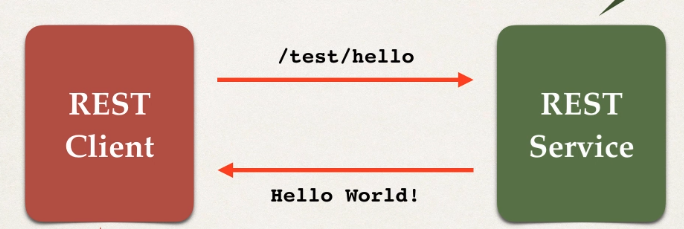

## Java JSON Data Binding

### Set Up

Add Jackson Project as a dependency in the maven file:

```XML
	<dependencies>

		<!-- TODO: Add your dependency here -->

		<dependency>
			<groupId>com.fasterxml.jackson.core</groupId>
			<artifactId>jackson-databind</artifactId>
			<version>2.10.0.pr1</version>
		</dependency>

	</dependencies>
```

### Create POJO Class

We now create the class we are going to convert to JSON (Serialize):

```java
package com.jackson.json.demo;

public class Student {

	private int id;
	private String firstName;
	private String lastName;
	private boolean active;

	public Student() {

	}

	public int getId() {
		return id;
	}

	public void setId(int id) {
		this.id = id;
	}

	public String getFirstName() {
		return firstName;
	}

	public void setFirstName(String firstName) {
		this.firstName = firstName;
	}

	public String getLastName() {
		return lastName;
	}

	public void setLastName(String lastName) {
		this.lastName = lastName;
	}

	public boolean isActive() {
		return active;
	}

	public void setActive(boolean active) {
		this.active = active;
	}

}
```

### Main App

Now, to test it we are going to create a `Student` object by reading from a `JSON` object:

```java
package com.jackson.json.demo;
import java.io.File;
import com.fasterxml.jackson.databind.ObjectMapper;

public class Driver {

	public static void main(String[] args) {

		try {
			// create object mapper
			ObjectMapper mapper = new ObjectMapper();

			// read JSON  file and map/convert to Java POJO:
			// data/sample-lite.json

			Student theStudent = mapper.readValue(
						new File("data/sample-lite.json"), Student.class);
		}
		catch (Exception exc) {
			exc.printStackTrace();
		}
	}
}
```

### Nested Objects

But, how can we read nested properties inside a json file, like the following:

```json
{
  "id": 14,
  "firstName": "Mario",
  "lastName": "Rossi",
  "active": true,
  "address": {
    "street": "100 Main St",
    "city": "Philadelphia",
    "state": "Pennsylvania",
    "zip": "19103",
    "country": "USA"
  },
  "languages": ["Java", "C#", "Python", "Javascript"]
}
```

As you can see the `address` property has properties inside it. What we are going to do is create a new attribute `address` inside the `Student` object, which will be a POJO object in itself.

```java
package com.jackson.json.demo;

public class Student {

	private int id;
	private String firstName;
	private String lastName;
	private boolean active;

	private Address address;

	private String[] languages;

	public Student() {

	}

	public int getId() {
		return id;
	}

	public void setId(int id) {
		this.id = id;
	}

	public String getFirstName() {
		return firstName;
	}

	public void setFirstName(String firstName) {
		this.firstName = firstName;
	}

	public String getLastName() {
		return lastName;
	}

	public void setLastName(String lastName) {
		this.lastName = lastName;
	}

	public boolean isActive() {
		return active;
	}

	public void setActive(boolean active) {
		this.active = active;
	}

	public Address getAddress() {
		return address;
	}

	public void setAddress(Address address) {
		this.address = address;
	}

	public String[] getLanguages() {
		return languages;
	}

	public void setLanguages(String[] languages) {
		this.languages = languages;
	}

}
```

We also need to create the `Address` class:

```java
package com.jackson.json.demo;

public class Address {

	private String street;
	private String city;
	private String state;
	private String zip;
	private String country;

	public Address() {

	}

	public String getStreet() {
		return street;
	}

	public void setStreet(String street) {
		this.street = street;
	}

	public String getCity() {
		return city;
	}

	public void setCity(String city) {
		this.city = city;
	}

	public String getState() {
		return state;
	}

	public void setState(String state) {
		this.state = state;
	}

	public String getZip() {
		return zip;
	}

	public void setZip(String zip) {
		this.zip = zip;
	}

	public String getCountry() {
		return country;
	}

	public void setCountry(String country) {
		this.country = country;
	}
}
```

### Ignore Unknwon Properties

To ignore properties from the JSON file that cannot be mapped to an attribute in the POJO we use the annotation:

```java
package com.jackson.json.demo;

@JsonIgnoreProperties(ignoreUnkown=true)
public class Student {

	private int id;
	private String firstName;
```

## Spring Rest Controller

### Hello World

To exemplify how to set up a REST Controller in Spring we will create an application that upong request sends back a Hello World! message:



#### Configuration

First of all, make sure you have the `Jackson` project, `MVC` and `REST` and also `Servlet` libraries as a maven dependency or as a library in your classpath.

```xml
	<dependencies>

		<!-- Add Spring MVC and REST support -->
		<dependency>
			<groupId>org.springframework</groupId>
			<artifactId>spring-webmvc</artifactId>
			<version>5.0.5.RELEASE</version>
		</dependency>

		<!-- Add Jackson for JSON converters -->
		<dependency>
			<groupId>com.fasterxml.jackson.core</groupId>
			<artifactId>jackson-databind</artifactId>
			<version>2.9.9.2</version>
		</dependency>

		<!-- Add Servlet support for
			 Spring's AbstractAnnotationConfigDispatcherServletInitializer -->
		<dependency>
			<groupId>javax.servlet</groupId>
			<artifactId>javax.servlet-api</artifactId>
			<version>3.1.0</version>
		</dependency>

		<!-- Add support for JSP ... get rid of Eclipse error -->
		<dependency>
			<groupId>javax.servlet.jsp</groupId>
			<artifactId>javax.servlet.jsp-api</artifactId>
			<version>2.3.1</version>
		</dependency>

	</dependencies>
```

##### General

We create a configuration class as follows:

```java
package com.springdemo.config;

import org.springframework.context.annotation.ComponentScan;
import org.springframework.context.annotation.Configuration;
import org.springframework.web.servlet.config.annotation.EnableWebMvc;
import org.springframework.web.servlet.config.annotation.WebMvcConfigurer;

// Mark it as a configuration class
@Configuration
@EnableWebMvc
// Enable component scanning in our source code
@ComponentScan("com.springdemo")
public class DemoAppConfig implements WebMvcConfigurer {

}
```

##### Servlet Initializer

We have to specify the configuration of our servlet, for this we extend `AbstractAnnotationConfigDispatcherServletInitializer`:

```java
package com.springdemo.config;

import org.springframework.web.servlet.support.AbstractAnnotationConfigDispatcherServletInitializer;

public class MySpringMvcDispatcherServletInitializer extends AbstractAnnotationConfigDispatcherServletInitializer {

	@Override
	protected Class<?>[] getRootConfigClasses() {
		// TODO Auto-generated method stub
		return null;
	}

	@Override
	protected Class<?>[] getServletConfigClasses() {
    // Specify our config class
		return new Class[] { DemoAppConfig.class };
	}

	@Override
	protected String[] getServletMappings() {
		return new String[] { "/" };
	}

}
```

#### Controller

For this we need to create our server with the controller that handles this request:

```java
package com.springdemo.rest;

import org.springframework.web.bind.annotation.GetMapping;
import org.springframework.web.bind.annotation.RequestMapping;
import org.springframework.web.bind.annotation.RestController;

@RestController
@RequestMapping("/test")
public class DemoRestController {

	// add code for the "/hello" endpoint

	@GetMapping("/hello")
	public String sayHello() {
		return "Hello World!";
	}

}
```

## POJOs as JSON

### Create POJO

We are going to create the `Student` entity:

```java
package com.springdemo.entity;

public class Student {

	private String firstName;
	private String lastName;

	public Student() {

	}

	public Student(String firstName, String lastName) {
		this.firstName = firstName;
		this.lastName = lastName;
	}

	public String getFirstName() {
		return firstName;
	}

	public void setFirstName(String firstName) {
		this.firstName = firstName;
	}

	public String getLastName() {
		return lastName;
	}

	public void setLastName(String lastName) {
		this.lastName = lastName;
	}

}
```

### Create Service

We now code the logic that handles the controller.

```java
package com.springdemo.rest;

import java.util.ArrayList;
import java.util.List;

import javax.annotation.PostConstruct;

import org.springframework.web.bind.annotation.GetMapping;
import org.springframework.web.bind.annotation.PathVariable;
import org.springframework.web.bind.annotation.RequestMapping;
import org.springframework.web.bind.annotation.RestController;

import com.luv2code.springdemo.entity.Student;

@RestController
@RequestMapping("/api")
public class StudentRestController {

	private List<Student> theStudents;


	// define @PostConstruct to load the student data ... only once!
	@PostConstruct
	public void loadData() {

		theStudents = new ArrayList<>();

		theStudents.add(new Student("Poornima", "Patel"));
		theStudents.add(new Student("Mario", "Rossi"));
		theStudents.add(new Student("Mary", "Smith"));
	}


	// define endpoint for "/students" - return list of students
	@GetMapping("/students")
	public List<Student> getStudents() {

		return theStudents;
	}

	// define endpoint for "/students/{studentId}" - return student at index
	@GetMapping("/students/{studentId}")
	public Student getStudent(@PathVariable int studentId) {

		// just index into the list ... keep it simple for now
		return theStudents.get(studentId);

	}
}
```

Note that the endpoint `"/students/{studentId}"` has a path variable `studentId`

## Exception Handling

### Create Error Response Class

```java
package com.springdemo.rest;

public class StudentErrorResponse {

	private int status;
	private String message;
	private long timeStamp;

	public StudentErrorResponse() {

	}

	public StudentErrorResponse(int status, String message, long timeStamp) {
		this.status = status;
		this.message = message;
		this.timeStamp = timeStamp;
	}

	public int getStatus() {
		return status;
	}

	public void setStatus(int status) {
		this.status = status;
	}

	public String getMessage() {
		return message;
	}

	public void setMessage(String message) {
		this.message = message;
	}

	public long getTimeStamp() {
		return timeStamp;
	}

	public void setTimeStamp(long timeStamp) {
		this.timeStamp = timeStamp;
	}


}
```

### Create Exception Class

```java
package com.springdemo.rest;

public class StudentNotFoundException extends RuntimeException {

	public StudentNotFoundException(String message, Throwable cause) {
		super(message, cause);
	}

	public StudentNotFoundException(String message) {
		super(message);
	}

	public StudentNotFoundException(Throwable cause) {
		super(cause);
	}

}
```

### Rest Service with Exception

What we need to know is:

- Define an exception handler method with `@ExceptionHandler` annotation
- The exception handler will return a `Response Entity`
- `Response Entity` is a wrapper for the `HTTP` response object
- `ResposneEntity` provides a fine-grained control to specify:
  - `HTTP` status code
  - `HTTP` headers
  - Response body

```java
package com.springdemo.rest;

import java.util.ArrayList;
import java.util.List;

import javax.annotation.PostConstruct;

import org.springframework.http.HttpStatus;
import org.springframework.http.ResponseEntity;
import org.springframework.web.bind.annotation.ExceptionHandler;
import org.springframework.web.bind.annotation.GetMapping;
import org.springframework.web.bind.annotation.PathVariable;
import org.springframework.web.bind.annotation.RequestMapping;
import org.springframework.web.bind.annotation.RestController;

import com.springdemo.entity.Student;

@RestController
@RequestMapping("/api")
public class StudentRestController {

	private List<Student> theStudents;

	// define @PostConstruct to load the student data ... only once!
	@PostConstruct
	public void loadData() {

		theStudents = new ArrayList<>();

		theStudents.add(new Student("Poornima", "Patel"));
		theStudents.add(new Student("Mario", "Rossi"));
		theStudents.add(new Student("Mary", "Smith"));
	}


	// define endpoint for "/students" - return list of students
	@GetMapping("/students")
	public List<Student> getStudents() {

		return theStudents;
	}

	// define endpoint for "/students/{studentId}" - return student at index
	@GetMapping("/students/{studentId}")
	public Student getStudent(@PathVariable int studentId) {

		// just index into the list ... keep it simple for now
		// check the studentId against list size
		if ( (studentId >= theStudents.size()) || (studentId < 0) ) {
			throw new StudentNotFoundException("Student id not found - " + studentId);
		}

		return theStudents.get(studentId);

	}

  // Tag it as an exception handling method
	@ExceptionHandler
  //                    Type of response body                 Exception type to handle
	public ResponseEntity<StudentErrorResponse> handleException(StudentNotFoundException exc) {

		StudentErrorResponse error = new StudentErrorResponse();

    // json error object
		error.setStatus(HttpStatus.NOT_FOUND.value());
		error.setMessage(exc.getMessage());
		error.setTimeStamp(System.currentTimeMillis());

    // return response with the error object and the status code
		return new ResponseEntity<>(error, HttpStatus.NOT_FOUND);
	 }

  // Another exception handler
	@ExceptionHandler
  // Catch any exception thrown
	public ResponseEntity<StudentErrorResponse> handleException(Exception exc) {

		StudentErrorResponse error = new StudentErrorResponse();

		error.setStatus(HttpStatus.BAD_REQUEST.value());
		error.setMessage(exc.getMessage());
		error.setTimeStamp(System.currentTimeMillis());

		return new ResponseEntity<>(error, HttpStatus.BAD_REQUEST);
	}
}
```

### Global Exception Handler

Instead of having the exception handling methods in every controller, we defined them globally. For that we use `ControllerAdvice` that acts as a filter between the requests and the controller. It:

- Pre-processes requests to controllers
- Post-processes responses to handle exceptions

So, we create a class with the `@ControllerAdvice` annotation:

```java
package com.springdemo.rest;

import org.springframework.http.HttpStatus;
import org.springframework.http.ResponseEntity;
import org.springframework.web.bind.annotation.ControllerAdvice;
import org.springframework.web.bind.annotation.ExceptionHandler;

@ControllerAdvice
public class StudentRestExceptionHandler {

	// add exception handling code here
	// Add an exception handler using @ExceptionHandler
	@ExceptionHandler
	public ResponseEntity<StudentErrorResponse> handleException(StudentNotFoundException exc) {

		// create a StudentErrorResponse
		StudentErrorResponse error = new StudentErrorResponse();

		error.setStatus(HttpStatus.NOT_FOUND.value());
		error.setMessage(exc.getMessage());
		error.setTimeStamp(System.currentTimeMillis());

		// return ResponseEntity
		return new ResponseEntity<>(error, HttpStatus.NOT_FOUND);
	}

	// add another exception handler ... to catch any exception (catch all)
	@ExceptionHandler
	public ResponseEntity<StudentErrorResponse> handleException(Exception exc) {

		// create a StudentErrorResponse
		StudentErrorResponse error = new StudentErrorResponse();
		error.setStatus(HttpStatus.BAD_REQUEST.value());
		error.setMessage(exc.getMessage());
		error.setTimeStamp(System.currentTimeMillis());

		// return ResponseEntity
		return new ResponseEntity<>(error, HttpStatus.BAD_REQUEST);
	}

}
```

And now we modify the controller to make use of this paradigm:

```java
package com.springdemo.rest;

import java.util.ArrayList;
import java.util.List;

import javax.annotation.PostConstruct;

import org.springframework.http.HttpStatus;
import org.springframework.http.ResponseEntity;
import org.springframework.web.bind.annotation.ExceptionHandler;
import org.springframework.web.bind.annotation.GetMapping;
import org.springframework.web.bind.annotation.PathVariable;
import org.springframework.web.bind.annotation.RequestMapping;
import org.springframework.web.bind.annotation.RestController;

import com.springdemo.entity.Student;

@RestController
@RequestMapping("/api")
public class StudentRestController {

	private List<Student> theStudents;

	// define @PostConstruct to load the student data ... only once!
	@PostConstruct
	public void loadData() {

		theStudents = new ArrayList<>();

		theStudents.add(new Student("Poornima", "Patel"));
		theStudents.add(new Student("Mario", "Rossi"));
		theStudents.add(new Student("Mary", "Smith"));
	}

	// define endpoint for "/students" - return list of students
	@GetMapping("/students")
	public List<Student> getStudents() {

		return theStudents;
	}

	// define endpoint for "/students/{studentId}" - return student at index
	@GetMapping("/students/{studentId}")
	public Student getStudent(@PathVariable int studentId) {

		// just index into the list ... keep it simple for now
		// check the studentId against list size
		if ( (studentId >= theStudents.size()) || (studentId < 0) ) {
			throw new StudentNotFoundException("Student id not found - " + studentId);
		}

		return theStudents.get(studentId);
	}
}
```
