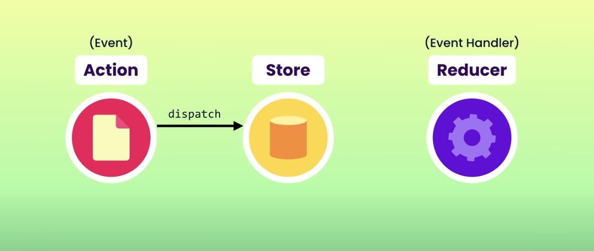
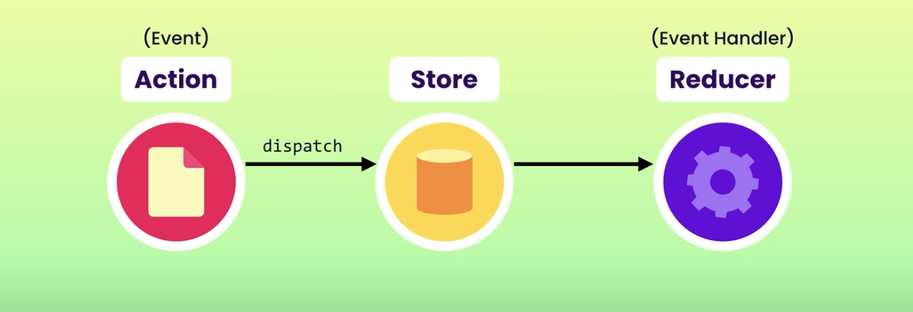
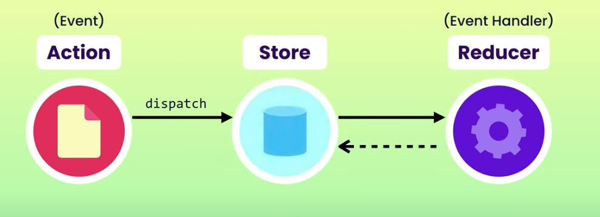

## Basics

### Handle an action

The process of handling an action is the following:

- We create an action object and dispatch it:



- The store forwards the action to the reducer:



- The reducer updates the state and returns it



- The store notifies the `UI` components of the change of the state

### Install `Redux`

```bash
$ npm install redux react-redux
```

### First steps

1. Inside `src` create a `store` folder
2. Inside the `store` folder create an `index.js` that holds all of the `React` states in this file

## Index file

In the following piece of code we create our store object, where we are going to save the state of our application. As you may note, in this store there are three slices defined. That is because we differentiate three different states (slices). So our store is defined as:

```json
{
  user: {...}
  theme: {...}
}
```

```javascript
import { configureStore } from "@reduxjs/toolkit";
// Different slices
import userSlice from "./features/userSlice.js";
import themeSlice from "./features/themeSlice.js";

// Create store
const store = configureStore({
  reducer: {
    // In each case obtain the reducer
    user: userSlice.reducer,
    theme: themeSlice.reducer,
  },
});
export default store;
```

Now, we have to wrap our application with our store:

```javascript
import React from "react";
import ReactDOM from "react-dom";

import App from "./App";

// Import our store as a provider
import { Provider } from "react-redux";
import store from "./store";

ReactDOM.render(
  <React.StrictMode>
    <Provider store={store}>
      <App />
    </Provider>
  </React.StrictMode>,
  document.getElementById("root")
);
```

## Reducers and Actions

Let's now see an example of a `reducer`, more concretely the `reducer` of the `user` slice we defined [previously](#index-file):

```javascript
// Use create slice to define the slice
import { createSlice } from "@reduxjs/toolkit";

// Define initial state
const initialStateValue = { name: "", age: 0, email: "" };

export const userSlice = createSlice({
  // Name of slice
  name: "user",
  // Initial state of reducer
  initialState: { value: initialStateValue },
  // Possible reducers
  reducers: {
    login: (state, action) => {
      state.value = action.payload;
    },

    logout: (state) => {
      state.value = initialStateValue;
    },
  },
});

// De-structure actions
export const { login, logout } = userSlice.actions;

// Export reducer
export default userSlice.reducer;
```

## Get State

In order to access the state saved in our state, we do the following:

```javascript
import React from "react";
import { useSelector } from "react-redux";

function Profile() {
  // Use the useSelector hook
  const user = useSelector((state) => state.user.value);

  return (
    <div style={{ color: themeColor }}>
      <h1> Profile Page</h1>
      <!--Obtain the user state-->
      <p> Name: {user.name} </p>
      <p> Age: {user.age}</p>
      <p> Email: {user.email}</p>
    </div>
  );
}

export default Profile;
```

## Dispatch

In order to dispatch actions in our reducers we do as follows:

```javascript
import React from "react";
// Get dispatch hook
import { useDispatch } from "react-redux";
// Get actions
import { login, logout } from "../features/user";

function Login() {
  // Initialize dispatch hook
  const dispatch = useDispatch();

  return (
    <div>
      <button
        onClick={() => {
          // Dispatch login action
          dispatch(login({ name: "Pedro", age: 20, email: "pedro@gmail.com" }));
        }}
      >
        Login
      </button>

      <button
        onClick={() => {
          // Dispatch logout action
          dispatch(logout());
        }}
      >
        LOGOUT
      </button>
    </div>
  );
}

export default Login;
```
