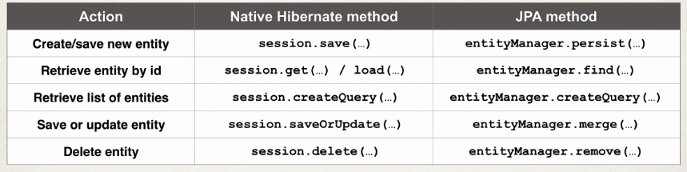

Spring Boot is a framework that:

- Make it easier to get started with Spring development
- Minimize the amount of manual configuration
  - Perform auto-configuration based on props files and JAR classpath
- Help to resolve dependency conflicts (Maven or Gradle)
- Provide an embedded HTTP server so you can get started quickly

To create a new project you just have to go to [Spring Initiliazr](https://start.spring.io/), where you simply select your dependencies and lets you create a maven/gradle project and import it into an IDE.

So now our app is a `jar` file, and it includes the source code and also the embedded http server, so can be ran from the command line, from your IDE, etc. However if you want to export your code as a `war` file, you can also do that by exporting only your source code, without the embedded server.

With the `jar` file you can run your application by executing:

```bash
$ java -jar app.jar
```

## Rest Controller

### Create Controller

The controller is the same as in Spring REST:

```java
package com.springboot.demo.mycoolapp.rest;

import java.time.LocalDateTime;

import org.springframework.beans.factory.annotation.Value;
import org.springframework.web.bind.annotation.GetMapping;
import org.springframework.web.bind.annotation.RestController;

@RestController
public class FunRestController {

	// expose "/" that return "Hello World"

	@GetMapping("/")
	public String sayHello() {
		return "Hello World! Time on server is " + LocalDateTime.now();
	}


```

### Main App

The `SpringBootApplication` is made up of three annotations:

- Auto configuration (`@EnableAutoConfiguration`)
- Component scanning (`@ComponentScan`)
- Additional configuration (`@Configuration`)

```java
package com.springboot.demo.mycoolapp;

import org.springframework.boot.SpringApplication;
import org.springframework.boot.autoconfigure.SpringBootApplication;

// Annotation to tell Spring this is an spring application
@SpringBootApplication
public class MycoolappApplication {

	public static void main(String[] args) {
		// Boostrap spring boot application
		SpringApplication.run(MycoolappApplication.class, args);
	}
}
```

## Spring Boot Project Structure

### Application Properties

By default, Spring Boot will load properties from: `application.properties` in the `src` project directory. We inject it in our code the [same way we did it with Spring](../01/03_configuration_with_java#load-properties-from-file)

### Static Content

By default, Spring Boot wil load static resources from `"/static"` directory

### Testing

Unit tests are stored on the `src` directory under the `/test` folder

## Spring Boot Starters

### Spring Boot Starter Parent

This is a special starter that provides defaults:

- Default compiler level
- UTF-8 source encoding

You include it in your `pom.xml` file as follows:

```xml
...
	<parent>
		<groupId>org.springframework.boot</groupId>
		<artifactId>spring-boot-starter-parent</artifactId>
		<version>2.1.2.RELEASE</version>
		<relativePath/> <!-- lookup parent from repository -->
	</parent>

	<dependencies>
	...
	</dependencies>
...
```

If you want to override a default, you use properties:

```xml
...
	<parent>
		<groupId>org.springframework.boot</groupId>
		<artifactId>spring-boot-starter-parent</artifactId>
		<version>2.1.2.RELEASE</version>
		<relativePath/> <!-- lookup parent from repository -->
	</parent>

	<!-- Override default java version -->
	<properties>
		<java.version>1.8</java.version>
	</properties>

	<dependencies>
	...
	</dependencies>
...
```

## Spring Boot DevTools

Spring Boot Dev Tools automatically restart your application when code is updated. The only thing you need to do is add the module to the dependencies:

```xml
...
	<dependencies>

		<!-- ADD SUPPORT FOR AUTOMATIC RELOADING -->
		<dependency>
			<groupId>org.springframework.boot</groupId>
			<artifactId>spring-boot-devtools</artifactId>
		</dependency>

	</dependencies>
...
```

## Spring Boot Actuator

### Add security

First you need to add Spring Security as a dependency in your `pom.xml`:

```xml
...
	<dependencies>
		...
    <!-- SECURITY -->
		<dependency>
			<groupId>org.springframework.boot</groupId>
			<artifactId>spring-boot-starter-security</artifactId>
		</dependency>
		...
	</dependencies>
...
```

Now, when we access some endpoints like `/actuator/beans` Spring will prompt a login to grant access to the endpoint.

- The default user name is "user"
- The password will be printed on the console where you start the application

To override these defaults edit the `application.properties` file as follows:

```json
spring.security.user.name=alba
spring.security.user.password=mypassword
```

We can also exclude endpoints by adding the following declarations to the `application.properties` file:

```json
management.endpoints.web.exposure.exclude=health,info
```

## Application Properties

### Configuring the Spring Boot Server

Some properties offered by Spring are:

#### Core

```properties
## Log levels severity mapping
logging.level.org.springframework=DEBUG
logging.level.org.hibernate=TRACE
logging.level.org.luv2code=INFO

## Log file name
logging.file=date.log
```

#### Web

```properties
## HTTP Server port
server.port=7070

## Context path of the application
server.servlet.context-path=/my-app

## Default HTTP Session timeout
server.servlet.session.timeout=15m
```

#### Actuator Properties

```properties
## Endpoints to include by name or wildcard
management.endpoints.web.exposure.include=*

## Endpoints to exclude by name or wildcard
management.endpoints.web.exposure.exclude=beans,mapping
```

#### Security

```properties
## Default username
spring.security.user.name=admin

## Password for default user
spring.security.user.password=mypass
```

#### Data Properties

```properties
## JDBC URL of the database
spring.datasource.url=jdbc:mysql://localhost:3306/myapp

## Login username of the database
spring.datasource.username=alba

## Login password of the database
spring.datasource.password=testpass
```

## JPA

Until now, to manage data we have been using the `EntityManager` along with the `Hibernate API`. However now we are going to use the `Standard JPA API`.

The `JPA API` methods are similar to `Native Hibernate API`. It also supports a query language `JPQL` (`JPA Query Language`)

Comparing `Hibernate` to `JPA`:



Example: for managing employees with `JPA`, we first create the Data Access Object:

```java
package com.springboot.cruddemo.dao;

import java.util.List;

import javax.persistence.EntityManager;
import javax.persistence.Query;

import org.springframework.beans.factory.annotation.Autowired;
import org.springframework.stereotype.Repository;

import com.luv2code.springboot.cruddemo.entity.Employee;

@Repository
public class EmployeeDAOJpaImpl implements EmployeeDAO {

    private EntityManager entityManager;

    @Autowired
    public EmployeeDAOJpaImpl(EntityManager theEntityManager) {
        entityManager = theEntityManager;
    }

    @Override
    public List<Employee> findAll() {

        // create a query
        Query theQuery =
                entityManager.createQuery("from Employee");

        // execute query and get result list
        List<Employee> employees = theQuery.getResultList();

        // return the results
        return employees;
    }

    @Override
    public Employee findById(int theId) {

        // get employee
        Employee theEmployee =
                entityManager.find(Employee.class, theId);

        // return employee
        return theEmployee;
    }

    @Override
    public void save(Employee theEmployee) {

        // save or update the employee
        Employee dbEmployee = entityManager.merge(theEmployee);

        // update with id from db ... so we can get generated id for save/insert
        theEmployee.setId(dbEmployee.getId());

    }

    @Override
    public void deleteById(int theId) {

        // delete object with primary key
        Query theQuery = entityManager.createQuery(
                            "delete from Employee where id=:employeeId");

        theQuery.setParameter("employeeId", theId);

        theQuery.executeUpdate();
    }

}
```

And then we call it from the Employee Service:

```java
package com.springboot.cruddemo.service;

import java.util.List;

import org.springframework.beans.factory.annotation.Autowired;
import org.springframework.beans.factory.annotation.Qualifier;
import org.springframework.stereotype.Service;
import org.springframework.transaction.annotation.Transactional;

import com.springboot.cruddemo.dao.EmployeeDAO;
import com.springboot.cruddemo.entity.Employee;

@Service
public class EmployeeServiceImpl implements EmployeeService {

    private EmployeeDAO employeeDAO;

    @Autowired
    public EmployeeServiceImpl(@Qualifier("employeeDAOJpaImpl") EmployeeDAO theEmployeeDAO) {
        employeeDAO = theEmployeeDAO;
    }

    @Override
    @Transactional
    public List<Employee> findAll() {
        return employeeDAO.findAll();
    }

    @Override
    @Transactional
    public Employee findById(int theId) {
        return employeeDAO.findById(theId);
    }

    @Override
    @Transactional
    public void save(Employee theEmployee) {
        employeeDAO.save(theEmployee);
    }

    @Override
    @Transactional
    public void deleteById(int theId) {
        employeeDAO.deleteById(theId);
    }
}
```

This class implements the following interface:

```java
package com.springboot.cruddemo.service;

import java.util.List;

import com.springboot.cruddemo.entity.Employee;

public interface EmployeeService {

    public List<Employee> findAll();

    public Employee findById(int theId);

    public void save(Employee theEmployee);

    public void deleteById(int theId);

}
```

## Spring Data JPA

### Create Repository

So now the Employee DAO is as follows:

```java
package com.springboot.cruddemo.dao;

import org.springframework.data.jpa.repository.JpaRepository;

import com.springboot.cruddemo.entity.Employee;

public interface EmployeeRepository extends JpaRepository<Employee, Integer> {
}
```

### Use Repository

And the Employee Service is:

```java
package com.springboot.cruddemo.service;

import java.util.List;
import java.util.Optional;

import org.springframework.beans.factory.annotation.Autowired;
import org.springframework.stereotype.Service;

import com.springboot.cruddemo.dao.EmployeeRepository;
import com.springboot.cruddemo.entity.Employee;

@Service
public class EmployeeServiceImpl implements EmployeeService {

  // Here we make use of the above implemented repository
	private EmployeeRepository employeeRepository;

	@Autowired
	public EmployeeServiceImpl(EmployeeRepository theEmployeeRepository) {
		employeeRepository = theEmployeeRepository;
	}

	@Override
	public List<Employee> findAll() {
		return employeeRepository.findAll();
	}

	@Override
	public Employee findById(int theId) {
		Optional<Employee> result = employeeRepository.findById(theId);

		Employee theEmployee = null;

		if (result.isPresent()) {
			theEmployee = result.get();
		}
		else {
			// we didn't find the employee
			throw new RuntimeException("Did not find employee id - " + theId);
		}

		return theEmployee;
	}

	@Override
	public void save(Employee theEmployee) {
		employeeRepository.save(theEmployee);
	}

	@Override
	public void deleteById(int theId) {
		employeeRepository.deleteById(theId);
	}

}
```

This `EmployeeService` implements the interface:

```java
package com.springboot.cruddemo.service;

import java.util.List;

import com.springboot.cruddemo.entity.Employee;

public interface EmployeeService {

	public List<Employee> findAll();

	public Employee findById(int theId);

	public void save(Employee theEmployee);

	public void deleteById(int theId);

}
```

## Spring Data Rest

### Configuration

- You can specify the name of the endpoint that is exposed (by the default is the plural of the entity) with:

```java
@RepositoryRestResource(path="members")
public interface EmployeeRepository extends JpaRepository<Employee, Integer> {
}
```

- The default number of elements returned are 20, then we can use pagination to retrieve the next ones with query parameters (`?page=0`).
- Some properties available to tweak in `application.properties` are:
  - `spring.data.rest.base-path`: Base path used to expose repository resources
  - `spring.data.rest.default-page-size`: Default size pages
  - `spring.data.rest.max-page-size`: Maximum size of pages

#### Sorting

You can sort by the property names of your entity. On the `Employee` example we have `firstName`, `lastName` and `email`, therefore we can do:

`http://localhost:8080/employees?sort=firstName`

or

`http://localhost:8080/employees?sort=firstName,desc`
