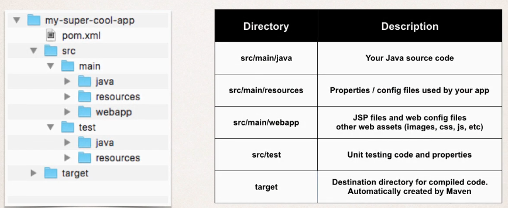
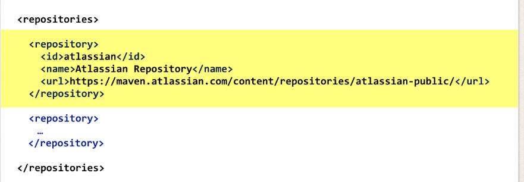

### Standard Directory Structure

## POM File Structure

### Project Coordinates

Project coordinates uniquely identify a project:

Where:

- Group ID: name of company, group or organization
- Artifact ID: name for the project
- Version: a specific release version

### Dependency Coordinates

To add a given dependency project, we need:

- Group ID
- Artifact ID
- Optional: version (best practice to include the version)

#### Find Dependencies

[Search Maven](https://search.maven.org)
[Maven Repository](https://www.mvnrepository.com)

## Maven Archetypes

Archetypes are used to create new Maven projects, you can think of them as starter projects. Some archetypes are:

- For standalone projects: `maven-archetype-quickstart`
- For web projects: `maven-archetype-webapp`

## Additional Repositories

If Maven does not find some dependency in your local repository it goes to the central repository to search for it. But what if the dependency is not in the central repository. Then we have to define the repository in our `pom.xml`:

## Private Repositories

If you want to create repositories with restricted access you can:

- Set up your own private Maven Repository in your server, that is secure with credentials: id/password

Some Maven repository manager products are:

- Archiva
- Artifactory
- Nexus

If you do not want to create your own server, there are also cloud based solutions like:

- [Package Cloud](https://www.packagecloud.io)
- [My Maven Repo](https://www.mymavenrepo.com)
