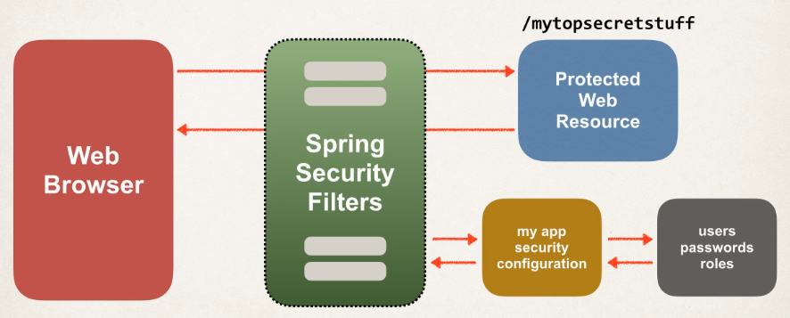
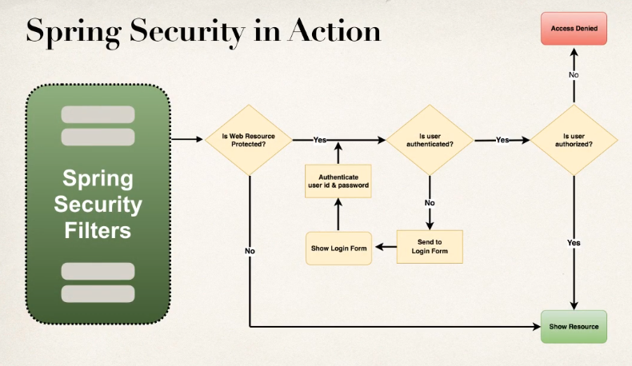
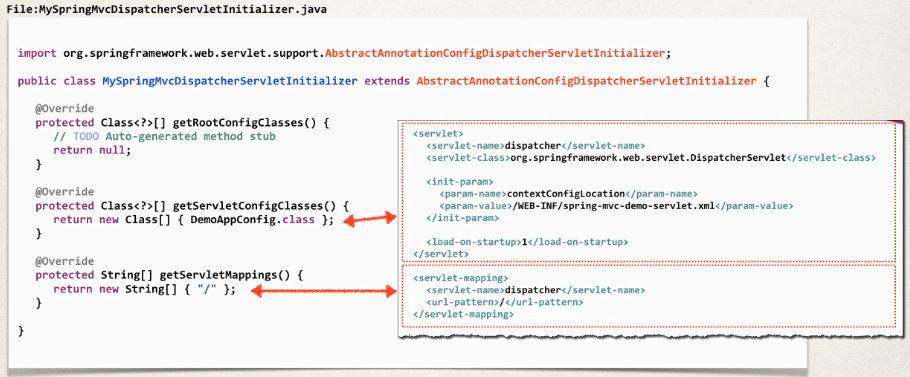
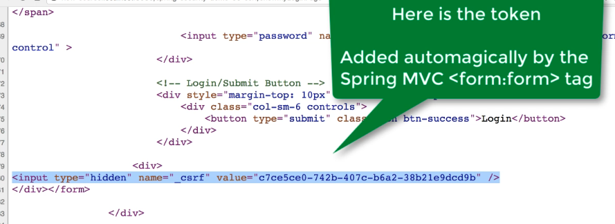
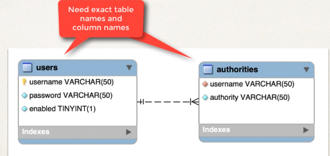

## Overview

- Spring Security is implemented using Servlet filters in the background
- There are two methods of securing a Web App:
  - Declarative
  - Programmatic

### Servlet Filters

Servlet filters are used to pre-process/post-process web requests.

- They can route web requests based on security logic.
- Spring provides a bulk of security functionality with servlet filters.

This is described in the following picture:



We can see Spring intercepts the request to `/mytopsecretstuff` and uses the app's security configuration, alongside information about the user, passwords and roles to pre and post-process the request.

### Spring Security in Action

Next we show a flowchart of the pre-processing made by Spring Security Filters:



1. If the resource is protected we go to step (2), else we go to step (4)
2. If the user is authenticated we go to step (3), else we go to step (6)
3. If the user is authorized to access the resource we go to step (4), else we go to step (5)
4. The resource is shown to the user
5. The access to the resource is denied
6. We send the user to the login page, if the user logins correctly we go to step (3)

### Declarative Security

You define your application's security constraints in configuration. For that, you can either:

- Use all Java configuration (@Configuration)
- Use a Spring configuration file (XML)

### Programmatic Security

You can also do it programmatically:

- Spring Security provides an API for custom application coding.
- It also provides greater customization for specific apps.

### Authentication/Authorization

Information about users/passwords/roles, etc can be stored:

- In-memory
- JDBC
- LDAP
- Custom
- etc

### Maven Dependencies

To use this framework, you have to add the following dependency to your project:

```xml
    <dependencies>

    ...
        <!-- Spring Security -->
        <!-- spring-security-web and spring-security-config -->

        <dependency>
            <groupId>org.springframework.security</groupId>
            <artifactId>spring-security-web</artifactId>
            <version>${springsecurity.version}</version>
        </dependency>

    ...

    <dependencies>
```

### Java Configuration

### Web App Initializer

Spring MVC provides support for web app initialization, and makes sure your code is automatically detected. Your code is used to initialize the servlet container.

As an example:

```java
package com.springsecurity.demo.config;

import org.springframework.web.servlet.support.AbstractAnnotationConfigDispatcherServletInitializer;

public class MySpringMvcDispatcherServletInitializer extends AbstractAnnotationConfigDispatcherServletInitializer {

    @Override
    protected Class<?>[] getRootConfigClasses() {
        // TODO Auto-generated method stub
        return null;
    }

    @Override
    // Tell spring where the configuration for the servlet is
    protected Class<?>[] getServletConfigClasses() {
        return new Class[] { DemoAppConfig.class };
    }

    @Override
    // Map the servlet to the path "/"
    protected String[] getServletMappings() {
        return new String[] { "/" };
    }

}
```

Here is the correspondence with the `xml` servlet configuration file:



## Basic Security

### Create Security Spring Initializer

Spring security provides support for security initialization. Your security code is used to initialize the servlet container. There is a special class to register the `Spring Security Filters`.

You need this class for the Spring Security Filters to "activate". Next we show an example:

```java
package com.springsecurity.demo.config;

import org.springframework.security.web.context.AbstractSecurityWebApplicationInitializer;

public class SecurityWebApplicationInitializer
						extends AbstractSecurityWebApplicationInitializer {

}
```

### Create Spring Security Configuration (@Configuration)

Now we create our spring security configuration file:

```java
package com.springsecurity.demo.config;

import org.springframework.context.annotation.Configuration;
import org.springframework.security.config.annotation.authentication.builders.AuthenticationManagerBuilder;
import org.springframework.security.config.annotation.web.builders.HttpSecurity;
import org.springframework.security.config.annotation.web.configuration.EnableWebSecurity;
import org.springframework.security.config.annotation.web.configuration.WebSecurityConfigurerAdapter;
import org.springframework.security.core.userdetails.User;
import org.springframework.security.core.userdetails.User.UserBuilder;

// Tell spring this is a configuration file
@Configuration
@EnableWebSecurity
public class DemoSecurityConfig extends WebSecurityConfigurerAdapter {
	@Override
	protected void configure(AuthenticationManagerBuilder auth) throws Exception {

		// add our users for in memory authentication (this is for test purposes only, you would usually retrieve this information encrypted from the database)
		UserBuilder users = User.withDefaultPasswordEncoder();

    // Use the AuthenticationManagerBuilder given by Spring to handle authentication
		auth
			.inMemoryAuthentication()
			.withUser(users.username("john").password("test123").roles("EMPLOYEE"))
			.withUser(users.username("mary").password("test123").roles("MANAGER"))
			.withUser(users.username("susan").password("test123").roles("ADMIN"));
	}
}
```

## Custom Login Form

### Create the form

We create the login page `/showMyLoginPage` as follows:

```jsp
<!-- Reference the spring and jsp tags -->
<%@ taglib prefix="form" uri="http://www.springframework.org/tags/form" %>
<%@ taglib prefix="c" uri="http://java.sun.com/jsp/jstl/core" %>
<html>
<head>
	<title>Custom Login Page</title>
	<style>
		.failed {
			color: red;
		}
	</style>
</head>
<body>
<h3>My Custom Login Page</h3>
		<!-- The form points to the endpoint specified preivously: "authenticateTheUser" -->
		<!-- contextPath is the domain of our app, i.e. localhost:8080 -->
	<form:form action="${pageContext.request.contextPath}/authenticateTheUser"
			   method="POST">
		<!-- Check for login error -->
		<c:if test="${param.error != null}">
			<i class="failed">Sorry! You entered invalid username/password.</i>
		</c:if>
		<p>
			User name: <input type="text" name="username" />
		</p>
		<p>
			Password: <input type="password" name="password" />
		</p>
		<input type="submit" value="Login" />
	</form:form>
</body>
</html>
```

Note that Spring appends a parameter `error` when the user fails to login. That is what we use as a condition to show our error message, that is, we check if `param.error` exists.

Also, Spring security defines default names for login form fields:

- User name field: `username`
- Password field: `password`

### Login Controller

We also need a controller method for requests to `/showMyLoginPage`:

```java
package com.springsecurity.demo.controller;

import org.springframework.stereotype.Controller;
import org.springframework.web.bind.annotation.GetMapping;

@Controller
public class LoginController {

	@GetMapping("/showMyLoginPage")
	public String showMyLoginPage() {

		// This is the custom-login.jsp we created in the previous section
		return "custom-login";

	}
}
```

## Log Out

### Configuration

To our [existing configuration](#custom-login-form) we add:

```java
package com.springsecurity.demo.config;

import org.springframework.context.annotation.Configuration;
import org.springframework.security.config.annotation.authentication.builders.AuthenticationManagerBuilder;
import org.springframework.security.config.annotation.web.builders.HttpSecurity;
import org.springframework.security.config.annotation.web.configuration.EnableWebSecurity;
import org.springframework.security.config.annotation.web.configuration.WebSecurityConfigurerAdapter;
import org.springframework.security.core.userdetails.User;
import org.springframework.security.core.userdetails.User.UserBuilder;

@Configuration
@EnableWebSecurity
public class DemoSecurityConfig extends WebSecurityConfigurerAdapter {

    @Override
    protected void configure(AuthenticationManagerBuilder auth) throws Exception {

        // add our users for in memory authentication
        UserBuilder users = User.withDefaultPasswordEncoder();

        auth.inMemoryAuthentication()
            .withUser(users.username("john").password("test123").roles("EMPLOYEE"))
            .withUser(users.username("mary").password("test123").roles("MANAGER"))
            .withUser(users.username("susan").password("test123").roles("ADMIN"));
    }

    @Override
    protected void configure(HttpSecurity http) throws Exception {
          // Here is the control of the access to web path
          http.authorizeRequests()
          // Require authentication for every request
            .anyRequest().authenticated()
            .and()
            .formLogin()
            .loginPage("/showMyLoginPage")
            .loginProcessingUrl("/authenticateTheUser")
            .permitAll();
            // Add logout functionality
            .and()
            .logout().permitAll()

    }
}
```

The default url for logging out is `/logout`.

### Log Out Button

Now we create the logout button in our home page:

```jsp
<%@ taglib prefix="form" uri="http://www.springframework.org/tags/form" %>
<html>
<head>
    <title>luv2code Company Home Page</title>
</head>
<body>
    <h2>luv2code Company Home Page</h2>
    <hr>
    <p>
    Welcome to the luv2code company home page!
    </p>
    <!-- Add a logout button: it point to "/logout" endpoint -->
    <form:form action="${pageContext.request.contextPath}/logout"
               method="POST">
        <input type="submit" value="Logout" />
    </form:form>
</body>
</html>
```

Note that the logout logic is handled directly by spring, what it does is:

- Invalidate the user's HTTP session and remove cookies, etc.
- Sends the user back to the login page
- Appends a logout parameter: `?logout`

## Cross Site Request Forgery

### How to see the CSRF token?

When your `jsp` with the `<form:form>` tag is processed into an `html` page, you will be able to see the token inside the `form` tag:



## Display User and Roles

### Add JSP Tag library as dependency

First we add to our `pom.xml` file the JSP Tag Library:

```xml
		<!-- Add Spring Security Taglibs support -->
		<dependency>
		    <groupId>org.springframework.security</groupId>
		    <artifactId>spring-security-taglibs</artifactId>
		    <version>${springsecurity.version}</version>
		</dependency>
```

### JSP page

Then add the tag library to the jsp page, and we use its tags to access the user id and its role:

```jsp
<%@ taglib prefix="form" uri="http://www.springframework.org/tags/form" %>
<!-- Add tag library -->
<%@ taglib prefix="security" uri="http://www.springframework.org/security/tags" %>
<html>
<head>
	<title>luv2code Company Home Page</title>
</head>
<body>
	<h2>luv2code Company Home Page</h2>
	<hr>
	<p>
	Welcome to the luv2code company home page!
	</p>
	<hr>
	<!-- display user name and role -->
	<p>
		User: <security:authentication property="principal.username" />
		<br><br>
		Role(s): <security:authentication property="principal.authorities" />
	</p>
	<hr>
	<!-- Add a logout button -->
	<form:form action="${pageContext.request.contextPath}/logout"
			   method="POST">
		<input type="submit" value="Logout" />
	</form:form>
</body>
</html>
```

## Authorization

### Create Controllers

We create a basic controller for every endpoint:

```java
package com.springsecurity.demo.controller;

import org.springframework.stereotype.Controller;
import org.springframework.web.bind.annotation.GetMapping;

@Controller
public class DemoController {

    // add request mapping for index page
    @GetMapping("/")
    public String showHome() {

    	return "home";
    }

    // add request mapping for /leaders
    @GetMapping("/leaders")
    public String showLeaders() {

    	return "leaders";
    }

    // add request mapping for /systems
    @GetMapping("/systems")
    public String showSystems() {

    	return "systems";
    }

}
```

We also create a controller for the `/acess-denied` endpoint:

```java
package com.springsecurity.demo.controller;

import org.springframework.stereotype.Controller;
import org.springframework.web.bind.annotation.GetMapping;

@Controller
public class LoginController {

	@GetMapping("/showMyLoginPage")
	public String showMyLoginPage() {

		// return "plain-login";
		return "fancy-login";
	}

	// add request mapping for /access-denied
	@GetMapping("/access-denied")
	public String showAccessDenied() {

		return "access-denied";
	}
}
```

### Define User Roles and Restrict Accessand Restrict Access

In our configuration file we had saved in-memory a list of users with some defined roles, we are going to update it to have more roles. We are also going to define the authorization scheme we showed earlier.

```java
package com.springsecurity.demo.config;

import org.springframework.context.annotation.Configuration;
import org.springframework.security.config.annotation.authentication.builders.AuthenticationManagerBuilder;
import org.springframework.security.config.annotation.web.builders.HttpSecurity;
import org.springframework.security.config.annotation.web.configuration.EnableWebSecurity;
import org.springframework.security.config.annotation.web.configuration.WebSecurityConfigurerAdapter;
import org.springframework.security.core.userdetails.User;
import org.springframework.security.core.userdetails.User.UserBuilder;

@Configuration
@EnableWebSecurity
public class DemoSecurityConfig extends WebSecurityConfigurerAdapter {

  @Override
  protected void configure(AuthenticationManagerBuilder auth) throws Exception {

    // add our users for in memory authentication
    UserBuilder users = User.withDefaultPasswordEncoder();

    // add more roles
    auth.inMemoryAuthentication()
      .withUser(users.username("john").password("test123").roles("EMPLOYEE"))
      .withUser(users.username("mary").password("test123").roles("EMPLOYEE", "MANAGER"))
      .withUser(users.username("susan").password("test123").roles("EMPLOYEE", "ADMIN"));
  }

  @Override
  protected void configure(HttpSecurity http) throws Exception {

    // Handle requests
    http.authorizeRequests()
      // Set role for index page
      .antMatchers("/").hasRole("EMPLOYEE")
      // Set role for leaders page
      .antMatchers("/leaders/**").hasRole("MANAGER")
      // Set role for systems page
      .antMatchers("/systems/**").hasRole("ADMIN")
      .and()
      .formLogin()
      .loginPage("/showMyLoginPage")
      .loginProcessingUrl("/authenticateTheUser")
      .permitAll()
      .and()
      .logout().permitAll()
      // also define the page where the user is redirected if it does not have access to the resource it requests
      .and()
      .exceptionHandling().accessDeniedPage("/access-denied");
  }
}
```

### Display Content based on Roles

In our home page, we add two conditionals so only managers can see the link to the `leaders` page, and only admins can see the link to the `systems` page:

```jsp
<%@ taglib prefix="form" uri="http://www.springframework.org/tags/form" %>
<%@ taglib prefix="security" uri="http://www.springframework.org/security/tags" %>
<html>
<head>
	<title>luv2code Company Home Page</title>
</head>
<body>
	<h2>luv2code Company Home Page</h2>
	<hr>
	<p>
	Welcome to the luv2code company home page!
	</p>
	<hr>
	<!-- display user name and role -->
	<p>
		User: <security:authentication property="principal.username" />
		<br><br>
		Role(s): <security:authentication property="principal.authorities" />
	</p>
	<!-- Check if user has the manager role, if so show the link -->
	<security:authorize access="hasRole('MANAGER')">
		<!-- Add a link to point to /leaders ... this is for the managers -->
		<p>
			<a href="${pageContext.request.contextPath}/leaders">Leadership Meeting</a>
			(Only for Manager peeps)
		</p>
	</security:authorize>
	<!-- Check if user has the admin role, if so show the link -->
	<security:authorize access="hasRole('ADMIN')">
		<!-- Add a link to point to /systems ... this is for the admins -->
		<p>
			<a href="${pageContext.request.contextPath}/systems">IT Systems Meeting</a>
			(Only for Admin peeps)
		</p>
	</security:authorize>
	<hr>
	<!-- Add a logout button -->
	<form:form action="${pageContext.request.contextPath}/logout"
			   method="POST">
		<input type="submit" value="Logout" />
	</form:form>
</body>
</html>
```

## JDBC Database Authentication

### Set Up Database

The tables we have to create are the following:



#### Password Encryption

In Spring Security 5, passwords are stored using a specific format:

```
{id}encodedPassword
```

The id references the operation used to encrypt the password:

- `noop`: plain text. So the password is stored as follows in the database:
  ```
  {noop}test123
  ```
- `bcrypt`: BCrypt password hashing. So the password is stored as follows in the database:
  ```
  {bcrypt}$2a$12$R9h/cIPz0gi.URNNX3kh2OPST9/PgBkqquzi.Ss7KIUgO2t0jWMUW
  ```
- etc.

### Add Dependiencies

We define the dependencies in our `pom.xml`file that are needed to add support to connect to databases:

```xml
        <!-- Add MySQL and C3P0 support -->

        <dependency>
            <groupId>mysql</groupId>
            <artifactId>mysql-connector-java</artifactId>
            <version>8.0.16</version>
        </dependency>

        <dependency>
            <groupId>com.mchange</groupId>
            <artifactId>c3p0</artifactId>
            <version>0.9.5.4</version>
        </dependency>
```

### JDBC Properties files

Inside `/src/main/resources` we create the properties file `persistence-mysql.properties` for our database connections:

```properties
#
## JDBC connection properties
#
jdbc.driver=com.mysql.jdbc.Driver
jdbc.url=jdbc:mysql://localhost:3306/spring_security_demo_plaintext?useSSL=false
jdbc.user=springstudent
jdbc.password=springstudent

#
## Connection pool properties
#
connection.pool.initialPoolSize=5
connection.pool.minPoolSize=5
connection.pool.maxPoolSize=20
connection.pool.maxIdleTime=3000
```

### Spring Security Configuration

We have to modify our main configuration class, to include our database properties file and create the datasource

```java
package com.luv2code.springsecurity.demo.config;

import java.beans.PropertyVetoException;
import java.util.logging.Logger;

import javax.sql.DataSource;

import org.springframework.beans.factory.annotation.Autowired;
import org.springframework.context.annotation.Bean;
import org.springframework.context.annotation.ComponentScan;
import org.springframework.context.annotation.Configuration;
import org.springframework.context.annotation.PropertySource;
import org.springframework.core.env.Environment;
import org.springframework.web.servlet.ViewResolver;
import org.springframework.web.servlet.config.annotation.EnableWebMvc;
import org.springframework.web.servlet.view.InternalResourceViewResolver;

import com.mchange.v2.c3p0.ComboPooledDataSource;

@Configuration
@EnableWebMvc
@ComponentScan(basePackages="com.luv2code.springsecurity.demo")
@PropertySource("classpath:persistence-mysql.properties")
public class DemoAppConfig {

    // set up variable to hold the properties
    @Autowired
    private Environment env;

    // set up a logger for diagnostics
    private Logger logger = Logger.getLogger(getClass().getName());


    // define a bean for ViewResolver
    @Bean
    public ViewResolver viewResolver() {

        InternalResourceViewResolver viewResolver = new InternalResourceViewResolver();

        viewResolver.setPrefix("/WEB-INF/view/");
        viewResolver.setSuffix(".jsp");

        return viewResolver;
    }

    // define a bean for our security datasource

    @Bean
    public DataSource securityDataSource() {

        // create connection pool
        ComboPooledDataSource securityDataSource
                                    = new ComboPooledDataSource();

        // set the jdbc driver class
        try {
      // Obtain driver from properties file
            securityDataSource.setDriverClass(env.getProperty("jdbc.driver"));
        } catch (PropertyVetoException exc) {
            throw new RuntimeException(exc);
        }


    // Obtain database info from properties file
        logger.info(">>> jdbc.url=" + env.getProperty("jdbc.url"));
        logger.info(">>> jdbc.user=" + env.getProperty("jdbc.user"));


        // set database connection props
        securityDataSource.setJdbcUrl(env.getProperty("jdbc.url"));
        securityDataSource.setUser(env.getProperty("jdbc.user"));
        securityDataSource.setPassword(env.getProperty("jdbc.password"));

        // set connection pool props
        securityDataSource.setInitialPoolSize(
                getIntProperty("connection.pool.initialPoolSize"));

        securityDataSource.setMinPoolSize(
                getIntProperty("connection.pool.minPoolSize"));

        securityDataSource.setMaxPoolSize(
                getIntProperty("connection.pool.maxPoolSize"));

        securityDataSource.setMaxIdleTime(
                getIntProperty("connection.pool.maxIdleTime"));

        return securityDataSource;
    }

    // need a helper method
    // read environment property and convert to int

    private int getIntProperty(String propName) {

        String propVal = env.getProperty(propName);

        // now convert to int
        int intPropVal = Integer.parseInt(propVal);

        return intPropVal;
    }
}
```

Now in our security configuration we do two things:

1. Inject the datasource we defined previouly that holds authentication information
2. Tell Spring to use JDBC for authentication

```java
package com.springsecurity.demo.config;

import javax.sql.DataSource;

import org.springframework.beans.factory.annotation.Autowired;
import org.springframework.context.annotation.Configuration;
import org.springframework.security.config.annotation.authentication.builders.AuthenticationManagerBuilder;
import org.springframework.security.config.annotation.web.builders.HttpSecurity;
import org.springframework.security.config.annotation.web.configuration.EnableWebSecurity;
import org.springframework.security.config.annotation.web.configuration.WebSecurityConfigurerAdapter;
import org.springframework.security.core.userdetails.User;
import org.springframework.security.core.userdetails.User.UserBuilder;

@Configuration
@EnableWebSecurity
public class DemoSecurityConfig extends WebSecurityConfigurerAdapter {

    // add a reference to our security data source
    @Autowired
    private DataSource securityDataSource;


    @Override
    protected void configure(AuthenticationManagerBuilder auth) throws Exception {

        // use jdbc authentication
        auth.jdbcAuthentication().dataSource(securityDataSource);

    }

    @Override
    protected void configure(HttpSecurity http) throws Exception {

        http.authorizeRequests()
            .antMatchers("/").hasRole("EMPLOYEE")
            .antMatchers("/leaders/**").hasRole("MANAGER")
            .antMatchers("/systems/**").hasRole("ADMIN")
            .and()
            .formLogin()
                .loginPage("/showMyLoginPage")
                .loginProcessingUrl("/authenticateTheUser")
                .permitAll()
            .and()
            .logout().permitAll()
            .and()
            .exceptionHandling().accessDeniedPage("/access-denied");

    }
}
```
