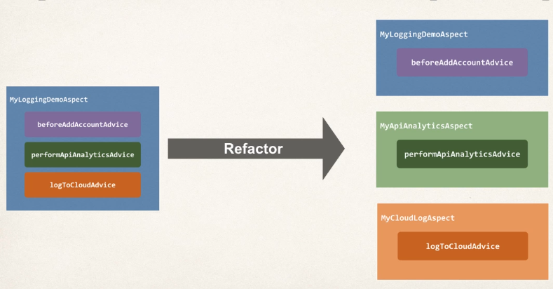
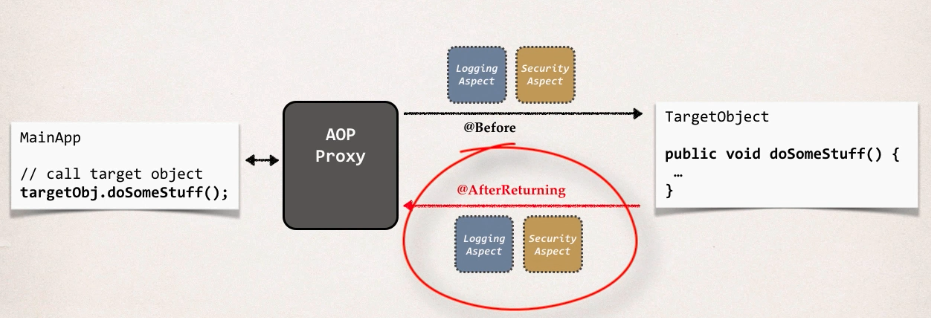

## Overview

### Advantages

- Reusable modules
- Resolve code tangling
- Resolve code scatter
- Applied selectively based on configuration

### Disadvantages

- Too many aspects and app flow is hard to follow
- Minor performance cost for aspect execution

### Terminology

- Aspect: module of code for a cross-cutting concern (logging, security...)
- Advice: what action is takes and when it should be applied
- Joint Point: when to apply code during program execution
- Pointcut: a predicate expression for where advice should be applied

#### Advice Types

- Before advice: run before the method
- After finally advice: run after the method (like finally clause in try catch)
- After returning advice: run after the method (success execution)
- After throwing advice: run after the method (if exception if thrown)
- Around advice: run before and after the method

#### Weaving

It refers to the connection being made between aspects and target objects to create an advised object. There are different types:

- Compile-time
- Load-time
- Run-time

Note that the slowest is the run-time weaving

### Best Practices

- Keep the code inside the advices small
- Keep the code fast
- Do not perform any expensive/slow operations

## Before Advice

### Add Dependencies

- We have to download the `AspectJ` jar file, because `Spring AOP` depends on some on their framework's classes

### Create Target Object

We create a DAO object:

```java
package com.aopdemo.dao;

import org.springframework.stereotype.Component;

@Component
public class AccountDAO {
	public void addAccount() {
		System.out.println(
			getClass()
			+ ": DOING MY DB WORK: ADDING AN ACCOUNT"
		);
	}
}
```

### Spring Configuration

We now have to enable `AOP` proxying in our app configuration:

```java
package com.aopdemo;

import org.springframework.context.annotation.ComponentScan;
import org.springframework.context.annotation.Configuration;
import org.springframework.context.annotation.EnableAspectJAutoProxy;

@Configuration
// Enable proxying to add before advice
@EnableAspectJAutoProxy
@ComponentScan("com.aopdemo")
public class DemoConfig {

}
```

### Create Aspect with @Before

Now it is time to create an aspect with `@Before` advice:

```java
package com.aopdemo.aspect;

import org.aspectj.lang.annotation.Aspect;
import org.aspectj.lang.annotation.Before;
import org.springframework.stereotype.Component;

@Aspect
@Component
public class MyDemoLoggingAspect {

	// this is where we add all of our related advices for logging
	// Here we specify we want to run this code before calling the
	// object method public void addAccount
	@Before("execution(public void addAccount())")
	public void beforeAddAccountAdvice() {
		System.out.println("\n=====>>> Executing @Before advice on addAccount()");
	}
}
```

### Main App

We now create a demo app:

```java
package com.aopdemo;

import org.springframework.context.annotation.AnnotationConfigApplicationContext;

import com.aopdemo.dao.AccountDAO;

public class MainDemoApp {

	public static void main(String[] args) {

		// read spring config java class
		AnnotationConfigApplicationContext context =
				new AnnotationConfigApplicationContext(DemoConfig.class);

		// get the bean from spring container
		AccountDAO theAccountDAO = context.getBean("accountDAO", AccountDAO.class);

		// call the business method
		theAccountDAO.addAccount();

		// do it again!
		System.out.println("\nlet's call it again!\n");

		// call the business method again
		theAccountDAO.addAccount();

		// close the context
		context.close();
	}

}
```

## Pointcut Expressions

### Execution Pointcut

The expression pattern is the following:

```java
execution(modifiers-pattern? return-type-pattern declaring-type-pattern? method-name-pattern(param-pattern) throws-pattern?)
```

- `modifiers-pattern?`: Spring AOP only supports public
- `return-type-pattern`: void, boolean, string, List<Costumer>, etc
- `declaring-type-pattern?`: the class name
- `method-name-pattern(param-pattern)`: method name to match, and parameters type to match
- `throws-pattern?`: exception types to match

If the parameter is optional it is followed by an `?`. You can also add wildcards inside the patterns.

### Match Methods

Some examples are:

- Match concrete method inside a class:

```java
@Before("execution(public void com.aopdemo.dao.AccountDAO.addAccount())")
```

- Match a method inside any class:

```java
@Before("execution(public void addAccount())")
```

- Match any method that starts with add:

```java
@Before("execution(public void add*())")
```

- Match all methods inside a given package:

```java
@Before("execution(** com.aopdemo.dao.**.*(..))")
```

- The first `*` denotes the return type, it can be anything
- The second `*` denotes the class name, it can be anything inside the package
- The third `*` denotes the method name, it can be anything
- Lastly, `..` denotes the param-type, there can be 0 or more parameters

### Match Parameters

There are the following parameter pattern wildcards:

- (): matches a method with no arguments
  ** (**): matches a method with one argument of any type
- (..): matches a method with 0 or more arguments of any type

For example:

- Match addAccount methods with no arguments:

```java
@Before("execution(* addAccount())")
```

- Match addAcount methods with one Account parameter:

```java
@Before("execution(* addAccount(com.aopdemo.Account))")
```

- Match addAcount methods with any number of parameters:

```java
@Before("execution(** addAccount(**))")
```

## Pointcut Declarations

### Create Pointcut Declaration

We define the pointcut declaration with the `Pointcut` annotation and we bind it to an arbitrary method.

```java
package com.aopdemo.aspect;

import org.aspectj.lang.annotation.Aspect;
import org.aspectj.lang.annotation.Before;
import org.aspectj.lang.annotation.Pointcut;
import org.springframework.stereotype.Component;

@Aspect
@Component
public class MyDemoLoggingAspect {

	@Pointcut("execution(** com.aopdemo.dao.**.*(..))")
	private void forDaoPackage() {}
}
```

### Reuse Pointcut Declaration

To reuse this declaration we simply call the method that is bound to the pointcut declaration:

```java
package com.aopdemo.aspect;

import org.aspectj.lang.annotation.Aspect;
import org.aspectj.lang.annotation.Before;
import org.aspectj.lang.annotation.Pointcut;
import org.springframework.stereotype.Component;

@Aspect
@Component
public class MyDemoLoggingAspect {

	@Pointcut("execution(** com.aopdemo.dao.**.*(..))")
	private void forDaoPackage() {}

  // Reuse declaration
	@Before("forDaoPackage()")
	public void beforeAddAccountAdvice() {
		System.out.println("\n=====>>> Executing @Before advice on method");
	}

  // Reuse declaration
	@Before("forDaoPackage()")
	public void performApiAnalytics() {
		System.out.println("\n=====>>> Performing API analytics");
	}

}
```

### Combine Pointcut Declarations

How can we apply multiple pointcut expressions to a single advice? Well we can combine pointcut expressions using logic operators:

- AND (&&)
- OR (||)
- NOT (!)

For example:

```java
@Before("expressionOne() && expressionTwo()")
```

```java
@Before("expressionOne() || expressionTwo()")
```

```java
@Before("expressionOne() && !expressionTwo()")
```

Imagine we want to execute an advice for every method in the package except for getters and setters, then we do:

```java
package com.aopdemo.aspect;

import org.aspectj.lang.annotation.Aspect;
import org.aspectj.lang.annotation.Before;
import org.aspectj.lang.annotation.Pointcut;
import org.springframework.stereotype.Component;

@Aspect
@Component
public class MyDemoLoggingAspect {

	@Pointcut("execution(** com.aopdemo.dao.**.*(..))")
	private void forDaoPackage() {}

	// create pointcut for getter methods
	@Pointcut("execution(** com.aopdemo.dao.**.get*(..))")
	private void getter() {}

	// create pointcut for setter methods
	@Pointcut("execution(** com.aopdemo.dao.**.set*(..))")
	private void setter() {}

	// create pointcut: include package ... exclude getter/setter
	@Pointcut("forDaoPackage() && !(getter() || setter())")
	private void forDaoPackageNoGetterSetter() {}

	@Before("forDaoPackageNoGetterSetter()")
	public void beforeAddAccountAdvice() {
		System.out.println("\n=====>>> Executing @Before advice on method");
	}

	@Before("forDaoPackageNoGetterSetter()")
	public void performApiAnalytics() {
		System.out.println("\n=====>>> Performing API analytics");
	}
}
```

## Control Aspect Order

### Refactor and Order

We are going to create three aspects separate from each other as follows:



So with the ordering the aspect flow looks something like this:


#### Log to Cloud Aspect

```java
package com.luv2code.aopdemo.aspect;

import org.aspectj.lang.annotation.Aspect;
import org.aspectj.lang.annotation.Before;
import org.springframework.core.annotation.Order;
import org.springframework.stereotype.Component;

@Aspect
@Component
// Set order
@Order(1)
public class MyCloudLogAsyncAspect {

    @Before("com.aopdemo.aspect.LuvAopExpressions.forDaoPackageNoGetterSetter()")
    public void logToCloudAsync() {
        System.out.println("\n=====>>> Logging to Cloud in async fashion");
    }

}
```

#### Logging Aspect

```java
package com.aopdemo.aspect;

import org.aspectj.lang.annotation.Aspect;
import org.aspectj.lang.annotation.Before;
import org.springframework.core.annotation.Order;
import org.springframework.stereotype.Component;

@Aspect
@Component
// Set the order
@Order(2)
public class MyDemoLoggingAspect {

    @Before("com.aopdemo.aspect.LuvAopExpressions.forDaoPackageNoGetterSetter()")
    public void beforeAddAccountAdvice() {
        System.out.println("\n=====>>> Executing @Before advice on method");
    }

}
```

#### Analytics Aspect

```java
package com.aopdemo.aspect;

import org.aspectj.lang.annotation.Aspect;
import org.aspectj.lang.annotation.Before;
import org.springframework.core.annotation.Order;
import org.springframework.stereotype.Component;

@Aspect
@Component
// Set the order
@Order(3)
public class MyApiAnalyticsAspect {

    @Before("com.aopdemo.aspect.LuvAopExpressions.forDaoPackageNoGetterSetter()")
    public void performApiAnalytics() {
        System.out.println("\n=====>>> Performing API analytics");
    }

}
```

## JoinPoints

### Display Method Signature

To display the method signature we do the following:

```java
package com.aopdemo.aspect;

import org.aspectj.lang.JoinPoint;
import org.aspectj.lang.annotation.Aspect;
import org.aspectj.lang.annotation.Before;
import org.aspectj.lang.reflect.MethodSignature;
import org.springframework.core.annotation.Order;
import org.springframework.stereotype.Component;

import com.aopdemo.Account;

@Aspect
@Component
@Order(2)
public class MyDemoLoggingAspect {

	@Before("com.aopdemo.aspect.LuvAopExpressions.forDaoPackageNoGetterSetter()")
	public void beforeAddAccountAdvice(JoinPoint theJoinPoint) {

		System.out.println("\n=====>>> Executing @Before advice on method");

		// display the method signature
		MethodSignature methodSig = (MethodSignature) theJoinPoint.getSignature();

		System.out.println("Method: " + methodSig);
	}
}
```

### Display Method Arguments

Also, to display the method arguments:

```java
package com.aopdemo.aspect;

import org.aspectj.lang.JoinPoint;
import org.aspectj.lang.annotation.Aspect;
import org.aspectj.lang.annotation.Before;
import org.aspectj.lang.reflect.MethodSignature;
import org.springframework.core.annotation.Order;
import org.springframework.stereotype.Component;

import com.aopdemo.Account;

@Aspect
@Component
@Order(2)
public class MyDemoLoggingAspect {

	@Before("com.aopdemo.aspect.LuvAopExpressions.forDaoPackageNoGetterSetter()")
	public void beforeAddAccountAdvice(JoinPoint theJoinPoint) {

		System.out.println("\n=====>>> Executing @Before advice on method");

		// display method arguments
		// get args
		Object[] args = theJoinPoint.getArgs();

		// loop through args
		for (Object tempArg : args) {
			System.out.println(tempArg);

			if (tempArg instanceof Account) {

				// downcast and print Account specific stuff
				Account theAccount = (Account) tempArg;

				System.out.println("account name: " + theAccount.getName());
				System.out.println("account level: " + theAccount.getLevel());

			}
		}
	}
}
```

## AfterReturning Advice

This advice is run after the method is done executing, and it executed successfully.

The flow of this advice is the following:



So for example, if you want to have an advice run everytime we call the `findAccounts` method inside a concrete class, and we also want to print out the result we obtained we do the following:

```java
package com.aopdemo.aspect;

import java.util.List;

import org.aspectj.lang.JoinPoint;
import org.aspectj.lang.annotation.AfterReturning;
import org.aspectj.lang.annotation.Aspect;
import org.aspectj.lang.annotation.Before;
import org.aspectj.lang.reflect.MethodSignature;
import org.springframework.core.annotation.Order;
import org.springframework.stereotype.Component;

import com.aopdemo.Account;

@Aspect
@Component
@Order(2)
public class MyDemoLoggingAspect {

    // add a new advice for @AfterReturning on the findAccounts method
    @AfterReturning(
            pointcut="execution(* com.aopdemo.dao.AccountDAO.findAccounts(..))",
      // This is the parameter name of the list of accounts returned by findAccounts
            returning="result")
    public void afterReturningFindAccountsAdvice(
                    JoinPoint theJoinPoint, List<Account> result) {

        // print out which method we are advising on
        String method = theJoinPoint.getSignature().toShortString();
        System.out.println("\n=====>>> Executing @AfterReturning on method: " + method);

        // print out the results of the method call
        System.out.println("\n=====>>> result is: " + result);
    }
}
```

## AfterThrowing Advice

This advice is run whenever the target object throws and execption. For example:

```java
package com.aopdemo.aspect;

import java.util.List;

import org.aspectj.lang.JoinPoint;
import org.aspectj.lang.annotation.AfterReturning;
import org.aspectj.lang.annotation.AfterThrowing;
import org.aspectj.lang.annotation.Aspect;
import org.aspectj.lang.annotation.Before;
import org.aspectj.lang.reflect.MethodSignature;
import org.springframework.core.annotation.Order;
import org.springframework.stereotype.Component;

import com.luv2code.aopdemo.Account;

@Aspect
@Component
@Order(2)
public class MyDemoLoggingAspect {

	@AfterThrowing(
			pointcut="execution(* com.aopdemo.dao.AccountDAO.findAccounts(..))",
			// Define the name of the parameter that holds the exception object
			throwing="theExc")
	public void afterThrowingFindAccountsAdvice(
					JoinPoint theJoinPoint, Throwable theExc) {

		// print out which method we are advising on
		String method = theJoinPoint.getSignature().toShortString();
		System.out.println("\n=====>>> Executing @AfterThrowing on method: " + method);

		// log the exception
		System.out.println("\n=====>>> The exception is: " + theExc);

	}
}
```

In this code sample we have the advice `afterThrowingFindAccountsAdvice` that is run whenever the method `findAccounts` inside `AccountDAO` throws an exception. We also make use of the `throwing` attribute that lets us map the exception object to a parameter inside our advice.

## After Advice

This advice runs **always** when the method is completed (like a finally clause inside a try catch).

For example if we want to always run the advice `afterFinallyFindAccountsAdvice` when the method `findAccounts` inside `AccountDAO` finishes:

```java
package com.aopdemo.aspect;

import java.util.List;

import org.aspectj.lang.JoinPoint;
import org.aspectj.lang.annotation.After;
import org.aspectj.lang.annotation.AfterReturning;
import org.aspectj.lang.annotation.AfterThrowing;
import org.aspectj.lang.annotation.Aspect;
import org.aspectj.lang.annotation.Before;
import org.aspectj.lang.reflect.MethodSignature;
import org.springframework.core.annotation.Order;
import org.springframework.stereotype.Component;

import com.aopdemo.Account;

@Aspect
@Component
@Order(2)
public class MyDemoLoggingAspect {

	@After("execution(* com.aopdemo.dao.AccountDAO.findAccounts(..))")
	public void afterFinallyFindAccountsAdvice(JoinPoint theJoinPoint) {

		// print out which method we are advising on
		String method = theJoinPoint.getSignature().toShortString();
		System.out.println("\n=====>>> Executing @After (finally) on method: "
							+ method);

	}
}
```

## Around Advice

### Exception Handling

Inside an advice, to handle exceptions you can:

- Handle the exception inside the advice

```java
	@Around("execution(** com.aopdemo.service.**.getFortune(..))")
	public Object aroundGetFortune(
			ProceedingJoinPoint theProceedingJoinPoint) throws Throwable {

		// print out method we are advising on
		String method = theProceedingJoinPoint.getSignature().toShortString();
		System.out.println("\n=====>>> Executing @Around on method: " + method);

		// get begin timestamp
		long begin = System.currentTimeMillis();

		try {
			result = theProceedingJoinPoint.proceed();
		} catch (Exception e) {
			// log the exception
			myLogger.warning(e.getMessage());

			// give users a custom messagee
			result = "Major accident! But no worries, "
					+ "your private AOP helicopter is on the way!";
		}

		// get end timestamp
		long end = System.currentTimeMillis();

		// compute duration and display it
		long duration = end - begin;
		System.out.println("\n=====> Duration: " + duration / 1000.0 + " seconds");

		return result;
	}
```

- Simply rethrow the exception

```java
	@Around("execution(** com.aopdemo.service.**.getFortune(..))")
	public Object aroundGetFortune(
			ProceedingJoinPoint theProceedingJoinPoint) throws Throwable {

		// print out method we are advising on
		String method = theProceedingJoinPoint.getSignature().toShortString();
		System.out.println("\n=====>>> Executing @Around on method: " + method);

		// get begin timestamp
		long begin = System.currentTimeMillis();

		try {
			result = theProceedingJoinPoint.proceed();
		} catch (Exception e) {
			// log the exception
			myLogger.warning(e.getMessage());

			// rethrow exception
			throw e;
		}

		// get end timestamp
		long end = System.currentTimeMillis();

		// compute duration and display it
		long duration = end - begin;
		System.out.println("\n=====> Duration: " + duration / 1000.0 + " seconds");

		return result;
	}
```
